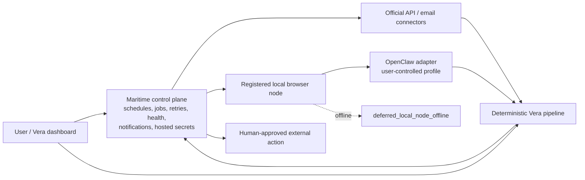

# Vera — Ship Season Implementation Plan

## 1. Product decision

Build **Product A first**: a single-user, privacy-preserving rental-search copilot operating on behalf of one renter. Listing evidence and authenticated consumer-site sessions remain local-first, while Maritime is the primary orchestration and deployment environment for monitoring jobs, schedules, retries, agent health, notifications, and hosted integration secrets.

Do not turn Maritime into a multi-user “scrape everything for everyone” SaaS or move consumer-site browser profiles into the cloud. The Ship Season goal is to prove the complete renter workflow on a real apartment hunt:

> watch → ingest → normalize → dedupe → rank → alert → approve outreach → coordinate viewing → audit

The strongest demo is not a marketplace-sized inventory count. It is a real sequence such as:

> “Vera noticed a matching listing, recognized that it was duplicated elsewhere, warned me about two missing facts, prepared the right questions, and got a viewing onto my calendar—while I approved every external action.”

## 2. Product principles

### Speed before sophistication

Freshness and response latency matter more than an elaborate recommendation model. The UI should show:

- listing observed time;
- source-posted time when available;
- Vera alert time;
- elapsed discovery-to-alert time;
- elapsed alert-to-draft time.

### Copilot before autonomy

The user approves messages and calendar writes. Approval is a trust feature, not a temporary embarrassment.

### Compliance by architecture

Source access is governed by explicit manifests, policy states, and kill switches. Unsupported sources are not silently scraped. Maritime stores only secrets for approved hosted API and email integrations. Authenticated consumer-site sessions, cookies, and OpenClaw profile contents stay on a registered local node; the user signs in manually, and Vera never requests, records, types, uploads, or transmits a third-party password.

### Primary orchestration, local browser execution

Maritime owns monitoring schedules, durable job state, retries, health, notifications, and hosted secrets. When a reviewed source requires a browser, Maritime dispatches a bounded saved-search job to a registered local browser node. OpenClaw is the default adapter behind a replaceable browser-executor interface. An offline node becomes visibly `deferred_local_node_offline`; it is never mistaken for an empty successful source result.

### Deterministic core, AI at fuzzy boundaries

Use code for hard constraints, dedupe features, scoring, policy decisions, state transitions, and idempotency. Use an LLM for messy extraction, natural-language drafting, and explanation.

### Provenance everywhere

Keep raw records and explain where each field came from. A canonical listing is a stitched view over source records, not an overwrite.

## 3. MVP scope

### Must ship

- Single-user Vera experience with Maritime as the primary orchestration/deployment environment and local fixture/manual fallback.
- Search-profile onboarding.
- Listing inbox and shortlist.
- At least three source labels/channels represented in a real or sanitized demo.
- At least one real, user-authorized ingestion path for MVP completion; the initial path is Craigslist official search-alert email ingestion through Gmail.
- A `SourceConnector` boundary with exactly `official_api`, `email_alert`, `local_browser`, and `user_capture` acquisition modes.
- Manual URL/text `user_capture` with inert URLs and user-supplied evidence.
- Craigslist official search-alert `email_alert` ingestion before any Craigslist browser work.
- A registered local browser node with OpenClaw as the default replaceable `local_browser` adapter.
- Exact saved-search URL monitoring with source-specific cursors or last-seen IDs and newly discovered records only.
- Visible, cursor-preserving `deferred_local_node_offline` state and agent health.
- Structured listing extraction with confidence and provenance.
- Address/unit normalization.
- Duplicate clustering, including photo hash support where images are available.
- Explainable deterministic ranking.
- Evidence-backed risk indicators.
- Gmail draft creation, never autonomous send.
- Viewing availability selection and tentative Google Calendar hold after approval.
- Append-only activity log.
- Local notification or one phone-friendly notification channel.
- Unit, integration, connector-contract, and golden-path end-to-end tests.

### Explicitly defer

- Multi-user accounts, billing, subscriptions, and teams.
- Autonomous marketplace messaging.
- SMS or voice calls.
- Rental applications, document upload, payments, or screening.
- Continuous browser automation against every marketplace.
- Broad website crawling, arbitrary category exploration, automatic search widening, or following unrelated recommendations.
- CAPTCHA or anti-bot circumvention.
- Automated account login, credential replay, or collection or transmission of consumer-site passwords.
- A mobile app.
- A nationwide proprietary inventory index.
- Neighborhood demographic or protected-class inference.
- “Guaranteed scam” verdicts.

## 4. Recommended architecture



Maritime owns job identity and lifecycle. The registered local node exclusively owns its dedicated user-controlled browser profile and authenticated sessions. A dispatch contains only opaque job/correlation IDs, connector and policy versions, the exact configured saved-search URL, the last committed cursor or last-seen ID, bounded limits, trigger type, and attempt metadata. The node returns schema-bounded listing evidence, discovered IDs, cursor candidates, typed blocker/failure codes, and safe counts over an authenticated, encrypted, replay-protected transport when implemented. It returns no password, cookie, authorization header, profile path, browser storage, password-manager value, or session export.

The target browser lifecycle is:

```text
scheduled -> dispatching
  -> running_local_browser -> succeeded | retryable | failed
  -> deferred_local_node_offline -> dispatching | cancelled
```

Deferral remains visible in the dashboard and agent health. It creates no RawListing or success event and does not advance the cursor. A cursor candidate commits only after all corresponding raw evidence is durably and idempotently accepted.

The target connector contract is conceptual until its milestone is implemented:

```ts
type AcquisitionMode = "official_api" | "email_alert" | "local_browser" | "user_capture";

interface SourceConnector {
  readonly connectorId: string;
  readonly acquisitionMode: AcquisitionMode;
  discover(input: ConnectorDiscoveryInput): Promise<ConnectorDiscoveryResult>;
  acquire(input: ConnectorAcquireInput): Promise<RawListingEnvelope[]>;
}
```

OpenClaw implements a separate replaceable browser-executor interface used by `local_browser` connectors. Every source/mode entry has one fail-closed permission ceiling: `approved`, `user_triggered_only`, `experimental_personal`, or `disabled`. State alone is insufficient; runtime enablement, manifest compatibility, exact capability, trigger, saved-search allowlist, node assignment, session availability, limits, kill switches, and required approval must also pass.

Every connector feeds one deterministic pipeline and cannot bypass a stage:

```text
source record
  -> normalization
  -> provenance
  -> deduplication
  -> ranking
  -> notification
  -> human-approved external action
```

## 5. Repository layout

```text
vera/
├── AGENTS.md
├── README.md
├── package.json
├── pnpm-workspace.yaml
├── .env.example
├── apps/
│   ├── web/                       # Next.js dashboard and local API
│   └── worker/                    # local execution, deterministic jobs, adapter runtime
├── packages/
│   ├── domain/                    # schemas, enums, states, invariants
│   ├── db/                        # Drizzle + SQLite, migrations, repositories
│   ├── connectors/                # source and productivity integrations
│   ├── ai/                        # provider interface + structured extraction
│   ├── policy/                    # manifests, approvals, kill switches
│   ├── scoring/                   # ranking, dedupe, risk signals
│   └── testing/                   # fixtures, factories, test utilities
├── docs/
│   ├── PRODUCT.md
│   ├── ARCHITECTURE.md
│   ├── DATA_MODEL.md
│   ├── SOURCE_POLICY.md
│   ├── SECURITY.md
│   ├── DECISIONS/
│   └── DEMO.md
├── fixtures/                      # sanitized listing and email fixtures
├── scripts/
└── infra/
    └── maritime/                  # primary schedules, jobs, retries, health, notifications, hosted secrets
```

`infra/maritime` is a required MVP repository responsibility, although it is not implemented in the current codebase. It contains the primary orchestration/deployment definitions and registered-node dispatch assets. It must not contain browser profiles, cookies, consumer-site passwords, or session exports. Local fixture and `user_capture` execution remain available for deterministic development and as an explicit outage fallback, not as the target monitoring control plane.

Do not add Turborepo for the MVP. pnpm's workspace graph and recursive scripts are sufficient at this repository size.

## 6. Core data model

### SearchProfile

- `id`
- `name`
- `locationText`
- `centerLat`, `centerLng`, `radiusKm` when known
- `minBeds`, `minBaths`
- `targetMonthlyTotal`, `absoluteMonthlyMax`
- `moveInEarliest`, `moveInLatest`
- `petRequirements`
- `commuteAnchors[]`
- `hardConstraints[]`
- `weightedPreferences[]`
- `notificationRules`
- timestamps

### RawListing

Immutable evidence captured from a source:

- `id`
- `source`
- `sourceListingId`
- `sourceUrl`
- `captureMethod`
- `observedAt`
- `sourcePostedAt`
- `rawText`
- `rawJson`
- `contentHash`
- `captureMetadata`

### ListingSourceRecord

Normalized interpretation of one raw record:

- normalized address and unit;
- price and required recurring fees;
- beds, baths, square footage;
- property type;
- availability;
- lease terms;
- pets;
- amenities;
- contact channels;
- photos and perceptual hashes;
- extraction confidence;
- field-level provenance.

### CanonicalListing

Stitched user-facing listing:

- `id`
- selected canonical values;
- duplicate cluster members;
- freshness;
- completeness;
- lifecycle state;
- score version and explanation;
- risk-signal summary.

### ContactWorkflow

- listing ID;
- recipient/channel;
- missing facts to ask;
- draft content;
- approval state;
- Gmail draft ID;
- reply state;
- timestamps.

### Viewing

- listing ID;
- proposed windows;
- confirmed window;
- timezone;
- calendar event ID;
- status;
- notes.

### ActivityEvent

- actor: user, Vera, connector, system;
- action type;
- target type and ID;
- source policy decision;
- approval ID;
- payload hash;
- result;
- error classification;
- timestamp.

## 7. Listing lifecycle

```text
new
 ├─► shortlisted
 │    ├─► draft_ready
 │    │    ├─► draft_created
 │    │    │    ├─► replied
 │    │    │    │    ├─► tour_proposed
 │    │    │    │    │    ├─► tour_scheduled
 │    │    │    │    │    │    ├─► toured
 │    │    │    │    │    │    │    ├─► applying
 │    │    │    │    │    │    │    └─► passed
 │    │    │    │    │    └─► unavailable
 │    │    │    │    └─► follow_up_due
 │    │    │    └─► stale
 │    │    └─► draft_rejected
 │    └─► dismissed
 └─► dismissed
```

Do not let arbitrary UI code mutate state. Use explicit domain transitions with tests.

## 8. Ranking model

Start deterministic and transparent.

1. Evaluate hard constraints. A confirmed violation excludes the listing. Unknown does not automatically exclude it unless the user chose “unknown is unacceptable” for that field.
2. Calculate factor scores only for explicit preferences.
3. Renormalize weights over active factors.
4. Apply separate penalties for stale data, low extraction confidence, and risk indicators.
5. Persist the score version, factor values, reason codes, and input snapshot.

Suggested initial factors:

- total monthly cost fit;
- location/radius fit;
- bedroom/bathroom fit;
- move-in fit;
- pet-policy fit;
- commute fit when routing data exists;
- must-have amenities;
- freshness;
- completeness.

Display explanations such as:

- “Strong fit: $140 below target, cats explicitly allowed, posted 18 minutes ago.”
- “Needs verification: required fees and earliest move-in date are missing.”
- “Also seen on two other sources; the freshest record is from Zillow.”

## 9. Deduplication model

### Deterministic links

- same normalized source ID;
- same canonical URL;
- exact normalized address + unit;
- same contact email or phone when appropriate;
- exact photo hash.

### Probabilistic features

- address similarity;
- geographic distance;
- rent delta;
- beds/baths delta;
- square-footage delta;
- building/manager similarity;
- description similarity;
- perceptual-photo-hash distance;
- posting-time proximity.

Use a weighted pair score and connected-components clustering. Keep merge/split overrides and never delete source records.

## 10. Risk indicators

The MVP should produce evidence-backed indicators rather than a binary accusation.

Initial deterministic signals:

- requests for wire transfer, cryptocurrency, gift cards, or deposit before viewing;
- “owner is out of the country” or courier-key patterns;
- requests to leave the platform immediately for an unusual channel;
- photo hashes reused for different addresses;
- materially inconsistent address, rent, or contact facts across duplicate records;
- suspicious external domains or URL shorteners;
- missing address combined with unusually low rent;
- pressure language and refusal to show the property;
- contact domain/name mismatch;
- a listing copied from a more authoritative source with altered contact details.

Each signal stores:

- code;
- severity;
- confidence;
- exact evidence;
- source record IDs;
- user-facing verification action.

Example:

> High-risk indicator: the same photos appear in another record for a different address. Verify ownership and do not send money before an in-person or authenticated tour.

## 11. Source strategy

### Control plane — Maritime first

Maritime is the primary orchestration and deployment tier for every monitoring channel. It owns schedules, durable job metadata, bounded retries, agent and connector health, notifications, and secrets for approved hosted API and email integrations. Local fixture/manual execution remains a deterministic development path and an explicit outage fallback.

### Acquisition portfolio

| Source path                               | Mode            | Policy state            | Default                   | Initial rule                                                                            |
| ----------------------------------------- | --------------- | ----------------------- | ------------------------- | --------------------------------------------------------------------------------------- |
| Sanitized fixture test double             | `official_api`  | `approved`              | Enabled in dev/test       | Local sanitized records; no network request.                                            |
| General manual URL/text capture           | `user_capture`  | `user_triggered_only`   | Enabled                   | Store supplied evidence and inert URL provenance; no implicit fetch.                    |
| Craigslist official search alert          | `email_alert`   | `approved`              | Disabled until configured | Ingest the provider's official search-alert email; Craigslist browser search is denied. |
| Craigslist automated browser search       | `local_browser` | `disabled`              | Disabled                  | Not an initial acquisition path.                                                        |
| Zillow monitoring                         | `local_browser` | `experimental_personal` | Disabled                  | Exact reviewed saved-search URL through the registered local OpenClaw node.             |
| Facebook Marketplace monitoring           | `local_browser` | `experimental_personal` | Disabled                  | Exact reviewed saved-search URL through the registered local OpenClaw node.             |
| Zillow/Facebook/Craigslist direct capture | `user_capture`  | `user_triggered_only`   | Available                 | User supplies URL/content; URL remains inert absent a separately authorized operation.  |
| Reviewed structured provider              | `official_api`  | `disabled`              | Disabled                  | Move to `approved` only after an explicit API and origin review.                        |

`experimental_personal` is a personal single-user experiment, not general approval. It requires exact saved-search configuration and explicit enablement. `user_triggered_only` can never run from a Maritime schedule, and `disabled` always denies.

### Browser execution rules

OpenClaw runs locally with a dedicated user-controlled profile behind a replaceable browser-executor interface. The user logs in manually. Vera never requests, stores, transmits, or automatically types the user's third-party password.

A `local_browser` connector may navigate only to an exact configured saved-search URL and necessary same-source detail pages discovered from that search. It maintains a source-specific cursor, last-seen listing ID, or equivalent monotonic checkpoint; visits only newly discovered records; and commits a cursor only after durable idempotent raw import. It caps pages, records, bytes, duration, and concurrency.

The connector stops for login, 2FA, CAPTCHA, consent, camera, microphone, download, upload, payment, unexpected navigation, or changed page structure. It never explores arbitrary category pages, widens a search, follows unrelated recommendations, crawls an entire website, or clicks message, contact, apply, submit, payment, or account-setting controls.

An empty successful saved-search result is distinct from `deferred_local_node_offline`, manual action required, layout change, policy denial, and transient failure. Deferral is visible, preserves the cursor, and is retried under the same stable Maritime job identity.

## 12. Implementation milestones

Current-state note: the repository implements the local workspace, persistence, fixture/manual capture, deterministic-first extraction, and evidence detail through the existing Milestone 3 slice. It does not yet implement Maritime orchestration, the four-mode target `SourceConnector`, remote dispatch, email alerts, an OpenClaw bridge, or source-specific browser monitoring. The remaining milestones below are normative MVP work, not claims of existing capability.

### Milestone 0 — Charter and guardrails

Deliverables:

- `AGENTS.md`;
- product, architecture, source-policy, security, and demo docs;
- explicit MVP/non-goal list;
- decision records for the Maritime/local-node topology, local data and session ownership, SQLite, and draft-only outreach.

Acceptance:

- A contributor can explain what Vera will and will not do.
- Source capabilities default to disabled/fail-closed.

### Milestone 1 — Monorepo and vertical skeleton

Deliverables:

- pnpm workspace;
- web app;
- worker app;
- shared packages;
- strict TypeScript, linting, formatting, testing;
- health endpoint;
- starter dashboard;
- CI workflow.

Acceptance:

- install, lint, typecheck, test, and build all pass.
- The dashboard runs locally with no external credentials.

### Milestone 2 — Domain and persistence

Deliverables:

- Zod domain schemas;
- SQLite schema and migrations;
- repositories and transactions;
- fixture seed command;
- listing lifecycle transitions;
- append-only audit log.

Acceptance:

- Seeded listings appear in the dashboard.
- Invalid transitions and duplicate imports are rejected safely.

### Milestone 3 — Ingestion and extraction

Deliverables:

- current fixture/manual connector contracts (the four-mode target remains Milestone 5 work);
- fixture connector;
- manual URL/text capture;
- raw snapshot storage;
- provider-neutral AI extraction with mock provider;
- confidence and provenance.

Acceptance:

- A messy listing can be captured and becomes a validated normalized record.
- Missing facts remain unknown.
- Re-importing identical evidence is idempotent.

### Milestone 4 — Dedupe, ranking, and risk indicators

Deliverables:

- address normalization;
- photo hashing;
- pair features and duplicate clustering;
- deterministic preference scoring;
- risk-signal engine;
- explanation API.

Acceptance:

- Fixture duplicates cluster correctly.
- Golden scoring cases are stable and versioned.
- Every risk flag links to exact evidence.

### Milestone 5 — Maritime orchestration foundation

Deliverables:

- `infra/maritime` deployment and environment definitions;
- scheduled triggers and durable monitoring-job identity;
- bounded retry/backoff and dead-letter outcomes;
- agent and connector health;
- notification orchestration;
- secrets only for approved hosted API and email connectors;
- mutually authenticated, encrypted, replay-protected registered-node transport;
- target `SourceConnector` contract with `official_api`, `email_alert`, `local_browser`, and `user_capture`;
- source policy states `approved`, `user_triggered_only`, `experimental_personal`, and `disabled`;
- stable dispatch idempotency and safe audit metadata.

Acceptance:

- Maritime is the primary scheduler and durable owner for monitoring jobs; local fixture/manual execution remains an explicit development and outage fallback.
- Unknown or malformed modes/states deny, and `user_triggered_only` jobs cannot be scheduled.
- No consumer-site password, cookie, local storage, session export, password-manager value, or browser profile enters Maritime.

### Milestone 6 — Email and official acquisition

Deliverables:

- narrow email-alert OAuth connection flow;
- Craigslist official search-alert `email_alert` ingestion first;
- parser plugins for reviewed alerts and a strict generic fallback;
- approved `official_api` connectors where access is documented;
- source cursor/idempotency and bounded Maritime scheduling;
- sanitized connector-contract tests with live checks opt-in.

Acceptance:

- Vera imports sanitized and explicitly configured test alerts exactly once through Maritime.
- Craigslist automated browser search remains `disabled`.
- Missing connection/configuration fails visibly without weakening policy or advancing a cursor.

### Milestone 7 — Registered local OpenClaw bridge

Deliverables:

- replaceable browser-executor interface;
- registered local browser node;
- OpenClaw local adapter with a dedicated user-controlled profile;
- manual-login instructions and no credential-login path;
- exact saved-search and same-source detail-page allowlists;
- source-specific cursor or last-seen-ID contract;
- bounded pages, records, bytes, duration, and concurrency;
- manual-blocker and layout-change handling;
- node/source kill switches;
- visible `deferred_local_node_offline` lifecycle and health.

Acceptance:

- A mock dispatch and one user-triggered reviewed saved-search run return schema-bounded evidence without exposing browser session material.
- An offline node creates no RawListing or success event, preserves the cursor, appears in UI/health, and retries with the stable job identity.
- Login, 2FA, CAPTCHA, consent, camera, microphone, unexpected navigation, or layout change stops visibly for manual action or typed failure.
- Navigation outside the configured saved-search and necessary discovered detail-page scope is rejected.

### Milestone 8 — Source-specific browser monitoring

Deliverables:

- Zillow `local_browser` connector with an `experimental_personal`, disabled-by-default manifest;
- Facebook Marketplace `local_browser` connector with an `experimental_personal`, disabled-by-default manifest;
- exact reviewed saved-search configurations;
- new-ID-only discovery and durable cursor commit after idempotent raw import;
- distinct empty, deferred, manual-blocker, policy-denial, layout-change, and failure results;
- continued `user_triggered_only` direct capture for Zillow, Facebook Marketplace, and Craigslist;
- connector contract and regression tests with no live accounts required.

Acceptance:

- Scheduled Zillow/Facebook runs deny until explicitly enabled after policy review.
- Enabled personal runs visit only records newer than the committed cursor and import each record once.
- Craigslist `local_browser` always denies; its approved initial path remains official `email_alert`.
- No connector crawls an entire site or exposes message, apply, payment, account-setting, or autonomous action controls.

### Milestone 9 — Decision cockpit UI

Deliverables:

- profile onboarding;
- listing inbox;
- filters and sorting;
- canonical listing detail;
- source/provenance timeline;
- duplicate cluster inspection;
- risk evidence;
- shortlist and dismiss actions;
- activity log;
- monitoring-job, agent-health, and deferred-node views.

Acceptance:

- A user can complete the decision flow without opening the database or logs.
- Freshness, latency, source cursor, and `deferred_local_node_offline` are visible without exposing secrets or raw session data.

### Milestone 10 — Draft outreach

Deliverables:

- incremental Gmail compose authorization;
- structured missing-question selection;
- outreach preview;
- explicit approval;
- Gmail draft creation only;
- audit and idempotency.

Acceptance:

- Vera creates a draft in the founder's Gmail after explicit approval.
- No code path sends the draft or autonomously contacts a marketplace account.

### Milestone 11 — Viewing coordination

Deliverables:

- availability editor;
- timezone-safe proposed windows;
- explicit approval;
- tentative Calendar event creation;
- stable event ID/idempotency;
- no attendee notifications by default;
- viewing status and reminders.

Acceptance:

- A confirmed test viewing creates one calendar hold, even after retries.
- The activity log records who approved it and what was written.

### Milestone 12 — Alerts, hardening, and demo

Deliverables:

- notification provider abstraction;
- local/browser notification and one phone-friendly channel;
- Maritime job retries and dead-letter state;
- connector and registered-node health page;
- security and privacy review;
- E2E golden path;
- demo seed and demo script;
- validated Maritime deployment for approved monitoring jobs and hosted secrets;
- local fixture/manual outage fallback.

Acceptance:

- A fresh listing produces a notification and enters the dashboard exactly once.
- The demo works from a clean clone using fixtures and can be switched to the founder’s real integrations.
- An offline local node is visibly deferred without cursor movement, and resumption imports only newly discovered records.

## 13. Ship Season demo script

1. Open the Vera dashboard and show the active search profile.
2. Trigger or receive three new source records.
3. Show the ingestion timestamps and alert latency.
4. Open a duplicate cluster and explain how Vera stitched the records.
5. Show a risk indicator backed by photo or text evidence.
6. Shortlist the strongest match.
7. Ask Vera to prepare outreach based on missing facts.
8. Edit one sentence and approve “Create Gmail draft.”
9. Open Gmail and show that the message is a draft, not sent.
10. Enter or parse an offered viewing time.
11. Approve a tentative calendar hold.
12. Open the activity log and show the complete audit trail.
13. End with a real outcome: a viewing scheduled, a scam avoided, or a listing found faster than the previous manual process.

## 14. Success metrics

Track product learning rather than vanity inventory counts:

- median source-observed-to-alert latency;
- percentage of new listings deduplicated correctly;
- extraction field accuracy on a labeled fixture set;
- percentage of top-ranked listings the user shortlists;
- draft approval/edit/rejection rate;
- number of messages saved from duplicate outreach;
- viewing conversion rate from shortlisted listings;
- risk indicators confirmed, dismissed, and false-positive rate;
- manual minutes saved per search session;
- external-action error rate;
- source connector health and breakage rate.

## 15. Expansion decision after Ship Season

Expand beyond the single-user Maritime-orchestrated MVP only if Ship Season demonstrates all three:

1. Users repeatedly rely on Vera across multiple platforms rather than treating it as a novelty.
2. The speed/workflow advantage produces measurable outcomes such as earlier replies or more tours.
3. A sustainable source-access strategy exists that does not depend on fragile, prohibited automation.

Possible post-MVP wedges:

- relocation concierge for cross-country movers;
- rental-search inbox and workflow tracker without direct crawling;
- scam and duplicate verification layer;
- broker/property-manager feed integrations;
- managed Maritime coordination with user-controlled local execution nodes;
- university or employer relocation partnerships.
