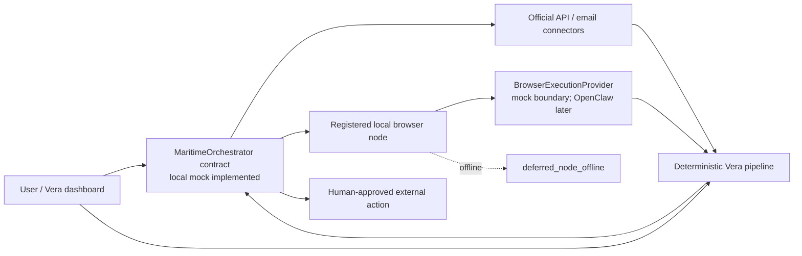
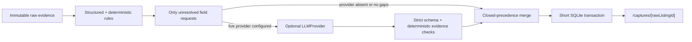

# Vera architecture and implementation-readiness review

Status: deterministic local demo plus Maritime/OpenClaw contract alignment implemented

Reviewed: 2026-07-18

## Readiness verdict

The current implementation is a pnpm TypeScript workspace with a Next.js App Router application, a separate Node worker, and a shared local SQLite database accessed through Drizzle and better-sqlite3. It runs fixture and user-capture ingestion and normalization locally.

The normative Ship Season topology uses Maritime as Vera's primary orchestration and deployment environment for monitoring jobs, scheduled triggers, durable job state, retries, agent health, notifications, and hosted integration secrets. Browser-only work is dispatched to a registered local browser node. That node uses OpenClaw as the default adapter behind a replaceable browser-executor interface and exclusively owns the user's browser profile and authenticated consumer-site sessions.

Milestones 1 and 2 provide the workspace, health slice, worker lifecycle, strict domain schemas, explicit listing transitions, migrated SQLite persistence, transactional repositories, immutable raw and audit storage, a provenance-preserving sanitized seed, and a read-only canonical-listing dashboard. Milestone 3 adds typed connector contracts, local fixture and manual-capture adapters, a persisted fail-closed policy registry, a durable normalization queue, deterministic-first structured extraction, a provider-neutral AI boundary, immutable extraction runs, capture/status routes, and field-level evidence UI. The current alignment adds strict source-job, job-attempt, browser-node, browser-execution, and Maritime control-plane contracts; deterministic no-network mocks; and migration `0003_romantic_fantastic_four.sql`.

Node 26 is a Current release, so the project should target Node 24 LTS for repeatable development and CI. The installed Node 26 is sufficient for inspection but should not define the project runtime.

No question blocks the already implemented local deterministic ingestion core or the contract-only orchestration slice. Real Maritime transport and deployment, a real OpenClaw bridge, authenticated remote-node dispatch, email-alert ingestion, official API integrations, and source-specific browser connectors remain required MVP implementation work. Google OAuth configuration blocks only future live acceptance checks for Gmail and Calendar.

## Resolved plan issues

| Issue                                                                | Assessment                 | Resolution                                                                                                                                               |
| -------------------------------------------------------------------- | -------------------------- | -------------------------------------------------------------------------------------------------------------------------------------------------------- |
| Earlier OpenClaw scope conflicted with its required milestone        | Contradiction              | Make browser execution first-class MVP architecture. OpenClaw is the default replaceable local adapter; source-specific monitoring remains fail-closed.  |
| “Universal manual URL capture” could imply arbitrary fetching        | Safety gap                 | Store the user-supplied URL as provenance and accept pasted/user-supplied content. Do not fetch the URL in the MVP.                                      |
| Three sources can be read as three live platform connectors          | Scope ambiguity            | Require three labeled channels in the deterministic demo and one real user-authorized ingestion path for MVP completion.                                 |
| The activity model has a mutable result while the log is append-only | Data-model contradiction   | Append separate requested, authorized/denied, succeeded, and failed events linked by correlation and causation IDs.                                      |
| Gmail draft creation uses a scope that can also authorize sending    | Platform limitation        | Split read and compose grants, expose only drafts.create in the adapter, omit any send capability or method, and keep the connector disabled by default. |
| A calendar “hold” could notify a landlord                            | Missing invariant          | Create a tentative event with an empty attendees list, no conference data, and sendUpdates set to none.                                                  |
| Worker durability and contention are unspecified                     | Missing decision           | Use a SQLite lease table, atomic claims, WAL mode, a busy timeout, stable idempotency keys, and one local worker process.                                |
| Source manifests use broad verbs such as read and compose            | Policy ambiguity           | Use namespaced, closed-set capabilities tied to a connector and operation. Internal composition is not a connector capability.                           |
| Raw evidence immutability conflicts with user-controlled deletion    | Privacy ambiguity          | Evidence is immutable while a store exists. A separate, confirmed full local reset may delete the database and credential-store entries.                 |
| Maritime was previously grouped with unrelated infrastructure        | Architecture contradiction | Use Maritime as the primary monitoring control plane. Keep Redis, Turborepo, broad crawling, hosted browser profiles, and unrelated infrastructure out.  |
| Browser sessions could be mistaken for hosted secrets                | Security gap               | Keep passwords, cookies, browser storage, and OpenClaw profile contents local; users sign in manually and Vera never transports third-party passwords.   |
| A local browser node may be unavailable when a Maritime job runs     | Missing state              | Record `deferred_node_offline`, keep it visible, preserve the cursor, and retry without manufacturing a success or RawListing.                           |
| Perceptual photo hashing may require fetching remote images          | Hidden network scope       | Hash only bytes already present in sanitized fixtures or explicitly supplied captures. Do not download remote images merely to compute a hash.           |

## System shape



In the target topology, Maritime owns orchestration job identity and lifecycle, trigger definitions, bounded retry/backoff, health, notification dispatch, and secrets for approved hosted API and email integrations. It does not own consumer-site credentials or browser session material. The registered local node exclusively owns its dedicated user-controlled OpenClaw profile, cookies, local storage, and sessions created through manual user login. Vera never asks for, records, types, uploads, or transmits a third-party password.

The repository now owns the `MaritimeOrchestrator` interface and a deterministic in-memory `LocalMockMaritimeOrchestrator`. The mock supports scheduling, policy-checked dispatch, status queries, safe retry, policy cancellation, and browser-node heartbeat receipt. It exercises `local_browser` work only through the browser mock; no connector catalog or other acquisition-mode executor is wired into it. It is a contract test double, not Maritime durability, authentication, transport, scheduling, encryption, or deployment.

The existing web process still owns the currently implemented local user interaction and API boundaries. The local worker owns the implemented deterministic-first normalization and provider-assisted extraction when configured. As the target topology is built, Maritime assumes durable orchestration for monitoring and dispatch while local fixture and user-capture execution remains available for development and outage fallback. All processes use the same package contracts; application packages do not import one another.

## Maritime-to-local-node dispatch

A browser job dispatch contains only:

- opaque job and correlation IDs;
- connector ID and policy-manifest version;
- the exact configured saved-search URL identifier and URL;
- the last committed source cursor or last-seen listing ID;
- bounded page, record, byte, duration, and concurrency limits;
- trigger type and attempt metadata.

When implemented, dispatch and result transport must be mutually authenticated, encrypted, replay-protected, bounded, and revocable. Maritime sends no credentials. The node returns only schema-bounded listing evidence, discovered source listing IDs, cursor candidates, typed blocker or failure codes, and safe operational counts. It never returns passwords, cookies, authorization headers, browser storage, local profile paths, password-manager values, or session exports.

The implemented source-job lifecycle is:

```text
queued -> dispatched -> running -> completed
                    \-> retryable_failed | permanently_failed
                    \-> deferred_node_offline | manual_action_required
                    \-> cancelled_by_policy
```

If the assigned node is unregistered, offline, stale, or revoked, the stable job moves to `deferred_node_offline` with a typed reason. Deferral creates no RawListing or success result and does not advance the source cursor. Explicit retry requeues the same job identity and last committed cursor after policy still permits it; an offline node is never treated as a successful empty search. The current contracts and SQLite rows make this state queryable, but the dashboard does not yet render source-job or node-health views.

For a successful acquisition, a cursor candidate is committed only after every corresponding immutable raw record is durably accepted through the idempotent ingestion boundary. An empty success therefore means the configured saved search had no new IDs after the committed cursor, which is distinct from deferral, a manual blocker, a layout change, policy denial, or transient failure.

## Implemented SourceConnector boundary

The production connector portfolio has exactly four acquisition modes:

```ts
type ProductionAcquisitionMode =
  | "official_api"
  | "email_alert"
  | "local_browser"
  | "user_capture";

type AcquisitionMode = ProductionAcquisitionMode | "fixture";

interface SourceConnector {
  readonly connectorId: string;
  readonly displayName: string;
  readonly source: ListingSourceLabel;
  readonly acquisitionMode: AcquisitionMode;
  readonly capability: SourceCapability;
  readonly policyRequirement: SourcePolicyRequirement;
  readonly operations: readonly ("discover" | "capture" | "fetch_detail")[];
  readonly cursorState: ConnectorCursor | null;
  discover?(
    request: ConnectorDiscoveryRequest,
    context: ConnectorContext
  ): Promise<readonly RawListingEnvelope[]>;
  capture?(
    request: CaptureRequest,
    context: ConnectorContext
  ): Promise<RawListingEnvelope> | RawListingEnvelope;
  fetchDetail?(
    request: ConnectorFetchDetailRequest,
    context: ConnectorContext
  ): Promise<RawListingEnvelope>;
  health(registry: SourcePolicyRegistry): ConnectorHealth;
}
```

`fixture` is a fifth code-level, test-only mode for sanitized local evidence. It cannot represent a live provider and never masquerades as `official_api`. Connector operations are optional because a source need not support discovery, capture, and detail fetching. A checked dispatcher returns `unsupported_operation` when an operation is undeclared or missing; it never falls back to another operation or acquisition mode.

Operation results are strict, hash-bound, idempotent envelopes with connector/source/mode identity, correlation ID, payload hash, idempotency key, result hash, untrusted records, safe counts, previous cursor, and optional cursor candidate. A cursor candidate is not committed by the connector. Future ingestion may commit it only after corresponding immutable raw records have been durably and idempotently accepted.

The implemented fixture and manual connectors remain capture-only and no-network. No `official_api`, `email_alert`, or `local_browser` source connector exists yet. OpenClaw will implement the separate `BrowserExecutionProvider` boundary; the current provider is a deterministic no-network mock.

Each source/mode entry has one permission-ceiling state: `approved`, `user_triggered_only`, `experimental_personal`, or `disabled`. Missing or malformed policy denies. Runtime enablement, manifest and capability checks, trigger compatibility, exact saved-search allowlisting, node assignment, limits, kill switches, session availability, and required approvals remain additional fail-closed conditions.

Browser connectors may navigate only an exact configured saved-search URL plus necessary same-source detail URLs discovered from it. They maintain a source-specific cursor or last-seen ID and visit only newly discovered records. They never explore arbitrary categories, widen searches, follow unrelated recommendations, or crawl an entire website. Login, 2FA, CAPTCHA, consent, camera, microphone, unexpected navigation, or structural change stops execution for visible manual action or typed failure.

No connector exposes autonomous messaging, account-login automation, credential login, CAPTCHA bypass, apply, payment, or account-change behavior.

Initial source decisions are explicit:

- Craigslist uses `email_alert` through its official search-alert channel first; Craigslist `local_browser` searching is `disabled`.
- Zillow and Facebook Marketplace monitoring use `local_browser`, are `experimental_personal`, and are disabled by default. Exact reviewed saved-search configuration and explicit enablement are required.
- Zillow, Facebook Marketplace, and Craigslist `user_capture` remain `user_triggered_only` and available; a supplied URL is inert unless a separate allowed browser operation is requested.
- Sanitized fixture adapters use the distinct test-only `fixture` mode and are `approved` in development and tests.

Next.js route handlers must opt into the Node runtime. Edge runtime and serverless deployment are out of scope because the application depends on a local native SQLite driver and an OS credential store.

## Workspace boundaries

```text
apps/
  web/          dashboard, local route handlers, approvals
  worker/       local deterministic jobs and execution adapters
packages/
  domain/       Zod schemas, entities, state transitions, typed errors
  db/           schema, migrations, repositories, transactions
  connectors/   source/browser/orchestration contracts and no-network mocks; fixture/manual adapters
  ai/           LLMProvider, strict evidence validation, mock and OpenAI providers
  policy/       manifests, evaluation, approvals, kill switches
  scoring/      normalization, dedupe, scoring, risk indicators
  testing/      sanitized fixtures, factories, test helpers
tests/
  e2e/          Playwright golden path
infra/
  maritime/     primary orchestration/deployment assets (target; not implemented)
```

These are dependency boundaries, not independent services. Keep the package graph acyclic:

- domain depends only on Zod and standard-library utilities.
- policy and scoring may depend on domain.
- db may depend on domain.
- ai depends on domain; connectors may depend on domain, policy, and the AI evidence-validator contract, never on web or worker.
- web and worker compose packages at the edge.
- testing is development-only and must not be imported by production code.

Do not add Turborepo initially. pnpm's workspace graph and recursive scripts are sufficient for this repository size.

## Data and transaction model

The minimum persistent concepts are:

- SearchProfile and versioned constraints/preferences.
- RawListing, an immutable capture with content hash and observation metadata.
- ListingSourceRecord, a normalized interpretation with per-field provenance.
- ListingExtraction, an immutable deterministic-only or LLM-augmented run containing strict merged fields, versions, requested fields, and safe usage metadata.
- CanonicalListing and DuplicateMembership, a stitched view that retains every source record.
- ScoreSnapshot with algorithm version, input hash, factor values, and reason codes.
- RiskIndicator with evidence references, severity, confidence, and verification action.
- ContactWorkflow and Viewing with explicit state transitions.
- Approval with operation, target, payload hash, expiry, use time, and actor.
- ActivityEvent with correlation ID, causation ID, actor, action, target, policy decision, payload hash, outcome, error class, and timestamp.
- SourceJob with strict minimum-data payload, hashes, idempotency key, attempts, state, and safe outcome metadata.
- JobAttempt as append-only source-orchestration attempt history.
- BrowserNodeStatus as the latest safe heartbeat and capability snapshot.
- NormalizationJob as the separate local leased queue from accepted raw evidence to a source record.

RawListing, ListingExtraction, and ActivityEvent receive SQLite triggers that reject updates and deletes. Normalized or canonical views can be superseded by new versions; they do not overwrite raw evidence.

An external action produces multiple immutable events rather than a mutable audit row:

```text
ACTION_REQUESTED
  -> POLICY_AUTHORIZED or POLICY_DENIED
  -> ACTION_SUCCEEDED or ACTION_FAILED
```

Every event in the chain shares a correlation ID. The approval and exact payload hash are recorded, but raw message bodies, tokens, email addresses, and phone numbers are excluded from audit payloads.

## SQLite and worker behavior

Use better-sqlite3 behind packages/db. Enable foreign keys, WAL mode, and a bounded busy timeout on every connection. The database lives in the operating system's per-user application-data directory, never in the repository and never on a network filesystem.

The currently implemented local SQLite path supports one worker process. A job claim uses a 90-second lease and occurs in a short immediate transaction:

1. Select the next runnable queued job whose lease is absent or expired.
2. Atomically set lease owner, lease expiry, state, and attempt count.
3. Commit before performing I/O.
4. Complete with a short transaction, or append a redacted typed failure and schedule a bounded retry.
5. Move exhausted retryable jobs, or an immediately permanent failure at its real attempt count, to a visible dead-letter state.

Each job type defines a stable idempotency key. Connector effects also use provider-side stable IDs where available. A lease timeout allows safe recovery after process death; it does not authorize two active workers.

SQLite writes must stay short. Network calls and LLM calls never run inside a database transaction.

### Source jobs are not normalization jobs

The persistence model has two deliberately separate job planes:

- `source_jobs` represents acquisition orchestration before evidence is accepted. Its domain states are `queued`, `dispatched`, `running`, `completed`, `retryable_failed`, `permanently_failed`, `deferred_node_offline`, `manual_action_required`, and `cancelled_by_policy`.
- `normalization_jobs` is the existing local leased queue that begins only after one immutable `raw_listings` row has been accepted. Its states remain `queued`, `leased`, `completed`, `retryable`, and `dead_letter`.

A source job may eventually produce a strict connector result envelope for the immutable ingestion gateway. It cannot directly create a source record, canonical listing, score, risk signal, notification, approval, message, or calendar event. The source-job repository validates domain transitions transactionally; `source_job_attempts` is append-only; and `browser_nodes` stores only the latest safe health snapshot. The current local Maritime mock keeps its own in-memory control state, while SQLite establishes the durable application-owned contract a live adapter must use later.

## Ingestion and canonicalization

All paths enter one ingestion gateway. Steps 1-5 are implemented for fixture and manual capture; steps 6-8 remain later milestone work:

1. Validate connector output with Zod.
2. Evaluate source policy before any read or capture.
3. Compute a content hash and insert immutable raw evidence idempotently.
4. Queue extraction/normalization.
5. Run strict deterministic extraction, optionally ask a configured `LLMProvider` only for unresolved fields, validate evidence, merge with closed precedence, and attach provenance to every field.
6. Generate candidate duplicate edges; cluster without deleting members.
7. Recompute versioned score and risk snapshots.
8. Append activity events and notify the UI.

Acquisition mode changes how evidence reaches Vera, never the processing order. The invariant end-to-end pipeline is:

```text
source record
  -> normalization
  -> provenance
  -> deduplication
  -> ranking
  -> notification
  -> human-approved external action
```

No `official_api`, `email_alert`, `local_browser`, `user_capture`, or test-only `fixture` output may bypass a stage. Browser output cannot directly create a notification, ranking result, canonical fact, message, calendar event, or approval. Each stage has its own deterministic, idempotent boundary, and unknown values remain unknown.

Manual capture currently accepts pasted text plus an optional provenance URL, or strict structured JSON plus an optional provenance URL. HTML uploads are not implemented. The connector validates a URL's syntax and source label without DNS or HTTP access; the URL is inert provenance. Unknown public domains are labeled `other` and classified as requiring a future manual browser-policy entry. Gmail ingestion is not implemented. Sanitized fixtures remain the deterministic first path.

### Implemented capture sequence

```mermaid
sequenceDiagram
    participant U as User
    participant API as Capture route
    participant P as SourcePolicyRegistry
    participant C as Fixture/manual connector
    participant DB as SQLite repositories
    participant W as Normalization worker

    U->>API: Strict capture request
    API->>DB: Append capture.requested
    API->>P: Evaluate exact connector/capability/operation
    P-->>API: Allow or fail-closed denial
    API->>DB: Append policy decision
    alt denied
        API->>DB: Append capture.failed
        API-->>U: Typed safe error
    else allowed
        API->>C: Capture user-supplied/local fixture content
        C-->>API: RawListingEnvelope
        API->>DB: Transaction: immutable raw import + job + capture.completed
        API-->>U: Accepted or duplicate-resolved status
        W->>DB: Atomically lease normalization job
        W->>W: Deterministic extraction; explicit unknowns
        opt Live provider configured and unresolved fields remain
            W->>W: Responses structured extraction; one repair maximum
            W->>W: Deterministic evidence validation and closed merge
        end
        W->>DB: Transaction: source + provenance + immutable extraction + event + completion
    end
```

The raw import and job idempotency keys are deterministic. Duplicate capture requests resolve to the existing raw row and at most one normalization job. Audit metadata contains hashes, opaque IDs, reason codes, and counts, not pasted bodies, full URLs, or contact values.

Unknown values are represented explicitly. They are never coerced to false, zero, empty string, or an inferred fact.

## AI boundary

`LLMProvider` is provider-neutral. `packages/domain` owns the strict 20-field extraction vocabulary; `packages/ai` owns prompts, the official OpenAI Responses transport, typed errors, cancellation/timeout, evidence validation, and one repair; `packages/connectors` owns deterministic parsing and merge; the worker composes them. The production worker never creates the mock implicitly.



Every field is either known with value, confidence, and a bounded evidence snippet, or unknown with zero confidence and a closed reason. Known provider evidence must occur in the supplied record, confidence must be at least 7,000 basis points, and the provider may populate only requested fields. Deterministic values always win. Money requires an explicit currency and billing period; base rent and recurring fees remain separate; cats and dogs remain separate; raw availability does not imply a date; contacts must occur exactly in evidence.

The OpenAI provider uses SDK 6.48.0 `responses.parse` plus `zodTextFormat`, `store: false`, no tools, caller cancellation, a 1–30 second validated timeout, and SDK `maxRetries: 0`. The model comes only from `VERA_LLM_MODEL`. Both key and model absent means deterministic-only; partial configuration fails visibly. The live integration test additionally requires `VERA_RUN_LIVE_LLM_TESTS=1`.

Provider work never holds a database transaction. A successful job atomically writes the source record, complete provenance, one immutable `listing_extractions` row, safe completion event, and completed job. Failed provider calls write no partial source/extraction rows. Retryable failures use the durable queue; permanent failures dead-letter immediately. Shutdown cancellation leaves the lease recoverable.

Prompt and extraction versions begin at `listing-extraction.prompt.v1` and `listing-extraction.v1`. The extraction row stores versions, exact input hash, requested fields, validated provider result when present, merged extraction, usage, latency, and repair count. Its raw-listing and source-record links are each unique.

Allowed AI work:

- extract a candidate from messy user-supplied or email text;
- identify missing facts and confidence;
- draft questions from known facts;
- summarize a reply into a proposed structured interpretation;
- explain already-computed score and risk results.

Disallowed AI work:

- enforce source policy or approvals;
- decide hard-constraint violations;
- create an external effect;
- invent listing facts;
- infer protected traits;
- issue a fraud verdict;
- follow instructions embedded in listing content.

All structured output is Zod-validated and deterministically checked against evidence. Invalid output receives at most one repair attempt and then enters a visible typed failure state. There is no permissive parser or unvalidated fallback.

## External actions

Approvals are single-use, expire after 15 minutes, and bind operation, connector, target, and a canonical payload hash. Editing the payload invalidates the approval.

Gmail is split into alert-read and draft-create capabilities. The adapter exposes drafts.create only. It has no send method, and no send capability exists in the domain vocabulary.

Calendar holds use a deterministic event ID, tentative status, an empty attendees list, no conferencing, and sendUpdates=none. A retry that finds the same event ID returns the existing result rather than creating a duplicate.

## Error model

Errors are typed into at least validation, policy denial, approval required/expired, manual action required, authentication, rate limit, transient provider, permanent provider, conflict/idempotency, and internal categories.

Policy uncertainty is a denial, not an internal error. Connector errors never silently downgrade to a broader capability. The UI shows a safe recovery action: reconnect, approve, edit input, retry, or inspect evidence.

## Stable toolchain baseline

Versions were checked against the npm registry on 2026-07-17. Exact versions belong in the initial lockfile; automated upgrades should be reviewed rather than floated at runtime.

| Concern            | Selection                                                                                        |
| ------------------ | ------------------------------------------------------------------------------------------------ |
| Runtime            | Node 24 LTS; package engines >=24 <25                                                            |
| Workspace manager  | pnpm 11.14.0 with packageManager pinned                                                          |
| Web                | Next.js 16.2.10 App Router, React and React DOM 19.2.7                                           |
| Language           | TypeScript 6.0.3, strict, NodeNext for Node packages                                             |
| Validation         | Zod 4.4.3                                                                                        |
| Database           | SQLite, better-sqlite3 12.11.1, Drizzle ORM 0.45.2, Drizzle Kit 0.31.10                          |
| Worker development | tsx 4.23.1; compiled ESM for startup                                                             |
| Logging            | Pino 10.3.1 with application-owned redaction                                                     |
| AI client          | openai 6.48.0 behind LLMProvider                                                                 |
| Google client      | googleapis 173.0.0 behind narrow adapters                                                        |
| Unit/integration   | Vitest 4.1.10 and @vitest/coverage-v8 4.1.10                                                     |
| End to end         | @playwright/test 1.61.1                                                                          |
| Lint/format        | ESLint 9.39.5, eslint-config-next 16.2.10, typescript-eslint 8.64.0, Prettier 3.9.5              |
| Type packages      | @types/node 24.13.3, @types/react 19.2.17, @types/react-dom 19.2.3, @types/better-sqlite3 7.6.13 |

Do not use TypeScript 7.0.2 yet. The current typescript-eslint 8.64.0 peer range is TypeScript >=4.8.4 and <6.1.0, so TypeScript 6.0.3 is the newest compatible stable line.

Do not use ESLint 10.7.0 yet. Although eslint-config-next 16.2.10 accepts ESLint 10 at its top-level peer boundary, its current import, React, and accessibility plugins support ESLint only through major 9. ESLint 9.39.5 is the newest compatible stable release.

CSS Modules and plain CSS are sufficient for the MVP. Do not add a component framework, state-management library, RPC framework, Redis queue, or ORM abstraction beyond Drizzle without a demonstrated need.

## Exact root scripts

The root package.json should contain these scripts:

```json
{
  "scripts": {
    "dev": "pnpm -r --parallel --stream --filter @vera/web --filter @vera/worker run dev",
    "build": "pnpm -r --if-present run build",
    "lint": "eslint . --max-warnings=0",
    "typecheck": "pnpm -r --if-present run typecheck",
    "test": "pnpm run test:unit && pnpm run test:integration && pnpm run test:e2e",
    "test:unit": "vitest run --project unit",
    "test:integration": "vitest run --project integration",
    "test:e2e": "playwright test",
    "db:generate": "pnpm --filter @vera/db run db:generate",
    "db:migrate": "pnpm --filter @vera/db run db:migrate",
    "db:seed": "pnpm --filter @vera/db run db:seed",
    "worker:start": "pnpm --filter @vera/worker run start"
  }
}
```

The delegated package scripts are:

- @vera/web: dev runs next dev; build runs next build; start runs next start; typecheck runs tsc --noEmit.
- @vera/worker: dev runs tsx watch src/index.ts; build runs tsc -b; start runs node dist/index.js; typecheck runs tsc --noEmit.
- @vera/db: db:generate runs drizzle-kit generate; db:migrate and db:seed run their TypeScript entrypoints through Node's tsx import loader without starting the tsx IPC CLI.
- Buildable library packages run tsc -b and expose compiled ESM with declaration files.

Vitest uses named unit and integration projects. Integration tests create a unique temporary SQLite database per test worker, apply real migrations, and never touch the developer database. Playwright owns its seeded test database and starts both web and worker through its web-server configuration.

## Implementation sequence

1. Scaffold only the workspace, strict configs, package boundaries, health endpoint, minimal dashboard, and CI.
2. Add domain schemas, migrations, repositories, append-only triggers, fixture seed, and SQLite job leases.
3. Implement fixture and manual capture with no network fetch, deterministic-first structured extraction, an optional provider gap-fill boundary, and capture evidence detail.
4. Add new-record duplicate clustering/canonicalization, deterministic scoring/risk refresh, decision UI, and golden-path tests.
5. Replace the local Maritime mock with a live adapter behind `MaritimeOrchestrator`: durable schedules, authenticated dispatch, bounded retries, health, notifications, and hosted secrets. Retain local fixture/manual execution for deterministic development.
6. Implement Craigslist official `email_alert` ingestion behind the existing provider-neutral connector contract before automated browser sources.
7. Replace the no-network browser mock with a registered local node and real OpenClaw adapter behind `BrowserExecutionProvider`, preserving manual login, exact saved-search limits, cursor commits, manual blockers, and `deferred_node_offline` visibility.
8. Add source-specific Zillow and Facebook Marketplace `local_browser` connectors only as disabled-by-default `experimental_personal` entries after explicit review; preserve `user_triggered_only` direct capture.
9. Add Google OAuth, Gmail draft creation behind disabled manifests, approved Calendar holds, and notifications without any autonomous send path.

Each milestone must remain usable with no credentials through sanitized fixtures and fake effect adapters.

## Implementation blockers and later gates

There are no blockers to the already implemented local deterministic core. The normative Maritime/OpenClaw MVP topology still requires concrete infrastructure and source-specific decisions before live execution; documentation approval does not claim those components exist.

Before Maritime dispatch acceptance:

- deployment ownership, environment, and authenticated node-registration mechanism must be implemented;
- live transport authentication, encryption, replay protection, revocation, node registration, health reporting, and secret ownership must pass acceptance tests;
- an unavailable node must preserve the implemented `deferred_node_offline` semantics without a RawListing, success result, or cursor advance.

Before live Google acceptance:

- the founder must provide a Google Cloud project and desktop OAuth client configuration through local, uncommitted configuration;
- a dedicated non-production test account must be selected;
- the consent-screen/test-user and scope configuration must be confirmed.

Before any browser connector:

- one exact source and saved-search flow must be named;
- its current terms and technical constraints must be reviewed;
- a dedicated user-controlled local OpenClaw profile and explicit manifest must be approved;
- the connector must maintain a source cursor or last-seen listing ID, visit only newly discovered records, and deny broad crawling;
- the connector must stop for manual login, 2FA, CAPTCHA, consent, camera, microphone, unexpected navigation, or layout changes.

Craigslist browser search remains `disabled`; its first live path is official `email_alert`. Zillow and Facebook Marketplace `local_browser` monitoring remain `experimental_personal` and disabled by default until their exact reviewed configurations are explicitly enabled. These gates block only the corresponding live connector, not fixture or `user_capture` development.
