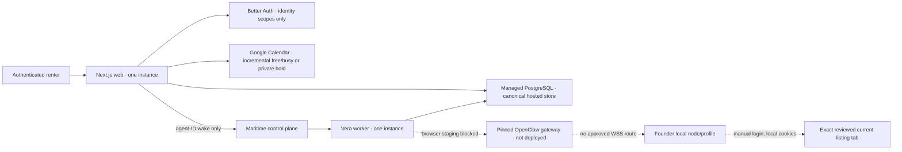
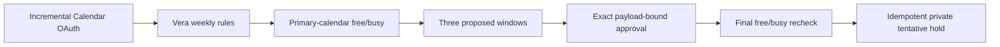
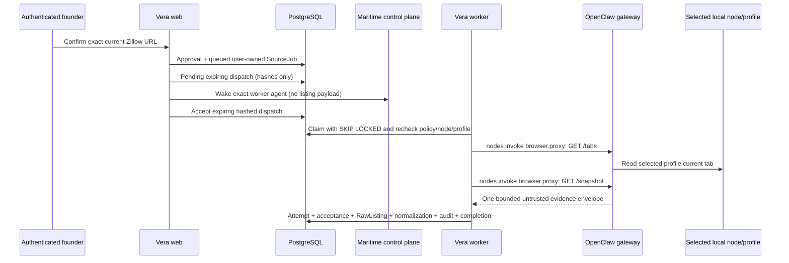

# Vera architecture

Status: normative founder-release architecture
Reviewed: 2026-07-22

## Product boundary

Vera turns fragmented, user-authorized listing evidence into a provenance-preserving decision inbox. It normalizes fields, clusters duplicates without deleting source records, applies deterministic hard constraints and ranking, surfaces risk indicators with evidence, and records material actions. It does not scrape platforms, collect marketplace credentials, send messages, submit applications, make payments, solve CAPTCHAs, or broaden searches autonomously.

## Hosted topology



The founder-staging topology is one region, one web instance, one Maritime worker, and one managed
PostgreSQL database. The founder-controlled local node/profile remains local; no OpenClaw gateway is
deployed for browser staging because ADR 0012 selects the explicit ingress block. Maritime is the
primary execution and trigger plane, while PostgreSQL remains canonical. Scheduled browser polling
remains disabled.

## Workspace boundaries

- `apps/web`: Next.js server components, protected route handlers, identity, readiness, and the decision cockpit.
- `apps/worker`: PostgreSQL-backed acquisition, normalization, and decision polling. It claims one owned job through a narrow system queue and processes it through tenant repositories.
- `packages/domain`: strict Zod schemas, lifecycle state machines, API contracts, readiness, identity, connector jobs, and safety invariants.
- `packages/db`: canonical PostgreSQL schema/migrations/repositories plus application-layer credential encryption.
- `packages/db/demo`: explicit sanitized SQLite adapter only.
- `packages/connectors`: optional-operation source connector, browser provider, and Maritime boundaries; fixture/manual adapters, no-network mocks, and the version-enforcing narrow OpenClaw current-tab adapter. The CLI remains an external node/gateway runtime, not a Vera package dependency.
- `packages/policy`: fail-closed source manifests and kill switches.
- `packages/scoring`: deterministic normalization, duplicate clustering, ranking, and risk indicators.
- `packages/ai`: provider-neutral structured extraction with a deterministic mock and opt-in OpenAI adapter.
- `packages/calendar`: provider-neutral free/busy, window-generation, hold-payload, and Google Calendar client boundaries with a deterministic mock.
- `packages/notifications`: deterministic eligibility, quiet-hours, mock/console providers, and generic Web Push delivery.
- `infra/maritime`: pinned worker/gateway deployment validation and operator-controlled runbooks; no secret values.

Business logic depends on asynchronous repository interfaces, not PostgreSQL driver objects. Production composition roots construct one bounded pool per process; no request creates a connection.

## Identity and tenancy

Better Auth uses a Google Web Application OAuth client and requests only `openid`, `email`, and `profile`. It stores auth state in PostgreSQL, encrypts provider account tokens supported by Better Auth, disables implicit cross-email account linking, and enforces origin/CSRF checks.

Calendar authorization is a separate server-side Google Web Application OAuth flow. Its state is cryptographically random, single-use, short-lived, bound to the initiating Vera user and capability, and protected by PKCE. Vera verifies the returned Google subject, audience, and scopes instead of inferring consent from a successful callback. Integration refresh tokens are application-encrypted; access tokens remain process-local and short-lived.

Every hosted private table is tenant-owned. `requireVeraSession(headers)` derives the UUID owner from the authoritative server session and returns repositories already closed over that user. It accepts no user ID. Repository predicates include `user_id`, and composite foreign keys enforce ownership across parent/child rows. A foreign resource is indistinguishable from a missing resource and returns 404.

The only cross-tenant API is `SystemWorkerQueue`. PostgreSQL claims use `FOR UPDATE SKIP LOCKED`, return `{ userId, job }`, and prevent duplicate execution. The worker immediately creates `repositoryProvider.forUser(userId)` before reading private evidence.

## PostgreSQL persistence

`DATABASE_URL` selects the only hosted engine. Drizzle migration `0000_smart_vin_gonzales.sql` is the canonical PostgreSQL baseline. Persisted instants use `timestamptz`, structured bounded data uses `jsonb`, currency uses integer minor units, identity IDs use UUIDs, and domain-stable listing/job IDs remain text where intentional.

The pool is bounded and configures connection, statement, lock, and idle-transaction timeouts. `/api/health` is dependency-free liveness. `/api/ready` checks connectivity and the latest Drizzle migration hash, returning 503 when PostgreSQL is unavailable or behind. Web and worker shutdown close their pool after in-flight work stops.

Global `source_policy_manifests` are the sole unowned application table. `pnpm db:seed` upserts those manifests only. Private data is created only for an authenticated user or an explicitly reviewed migration/import operation.

Migration `0001_calendar_availability.sql` adds user-owned availability rules, append-only availability-check summaries, Calendar OAuth state, idempotent calendar holds, and viewing supersession fields without resetting existing listings, jobs, or demo fixtures.

Migration `0003_maritime_execution_plane.sql` additively introduces durable dispatch attempts, schedules/runs, service health, Gmail alert cursors/references/OAuth state, encrypted Web Push subscriptions, and notification deliveries. It upgrades the preserved browser-node compatibility pin without resetting source, listing, Calendar, or demo rows.

## Calendar availability and hold boundary



For the founder release, Vera checks only the connected account's primary calendar and states that limit in the UI. It requests `calendar.freebusy` only when conflict checking is enabled. It requests `calendar.events.owned` separately when hold creation is enabled or first used; write access is never required to suggest times. Multi-calendar selection and `calendar.calendarlist.readonly` are not implemented.

Availability checking calls only the free/busy endpoint. Vera does not fetch event titles, descriptions, attendees, locations, or other event details, and does not persist raw busy intervals. It stores only a bounded check summary: state, calendars attempted and actually checked, check time, response hash/count, safe provider error, and the Vera rules used to generate proposals.

The Option C availability states are `checked`, `scope_not_granted`, `google_disconnected`, `google_temporarily_unavailable`, `stale`, and `vera_rules_only`. `stale` is derived at read time; the other provider outcomes are persisted. A missing grant, revoked/disconnected account, stale result, timeout, or provider failure is never interpreted as an empty calendar. Vera may propose rules-only windows, but labels them **Calendar conflicts not checked**, exposes Connect/Reconnect or Retry, and requires a visible warning before the user continues.

Immediately before a hold, Vera rechecks the selected interval when free/busy is available. A new conflict blocks creation and offers replacement windows. If the recheck cannot complete, continuing requires a new exact approval whose payload includes the explicit conflict-check override and reason. The created event uses a deterministic Vera event ID, is `tentative` and private, has no attendees or conference data, and uses `sendUpdates=none`. Founder-release reschedule and cancel actions update Vera's internal state only; they do not update or delete the Google event.

## Connector and orchestration boundary

Acquisition mode and policy state remain independent:

- acquisition: `official_api`, `email_alert`, `local_browser`, `user_capture`, plus test-only `fixture`;
- policy: `approved`, `user_triggered_only`, `experimental_personal`, `disabled`.

Connectors declare supported operations rather than implementing a universal interface. Discover, capture, and detail fetch are optional. Every result is schema-validated, untrusted, correlated, hashed, and idempotent. Disabled or missing policy fails closed. An offline browser node produces visible `deferred_node_offline`; it is never an empty success and never advances a cursor.

### OpenClaw current-tab boundary

The following is the future founder-only current-tab contract, deliberately smaller than saved-search
monitoring. It is not active in Maritime staging until ADR 0012 is superseded by a documented ingress
topology:



`OpenClawBrowserExecutionProvider` requires the worker-bundled CLI to report exactly `2026.6.33`, carries the gateway URL/token only in the child environment, executes with `shell:false`, and emits fixed `nodes invoke --node … --command browser.proxy` calls. Vera's application adapter can serialize only `GET /tabs` and `GET /snapshot` for the explicitly selected allowlisted profile. The worker never calls the legacy navigation method. Login, 2FA, CAPTCHA, consent, rate/bot challenge, redirect, active-URL mismatch, stale target, layout uncertainty, upload/download, camera/microphone, version mismatch, and policy uncertainty are typed non-success states.

This application restriction is not a transport-level read-only guarantee. OpenClaw `2026.6.33` does not provide a path-level allowlist within native `browser.proxy`, so another authorized proxy caller could exercise broader browser operations. The reviewed gateway/node configuration limits the effective node command set to `browser.proxy`, selects one profile, disables evaluation, and keeps the feature disabled and founder-only by default. A narrower node-side capture command is required before multi-user browser enrollment.

The hosted authority stores five independent control layers: process-wide system kill switch, per-user browser enablement, per-user Zillow-source enablement, per-node disablement, and per-profile disablement. `browser_capture_acceptances` provides one immutable acceptance per user/job and one per invocation key. Acceptance is in the same transaction as immutable raw import, normalization enqueue, redacted audit, and job completion. Provider I/O occurs before that transaction.

The current founder enrollment helper synchronizes a manually verified OpenClaw node/profile into Vera and gives it a five-minute heartbeat window. It does not pair or grant OpenClaw capability. Maritime deployment health is reconciled independently. A signed continuous node-enrollment channel remains a prerequisite before broader multi-user enrollment.

### Maritime durable execution

The hosted web persists an expiring dispatch with issuer, exact worker audience, unique nonce hash, job payload hash, and source-job reference before calling the server-only Maritime SDK. The SDK call receives only the worker agent ID. An accepted dispatch is atomically consumed once with the job claim; Maritime status never replaces the canonical PostgreSQL job state. Policy is checked at job creation, immediately before dispatch, and again by the worker. Kill switches can cancel queued work.

Maritime's dashboard owns the supported five-minute UTC wake trigger. PostgreSQL `production_schedules` own per-user due state and idempotent run records for Gmail alert ingestion, reconciliation, notification fan-out, health, stale checks, and cleanup. Browser jobs are never scheduled in this release.

### Notification boundary

Web Push subscriptions are encrypted at the application layer before PostgreSQL persistence. Deterministic fan-out requires enabled user/profile rules, a score threshold, passed hard constraints, freshness, risk policy, and duplicate suppression. Quiet hours and hourly limits defer deliveries. The lock-screen payload is fixed generic text plus a same-origin listing link; it contains no address, price, description, risk evidence, or contact detail.

The immutable pipeline remains:

```text
source evidence → normalization → field provenance → deduplication
→ deterministic ranking/risk → notification → approved external action
```

## Explicit offline demo

`pnpm demo` starts a separate composition with a cryptographic launch capability and `@vera/db/demo`. A flag or database path cannot select SQLite from hosted code. The adapter is bound to one synthetic demo owner, preserves the twelve sanitized records and deterministic audit flow, and contains no users, sessions, accounts, OAuth credentials, browser cookies, or real personal data. A process-local, immutable, no-token Calendar capability fixture exists only to exercise scope-aware approval paths and is never presented as a connected Google account.

The demo worker is launched only by `scripts/demo-start.ts`. Normal `pnpm dev`, `worker:start`, Maritime, hosted web, staging, and production can construct PostgreSQL only and fail rather than falling back. Demo mode never imports the Maritime, OpenClaw, Gmail, or Web Push production compositions. Calendar behavior in demo mode uses the process-owned `MockCalendarClient` and makes no Google network request; simulated checks and holds must be labeled as such.

## Compatibility constraint

Existing domain objects for canonical listings and duplicate clusters predate explicit `searchProfileId` ownership. The PostgreSQL compatibility repository resolves exactly one search profile for those legacy write methods and fails if the user has zero or multiple profiles. Decision reconciliation already uses the job's explicit profile. Before supporting multiple active profiles per user, revise those domain write contracts to carry profile identity directly; do not infer it.

## Deployment

Railway or Vercel may host the single web instance. Maritime may host the immutable Vera worker image;
an explicit OpenClaw gateway image is future-only until the ingress ADR changes. Both web and worker
receive the same managed `DATABASE_URL` with conservative pool limits. Apply migrations as a controlled
release step, take a managed snapshot before schema changes, and use `infra/maritime/README.md` plus
the PostgreSQL runbook for deploy, backup, restore, and rollback.
