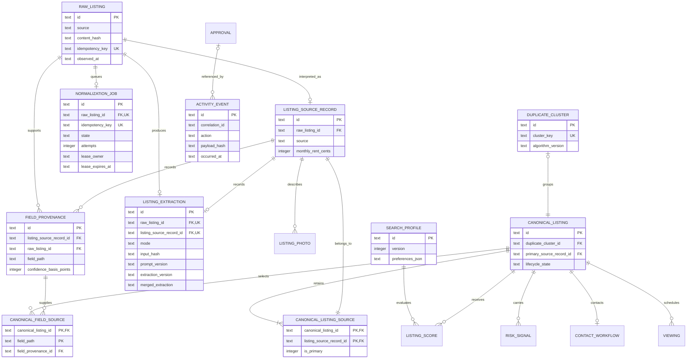
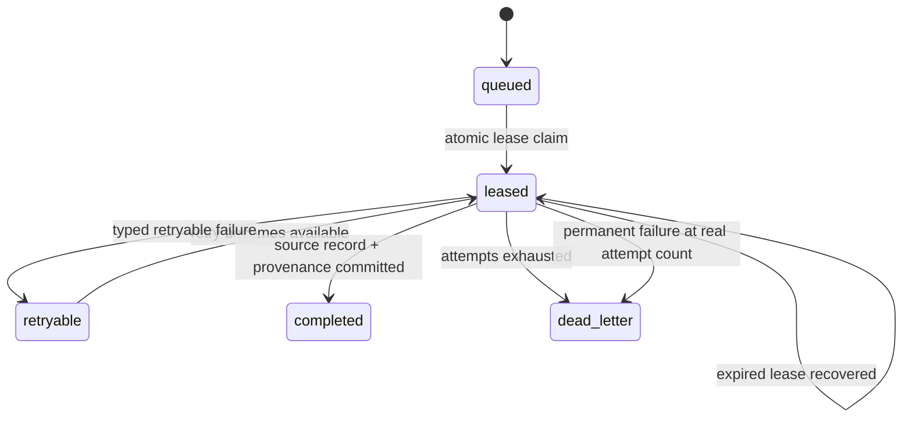
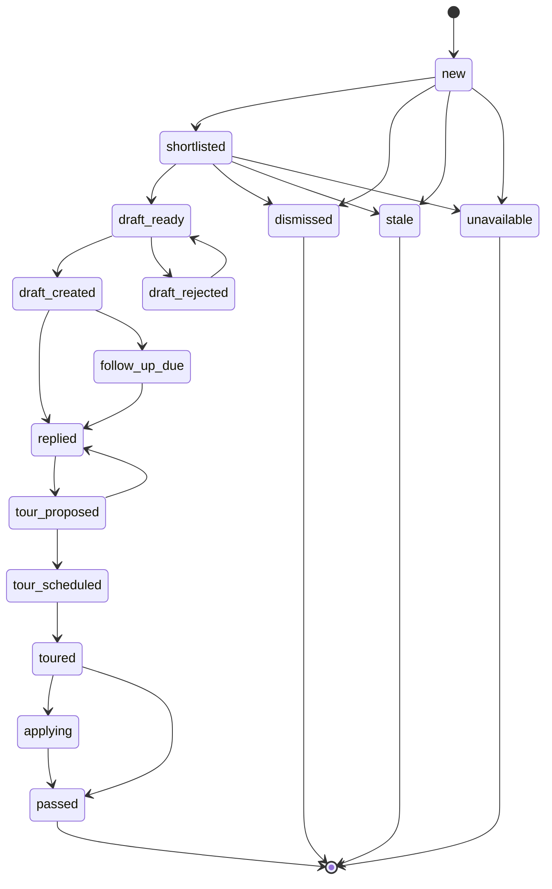

# Vera data model

Status: implemented through provider-neutral Milestone 3 extraction  
Reviewed: 2026-07-17

## Purpose

Vera's SQLite store preserves source evidence, field provenance, canonical listing decisions, workflow state, and audit events for one local user. The model is designed around five rules:

1. Raw evidence and activity events are append-only.
2. Canonicalization retains every source record.
3. Every normalized fact and every selected canonical fact has provenance.
4. Unknown is stored as `NULL`, not as a guessed value.
5. Listing lifecycle changes pass through the domain transition function.

The sanitized fixture seed uses Zillow, Facebook Marketplace, Craigslist, and Apartments.com as source labels only. Manual capture may classify validated provenance URLs with those same labels or `other`; neither path performs platform access.

## Entity relationships



`SOURCE_POLICY_MANIFEST` is deliberately independent of listing evidence. The seed enables only the local sanitized-fixture and manual-capture manifests. Label-only platform manifests are present but disabled; no platform connector is enabled.

## Tables

| Table                       | Responsibility                                                                   | Important constraints                                                                                                        |
| --------------------------- | -------------------------------------------------------------------------------- | ---------------------------------------------------------------------------------------------------------------------------- |
| `search_profiles`           | Versioned renter constraints and preferences                                     | Unique name/version; non-negative budgets                                                                                    |
| `raw_listings`              | Exact fixture or user-supplied capture evidence                                  | Unique idempotency key; evidence required; update/delete triggers                                                            |
| `listing_source_records`    | One normalized interpretation per raw record                                     | Unique raw-listing link; confidence and completeness ranges; optional post date/contact channel                              |
| `listing_photos`            | Metadata for already-supplied photo evidence                                     | No download behavior; inert URL or fixture label required                                                                    |
| `field_provenance`          | Source, method, confidence, time, and known/unknown state for a normalized field | Unique source-record/field path; raw and source FKs; unknown reason required when unknown                                    |
| `normalization_jobs`        | Durable local queue from immutable raw evidence to a source record               | Unique raw/idempotency keys; checked state/attempts; bounded lease and typed failure fields                                  |
| `listing_extractions`       | One immutable strict extraction result per raw/source record                     | Unique raw and source links; deterministic/LLM mode checks; strict JSON; token/latency/repair checks; update/delete triggers |
| `duplicate_clusters`        | Versioned metadata for multi-source clusters                                     | Unique deterministic cluster key                                                                                             |
| `canonical_listings`        | User-facing stitched listing and lifecycle state                                 | Optional unique cluster; primary source FK; state check                                                                      |
| `canonical_listing_sources` | Every source record retained by a canonical listing                              | Composite PK; a source record belongs to one canonical listing                                                               |
| `canonical_field_sources`   | Provenance selected for each canonical field                                     | One provenance selection per canonical field path                                                                            |
| `listing_scores`            | Immutable versioned score snapshots                                              | Unique inputs and algorithm version; score range                                                                             |
| `risk_signals`              | Evidence-backed risk indicators                                                  | Confidence/severity/status checks; no scam verdict field                                                                     |
| `contact_workflows`         | Draft-oriented contact state                                                     | One workflow per listing; no send operation                                                                                  |
| `approvals`                 | Payload-bound, expiring, single-use approval state                               | User actor only; state check                                                                                                 |
| `viewings`                  | Proposed and confirmed viewing data                                              | State check; no attendees or notification fields                                                                             |
| `activity_events`           | Immutable material-action audit trail                                            | Correlation index; update/delete triggers                                                                                    |
| `source_policy_manifests`   | Versioned fail-closed connector policy                                           | Composite connector/version PK; exact capability/operation/network fields; disabled manifests grant no capabilities          |

Complex bounded values such as amenities, evidence summaries, preferences, viewing windows, and manifest capabilities use JSON text columns. Repository reads parse every such value through the corresponding strict Zod schema.

## Evidence and provenance

`RawListing` is an immutable capture. `ListingSourceRecord` is its normalized interpretation. A source record never becomes a canonical record by replacement; it joins a canonical record through `canonical_listing_sources`.

Every baseline normalized field has a `field_provenance` row. Known facts carry a value in the source record; unknown facts carry `value_status=unknown`, zero confidence, a reason code, and no invented value. Each row contains:

- source-record ID;
- raw-listing ID;
- normalized field path;
- extraction method;
- confidence in basis points;
- observed time;
- optional safe evidence excerpt.

The current normalizer records provenance for URL/source classification plus every extraction path: title, bedrooms, bathrooms, address text, square feet, property type, base rent, required recurring fees, raw availability, justified availability date, lease term, cats, dogs, amenities, source-posted time, contact channel, contact name, email, phone, and contact URL. Contact values may exist in the protected local extraction row when present in supplied evidence; they never appear in audit metadata or logs.

`listing_extractions` retains the richer representation that does not fit the narrower source record. Its mode is `deterministic_only` or `llm_augmented`. It stores the exact input hash, requested fields, prompt/extraction versions, nullable validated provider result, required merged extraction, usage, latency, repair count, and completion time. A deterministic run has no provider metadata and zero metrics. An LLM-augmented run requires matching provider metadata/result/metrics. Repository reads and writes parse every JSON value through strict domain schemas.

Source-record projection remains conservative: monthly rent is populated only from USD/month base rent; recurring fees are aggregated only when every known required fee is USD/month; contact values remain in the extraction row while only the channel projects to the source record. The extraction row retains original currency, billing period, fee entries, raw availability, and exact unknown reasons.

`canonical_field_sources` chooses one of those provenance rows for each non-null canonical field. This permits a stitched canonical listing—for example, rent from one source and stated recurring fees from another—while retaining the evidence for both.

## Raw import identity

Raw content hashes use SHA-256 over canonical JSON containing exact raw text, raw JSON, and capture metadata:

```text
SHA256("raw-content:v1:" + canonicalJson(evidence))
```

The raw idempotency key binds source identity to that content hash:

```text
SHA256("raw-import:v1:" + source + ":" + sourceIdentity + ":" + contentHash)
```

Object keys are sorted recursively; array order is preserved. Reimporting identical evidence returns the existing record. Changed evidence for the same source identity creates a new immutable snapshot. A normalization job uses:

```text
SHA256("normalization-job:v1:" + rawListingId)
```

The unique raw-listing and idempotency-key constraints ensure an identical capture produces at most one job.

## Normalization job lifecycle



The worker claims one runnable job with a 90-second lease in a short transaction, performs deterministic/provider work without holding the transaction, and commits the source record, all provenance rows, immutable extraction, completion event, and job completion together. Failure records only a safe typed code/category and either schedules bounded exponential retry or moves the job to `dead_letter`. Permanent failure does not pretend unused attempts were consumed.

## Append-only enforcement

Repository interfaces expose `import`/`get` for raw listings and `append`/`get`/`list` for activity events. They have no update or delete methods.

The migrations install six SQLite immutability triggers:

```text
raw_listings_no_update
raw_listings_no_delete
activity_events_no_update
activity_events_no_delete
listing_extractions_no_update
listing_extractions_no_delete
```

The triggers abort direct SQL mutations, protecting the invariant if later code bypasses a repository.

## Listing lifecycle



The diagram omits repeated transitions from active states to `dismissed`, `stale`, or `unavailable` for readability. The authoritative adjacency map is `packages/domain/src/lifecycle.ts`.

Repositories expose only `transitionLifecycle(id, requested, transitionedAt)`. The method reads current state and calls `transitionListingLifecycle` inside a transaction. Invalid transitions throw without changing state.

## SQLite initialization

Every connection executes and verifies:

```sql
PRAGMA foreign_keys = ON;
PRAGMA journal_mode = WAL;
PRAGMA busy_timeout = 5000;
```

The database is file-backed. Tests use unique temporary file databases so WAL and migration behavior are real. The default file is `vera.sqlite` under the current user's application-data directory; `VERA_DATA_DIR` supplies an explicit directory.

## Sanitized seed topology

The idempotent seed produces exactly 12 raw listings, 12 source records, 8 canonical listings, and 3 duplicate clusters:

| Canonical listing | Source labels                      | Source records |
| ----------------- | ---------------------------------- | -------------: |
| Juniper Row 1A    | Zillow, Craigslist, Apartments.com |              3 |
| Harbor studio     | Facebook Marketplace, Craigslist   |              2 |
| Maple Crescent 2B | Zillow, Apartments.com             |              2 |
| Orchard loft      | Facebook Marketplace               |              1 |
| Cedar flat        | Craigslist                         |              1 |
| River cottage     | Zillow                             |              1 |
| Pine studio       | Apartments.com                     |              1 |
| Market Terrace 3C | Facebook Marketplace               |              1 |

All facts and addresses are synthetic, all URLs use `example.invalid`, and no contacts or account identifiers are present. Several fields are intentionally `NULL` so the UI and tests exercise unknown facts.

## Commands

```bash
pnpm db:generate
pnpm db:migrate
pnpm db:seed
```

`db:generate` regenerates a Drizzle migration for review. `db:migrate` creates or upgrades the configured database. `db:seed` requires a migrated database and can be run repeatedly without increasing fixture, audit, or manifest counts. `pnpm worker:run-once` claims and processes at most one queued normalization job.
