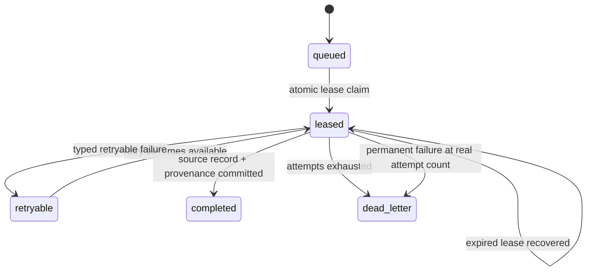
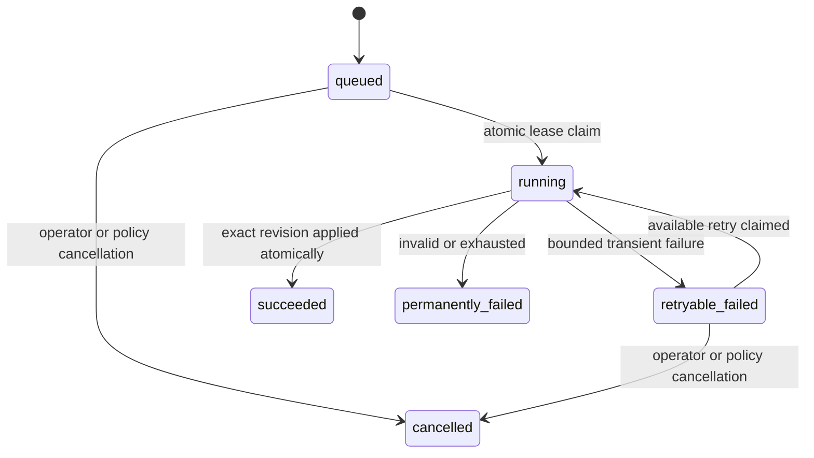
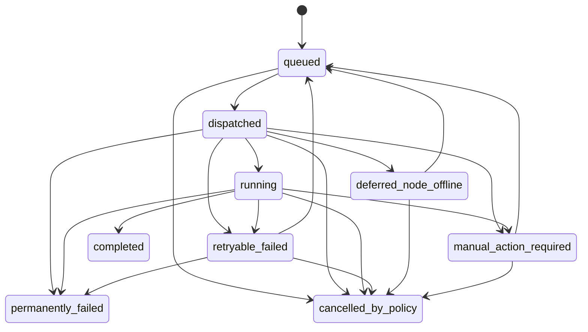
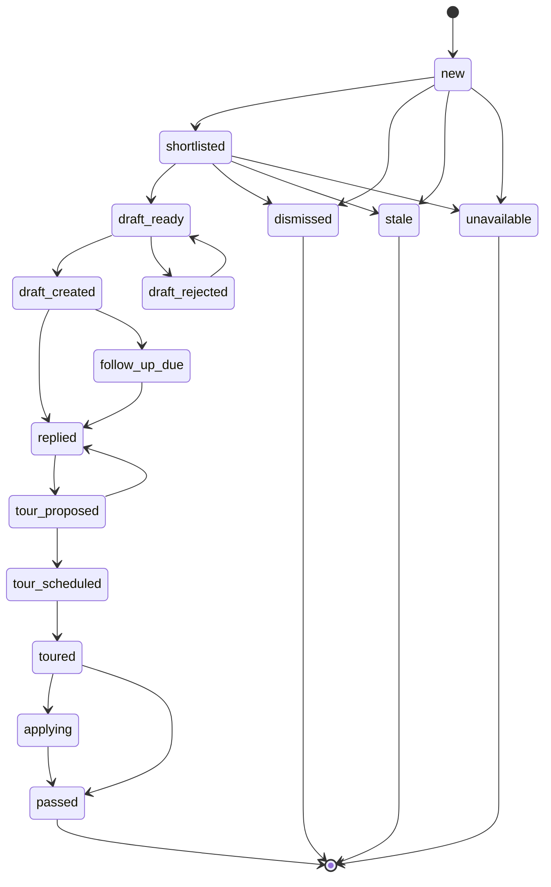

# Vera data model

Status: implemented through deterministic decision reconciliation

Reviewed: 2026-07-20

## Purpose

Vera's SQLite store preserves source evidence, field provenance, canonical listing decisions, workflow state, and audit events for one local user. The model is designed around five rules:

1. Raw evidence, activity events, and source-job attempts are append-only.
2. Canonicalization retains every source record.
3. Every normalized fact and every selected canonical fact has provenance.
4. Unknown is stored as `NULL`, not as a guessed value.
5. Listing lifecycle changes pass through the domain transition function.

The sanitized fixture seed uses Zillow, Facebook Marketplace, Craigslist, and Apartments.com as source labels only. Manual capture may classify validated provenance URLs with those same labels or `other`; neither path performs platform access.

## Entity relationships

```mermaid
erDiagram
    SEARCH_PROFILE ||--o{ LISTING_SCORE : evaluates
    SOURCE_POLICY_MANIFEST ||--o{ SOURCE_JOB : authorizes
    SOURCE_JOB ||--o{ SOURCE_JOB_ATTEMPT : records
    BROWSER_NODE ||--o{ SOURCE_JOB : executes
    SOURCE_JOB ||--o{ RAW_LISTING : may_produce
    RAW_LISTING ||--o| LISTING_SOURCE_RECORD : interpreted_as
    RAW_LISTING ||--o| NORMALIZATION_JOB : queues
    RAW_LISTING ||--o| LISTING_EXTRACTION : produces
    LISTING_SOURCE_RECORD ||--o| LISTING_EXTRACTION : records
    LISTING_SOURCE_RECORD ||--o{ LISTING_PHOTO : describes
    RAW_LISTING ||--o{ FIELD_PROVENANCE : supports
    LISTING_SOURCE_RECORD ||--o{ FIELD_PROVENANCE : records
    SEARCH_PROFILE ||--|| DECISION_CORPUS_STATE : versions
    SEARCH_PROFILE ||--o{ DECISION_JOB : queues
    DECISION_JOB ||--o{ DECISION_JOB_ATTEMPT : records
    DECISION_JOB ||--o| DECISION_RUN : produces
    DECISION_RUN ||--o{ DUPLICATE_PAIR_EVALUATION : evaluates
    DECISION_RUN ||--o{ CANONICAL_DECISION_RUN : stitches
    DECISION_RUN ||--o{ LISTING_SCORE : snapshots
    DECISION_RUN ||--o{ RISK_SIGNAL : snapshots
    SEARCH_PROFILE ||--o{ DUPLICATE_OVERRIDE : owns
    DUPLICATE_OVERRIDE ||--o| DUPLICATE_OVERRIDE_REVOCATION : revoked_by

    DUPLICATE_CLUSTER o|--|| CANONICAL_LISTING : groups
    CANONICAL_LISTING ||--|{ CANONICAL_LISTING_SOURCE : retains
    LISTING_SOURCE_RECORD ||--|| CANONICAL_LISTING_SOURCE : belongs_to
    CANONICAL_LISTING ||--o{ CANONICAL_FIELD_SOURCE : selects
    FIELD_PROVENANCE ||--o{ CANONICAL_FIELD_SOURCE : supplies

    CANONICAL_LISTING ||--o{ LISTING_SCORE : receives
    CANONICAL_LISTING ||--o{ RISK_SIGNAL : carries
    CANONICAL_LISTING ||--o| CONTACT_WORKFLOW : contacts
    CANONICAL_LISTING ||--o{ VIEWING : schedules
    APPROVAL o|--o{ ACTIVITY_EVENT : referenced_by

    SEARCH_PROFILE {
        text id PK
        integer version
        text preferences_json
    }
    RAW_LISTING {
        text id PK
        text source
        text acquisition_mode
        text content_hash
        text idempotency_key UK
        text observed_at
    }
    LISTING_SOURCE_RECORD {
        text id PK
        text raw_listing_id FK
        text source
        integer monthly_rent_cents
    }
    FIELD_PROVENANCE {
        text id PK
        text listing_source_record_id FK
        text raw_listing_id FK
        text field_path
        integer confidence_basis_points
    }
    DUPLICATE_CLUSTER {
        text id PK
        text cluster_key UK
        text algorithm_version
    }
    CANONICAL_LISTING {
        text id PK
        text duplicate_cluster_id FK
        text primary_source_record_id FK
        text lifecycle_state
    }
    CANONICAL_LISTING_SOURCE {
        text canonical_listing_id PK, FK
        text listing_source_record_id PK, FK
        integer is_primary
    }
    CANONICAL_FIELD_SOURCE {
        text canonical_listing_id PK, FK
        text field_path PK
        text field_provenance_id FK
    }
    ACTIVITY_EVENT {
        text id PK
        text correlation_id
        text action
        text payload_hash
        text occurred_at
    }
    NORMALIZATION_JOB {
        text id PK
        text raw_listing_id FK, UK
        text idempotency_key UK
        text state
        integer attempts
        text lease_owner
        text lease_expires_at
    }
    SOURCE_POLICY_MANIFEST {
        text connector_id PK
        integer version PK
        text acquisition_mode
        text policy_state
        text execution
    }
    SOURCE_JOB {
        text id PK
        text connector_id
        text acquisition_mode
        text status
        text payload_hash
        text idempotency_key UK
    }
    SOURCE_JOB_ATTEMPT {
        text id PK
        text source_job_id FK
        integer attempt_number
        text outcome_status
        text payload_hash
    }
    BROWSER_NODE {
        text node_id PK
        text provider_id
        text status
        text last_heartbeat_at
        text heartbeat_expires_at
    }
    LISTING_EXTRACTION {
        text id PK
        text raw_listing_id FK, UK
        text listing_source_record_id FK, UK
        text mode
        text input_hash
        text prompt_version
        text extraction_version
        text merged_extraction
    }
    DECISION_CORPUS_STATE {
        text search_profile_id PK, FK
        integer revision
        text updated_at
    }
    DECISION_JOB {
        text id PK
        text search_profile_id FK
        integer target_corpus_revision
        text status
        text input_hash
        text output_hash
    }
    DECISION_JOB_ATTEMPT {
        text id PK
        text job_id FK
        integer attempt_number
        text outcome
        text error_code
    }
    DECISION_RUN {
        text id PK
        text job_id FK, UK
        integer corpus_revision
        text input_hash
        text output_hash
        text plan_version
    }
    DUPLICATE_PAIR_EVALUATION {
        text id PK
        text decision_run_id FK
        text decision
        integer score_basis_points
        text features_json
    }
    DUPLICATE_OVERRIDE {
        text id PK
        text search_profile_id FK
        text kind
        text source_record_ids_json
        text payload_hash
    }
    DUPLICATE_OVERRIDE_REVOCATION {
        text id PK
        text override_id FK, UK
        text reason
        text created_at
    }
    CANONICAL_DECISION_RUN {
        text id PK
        text decision_run_id FK
        text canonical_listing_id
        text stitch_input_hash
        text selected_fields_json
    }
```



The source-orchestration relationships are logical control-plane links. `source_job_attempts.source_job_id` is a database foreign key; manifest authorization is identified by connector and manifest version, and a local-browser node ID is carried only in the job's strict payload. A source job can produce raw evidence only through the existing immutable ingestion gateway, so there is intentionally no direct source-job-to-raw-listing foreign key yet.

`SOURCE_POLICY_MANIFEST` is deliberately independent of listing evidence. The seed enables only the local sanitized-fixture and manual-capture manifests. Label-only platform manifests are present but disabled; no platform connector is enabled.

## Tables

| Table                       | Responsibility                                                                   | Important constraints                                                                                                        |
| --------------------------- | -------------------------------------------------------------------------------- | ---------------------------------------------------------------------------------------------------------------------------- |
| `search_profiles`           | Versioned renter constraints and preferences                                     | Unique name/version; non-negative budgets                                                                                    |
| `raw_listings`              | Exact fixture or user-supplied capture evidence                                  | Acquisition mode retained; unique idempotency key; evidence required; update/delete triggers                                 |
| `listing_source_records`    | One normalized interpretation per raw record                                     | Unique raw-listing link; confidence and completeness ranges; optional post date/contact channel                              |
| `listing_photos`            | Metadata for already-supplied photo evidence                                     | No download behavior; inert URL or fixture label required                                                                    |
| `field_provenance`          | Source, method, confidence, time, and known/unknown state for a normalized field | Unique source-record/field path; raw and source FKs; unknown reason required when unknown                                    |
| `normalization_jobs`        | Durable local queue from immutable raw evidence to a source record               | Unique raw/idempotency keys; checked state/attempts; bounded lease and typed failure fields                                  |
| `listing_extractions`       | One immutable strict extraction result per raw/source record                     | Unique raw and source links; deterministic/LLM mode checks; strict JSON; token/latency/repair checks; update/delete triggers |
| `duplicate_clusters`        | Versioned metadata for multi-source clusters                                     | Unique deterministic cluster key                                                                                             |
| `canonical_listings`        | User-facing stitched listing and lifecycle state                                 | Optional unique cluster; primary source FK; state check                                                                      |
| `canonical_listing_sources` | Every source record retained by a canonical listing                              | Composite PK; a source record belongs to one canonical listing                                                               |
| `canonical_field_sources`   | Provenance selected for each canonical field                                     | One provenance selection per canonical field path                                                                            |
| `listing_scores`            | Immutable versioned score snapshots                                              | Unique inputs and algorithm version; score range                                                                             |
| `risk_signals`              | Evidence-backed risk indicators                                                  | Confidence/severity/status checks; no scam verdict field                                                                     |
| `contact_workflows`         | Draft-oriented contact state                                                     | One workflow per listing; no send operation                                                                                  |
| `approvals`                 | Payload-bound, expiring, single-use approval state                               | User actor only; state check                                                                                                 |
| `viewings`                  | Proposed and confirmed viewing data                                              | State check; no attendees or notification fields                                                                             |
| `activity_events`           | Immutable material-action audit trail                                            | Correlation index; update/delete triggers                                                                                    |
| `source_policy_manifests`   | Versioned fail-closed connector policy                                           | Composite connector/version PK; exact capability/operation/network fields; disabled manifests grant no capabilities          |
| `source_jobs`               | Acquisition orchestration state before immutable raw acceptance                  | Strict payload/result JSON; persisted capability and optional opaque approval ID; unique idempotency key; checked lifecycle |
| `source_job_attempts`       | Immutable source-job attempt history                                             | Source-job FK; unique job/attempt number; update/delete triggers                                                             |
| `browser_nodes`             | Latest safe local browser-node heartbeat snapshot                               | One row per opaque node ID; closed health state; heartbeat expiry and safe capability JSON                                   |
| `decision_corpus_state`     | Monotonic evidence/override revision per search profile                          | One row per profile; revision never decreases                                                                                |
| `decision_jobs`             | Leased recomputation queue for one exact corpus revision                         | Unique profile/revision; bounded attempts and leases; typed terminal state                                                    |
| `decision_job_attempts`     | Immutable reconciliation-attempt history                                         | Unique job/attempt; update/delete triggers                                                                                   |
| `decision_runs`             | Immutable accepted plan identity and safe counts                                 | One run per job; unique profile/revision/input; update/delete triggers                                                       |
| `duplicate_pair_evaluations` | Immutable explainable pair decisions and feature values                        | Ordered source pair; one row per run/pair; update/delete triggers                                                            |
| `duplicate_overrides`       | Operator-authored force-merge or force-split fact                                | Append-only; sorted unique member IDs; hashed payload                                                                        |
| `duplicate_override_revocations` | Append-only revocation of an override                                      | At most one revocation per override; no destructive delete                                                                  |
| `canonical_decision_runs`   | Immutable stitched projection and field-selection history                       | One canonical row per decision run; retained source/provenance selection                                                     |

Complex bounded values such as amenities, evidence summaries, preferences, viewing windows, and manifest capabilities use JSON text columns. Repository reads parse every such value through the corresponding strict Zod schema.

## Evidence and provenance

`RawListing` is an immutable capture. It records `acquisition_mode` independently from its human-readable source label so sanitized fixtures cannot masquerade as a live provider. The production modes are `official_api`, `email_alert`, `local_browser`, and `user_capture`; `fixture` is an additional code-level test-only mode. `ListingSourceRecord` is the raw capture's normalized interpretation. A source record never becomes a canonical record by replacement; it joins a canonical record through `canonical_listing_sources`.

Every baseline normalized field has a `field_provenance` row. Known facts carry a value in the source record; unknown facts carry `value_status=unknown`, zero confidence, a reason code, and no invented value. Each row contains:

- source-record ID;
- raw-listing ID;
- normalized field path;
- extraction method;
- confidence in basis points;
- observed time;
- optional safe evidence excerpt.

The current normalizer records provenance for URL/source classification plus every extraction path: title, bedrooms, bathrooms, address text, square feet, property type, base rent, required recurring fees, raw availability, justified availability date, lease term, cats, dogs, amenities, source-posted time, contact channel, contact name, email, phone, and contact URL. Contact values may exist in the protected local extraction row when present in supplied evidence; they never appear in audit metadata or logs.

`listing_extractions` retains the richer representation that does not fit the narrower source record. Its mode is `deterministic_only` or `llm_augmented`. It stores the exact input hash, requested fields, prompt/extraction versions, nullable validated provider result, required merged extraction, usage, latency, repair count, and completion time. A deterministic run has no provider metadata and zero metrics. An LLM-augmented run requires matching provider metadata/result/metrics. Repository reads and writes parse every JSON value through strict domain schemas. New runs use extraction semantics `listing-extraction.v2`; the read schema continues to accept persisted `listing-extraction.v1` rows, so this semantic hardening requires no destructive data migration.

Source-record projection remains conservative: monthly rent is populated only from USD/month base rent whose quoted evidence identifies it as rent; recurring fees are aggregated only when every known required fee is USD/month and its label and amount share explicit required-fee evidence. Contact values remain in the extraction row while only the channel projects to the source record. The extraction row retains original currency, billing period, fee entries, raw availability, and exact unknown reasons.

`canonical_field_sources` chooses one of those provenance rows for each non-null canonical field. This permits a stitched canonical listing—for example, rent from one source and stated recurring fees from another—while retaining the evidence for both.

## Raw import identity

Raw content hashes use SHA-256 over canonical JSON containing exact raw text, raw JSON, and capture metadata:

```text
SHA256("raw-content:v1:" + canonicalJson(evidence))
```

The raw idempotency key binds source identity to that content hash:

```text
SHA256("raw-import:v1:" + source + ":" + sourceIdentity + ":" + contentHash)
```

Object keys are sorted recursively; array order is preserved. Reimporting identical evidence returns the existing record. Changed evidence for the same source identity creates a new immutable snapshot. A normalization job uses:

```text
SHA256("normalization-job:v1:" + rawListingId)
```

The unique raw-listing and idempotency-key constraints ensure an identical capture produces at most one job.

## Normalization job lifecycle



The worker claims one runnable job with a 90-second lease in a short transaction, performs deterministic/provider work without holding the transaction, and commits the source record, all provenance rows, immutable extraction, completion event, and job completion together. Failure records only a safe typed code/category and either schedules bounded exponential retry or moves the job to `dead_letter`. Permanent failure does not pretend unused attempts were consumed.

## Decision reconciliation lifecycle

`decision_jobs` begins only after evidence or an operator override changes the corpus. It is separate from both pre-ingestion `source_jobs` and per-raw-record `normalization_jobs`.



Each profile owns a monotonic `decision_corpus_state.revision`. A normalization commit or merge/split override increments it and enqueues at most one job for the resulting profile/revision pair. The worker reads an ordered snapshot for exactly that revision, computes outside a transaction, then applies only if the lease and current corpus revision still match. A stale plan cannot partially update canonical listings.

The accepted transaction writes the full projection and append-only evidence together:

- one `decision_run` with plan/input/output versions, hashes, corpus revision, and safe counts;
- every evaluated candidate pair and feature contribution;
- every canonical stitch plan and selected field-provenance reference;
- active/superseded cluster and canonical projection state;
- immutable score and risk snapshots linked to the run;
- source memberships and canonical field selections; and
- a redacted activity event plus job completion.

The canonical ID is stable when a new component has one unambiguous prior identity. When components merge or split, losing projections are marked `superseded` and point to the active survivor; user workflow state is preserved on the survivor. Source evidence and historical decisions are never deleted. Override rows are append-only facts; reversal is a separate append-only revocation.

Decision-job status is queryable through `/api/decision-jobs/[id]`. `/api/dedupe/overrides` validates active references, records a force-merge or force-split, bumps the corpus revision in the same transaction, and returns the queued job. Neither API accepts raw evidence, contacts, credentials, cookies, or browser state.

## Source-job lifecycle

Source jobs are acquisition orchestration records. They are separate from normalization jobs, which exist only after raw evidence has been accepted.



`completed`, `permanently_failed`, and `cancelled_by_policy` are terminal. Repository transitions execute in a transaction and call the domain transition function before updating a row. Retry reuses the job's stable identity and idempotency key.

The payload is a strict discriminated object with minimum control data only:

- `fixture` names a sanitized fixture-set reference;
- `user_capture` names an opaque protected capture reference, never pasted evidence;
- `official_api` and `email_alert` name a reviewed source-configuration reference and optional committed cursor;
- `local_browser` names an opaque node and saved-search ID, one exact safe URL, an optional committed cursor, and bounded page, record, byte, duration, and concurrency limits.

`JobAttempt` stores the attempt number, times, outcome, safe error or deferred reason, correlation ID, and payload hash. It stores no raw connector output or secret. `BrowserNodeStatus` stores only the most recent safe node/provider identity, closed status (`online`, `offline`, `stale`, or `revoked`), heartbeat times, contract version, and boolean navigation/capture/cancellation capabilities.

Connector and browser results may return a `cursorCandidate`, but neither result envelope nor `source_jobs.result` commits it. A future ingestion transaction may promote that candidate only after all associated raw evidence is durably accepted. Policy denial, unsupported operation, manual action, failure, cancellation, and `deferred_node_offline` create no cursor candidate and never advance the committed cursor.

## Append-only enforcement

Repository interfaces expose `import`/`get` for raw listings and `append`/`get`/`list` for activity events. They have no update or delete methods.

The migrations install 24 SQLite immutability triggers. Each protected table has one update and one delete trigger:

```text
raw_listings_no_update
raw_listings_no_delete
activity_events_no_update
activity_events_no_delete
listing_extractions_no_update
listing_extractions_no_delete
source_job_attempts_no_update
source_job_attempts_no_delete
decision_job_attempts_no_update
decision_job_attempts_no_delete
decision_runs_no_update
decision_runs_no_delete
duplicate_pair_evaluations_no_update
duplicate_pair_evaluations_no_delete
duplicate_overrides_no_update
duplicate_overrides_no_delete
duplicate_override_revocations_no_update
duplicate_override_revocations_no_delete
canonical_decision_runs_no_update
canonical_decision_runs_no_delete
listing_scores_no_update
listing_scores_no_delete
risk_signals_no_update
risk_signals_no_delete
```

The triggers abort direct SQL mutations, protecting the invariant if later code bypasses a repository.

## Migration 0003

`packages/db/drizzle/0003_romantic_fantastic_four.sql` is a forward-only migration that preserves existing user data. It:

1. rebuilds `source_policy_manifests` at schema version 2 with required `acquisition_mode` and `policy_state` columns;
2. backfills `fixture.feed.v1` to `fixture` / `approved`;
3. backfills `manual.capture.v1` to `user_capture` / `user_triggered_only`;
4. backfills legacy label-only source manifests to `fixture` / `disabled` and forces them runtime-disabled;
5. rebuilds `raw_listings` with required `acquisition_mode`, mapping fixture captures to `fixture` and both manual capture methods to `user_capture`, while recreating its indexes and append-only triggers;
6. creates `source_jobs`, append-only `source_job_attempts`, and `browser_nodes`.

The migration does not reset raw listings, source records, canonical listings, duplicate clusters, extraction runs, scores, risks, activity events, or normalization jobs. Existing raw content hashes and import idempotency keys remain unchanged because acquisition mode was not added to the version-1 raw content-hash input. Migration execution restores foreign keys and runs SQLite's foreign-key check after applying the migration set. Downgrading to code that understands only manifest schema version 1 is unsupported.

## Migration 0004

`packages/db/drizzle/0004_groovy_zaladane.sql` is additive and preserves the rows created by migration 0003. It:

1. persists each source job's requested capability and optional opaque approval ID without persisting authorization-truth booleans;
2. conservatively backfills existing source jobs with the capability implied by their acquisition mode and a null approval ID;
3. extends immutable raw evidence to accept exact `official_api`, `email_alert`, and `local_browser` capture-method/mode pairs in addition to fixture and user-capture pairs;
4. preserves raw IDs, content hashes, and idempotency keys while recreating indexes and append-only triggers.

The migration does not infer that a legacy job had a session or approval. Runtime session availability and the referenced approval's current state and binding are revalidated for every dispatch and retry. A missing provider, missing approval, invalid approval, or provider error fails closed.

## Migration 0005

`packages/db/drizzle/0005_production_decision_engines.sql` is a forward-only migration from the prior schema. It does not reset or delete user evidence. It:

1. creates monotonic corpus state, leased decision jobs, immutable attempts, immutable accepted decision runs, pair histories, canonical decision histories, merge/split overrides, and override revocations;
2. adds stable active/superseded projection state and decision-run references to canonical listings and duplicate clusters;
3. adds optional source coordinates with an all-or-none pair constraint;
4. extends already-supplied photo metadata with byte size, decoded dimensions, MIME type, and explicit perceptual-hash version while marking legacy hashes as `legacy`;
5. extends listing scores and risk signals with additive version-2 columns while preserving every version-1 row and legacy read compatibility;
6. removes the legacy one-risk-row-per-listing/code restriction so immutable snapshots can coexist across decision runs; and
7. adds database triggers for every new append-only history plus `listing_scores` and `risk_signals`.

The table rebuilds copy only columns that existed before migration and supply conservative `NULL`, `active`, or `legacy` defaults for new semantics. Migration integration tests reconstruct the exact migration-0004 schema, insert representative data, run migration 0005, verify foreign keys and row preservation, and exercise the new repositories. Downgrading to code that assumes mutable scores or no projection state is unsupported.

## Listing lifecycle



The diagram omits repeated transitions from active states to `dismissed`, `stale`, or `unavailable` for readability. The authoritative adjacency map is `packages/domain/src/lifecycle.ts`.

Repositories expose only `transitionLifecycle(id, requested, transitionedAt)`. The method reads current state and calls `transitionListingLifecycle` inside a transaction. Invalid transitions throw without changing state.

## SQLite initialization

Every connection executes and verifies:

```sql
PRAGMA foreign_keys = ON;
PRAGMA journal_mode = WAL;
PRAGMA busy_timeout = 5000;
```

The database is file-backed. Tests use unique temporary file databases so WAL and migration behavior are real. The default file is `vera.sqlite` under the current user's application-data directory; `VERA_DATA_DIR` supplies an explicit directory.

## Sanitized seed topology

The production seed inserts exactly 12 immutable raw listings and 12 source records, then queues one decision job. It does not hand-author canonical listings, scores, or risk indicators. Running the decision worker against that evidence deterministically produces 8 active canonical listings and 3 multi-record duplicate clusters:

| Canonical listing | Source labels                      | Source records |
| ----------------- | ---------------------------------- | -------------: |
| Juniper Row 1A    | Zillow, Craigslist, Apartments.com |              3 |
| Harbor studio     | Facebook Marketplace, Craigslist   |              2 |
| Maple Crescent 2B | Zillow, Apartments.com             |              2 |
| Orchard loft      | Facebook Marketplace               |              1 |
| Cedar flat        | Craigslist                         |              1 |
| River cottage     | Zillow                             |              1 |
| Pine studio       | Apartments.com                     |              1 |
| Market Terrace 3C | Facebook Marketplace               |              1 |

All facts and addresses are synthetic, all URLs use `example.invalid`, and no contacts or account identifiers are present. Several fields are intentionally `NULL` so the UI and tests exercise unknown facts.

## Commands

```bash
pnpm db:generate
pnpm db:migrate
pnpm db:seed
pnpm scoring:evaluate-fixtures
```

`db:generate` checks or generates a Drizzle migration for review. `db:migrate` creates or upgrades the configured database. The root `db:seed` command inserts sanitized evidence and runs the worker's bounded one-shot loop, so displayed canonical rows, scores, and risks come from the same production evaluator used for new captures. Repeating the command does not increase evidence, activity, job, or decision-run counts when nothing changed. `pnpm scoring:evaluate-fixtures` evaluates all 66 labeled record pairs, reports precision/recall, cluster shape, algorithm versions, risk counts, and same-input determinism, and labels its small-corpus metrics as regression evidence rather than production-performance claims.
