# Vera data model

Status: PostgreSQL canonical hosted model
Reviewed: 2026-07-22

## Storage rules

Hosted development, staging, and production use PostgreSQL only. All persisted instants are `timestamptz`; bounded structured values are `jsonb`; monetary values are integer minor units; identity and integration IDs are UUIDs; source evidence retains deterministic content and idempotency hashes.

Raw listings, activity events, job attempts, decision histories, and provenance evidence are append-only at the repository layer, with database triggers for the tables that must reject direct update/delete. Unknown is represented explicitly or with nullable fields and is never coerced to false.

## Ownership diagram

```mermaid
erDiagram
  USER ||--o{ SESSION : owns
  USER ||--o{ ACCOUNT : authenticates
  USER ||--o{ INTEGRATION_CONNECTION : owns
  USER ||--o{ SEARCH_PROFILE : owns
  USER ||--o{ RAW_LISTING : owns
  USER ||--o{ LISTING_SOURCE_RECORD : owns
  USER ||--o{ CANONICAL_LISTING : owns
  USER ||--o{ SOURCE_JOB : owns
  USER ||--o{ NORMALIZATION_JOB : owns
  USER ||--o{ DECISION_JOB : owns
  USER ||--o{ ACTIVITY_EVENT : owns
  USER ||--o{ AVAILABILITY_RULE_SET : owns
  USER ||--o{ AVAILABILITY_CHECK : owns
  USER ||--o{ CALENDAR_OAUTH_STATE : owns
  USER ||--o{ CALENDAR_HOLD : owns
  USER ||--o{ BROWSER_NODE : owns
  USER ||--o| BROWSER_USER_CONTROL : controls
  USER ||--o{ BROWSER_SOURCE_CONTROL : controls
  USER ||--o{ BROWSER_PROFILE_CONTROL : controls
  USER ||--o{ BROWSER_CAPTURE_ACCEPTANCE : accepts
  USER ||--o{ MARITIME_DISPATCH : owns
  USER ||--o{ PRODUCTION_SCHEDULE : owns
  USER ||--o| NOTIFICATION_PREFERENCE : configures
  USER ||--o{ WEB_PUSH_SUBSCRIPTION : owns
  USER ||--o{ NOTIFICATION_DELIVERY : receives
  USER ||--o{ GMAIL_OAUTH_STATE : owns
  USER ||--o{ GMAIL_ALERT_CURSOR : owns
  USER ||--o{ GMAIL_ALERT_EXTERNAL_REFERENCE : owns

  SEARCH_PROFILE ||--o{ DECISION_JOB : versions
  RAW_LISTING ||--o| LISTING_SOURCE_RECORD : normalizes
  RAW_LISTING ||--o| LISTING_EXTRACTION : extracts
  RAW_LISTING ||--o| NORMALIZATION_JOB : queues
  LISTING_SOURCE_RECORD ||--o{ FIELD_PROVENANCE : supports
  LISTING_SOURCE_RECORD ||--o{ LISTING_PHOTO : describes
  DUPLICATE_CLUSTER ||--o{ CANONICAL_LISTING : groups
  CANONICAL_LISTING ||--|{ CANONICAL_LISTING_SOURCE : retains
  LISTING_SOURCE_RECORD ||--o| CANONICAL_LISTING_SOURCE : joins
  CANONICAL_LISTING ||--o{ CANONICAL_FIELD_SOURCE : selects
  CANONICAL_LISTING ||--o{ LISTING_SCORE : receives
  CANONICAL_LISTING ||--o{ RISK_SIGNAL : carries
  CANONICAL_LISTING ||--o| CONTACT_WORKFLOW : prepares
  CANONICAL_LISTING ||--o{ VIEWING : schedules
  AVAILABILITY_RULE_SET ||--o{ AVAILABILITY_CHECK : governs
  INTEGRATION_CONNECTION o|--o{ AVAILABILITY_CHECK : authorizes
  VIEWING ||--o| CALENDAR_HOLD : reserves
  APPROVAL ||--o| CALENDAR_HOLD : authorizes
  AVAILABILITY_CHECK o|--o{ CALENDAR_HOLD : rechecks
  VIEWING o|--o| VIEWING : supersedes
  DECISION_JOB ||--o| DECISION_RUN : produces
  DECISION_RUN ||--o{ DUPLICATE_PAIR_EVALUATION : explains
  SOURCE_JOB ||--o{ SOURCE_JOB_ATTEMPT : records
  BROWSER_NODE ||--o{ BROWSER_PROFILE_CONTROL : allowlists
  SOURCE_JOB ||--o| BROWSER_CAPTURE_ACCEPTANCE : accepts
  SOURCE_JOB_ATTEMPT ||--o| BROWSER_CAPTURE_ACCEPTANCE : proves
  RAW_LISTING ||--o| BROWSER_CAPTURE_ACCEPTANCE : materializes
  SOURCE_JOB ||--o{ MARITIME_DISPATCH : attempts
  PRODUCTION_SCHEDULE ||--o{ PRODUCTION_SCHEDULE_RUN : records
  WEB_PUSH_SUBSCRIPTION ||--o{ NOTIFICATION_DELIVERY : targets
  CANONICAL_LISTING ||--o{ NOTIFICATION_DELIVERY : links
  APPROVAL o|--o{ ACTIVITY_EVENT : authorizes
  SOURCE_POLICY_MANIFEST ||--o{ SOURCE_JOB : governs
```

`SOURCE_POLICY_MANIFEST` is global configuration. Every other private application relationship includes `user_id`; composite primary/foreign keys enforce that child and parent have the same owner. Repository queries also predicate on the bound owner, so defense does not rely on caller discipline alone.

## Important PostgreSQL differences from the SQLite demo

| Concern           | PostgreSQL hosted model                                             | SQLite demo adapter                                       |
| ----------------- | ------------------------------------------------------------------- | --------------------------------------------------------- |
| Ownership         | Required `user_id` plus composite ownership FKs                     | Fixed synthetic owner in the adapter; no identity tables  |
| Identity          | Better Auth `users`, `sessions`, `accounts`, `verifications`        | Absent                                                    |
| Integrations      | Tenant-owned encrypted credential envelope and Calendar OAuth state | One immutable no-token Calendar capability fixture; writes reject |
| Calendar          | Rules, bounded check summaries, holds, and viewing supersession     | Process-owned deterministic mock; no provider credentials |
| Browser capture   | Tenant node/profile controls and immutable capture acceptance        | Explicitly unavailable; real OpenClaw provider is never composed |
| Execution plane   | Tenant dispatch attempts/schedules plus global safe health projections | Absent; demo never imports Maritime                     |
| Gmail alerts      | Encrypted Google grant, cursor, and minimal external message reference | Absent                                                    |
| Notifications     | Encrypted Web Push subscription and idempotent delivery state           | Absent                                                    |
| Instants          | `timestamptz` mapped to ISO strings                                 | ISO text                                                  |
| Structured values | `jsonb` / arrays where justified                                    | JSON text                                                 |
| Concurrency       | Row locks and `FOR UPDATE SKIP LOCKED`                              | Serialized process-local demo transactions                |
| Job availability  | Explicit availability and lease timestamps                          | Preserved legacy demo queue columns                       |
| Source policy     | Global versioned table                                              | Sanitized local copies for demo policy evaluation         |

The canonical baseline creates 34 PostgreSQL tables, tenant indexes and uniqueness constraints, composite ownership foreign keys, and 12 append-only enforcement triggers. Additive migration `0001_calendar_availability.sql` brings the hosted model to 38 tables and 13 append-only triggers without resetting existing records. It adds:

- `availability_rule_sets`: one versioned, user-owned weekly rule set with timezone, duration, notice, travel, buffers, reminders, and primary-calendar selection;
- `availability_checks`: immutable summaries of Google or rules-only availability outcomes and proposal provenance;
- `calendar_oauth_states`: short-lived, single-use, user-bound capability and PKCE state;
- `calendar_holds`: exact payload hash, approval, final-check provenance, deterministic provider event identity, and optional warned override reason;
- `viewings.selected_window` and `viewings.supersedes_viewing_id`: the chosen proposal and internal-only reschedule chain.

The migration preflights duplicate `(user_id, provider)` integration connections before applying the one-connection-per-provider uniqueness constraint. Existing local fixture/demo data is still reseeded rather than transformed.

Additive migration `0002_openclaw_current_tab.sql` brings the hosted model to 42 tables and 14 append-only triggers. It preserves every source, canonical, demo, Calendar, and identity row while:

- extending `browser_nodes` with fail-closed pairing, capability, selected/allowed profile, pinned-version compatibility, last-capture, disable, and creation fields;
- adding `browser_user_controls`, `browser_source_controls`, and `browser_profile_controls` for independent tenant-owned kill switches;
- binding new current-tab `source_jobs` to an optional same-user browser node/profile while keeping legacy non-browser rows null;
- adding immutable `browser_capture_acceptances`, with composite same-user foreign keys to the source job, completed attempt, selected profile, and raw listing plus per-job and invocation uniqueness.

The accepted row stores hashes and bounded identity only. Full tab lists, screenshots, browser snapshots, cookies, storage, profile paths, CDP URLs, gateway credentials, and authorization headers are not columns. RawListing retains only the accepted listing evidence required by the existing immutable ingestion pipeline.

Additive migration `0003_maritime_execution_plane.sql` brings the hosted model to 54 tables while preserving the 14 append-only triggers and all prior evidence. It also upgrades the browser-node expected OpenClaw version to `2026.6.33` and resets compatibility to `unknown` for an explicit health recheck. It adds:

- `maritime_dispatches`: tenant-owned, expiring wake attempts with issuer, exact audience, nonce hash, payload hash, and replay/consumption state; no source payload;
- `production_schedules` and `production_schedule_runs`: tenant due state and idempotent run history behind Maritime wake triggers;
- `maritime_deployments` and `service_heartbeats`: global safe projections of worker/gateway health, version, expiry, and diagnostic references;
- `gmail_oauth_states`, `gmail_alert_cursors`, and `gmail_alert_external_references`: single-use OAuth state, last successful history marker, and message ID/hash only;
- `notification_preferences`, `web_push_subscriptions`, `notification_deliveries`, and `notification_digest_items`: user rules, application-encrypted endpoint/key material, generic payload hashes, leases, delivery state, and deferred digest membership.

Multiple dispatch attempts may reference the same source job so a transient Maritime wake can be retried. Nonce hashes are globally unique, and only an accepted, unexpired attempt for the exact audience may be atomically consumed with a `dispatched` job. Notification idempotency is unique per user/key and prevents duplicate delivery for a canonical listing/subscription pair.

Additive migration `0004_founder_security_hardening.sql` brings the hosted model to 55 tables. It adds tenant-owned `integration_refresh_leases`, used to serialize Google token refresh and disconnect/revocation across the web and worker without holding a database transaction open during provider I/O. An owner-predicated release prevents another tenant from releasing a lease. Expiry permits recovery after a crashed process.

The same migration refuses ambiguous duplicate global schedules, then adds a partial unique index for one enabled global schedule per user and schedule type. It also preflights and enforces exact AES-GCM nonce/tag lengths plus a practical ciphertext bound for encrypted Web Push material. Existing evidence and the 14 append-only triggers remain unchanged.

Bounded ephemeral cleanup deletes expired Gmail OAuth state older than 24 hours, expires stale Maritime dispatches, deletes service heartbeats older than 7 days, and deletes terminal production-schedule runs older than 30 days. It never removes listing evidence, provenance, approvals, source jobs/attempts, capture acceptances, extraction evidence, or activity events. Notification claims may atomically recover an expired `leased` row and increment its attempt count, so a crashed worker does not strand delivery.

## Calendar availability provenance

The persisted availability states are `checked`, `scope_not_granted`, `google_disconnected`, `google_temporarily_unavailable`, and `vera_rules_only`. `stale` is a read-time projection over a prior result; it does not rewrite append-only check history.

A successful check records `calendar_ids_attempted=["primary"]`, `calendars_checked=["primary"]`, the check time, response hash/count, time zone, and the exact rule-set identity used. A degraded result records an empty or attempted primary-calendar set and a safe reason. Proposed windows carry the same provenance plus whether a visible conflict warning is required.

Vera does not persist Google busy intervals or fetch event details for conflict checking. The response hash and interval count support auditing and idempotency without retaining a user's calendar schedule. A hold references the exact approval and most recent check; a failed final check can proceed only through a newly hashed, explicit override approval.

## Repository compatibility

The public repository contracts are asynchronous. `UserRepositoryProvider.forUser(userId)` returns only tenant-scoped methods; transactions recreate repositories over the same PostgreSQL transaction and owner. `SystemWorkerQueue` is deliberately narrower: it claims one job and returns its owner.

Legacy canonical/cluster write contracts do not carry a search-profile ID. Their PostgreSQL implementation supports the founder constraint of exactly one profile per user and fails visibly otherwise. Multi-profile production support requires a domain contract migration rather than implicit selection.

## Credential storage

Integration credentials, including Calendar/Gmail refresh tokens, OAuth PKCE verifiers, and Web Push subscription endpoint/key material, are encrypted before insertion with AES-256-GCM. The envelope stores key ID, version, algorithm, nonce, ciphertext, and authentication tag. Additional authenticated data binds user, integration or OAuth-state record, provider, and version, preventing ciphertext from being moved to another owner or record. Access tokens are short-lived and are not persisted in browser storage. Managed-database encryption at rest is supplementary, not the application credential boundary.
