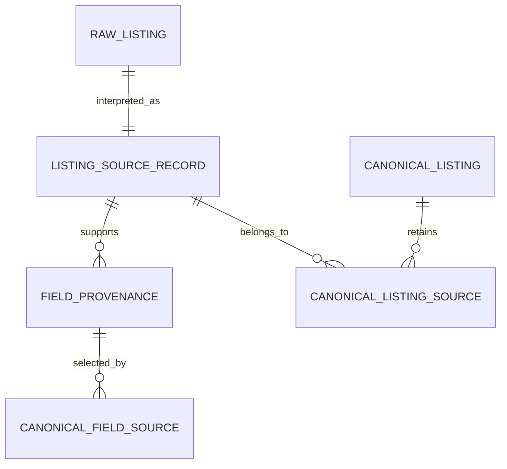

# Domain and Persistence Implementation Plan

> **For agentic workers:** REQUIRED SUB-SKILL: Use superpowers:subagent-driven-development (recommended) or superpowers:executing-plans to implement this plan task-by-task. Steps use checkbox (`- [ ]`) syntax for tracking.

**Goal:** Build Vera's strict domain model and transactional SQLite persistence layer, seed 12 immutable source records into 8 provenance-preserving canonical listings, and render them in the dashboard.

**Architecture:** `packages/domain` owns strict Zod contracts and pure lifecycle transitions. `packages/db` owns Drizzle schema, reviewed migrations, connection pragmas, deterministic hashing, repositories, and sanitized seed data; the Next.js application reaches it only through a read-only Node-runtime route. SQLite constraints and triggers backstop repository invariants.

**Tech Stack:** TypeScript 6.0.3, Zod 4.4.3, Drizzle ORM 0.45.2, Drizzle Kit 0.31.10, better-sqlite3 12.11.1, Vitest 4.1.10, Next.js 16.2.10, Playwright 1.61.1.

## Global Constraints

- Preserve all 12 RawListing and ListingSourceRecord fixtures; canonicalization produces exactly 8 CanonicalListing rows and never destroys a source record.
- Include exactly three duplicate clusters spanning Zillow, Facebook Marketplace, Craigslist, and Apartments.com labels.
- Every non-null normalized source field and every displayed canonical field has field-level provenance.
- RawListing and ActivityEvent are append-only in repository APIs and through SQLite triggers.
- Unknown values remain `null`; never infer or coerce missing facts.
- Every database connection enables foreign keys, WAL mode, and a 5,000 ms busy timeout.
- No AI, Gmail, Calendar, browser automation, live platform access, credential, or real personal data.
- Every source capability remains fail closed.
- The repository is not a Git repository; commit steps are review checkpoints and cannot be executed until Git is initialized by the user.

---

### Task 1: Domain primitives, schemas, and lifecycle

**Files:**
- Create: `packages/domain/src/primitives.ts`
- Create: `packages/domain/src/search-profile.ts`
- Create: `packages/domain/src/listing.ts`
- Create: `packages/domain/src/workflows.ts`
- Create: `packages/domain/src/activity.ts`
- Create: `packages/domain/src/source-policy.ts`
- Create: `packages/domain/src/api.ts`
- Create: `packages/domain/src/lifecycle.ts`
- Create: `packages/domain/src/schemas.unit.test.ts`
- Create: `packages/domain/src/lifecycle.unit.test.ts`
- Modify: `packages/domain/src/index.ts`

**Interfaces:**
- Produces strict schemas and inferred types for all 14 named concepts.
- Produces `transitionListingLifecycle(current, next): ListingLifecycleState`.
- Produces `InvalidListingTransitionError` with `current` and `requested` fields.
- Produces `CanonicalListingCollectionResponseSchema` and `ListingsUnavailableResponseSchema` for the web boundary.

- [ ] **Step 1: Write schema tests that parse one valid representative of each concept and reject extra keys, invalid confidence, negative money, malformed timestamps, and raw captures with no evidence.**

```ts
expect(() => RawListingSchema.parse({ ...validRawListing, unexpected: true })).toThrow();
expect(() => FieldProvenanceSchema.parse({ ...validProvenance, confidenceBasisPoints: 10_001 })).toThrow();
expect(() => CanonicalListingSchema.parse({ ...validCanonical, monthlyRentCents: -1 })).toThrow();
```

- [ ] **Step 2: Write lifecycle tests that exercise every allowed edge plus skipped, reversed, and terminal transitions.**

```ts
for (const [current, nextStates] of Object.entries(ALLOWED_LISTING_TRANSITIONS)) {
  for (const next of nextStates) {
    expect(transitionListingLifecycle(current, next)).toBe(next);
  }
}
expect(() => transitionListingLifecycle("new", "tour_scheduled")).toThrow(InvalidListingTransitionError);
expect(() => transitionListingLifecycle("dismissed", "shortlisted")).toThrow(InvalidListingTransitionError);
```

- [ ] **Step 3: Run the tests to prove the new contracts do not exist yet.**

Run: `pnpm test:unit`
Expected: FAIL because the new domain modules and exports are missing.

- [ ] **Step 4: Implement focused strict schemas with shared ID, timestamp, money, confidence, hash, JSON, source-label, and nullable-fact primitives.**

```ts
export const ConfidenceBasisPointsSchema = z.number().int().min(0).max(10_000);
export const Sha256Schema = z.string().regex(/^[a-f0-9]{64}$/u);
export const ListingLifecycleStateSchema = z.enum([
  "new", "shortlisted", "draft_ready", "draft_created", "draft_rejected", "replied",
  "follow_up_due", "tour_proposed", "tour_scheduled", "toured", "applying", "passed",
  "dismissed", "stale", "unavailable"
]);
```

- [ ] **Step 5: Implement the immutable transition map and typed error; export schemas and types through the package entrypoint.**

```ts
export function transitionListingLifecycle(
  current: ListingLifecycleState,
  requested: ListingLifecycleState
): ListingLifecycleState {
  if (!ALLOWED_LISTING_TRANSITIONS[current].includes(requested)) {
    throw new InvalidListingTransitionError(current, requested);
  }
  return requested;
}
```

- [ ] **Step 6: Run domain tests, typecheck, and lint.**

Run: `pnpm test:unit && pnpm --filter @vera/domain typecheck && pnpm lint`
Expected: all pass with no warnings.

- [ ] **Step 7: Review checkpoint.**

Commit when Git exists: `git commit -m "feat(domain): add Vera core schemas and listing lifecycle"`

---

### Task 2: Database dependencies, schema, migrations, and connection initialization

**Files:**
- Modify: `package.json`
- Modify: `pnpm-workspace.yaml`
- Modify: `packages/db/package.json`
- Create: `packages/db/drizzle.config.ts`
- Create: `packages/db/src/schema.ts`
- Create: `packages/db/src/paths.ts`
- Create: `packages/db/src/connection.ts`
- Create: `packages/db/src/migrations.ts`
- Create: `packages/db/src/migrate-cli.ts`
- Create: `packages/db/src/connection.integration.test.ts`
- Create: `packages/db/drizzle/0000_vera_core.sql`
- Create: `packages/db/drizzle/meta/_journal.json`

**Interfaces:**
- Consumes all domain schemas and inferred types.
- Produces `openDatabase(options)`, `openExistingDatabase(options)`, `getDatabasePath(options)`, `migrateDatabase(connection)`, and Drizzle table exports.
- Root scripts delegate `db:generate`, `db:migrate`, and `db:seed` to `@vera/db`.

- [ ] **Step 1: Add exact database dependencies and scripts, then install them.**

```json
{
  "dependencies": {
    "@vera/domain": "workspace:*",
    "better-sqlite3": "12.11.1",
    "drizzle-orm": "0.45.2"
  },
  "devDependencies": {
    "@types/better-sqlite3": "7.6.13",
    "drizzle-kit": "0.31.10"
  }
}
```

Run: `pnpm install`
Expected: lockfile updates and the native better-sqlite3 package builds successfully.

- [ ] **Step 2: Write integration tests for path selection, foreign keys, WAL, busy timeout, real migration application, and missing-file refusal.**

```ts
const connection = openDatabase({ filePath: join(tempDirectory, "vera.sqlite") });
expect(connection.sqlite.pragma("foreign_keys", { simple: true })).toBe(1);
expect(connection.sqlite.pragma("journal_mode", { simple: true })).toBe("wal");
expect(connection.sqlite.pragma("busy_timeout", { simple: true })).toBe(5000);
```

- [ ] **Step 3: Define Drizzle tables for every required concept plus canonical source and canonical field provenance memberships.**

Each table uses explicit text/integer columns, restrictive foreign keys, unique indexes, and check constraints. JSON columns use `$type<DomainType>()`; repository parsing remains mandatory.

- [ ] **Step 4: Generate the initial migration and append reviewed append-only triggers.**

```sql
CREATE TRIGGER raw_listings_no_update BEFORE UPDATE ON raw_listings
BEGIN SELECT RAISE(ABORT, 'raw_listings are append-only'); END;
CREATE TRIGGER raw_listings_no_delete BEFORE DELETE ON raw_listings
BEGIN SELECT RAISE(ABORT, 'raw_listings are append-only'); END;
CREATE TRIGGER activity_events_no_update BEFORE UPDATE ON activity_events
BEGIN SELECT RAISE(ABORT, 'activity_events are append-only'); END;
CREATE TRIGGER activity_events_no_delete BEFORE DELETE ON activity_events
BEGIN SELECT RAISE(ABORT, 'activity_events are append-only'); END;
```

- [ ] **Step 5: Implement explicit application-data path resolution and connection setup.**

```ts
sqlite.pragma("foreign_keys = ON");
const journalMode = sqlite.pragma("journal_mode = WAL", { simple: true });
sqlite.pragma("busy_timeout = 5000");
if (journalMode !== "wal") throw new DatabaseInitializationError("WAL mode could not be enabled.");
```

- [ ] **Step 6: Implement migration runner and CLI without auto-seeding or fallback paths.**

Run: `pnpm db:migrate`
Expected: creates `vera.sqlite` in the configured application-data directory and applies `0000_vera_core.sql`.

- [ ] **Step 7: Run database integration tests, typecheck, and lint.**

Run: `pnpm test:integration && pnpm --filter @vera/db typecheck && pnpm lint`
Expected: all pass.

- [ ] **Step 8: Review checkpoint.**

Commit when Git exists: `git commit -m "feat(db): add Drizzle schema and SQLite migrations"`

---

### Task 3: Deterministic hashing, repositories, and transactions

**Files:**
- Create: `packages/db/src/hashing.ts`
- Create: `packages/db/src/row-mappers.ts`
- Create: `packages/db/src/repositories.ts`
- Create: `packages/db/src/sqlite-repositories.ts`
- Create: `packages/db/src/repositories.integration.test.ts`
- Modify: `packages/db/src/index.ts`

**Interfaces:**
- Produces `canonicalJson(value)`, `computeRawContentHash(capture)`, and `computeRawImportIdempotencyKey(capture, contentHash)`.
- Produces repository interfaces and `createSqliteRepositories(connection): VeraRepositories`.
- `VeraRepositories.transaction(callback)` executes a synchronous callback atomically.

- [ ] **Step 1: Write deterministic hash tests for reordered object keys, preserved array order, changed evidence, and changed source identity.**

```ts
expect(canonicalJson({ b: 2, a: 1 })).toBe(canonicalJson({ a: 1, b: 2 }));
expect(computeRawContentHash(firstCapture)).toBe(computeRawContentHash(reorderedCapture));
expect(computeRawContentHash(firstCapture)).not.toBe(computeRawContentHash(changedCapture));
```

- [ ] **Step 2: Write repository integration tests for typed round trips, duplicate imports, append-only behavior, lifecycle enforcement, foreign keys, and rollback.**

```ts
const first = repositories.rawListings.import(capture);
const second = repositories.rawListings.import({ ...capture, id: "different-request-id" });
expect(second).toEqual({ record: first.record, inserted: false });

expect(() => repositories.transaction(() => {
  repositories.activityEvents.append(event);
  throw new Error("rollback probe");
})).toThrow("rollback probe");
expect(repositories.activityEvents.list()).toHaveLength(0);
```

- [ ] **Step 3: Run targeted tests to verify failure before implementation.**

Run: `pnpm test:unit && pnpm test:integration`
Expected: FAIL because hashing and repository modules are missing.

- [ ] **Step 4: Implement canonical JSON and SHA-256 helpers using `node:crypto`; reject non-JSON input.**

- [ ] **Step 5: Define narrow repositories for profiles, raw evidence, source records, provenance, clusters, canonical listings, scores, risks, workflows, approvals, viewings, manifests, and activity events.**

```ts
export interface RawListingRepository {
  import(capture: RawListingCapture): RawImportResult;
  getById(id: string): RawListing | null;
}
export interface ActivityEventRepository {
  append(event: ActivityEvent): ActivityEvent;
  getById(id: string): ActivityEvent | null;
  list(): readonly ActivityEvent[];
}
```

- [ ] **Step 6: Implement SQLite repositories with domain parsing on every input and output.**

The raw import uses `ON CONFLICT DO NOTHING` on `idempotency_key`, then returns the existing validated row. Activity and raw interfaces contain no update/delete method. Canonical lifecycle writes call `transitionListingLifecycle` inside a better-sqlite3 transaction.

- [ ] **Step 7: Prove triggers reject direct SQL update/delete attempts and transaction rollback leaves all involved tables unchanged.**

Run: `pnpm test:integration`
Expected: append-only, idempotency, transition, and rollback cases pass.

- [ ] **Step 8: Run typecheck and lint.**

Run: `pnpm typecheck && pnpm lint`
Expected: pass without `any` or ignored errors.

- [ ] **Step 9: Review checkpoint.**

Commit when Git exists: `git commit -m "feat(db): add transactional SQLite repositories"`

---

### Task 4: Sanitized idempotent seed and provenance coverage

**Files:**
- Create: `packages/db/src/fixtures.ts`
- Create: `packages/db/src/seed.ts`
- Create: `packages/db/src/seed-cli.ts`
- Create: `packages/db/src/seed.integration.test.ts`
- Modify: `packages/db/package.json`
- Modify: `package.json`

**Interfaces:**
- Produces `seedDatabase(repositories): SeedResult` with exact counts.
- Produces CLI `pnpm db:seed`.

- [ ] **Step 1: Write seed integration tests asserting exact cardinality, source-label coverage, duplicate membership, idempotency, incomplete fields, and provenance coverage.**

```ts
expect(first).toMatchObject({ rawListings: 12, sourceRecords: 12, canonicalListings: 8, duplicateClusters: 3 });
expect(second).toEqual(first);
expect(sourceLabels).toEqual(new Set(["zillow", "facebook_marketplace", "craigslist", "apartments_com"]));
expect(unprovenNormalizedFields).toEqual([]);
expect(unprovenCanonicalFields).toEqual([]);
```

- [ ] **Step 2: Define 12 synthetic fixture captures and normalized source records with stable IDs.**

Cluster topology:

```text
can-juniper-1a       zillow + craigslist + apartments_com
can-harbor-studio    facebook_marketplace + craigslist
can-maple-2b         zillow + apartments_com
five singleton canonical listings across the four labels
```

Fixture URLs use `example.invalid`; no contact field is populated.

- [ ] **Step 3: Implement programmatic provenance generation for every non-null normalized field and explicit canonical field selection mappings.**

```ts
for (const field of normalizedFieldEntries(sourceRecord)) {
  repositories.fieldProvenance.insert({
    id: `prov:${sourceRecord.id}:${field.path}`,
    listingSourceRecordId: sourceRecord.id,
    rawListingId: sourceRecord.rawListingId,
    fieldPath: field.path,
    extractionMethod: "fixture_structured",
    confidenceBasisPoints: sourceRecord.extractionConfidenceBasisPoints,
    observedAt: sourceRecord.observedAt,
    evidenceExcerpt: null
  });
}
```

- [ ] **Step 4: Implement one-transaction idempotent seeding with a stable completion ActivityEvent.**

Any failure rolls back all seed-created rows. A second seed checks stable identities and retains exact row and event counts.

- [ ] **Step 5: Run migration and seed twice against an isolated explicit data directory.**

Run: `VERA_DATA_DIR=/tmp/vera-m2-verification pnpm db:migrate`
Run: `VERA_DATA_DIR=/tmp/vera-m2-verification pnpm db:seed`
Run: `VERA_DATA_DIR=/tmp/vera-m2-verification pnpm db:seed`
Expected: both seed runs report 12 raw, 12 source, 8 canonical, and 3 duplicate clusters with no count growth.

- [ ] **Step 6: Run seed integration tests, typecheck, and lint.**

Run: `pnpm test:integration && pnpm typecheck && pnpm lint`
Expected: all pass.

- [ ] **Step 7: Review checkpoint.**

Commit when Git exists: `git commit -m "feat(db): add sanitized provenance-preserving seed"`

---

### Task 5: Read-only listings API and dashboard

**Files:**
- Modify: `apps/web/package.json`
- Modify: `apps/web/next.config.ts`
- Create: `apps/web/app/api/listings/route.ts`
- Create: `apps/web/app/api/listings/route.integration.test.ts`
- Create: `apps/web/app/listing-dashboard.tsx`
- Modify: `apps/web/app/page.tsx`
- Modify: `apps/web/app/globals.css`
- Modify: `playwright.config.ts`
- Modify: `tests/e2e/dashboard.spec.ts`

**Interfaces:**
- Consumes `@vera/db` only in a Node-runtime route.
- Produces typed `GET /api/listings` success and safe 503 responses.
- Dashboard displays exactly the canonical summaries returned by the API and exposes no mutation action.

- [ ] **Step 1: Write route integration tests using a migrated and seeded temporary database plus an uninitialized directory.**

```ts
expect(success.status).toBe(200);
expect(CanonicalListingCollectionResponseSchema.parse(await success.json()).listings).toHaveLength(8);
expect(unavailable.status).toBe(503);
expect(ListingsUnavailableResponseSchema.parse(await unavailable.json()).code).toBe("database_unavailable");
```

- [ ] **Step 2: Update the E2E test to require eight cards, three duplicate badges, all source labels, an Unknown field, and Online health.**

- [ ] **Step 3: Implement Node-only route handling with no-store caching, explicit database existence check, repository read, Zod response validation, and redacted failure output.**

- [ ] **Step 4: Implement the accessible listing dashboard client.**

Cards use semantic articles and headings. Currency formatting consumes integer cents. Missing rent, beds, baths, availability, pet policy, or lease information displays the word `Unknown`.

- [ ] **Step 5: Configure Next.js to transpile `@vera/db` and keep `better-sqlite3` server-external. Configure Playwright's web server to migrate and seed an isolated test-artifact database before startup.**

- [ ] **Step 6: Run route integration and Chromium E2E tests.**

Run: `pnpm test:integration`
Run: `pnpm test:e2e`
Expected: route success/unavailable cases and dashboard browser assertions pass.

- [ ] **Step 7: Run web typecheck, build, and lint.**

Run: `pnpm --filter @vera/web typecheck && pnpm --filter @vera/web build && pnpm lint`
Expected: pass; build does not create or access a database.

- [ ] **Step 8: Review checkpoint.**

Commit when Git exists: `git commit -m "feat(web): display seeded canonical listings"`

---

### Task 6: Data-model documentation and contributor commands

**Files:**
- Create: `docs/DATA_MODEL.md`
- Modify: `docs/ARCHITECTURE.md`
- Modify: `README.md`
- Modify: `.env.example`

**Interfaces:**
- Documents implemented database location, schema, commands, invariants, seed topology, and lifecycle.
- Mermaid diagram exactly matches migration foreign-key direction and repository behavior.

- [ ] **Step 1: Write `docs/DATA_MODEL.md` with every table, entity relationships, lifecycle graph, append-only triggers, provenance model, hashing rules, and seed topology.**



- [ ] **Step 2: Update architecture status and README clean-clone/local workflow.**

The documented local sequence is:

```bash
pnpm install --frozen-lockfile
pnpm db:migrate
pnpm db:seed
pnpm dev
```

- [ ] **Step 3: Clarify `VERA_DATA_DIR` behavior without adding a default path containing repository data.**

- [ ] **Step 4: Run formatting and documentation scans.**

Run: `pnpm format && pnpm format:check`
Run: `rg -n "T[B]D|T[O]DO|F[I]XME|real@|password|token=" docs README.md packages/db/src/fixtures.ts`
Expected: format passes and the safety scan finds no placeholder, credential, or personal-data assignment.

- [ ] **Step 5: Review checkpoint.**

Commit when Git exists: `git commit -m "docs: document Vera domain and SQLite model"`

---

### Task 7: Full acceptance and requirement audit

**Files:**
- Modify only files implicated by a failing check.

**Interfaces:**
- Proves every Prompt 2 requirement with current-state source or command evidence.

- [ ] **Step 1: Run focused checks.**

```bash
pnpm test:unit
pnpm test:integration
pnpm test:e2e
```

Expected: domain, persistence, route, worker, health, and Chromium suites all pass.

- [ ] **Step 2: Run the full gate.**

```bash
pnpm lint
pnpm typecheck
pnpm test
pnpm build
```

Expected: every command exits zero.

- [ ] **Step 3: Inspect the seeded database directly.**

Verify 12 raw listings, 12 source records, 8 canonical listings, 3 clusters, all 12 retained memberships, no normalized non-null field without provenance, no displayed canonical field without selected provenance, and four source labels.

- [ ] **Step 4: Inspect migration triggers and source scope.**

Confirm update/delete triggers exist for raw listings and activity events. Scan manifests, dependencies, and source for AI, Gmail, Calendar, browser automation, platform fetches, credentials, real contacts, explicit `any`, and arbitrary state mutation.

- [ ] **Step 5: Review final changes and report migration/seed commands, files, tests, risks, and recommended next task.**

Commit when Git exists: `git commit -m "feat: implement Vera domain and persistence milestone"`
