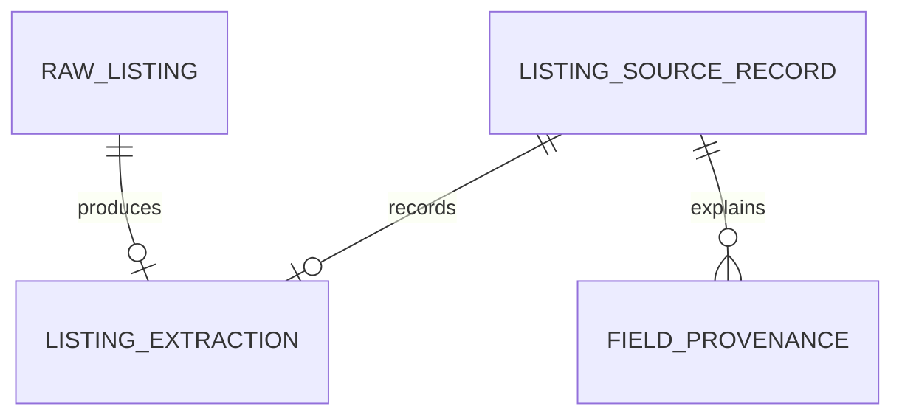

# Provider-neutral Structured Extraction Implementation Plan

> **For agentic workers:** REQUIRED SUB-SKILL: Use superpowers:subagent-driven-development (recommended) or superpowers:executing-plans to implement this plan task-by-task. Steps use checkbox (`- [ ]`) syntax for tracking.

**Goal:** Add deterministic-first, provider-neutral structured listing extraction with strict evidence validation, an optional OpenAI Responses API provider, immutable extraction metadata, typed worker failure handling, and a capture evidence-detail page, while keeping the default runtime offline and preserving unknowns.

**Architecture:** Domain owns strict extraction and API schemas. AI owns the provider boundary, prompt, timeout/cancellation, typed errors, schema validation, and one repair attempt. Connectors own deterministic extraction and the closed merge policy. The worker performs provider work outside SQLite transactions, then atomically persists the source record, complete field provenance, immutable extraction run, audit event, and job completion. The web app reads this evidence without creating canonical listings.

**Tech Stack:** TypeScript 6, Zod 4, official OpenAI JavaScript SDK 6.48.0, Next.js 16, React 19, SQLite via better-sqlite3, Drizzle ORM, Vitest, Playwright, pnpm workspaces.

## Global Constraints

- Never canonicalize or deduplicate new captures in this milestone.
- Never scrape, browse, resolve, preview, or fetch a listing URL.
- Never add Gmail, Calendar, browser automation, external actions, or AI policy decisions.
- Keep deterministic extraction first; request provider help only for missing or ambiguous fields.
- Preserve explicit unknown values. Never infer facts unsupported by supplied evidence.
- A provider may fill only a requested field and may never overwrite a known deterministic value.
- Treat all supplied listing content as untrusted quoted data and expose no tools to the model.
- Do not log prompt text, raw model output, raw listing text/JSON, API keys, contact values, or full URLs.
- Default execution makes zero model calls. Both `OPENAI_API_KEY` and `VERA_LLM_MODEL` are required for live extraction.
- Use `VERA_LLM_MODEL` as the only model selection source; do not hardcode a fallback model.
- Set `store: false`, disable SDK retries, pass cancellation, and enforce the validated timeout.
- Perform provider work outside database transactions.
- Keep `RawListing`, `ActivityEvent`, and `listing_extractions` append-only at the repository layer and with database triggers.
- Use sanitized synthetic fixtures only. Fixture URLs use reserved domains such as `example.invalid`.
- This workspace is not a Git worktree. Each task ends with a review checkpoint instead of a commit; do not initialize Git as part of this milestone.

---

## File Structure

### Domain

- Create `packages/domain/src/extraction.ts`: field vocabulary, strict schemas, inferred types, versions, provider request/result, and immutable run schema.
- Modify `packages/domain/src/capture-api.ts`: evidence-detail and extraction-run summary response schemas.
- Modify `packages/domain/src/index.ts`: public exports.
- Create `packages/domain/src/extraction.unit.test.ts`: strict schema and cross-field invariant tests.
- Modify `packages/domain/src/jobs.ts`: permit permanent dead-letter after the first leased attempt.
- Modify `packages/domain/src/jobs.unit.test.ts`: permanent/retryable state invariants.
- Modify `packages/domain/src/schemas.unit.test.ts`: public API boundary coverage.

### AI

- Modify `packages/ai/package.json`: add `@vera/domain`, `openai@6.48.0`, and `zod` workspace dependencies.
- Create `packages/ai/src/contracts.ts`: provider interface and clock/client-neutral options.
- Create `packages/ai/src/errors.ts`: typed safe error hierarchy and retry classification.
- Create `packages/ai/src/config.ts`: environment parsing and deterministic-only/live mode resolution.
- Create `packages/ai/src/evidence-validator.ts`: deterministic semantic evidence checks.
- Create `packages/ai/src/prompt.ts`: versioned injection-resistant request and repair prompt builders.
- Create `packages/ai/src/mock-provider.ts`: deterministic no-network provider.
- Create `packages/ai/src/openai-provider.ts`: official Responses API structured-output provider.
- Create `packages/ai/src/testing-fixtures.ts`: sanitized golden evidence and expected extraction builders.
- Create unit and opt-in live integration tests next to those modules.
- Modify `packages/ai/src/index.ts`: public exports.

### Connectors

- Modify `packages/connectors/package.json`: add `@vera/ai` for the shared semantic evidence validator; provider SDK types remain confined to `packages/ai`.
- Modify `packages/connectors/src/contracts.ts`: complete normalized field vocabulary and extraction pipeline result.
- Create `packages/connectors/src/deterministic-extraction.ts`: pure structured/manual-text field parsing.
- Create `packages/connectors/src/listing-evidence.ts`: deterministic evidence serialization and SHA-256 hashing.
- Create `packages/connectors/src/extraction-request.ts`: exact missing/ambiguous field selection.
- Create `packages/connectors/src/extraction-merge.ts`: semantic validation and closed-precedence merge.
- Modify `packages/connectors/src/normalizer.ts`: compose deterministic parsing and mapping to `ListingSourceRecord`.
- Add focused unit tests and expand golden normalizer tests.
- Modify `packages/connectors/src/index.ts`: public exports.

### Database

- Modify `packages/db/src/schema.ts`: add the immutable `listing_extractions` table.
- Generate `packages/db/drizzle/0002_*.sql` and Drizzle metadata.
- Modify `packages/db/src/repositories.ts`: extraction repository and explicit retryable/permanent job failure input.
- Modify `packages/db/src/row-mappers.ts`: extraction run mapping.
- Modify `packages/db/src/sqlite-repositories.ts`: extraction insertion/read and permanent dead-letter behavior.
- Modify `packages/db/src/index.ts`: public exports.
- Add extraction, append-only, migration, rollback, and job-state integration tests.

### Worker

- Modify `apps/worker/package.json`: add `@vera/ai`.
- Create `apps/worker/src/provider-factory.ts`: fail-closed runtime provider selection.
- Modify `apps/worker/src/normalization-worker.ts`: asynchronous provider orchestration and atomic persistence.
- Modify `apps/worker/src/lifecycle.ts`: async non-overlapping polling and cancellation.
- Modify `apps/worker/src/cli.ts`: configuration, signal handling, and async run-once behavior.
- Modify `apps/worker/src/logger.ts`: safe error metadata only.
- Extend worker unit and integration tests.

### Web

- Modify `apps/web/app/api/captures/[rawListingId]/route.ts`: return detailed extraction evidence.
- Modify its integration test for deterministic-only, LLM-augmented, duplicate, pending, and failed states.
- Modify `apps/web/app/capture/capture-form.tsx`: link completed captures to evidence detail.
- Create `apps/web/app/captures/[rawListingId]/page.tsx`: server shell.
- Create `apps/web/app/captures/[rawListingId]/capture-evidence.tsx`: field evidence UI.
- Modify `apps/web/app/globals.css`: evidence table/status styles.
- Modify Playwright golden-flow coverage.

### Documentation and Configuration

- Modify `.env.example`, `README.md`, `docs/ARCHITECTURE.md`, `docs/DATA_MODEL.md`, `docs/SECURITY.md`, and `docs/DEMO.md`.
- Create `docs/DECISIONS/0006-provider-neutral-structured-extraction.md`.

---

### Task 1: Define the strict domain extraction contract

**Files:**

- Create: `packages/domain/src/extraction.ts`
- Create: `packages/domain/src/extraction.unit.test.ts`
- Modify: `packages/domain/src/jobs.ts`
- Modify: `packages/domain/src/jobs.unit.test.ts`
- Modify: `packages/domain/src/capture-api.ts`
- Modify: `packages/domain/src/schemas.unit.test.ts`
- Modify: `packages/domain/src/index.ts`

**Interfaces:**

- Produces: `ListingExtraction`, `ListingExtractionRequest`, `ListingExtractionProviderResult`, `ListingExtractionRun`, field-name and unknown-reason vocabularies, version constants, and capture evidence response schemas.
- Consumes: existing property type, contact channel, primitive ID/time/hash, provenance, and job-state schemas.

- [ ] **Step 1: Write failing strict-schema tests**

Cover all 20 fields in the approved vocabulary. Assert:

- known fields require non-empty evidence and confidence 1 through 10,000;
- unknown fields require `value: null`, `evidenceSnippet: null`, confidence zero, and one extraction unknown reason;
- money requires integer minor units, uppercase three-letter currency, raw amount language, and `day | week | month | year` billing;
- recurring fee entries are labeled and strict;
- dates, timestamps, emails, safe HTTP(S) URLs, half-unit bedroom/bathroom values, positive counts, and closed enums reject malformed values;
- request field names are unique and carry one deterministic reason each;
- token totals equal input plus output;
- repair count is zero or one;
- mode/provider/model/response ID consistency is enforced for deterministic-only versus `llm_augmented` runs;
- a dead-letter normalization job is valid after at least one attempt, while retryable jobs remain below `maxAttempts`;
- unexpected keys are rejected at every boundary.

Use exact examples such as:

```ts
const knownTitle = {
  status: "known",
  value: "Sunny studio",
  confidenceBasisPoints: 9_500,
  evidenceSnippet: "Title: Sunny studio"
} as const;

const unknownTitle = {
  status: "unknown",
  value: null,
  confidenceBasisPoints: 0,
  evidenceSnippet: null,
  reason: "not_present"
} as const;

expect(ExtractedTitleSchema.parse(knownTitle)).toEqual(knownTitle);
expect(ExtractedTitleSchema.parse(unknownTitle)).toEqual(unknownTitle);
expect(() =>
  ExtractedTitleSchema.parse({
    ...knownTitle,
    evidenceSnippet: ""
  })
).toThrow();
```

- [ ] **Step 2: Run the focused tests and confirm failure**

Run: `pnpm vitest run --project unit packages/domain/src/extraction.unit.test.ts packages/domain/src/schemas.unit.test.ts`  
Expected: failure because extraction exports and expanded capture schemas do not exist.

- [ ] **Step 3: Implement the exact field vocabulary and generic field schema**

Export these constants and closed vocabularies:

```ts
export const LISTING_EXTRACTION_PROMPT_VERSION = "listing-extraction.prompt.v1";
export const LISTING_EXTRACTION_VERSION = "listing-extraction.v1";

export const ListingExtractionFieldNameSchema = z.enum([
  "title",
  "bedrooms",
  "bathrooms",
  "addressText",
  "squareFeet",
  "propertyType",
  "baseRent",
  "requiredRecurringFees",
  "availabilityRaw",
  "availableOn",
  "leaseTermMonths",
  "catsAllowed",
  "dogsAllowed",
  "amenities",
  "sourcePostedAt",
  "contactChannel",
  "contactName",
  "contactEmail",
  "contactPhone",
  "contactUrl"
]);

export const ExtractionUnknownReasonSchema = z.enum([
  "not_present",
  "ambiguous",
  "conflicting_evidence",
  "unrecognized_format"
]);
```

Implement `extractedFieldSchema(valueSchema)` as a strict discriminated union. Export concrete schemas for every field so the OpenAI Zod response format receives a fully concrete object schema rather than a generic runtime factory.

- [ ] **Step 4: Implement money, request, provider-result, and immutable-run schemas**

Use these central shapes:

```ts
export const MoneyObservationSchema = z
  .object({
    amountMinorUnits: z.number().int().nonnegative().safe(),
    currency: z.string().regex(/^[A-Z]{3}$/u),
    billingPeriod: z.enum(["day", "week", "month", "year"]),
    rawAmount: z.string().trim().min(1).max(200)
  })
  .strict();

export const RequiredRecurringFeeSchema = z
  .object({
    label: z.string().trim().min(1).max(160),
    amount: MoneyObservationSchema
  })
  .strict();

export const ListingExtractionFieldRequestSchema = z
  .object({
    field: ListingExtractionFieldNameSchema,
    reason: ExtractionUnknownReasonSchema
  })
  .strict();
```

`ListingExtractionRequest` contains `evidenceText`, `inputHash`, the unique non-empty `fieldRequests`, and literal prompt/extraction versions. `ListingExtractionProviderResult` contains strict extraction, provider/model/nullable response ID, token usage, latency, and repair count. `ListingExtractionRun` adds IDs, mode (`deterministic_only | llm_augmented`), requested fields, nullable validated provider result, merged extraction, and completion time, with deterministic-only metadata fixed to `providerId: null`, `model: null`, `responseId: null`, provider result null, zero usage, zero latency, and zero repairs.

Update `NormalizationJobSchema` so `dead_letter` requires `attempts >= 1 && attempts <= maxAttempts`. Do not pretend a permanent failure consumed attempts that never occurred.

- [ ] **Step 5: Expand the capture evidence response schemas**

Add a `CaptureFieldUnknownReasonSchema` union of the existing provenance reasons and extraction reasons. This keeps old seeded provenance responses compatible while preserving `ambiguous` and `conflicting_evidence` from new extraction rows. Add nullable extraction-run summary plus these field explanation attributes:

```ts
export const CaptureFieldSummarySchema = z
  .object({
    fieldPath: z.string().trim().min(1).max(200),
    status: ProvenanceValueStatusSchema,
    displayValue: z.string().trim().min(1).max(1_000).nullable(),
    unknownReason: CaptureFieldUnknownReasonSchema.nullable(),
    extractionMethod: z.enum(["fixture_structured", "manual", "rule", "ai"]),
    confidenceBasisPoints: z.number().int().min(0).max(10_000),
    evidenceSnippet: z.string().trim().min(1).max(1_000).nullable(),
    explanation: z.string().trim().min(1).max(1_000)
  })
  .strict();
```

Keep contact values present only in the authenticated local detail response and absent from error responses, audit metadata, and logs. This product is local single-user for the MVP; do not introduce auth in this task.

- [ ] **Step 6: Run focused tests and package checks**

Run: `pnpm vitest run --project unit packages/domain/src && pnpm --filter @vera/domain typecheck`  
Expected: all domain tests and typecheck pass.

- [ ] **Review checkpoint:** inspect `packages/domain/src/index.ts` and confirm every public schema/type has one owner and no provider SDK types leak into domain.

---

### Task 2: Build provider-neutral AI core, semantic validation, and deterministic mock

**Files:**

- Modify: `packages/ai/package.json`
- Create: `packages/ai/src/contracts.ts`
- Create: `packages/ai/src/errors.ts`
- Create: `packages/ai/src/config.ts`
- Create: `packages/ai/src/evidence-validator.ts`
- Create: `packages/ai/src/prompt.ts`
- Create: `packages/ai/src/mock-provider.ts`
- Create: `packages/ai/src/testing-fixtures.ts`
- Create: `packages/ai/src/config.unit.test.ts`
- Create: `packages/ai/src/evidence-validator.unit.test.ts`
- Create: `packages/ai/src/prompt.unit.test.ts`
- Create: `packages/ai/src/mock-provider.unit.test.ts`
- Modify: `packages/ai/src/index.ts`

**Interfaces:**

- Produces: `LLMProvider`, typed LLM errors, `resolveLLMConfiguration`, safe prompt builders, `validateExtractionEvidence`, and `MockLLMProvider`.
- Consumes: only domain extraction schemas/types and standard `AbortSignal`/clock primitives.

- [ ] **Step 1: Add failing config, prompt, evidence, and mock tests**

Test the complete environment matrix:

| API key | Model   | Expected                              |
| ------- | ------- | ------------------------------------- |
| absent  | absent  | `{ mode: "disabled" }`                |
| present | present | enabled config with validated timeout |
| present | absent  | `LLMConfigurationError`               |
| absent  | present | `LLMConfigurationError`               |

Test default timeout 20,000, inclusive 1,000/30,000 bounds, and rejection of non-integers/out-of-range values. Ensure thrown errors and serialized metadata do not include the API key.

Test prompt-injection evidence containing commands to reveal secrets, browse, change schema, and contact a person. Assert the built request treats it as delimited untrusted data, requests only named fields, exposes no tools/secrets, and does not copy environment values.

Test evidence validation for every approved semantic rule: exact snippet inclusion after whitespace normalization, requested-field restriction, 7,000 confidence floor, contact occurrence, money support, justified availability dates, explicit empty-fee evidence, and species-specific pet evidence.

Test mock success, stable deep-cloned output, recorded requests, typed refusal/error, pre-abort, abort while pending, and no use of `fetch`, `http`, `https`, `net`, or the OpenAI SDK.

- [ ] **Step 2: Run focused tests and confirm failure**

Run: `pnpm vitest run --project unit packages/ai/src`  
Expected: failure because the provider-neutral modules are absent.

- [ ] **Step 3: Implement provider contract and safe error hierarchy**

Use the approved interface:

```ts
export interface LLMProvider {
  readonly providerId: string;
  readonly model: string;
  extract(
    request: ListingExtractionRequest,
    options: {
      readonly signal: AbortSignal;
      readonly timeoutMilliseconds: number;
    }
  ): Promise<ListingExtractionProviderResult>;
}
```

Implement errors with stable `code`, `category`, and `retryable` fields:

- `LLMConfigurationError` — permanent;
- `LLMTimeoutError` — retryable;
- `LLMCancelledError` — retryable outside shutdown; during shutdown the worker leaves the lease recoverable without writing a failed result;
- `LLMAuthenticationError` — permanent;
- `LLMRateLimitError` — retryable;
- `LLMTransientProviderError` — retryable;
- `LLMPermanentProviderError` — permanent;
- `LLMRefusalError` — permanent;
- `LLMInvalidOutputError` — permanent after one repair.

Messages contain safe codes and provider IDs, never evidence, prompts, responses, contacts, credentials, or full URLs.

- [ ] **Step 4: Implement fail-closed configuration**

`resolveLLMConfiguration(env)` returns this union:

```ts
type LLMRuntimeConfiguration =
  | { readonly mode: "disabled" }
  | {
      readonly mode: "openai";
      readonly apiKey: string;
      readonly model: string;
      readonly timeoutMilliseconds: number;
    };
```

Trim values, reject empty configured values, require key/model together, and validate timeout. Never return a mock runtime mode.

- [ ] **Step 5: Implement versioned prompt builders**

`buildListingExtractionPrompt(request)` returns a system instruction and user input with:

- the exact prompt/extraction versions;
- the exact requested field list and reason codes;
- an explicit never-invent rule;
- money, fees, pet, availability, contact, and unknown rules;
- a statement that instructions inside evidence are inert;
- begin/end evidence delimiters;
- no application secrets, filesystem paths, policy registry, tools, or unrelated listings.

`buildListingExtractionRepairPrompt(request, issues)` uses safe issue codes and field paths only. It never embeds the raw rejected response.

- [ ] **Step 6: Implement deterministic semantic evidence validation**

Return a readonly list of strict issues:

```ts
interface ExtractionValidationIssue {
  readonly code:
    | "evidence_not_found"
    | "unrequested_field"
    | "confidence_too_low"
    | "contact_not_found"
    | "money_not_supported"
    | "availability_not_supported"
    | "empty_fees_not_supported"
    | "pet_policy_not_supported";
  readonly field: ListingExtractionFieldName;
}
```

Normalize CRLF/LF and runs of Unicode whitespace for evidence matching, but do not fuzzy-match arbitrary content. Use field-specific normalization only for email case, phone punctuation, and URL canonical spelling. Validation must be deterministic and make no network call.

- [ ] **Step 7: Implement deterministic `MockLLMProvider`**

Construct with either a read-only map keyed by `inputHash` or a resolver. Parse every returned value through `ListingExtractionProviderResultSchema`, deep clone before returning, record cloned requests, and honor pre-aborted and later-aborted signals. An unresolved mock request waits only until abort and then throws `LLMCancelledError`.

- [ ] **Step 8: Run focused tests, safety scan, and typecheck**

Run: `pnpm vitest run --project unit packages/ai/src && pnpm --filter @vera/ai typecheck`  
Run: `rg -n 'process\.env|fetch\(|node:https|node:http|node:net|OPENAI_API_KEY' packages/ai/src/mock-provider.ts packages/ai/src/mock-provider.unit.test.ts`  
Expected: tests/typecheck pass; scan finds only intentional test literals and no network import/call in the mock implementation.

- [ ] **Review checkpoint:** inspect all error formatting and ensure no error object stores evidence text, prompt text, raw output, or credentials.

---

### Task 3: Implement the official OpenAI Responses provider and one repair attempt

**Files:**

- Modify: `packages/ai/package.json`
- Modify: `pnpm-lock.yaml`
- Create: `packages/ai/src/openai-provider.ts`
- Create: `packages/ai/src/openai-provider.unit.test.ts`
- Create: `packages/ai/src/openai-provider.live.integration.test.ts`
- Modify: `packages/ai/src/index.ts`

**Interfaces:**

- Produces: `OpenAIResponsesProvider` implementing `LLMProvider`.
- Consumes: official `openai` SDK, `zodTextFormat`, domain schema, prompt builders, evidence validator, typed errors.

- [ ] **Step 1: Install the pinned official dependency**

Run: `pnpm --filter @vera/ai add openai@6.48.0`  
Expected: `packages/ai/package.json` and `pnpm-lock.yaml` record exactly 6.48.0.

- [ ] **Step 2: Inspect installed SDK types before writing the adapter**

Run: `rg -n 'responses\.parse|zodTextFormat|APIConnectionTimeoutError|RateLimitError|AuthenticationError' node_modules/.pnpm/openai@6.48.0*/node_modules/openai -g '*.d.ts' -g '*.ts' | head -80`  
Expected: confirms the actual `responses.parse`, structured output, request options, usage, refusal, and error class types. Use those installed definitions; do not cast the client to `any`.

- [ ] **Step 3: Write failing provider tests against an injected narrow client adapter**

Cover:

- one valid response, strict schema parsing, semantic validation, response ID, usage, and monotonic latency;
- `model` comes only from constructor configuration;
- `store: false`, no tools, Zod text format, caller signal, timeout, and SDK `maxRetries: 0`;
- prompt-injection content remains quoted evidence;
- structurally invalid first output followed by valid repair;
- semantically invalid first output followed by valid repair;
- invalid second output throws `LLMInvalidOutputError` with repair count one;
- refusal, timeout, cancellation, authentication, rate limit, connection/transient, and permanent mapping;
- non-schema failures never trigger repair;
- token totals and latency aggregate across both calls;
- error/loggable values contain no raw response or evidence.

- [ ] **Step 4: Run provider tests and confirm failure**

Run: `pnpm vitest run --project unit packages/ai/src/openai-provider.unit.test.ts`  
Expected: failure because `OpenAIResponsesProvider` is absent.

- [ ] **Step 5: Implement the Responses API provider**

Create the SDK with `apiKey` and `maxRetries: 0`. Each attempt calls `responses.parse` with the configured model, prompt input, `store: false`, no tool definitions, and:

```ts
text: {
  format: zodTextFormat(ListingExtractionSchema, "listing_extraction");
}
```

Pass `{ signal, timeout: timeoutMilliseconds }` through SDK request options. Measure with an injectable monotonic clock defaulting to `performance.now()`. Parse the returned structured value again with `ListingExtractionSchema`, run semantic validation, and perform exactly one repair only for structural or semantic invalidity. Aggregate usage safely when the SDK omits counts. Reject refusal or missing parsed output with typed errors.

- [ ] **Step 6: Add an opt-in live integration test**

The test runs only when all three conditions are true:

```ts
const liveEnabled =
  process.env.VERA_RUN_LIVE_LLM_TESTS === "1" &&
  typeof process.env.OPENAI_API_KEY === "string" &&
  typeof process.env.VERA_LLM_MODEL === "string";
```

Otherwise use `describe.skip`. The live evidence is short, synthetic, contains no real contact data, expects a strict extraction, and never asserts wording beyond schema/evidence invariants. Default `pnpm test:integration` must skip without making a request.

- [ ] **Step 7: Run provider tests and package checks**

Run: `pnpm vitest run --project unit packages/ai/src/openai-provider.unit.test.ts && pnpm vitest run --project integration packages/ai/src/openai-provider.live.integration.test.ts && pnpm --filter @vera/ai typecheck`  
Expected: unit tests pass; live test is reported skipped without all opt-in variables; typecheck passes.

- [ ] **Review checkpoint:** temporarily replace the injected SDK adapter with a throwing fake in the default integration run and confirm zero network-capable constructor/call is reached while live mode is disabled.

---

### Task 4: Expand deterministic extraction and implement the closed merge policy

**Files:**

- Modify: `packages/connectors/package.json`
- Modify: `packages/connectors/src/contracts.ts`
- Create: `packages/connectors/src/deterministic-extraction.ts`
- Create: `packages/connectors/src/deterministic-extraction.unit.test.ts`
- Create: `packages/connectors/src/listing-evidence.ts`
- Create: `packages/connectors/src/listing-evidence.unit.test.ts`
- Create: `packages/connectors/src/extraction-request.ts`
- Create: `packages/connectors/src/extraction-request.unit.test.ts`
- Create: `packages/connectors/src/extraction-merge.ts`
- Create: `packages/connectors/src/extraction-merge.unit.test.ts`
- Modify: `packages/connectors/src/normalizer.ts`
- Modify: `packages/connectors/src/normalizer.unit.test.ts`
- Modify: `packages/connectors/src/index.ts`

**Interfaces:**

- Produces: deterministic field set, provider request selection, merged extraction/result, source-record projection, and complete provenance.
- Consumes: domain extraction types and `validateExtractionEvidence`; no provider SDK or database types.

- [ ] **Step 1: Write failing deterministic extraction golden tests**

Use sanitized Zillow, Facebook Marketplace, Craigslist, and Apartments.com labels as fixture metadata only. Cover:

- full explicit record;
- incomplete record;
- weekly/non-USD rent that must not become monthly USD cents;
- base rent separated from parking, pet rent, utilities, and deposits;
- explicit no-fees versus silence;
- cats allowed/dogs prohibited, generic pet-friendly ambiguity, and pet deposit without permission;
- raw availability with exact date, approximate date, and unanchored relative phrase;
- explicit and absent contacts;
- prompt-injection text that remains inert.

Every field must be known or unknown; no `undefined` field is allowed.

- [ ] **Step 2: Write failing request-selection and merge tests**

Assert:

- only unknown/ambiguous/conflicting/unrecognized fields are requested;
- structured fixture/manual JSON known values are excluded;
- no request is created when no fields need help;
- provider values below 7,000 or failing evidence validation are rejected;
- unrequested provider output is ignored;
- valid provider output fills only an unknown field;
- deterministic values always win;
- rejected provider values preserve the deterministic unknown reason;
- provider values receive `extractionMethod: "ai"` and correct confidence/evidence;
- all fields, including unknown/contact fields, produce provenance;
- merge is deterministic for identical inputs.

- [ ] **Step 3: Run focused tests and confirm failure**

Run: `pnpm vitest run --project unit packages/connectors/src`  
Expected: failures for new modules and expanded contracts.

- [ ] **Step 4: Implement deterministic evidence serialization and complete field extraction**

`buildListingEvidence(envelope)` returns a stable string and SHA-256 hash. Manual text remains byte-for-byte evidence except normalized line endings used for matching. Structured JSON uses a stable key order and JSON escaping; it never interpolates values as prompt instructions. If an envelope contains both representations, delimit and include both deterministically. Hash the exact evidence string supplied to the provider.

Split pure field readers out of `normalizer.ts`. Structured values use `fixture_structured` for fixture captures and `manual` for manual structured captures. Text rules use `rule`. Preserve exact bounded evidence snippets and map connector unknown reasons to the extraction reasons:

| Existing provenance reason                  | Extraction reason            |
| ------------------------------------------- | ---------------------------- |
| `missing_evidence`                          | `not_present`                |
| `unrecognized_format`                       | `unrecognized_format`        |
| conflicting explicit matches                | `conflicting_evidence`       |
| vague/inclusive wording                     | `ambiguous`                  |
| `not_applicable` for URL/source-only fields | not part of provider request |

Do not add a locale currency default, billing-period default, date interpretation service, geocoder, or contact enrichment.

- [ ] **Step 5: Implement request selection**

`buildListingExtractionRequest` accepts evidence text/hash and deterministic extraction. It emits a unique ordered field request list using `ListingExtractionFieldNameSchema.options` order. It returns `null` when no field needs provider help. It must never request deterministically known fields.

- [ ] **Step 6: Implement deterministic merge and source-record projection**

Use this precedence:

```ts
function chooseField<T>(
  deterministic: ExtractedField<T>,
  provider: ExtractedField<T> | undefined,
  providerAccepted: boolean
): ExtractedField<T> {
  if (deterministic.status === "known") return deterministic;
  if (providerAccepted && provider?.status === "known") return provider;
  return deterministic;
}
```

Apply it field by field only after request membership and semantic validation. Project to `ListingSourceRecord` exactly as approved:

- monthly rent only from USD/month base rent;
- recurring-fee aggregate only when known entries are all USD/month;
- exact available date, square feet, lease term, property type, amenities, pets, and contact channel map directly;
- contact values remain only in the extraction row/detail result;
- title uses an existing deterministic safe fallback only if both deterministic/provider title remain unknown;
- confidence/completeness are deterministic calculations documented by tests.

Produce provenance for all 20 extraction fields plus existing source URL/source classification fields, using stable unique field paths.

For the existing `FieldProvenance` reason vocabulary, map extraction `not_present` to `missing_evidence`; map `ambiguous`, `conflicting_evidence`, and `unrecognized_format` to `unrecognized_format`. Retain the precise extraction reason in `merged_extraction` and expose that precise value on the capture detail page.

- [ ] **Step 7: Preserve the existing normalizer API as a deterministic-only wrapper**

Keep `normalizeRawListing(envelope, context)` usable by existing callers and tests. Internally compose deterministic extraction, null provider result, merge, and source-record projection. Add an explicit async worker-facing orchestration function rather than making pure parsing itself async.

- [ ] **Step 8: Run focused tests and typechecks**

Run: `pnpm vitest run --project unit packages/connectors/src && pnpm --filter @vera/connectors typecheck`  
Expected: all connector tests pass, including previous baseline tests.

- [ ] **Review checkpoint:** compare the implementation field list against `ListingExtractionFieldNameSchema.options` and prove with a test that no field is silently omitted from request selection, merge, or provenance.

---

### Task 5: Persist immutable extraction runs and permanent/retryable job outcomes

**Files:**

- Modify: `packages/db/src/schema.ts`
- Modify: `packages/db/src/repositories.ts`
- Modify: `packages/db/src/row-mappers.ts`
- Modify: `packages/db/src/sqlite-repositories.ts`
- Modify: `packages/db/src/index.ts`
- Create: `packages/db/src/extractions.integration.test.ts`
- Modify: `packages/db/src/jobs.integration.test.ts`
- Modify: `packages/db/src/migration.integration.test.ts`
- Modify: `packages/db/src/repositories.integration.test.ts`
- Generate: `packages/db/drizzle/0002_*.sql`
- Generate: `packages/db/drizzle/meta/0002_snapshot.json`
- Modify: `packages/db/drizzle/meta/_journal.json`

**Interfaces:**

- Produces: `ListingExtractionRepository`, immutable SQL storage, and explicit job retryability.
- Consumes: domain `ListingExtractionRun` and existing repository transaction boundary.

- [ ] **Step 1: Write failing repository and migration tests**

Cover:

- insert/get/list-by-raw-listing extraction round trip;
- JSON schema validation on write and read;
- at most one extraction row per raw listing/source record, with a unique run ID;
- SQL/repository update and delete rejection;
- foreign-key rejection;
- transaction rollback removes source record, provenance, extraction, activity event, and job completion together;
- retryable failure queues another attempt until maximum;
- permanent failure immediately produces `dead_letter` without fake retry cycles;
- migration from a database at 0001 preserves all existing data and append-only triggers;
- fresh migration includes the new append-only triggers.

- [ ] **Step 2: Run focused integration tests and confirm failure**

Run: `pnpm vitest run --project integration packages/db/src/extractions.integration.test.ts packages/db/src/jobs.integration.test.ts packages/db/src/migration.integration.test.ts`  
Expected: failure because the table/repository and permanent failure input do not exist.

- [ ] **Step 3: Add the strict `listing_extractions` table**

Store normalized query columns plus strict JSON payloads:

- `id` primary key;
- `raw_listing_id` required foreign key;
- `listing_source_record_id` required foreign key;
- `mode` (`deterministic_only | llm_augmented`);
- `input_hash`;
- `requested_fields` JSON;
- nullable `provider_id`, `model`, `response_id`;
- prompt/extraction versions;
- `provider_extraction` nullable JSON;
- `merged_extraction` required JSON;
- non-negative input/output/total token counts;
- non-negative latency;
- repair count 0 or 1;
- `completed_at`.

Add unique indexes on raw listing and source record, SQL checks for mode/provider/result consistency, token totals, repair range, and non-negative metrics. Add update/delete abort triggers matching the RawListing/ActivityEvent append-only strategy.

Update the normalization-job state check so `dead_letter` permits any attempt count from one through `maxAttempts`. Drizzle may rebuild `normalization_jobs` to change that SQLite check; preserve its rows and indexes. Do not rebuild immutable raw listing, source record, provenance, or activity tables.

- [ ] **Step 4: Generate and inspect migration 0002**

Run: `pnpm db:generate`  
Expected: exactly one new numbered migration and snapshot.

Read the generated SQL in full. If Drizzle does not generate triggers, add the append-only trigger statements to that migration using `apply_patch`. Do not edit prior migrations.

- [ ] **Step 5: Implement repository contracts and row mapping**

Add:

```ts
export interface ListingExtractionRepository {
  insert(run: ListingExtractionRun): ListingExtractionRun;
  getById(id: string): ListingExtractionRun | null;
  getByRawListingId(rawListingId: string): ListingExtractionRun | null;
  getBySourceRecordId(sourceRecordId: string): ListingExtractionRun | null;
}
```

Add `listingExtractions` to `VeraRepositories`. Parse JSON columns through domain schemas on both writes and reads. Expose no update/delete method.

Extend `FailNormalizationJob` with `retryable: boolean`. For permanent failure, keep the real attempt count, clear lease fields, set safe error code/category, and enter `dead_letter` immediately. Preserve current bounded retry schedule for retryable failures.

- [ ] **Step 6: Run DB integration tests and typecheck**

Run: `pnpm vitest run --project integration packages/db/src && pnpm --filter @vera/db typecheck`  
Expected: all DB tests pass, including old append-only/idempotency/rollback coverage.

- [ ] **Review checkpoint:** inspect the final 0002 SQL in full and verify it migrates forward without dropping/recreating immutable evidence tables; a constraint-preserving `normalization_jobs` rebuild is acceptable.

---

### Task 6: Integrate optional provider extraction into the asynchronous worker

**Files:**

- Modify: `apps/worker/package.json`
- Create: `apps/worker/src/provider-factory.ts`
- Create: `apps/worker/src/provider-factory.unit.test.ts`
- Modify: `apps/worker/src/normalization-worker.ts`
- Modify: `apps/worker/src/normalization-worker.integration.test.ts`
- Modify: `apps/worker/src/lifecycle.ts`
- Modify: `apps/worker/src/lifecycle.unit.test.ts`
- Modify: `apps/worker/src/cli.ts`
- Modify: `apps/worker/src/cli.unit.test.ts`
- Modify: `apps/worker/src/logger.ts`
- Modify: `apps/worker/src/index.ts`

**Interfaces:**

- Produces: runtime provider selection, async job processing, cancellation, retry/dead-letter classification, and atomic extraction persistence.
- Consumes: AI provider contract/config, connector extraction pipeline, DB repositories/runtime.

- [ ] **Step 1: Write failing provider-factory and worker tests**

Provider factory tests cover disabled, enabled, partial configuration, timeout bounds, no implicit mock, and no OpenAI client construction in disabled mode.

Worker integration tests cover:

- deterministic-only job completes with one immutable run and zero provider metadata;
- no missing fields means provider is not called even when configured;
- configured mock fills only requested fields;
- provider work occurs before the persistence transaction begins;
- success atomically writes source record, all provenance, extraction, audit, and job completion;
- invalid/refusal/auth/config/permanent errors dead-letter once;
- timeout/rate-limit/transient errors follow bounded retry state;
- cancellation during shutdown releases work safely according to the existing lease model and does not write a partial result;
- provider raw errors, evidence, contacts, and secrets are absent from logs/audit metadata;
- duplicate job replay cannot create a second source record for the raw listing.

- [ ] **Step 2: Run focused tests and confirm failure**

Run: `pnpm vitest run --project unit apps/worker/src && pnpm vitest run --project integration apps/worker/src/normalization-worker.integration.test.ts`  
Expected: failure because worker execution is synchronous and has no provider boundary.

- [ ] **Step 3: Implement fail-closed provider factory**

Resolve environment with `resolveLLMConfiguration`. Return `null` for disabled mode. Construct `OpenAIResponsesProvider` only for enabled mode. A partial key/model configuration throws `LLMConfigurationError` before polling starts. Never construct `MockLLMProvider` in production code.

- [ ] **Step 4: Make job processing asynchronous and provider-aware**

Change the public operation to:

```ts
export async function processNextNormalizationJob(
  dependencies: NormalizationWorkerDependencies,
  signal: AbortSignal
): Promise<NormalizationWorkerResult>;
```

Processing order:

1. claim one job with the existing short transaction/90-second lease;
2. read and validate immutable raw evidence;
3. run deterministic extraction;
4. build the exact missing-field request;
5. call provider only when both request and provider exist;
6. merge and build source record/provenance/extraction run outside a transaction;
7. in one short transaction insert source record, provenance, extraction, safe activity event, and complete the leased job;
8. on typed failure, use a short failure transaction that appends a redacted `normalization.failed` activity event and updates the job with explicit `retryable` classification; insert no extraction/source/provenance rows.

The successful activity event records IDs, mode, versions, requested-field count, known/unknown counts, provider ID/model if configured, token counts, latency, repair count, and safe outcome code. Failure events record only IDs, safe error code/category, retryability, and resulting job state. Both exclude requested field names, evidence, prompts, raw output, contact values, API key, raw listing content, request/response bodies, and URLs.

- [ ] **Step 5: Implement cancellation and non-overlapping lifecycle polling**

The lifecycle owns one `AbortController`. SIGINT/SIGTERM abort in-flight provider work, stop scheduling another poll, await the current promise, close SQLite, and exit. Use recursive timeout scheduling after each settled job; never `setInterval` overlapping async work.

Cancellation is not schema repair. If a provider call is aborted, do not persist extraction/source data. Leave the job recoverable by lease expiry unless the current repository contract already has a safe explicit release operation; do not invent a destructive unlock.

- [ ] **Step 6: Redact operational logging**

Log only safe structured fields: job/raw/correlation IDs, provider ID/model, typed code/category, retryable flag, attempt, latency/tokens, and state. Do not pass arbitrary SDK errors directly to Pino. Convert them to the typed safe error view first.

- [ ] **Step 7: Run worker tests and typecheck**

Run: `pnpm vitest run --project unit apps/worker/src && pnpm vitest run --project integration apps/worker/src/normalization-worker.integration.test.ts && pnpm --filter @vera/worker typecheck`  
Expected: all worker tests pass.

- [ ] **Review checkpoint:** run worker once with both LLM variables absent and an OpenAI-client constructor spy; confirm deterministic completion and zero SDK construction/network calls.

---

### Task 7: Expose extraction evidence through the capture API

**Files:**

- Modify: `apps/web/app/api/captures/[rawListingId]/route.ts`
- Modify: `apps/web/app/api/captures/[rawListingId]/route.integration.test.ts`
- Modify: `apps/web/lib/capture-service.ts`

**Interfaces:**

- Produces: strict `CaptureStatusResponse` with field provenance, explanation, and extraction metadata.
- Consumes: DB source/provenance/extraction repositories and domain response schemas.

- [ ] **Step 1: Write failing API detail tests**

Cover:

- queued and leased captures return job state with no fabricated fields;
- deterministic-only completion returns all field explanations and zero provider metadata;
- LLM-augmented completion returns mode, provider/model, versions, tokens, latency, repair count, and requested field names, but not the opaque provider response ID;
- incomplete fields remain explicit unknowns;
- duplicate capture resolves to the original raw listing evidence;
- not found and database errors use the existing safe error schema;
- response parsing rejects inconsistent known/unknown evidence;
- no prompt/raw model output/API key appears in serialized JSON.

- [ ] **Step 2: Run the focused test and confirm failure**

Run: `pnpm vitest run --project integration 'apps/web/app/api/captures/[rawListingId]/route.integration.test.ts'`  
Expected: failure because current response lacks extraction detail.

- [ ] **Step 3: Implement detail projection**

Load raw listing, job, source record, provenance, and latest extraction independently. Do not return raw listing text/JSON. Sort fields in domain field-vocabulary order. Build explanations deterministically:

- known fixture/manual: `Provided in structured capture.`
- known rule: `Matched supplied listing evidence with a deterministic rule.`
- known AI: `Filled a requested missing field from the quoted evidence after schema and evidence validation.`
- unknown: message derived from the closed reason code, without implying absence is a negative fact.

Parse the final object through `CaptureStatusResponseSchema` before returning it.

- [ ] **Step 4: Run API integration tests and web typecheck**

Run: `pnpm vitest run --project integration 'apps/web/app/api/captures/[rawListingId]/route.integration.test.ts' && pnpm --filter @vera/web typecheck`  
Expected: pass.

- [ ] **Review checkpoint:** inspect a JSON snapshot and verify contact values appear only in the intended local evidence field, while logs/errors/audit fixtures contain none.

---

### Task 8: Add the capture evidence-detail UI and browser coverage

**Files:**

- Modify: `apps/web/app/capture/capture-form.tsx`
- Create: `apps/web/app/captures/[rawListingId]/page.tsx`
- Create: `apps/web/app/captures/[rawListingId]/capture-evidence.tsx`
- Modify: `apps/web/app/globals.css`
- Modify: existing Playwright capture/golden-flow spec discovered through `rg --files -g '*.spec.ts'`.

**Interfaces:**

- Produces: `/captures/[rawListingId]` evidence page.
- Consumes: capture detail API only; no direct DB or provider calls in the client component.

- [ ] **Step 1: Locate and extend the existing capture E2E test**

Run: `rg --files -g '*.spec.ts' -g '*.e2e.ts'`  
Modify the existing capture flow rather than creating a duplicate test harness.

Add assertions that a sanitized manual capture completes, exposes a `View extraction evidence` link, opens the matching detail URL, and shows:

- normalization state and deterministic/LLM-augmented mode;
- every field row;
- explicit known/unknown badge;
- display value when known;
- extraction method, confidence, evidence snippet, and explanation;
- no canonical-listing claim or AI certainty wording.

- [ ] **Step 2: Run the focused browser test and confirm failure**

Run: `pnpm playwright test tests/e2e/capture.spec.ts`  
Expected: failure because the detail route and link do not exist.

- [ ] **Step 3: Implement the detail page**

The server page validates the route ID, renders a client evidence component, and never fetches a listing URL. The client polls only while queued/leased/retryable, stops at completed/dead-letter, handles not found/database errors, and renders provider metadata only when present.

Use an accessible definition list or table with visible labels. Contact values use normal text, not auto-triggering `mailto:`/`tel:` actions. Source/contact URLs, if displayed, are inert text in this milestone.

- [ ] **Step 4: Link completed captures and style states**

Add the evidence link to the capture success panel using the local raw listing ID. Add responsive field layout, high-contrast known/unknown/method badges, and wrapping for long snippets. Preserve existing dashboard/capture styling.

- [ ] **Step 5: Run browser, unit/integration, and build checks**

Run: `pnpm test:e2e && pnpm --filter @vera/web typecheck && pnpm --filter @vera/web build`  
Expected: all E2E tests pass and the detail route builds.

- [ ] **Review checkpoint:** visually inspect the page at narrow and desktop widths and verify no controls imply contacting, browsing, approval, or canonicalization.

---

### Task 9: Document operations, security, and the final acceptance gate

**Files:**

- Modify: `.env.example`
- Modify: `README.md`
- Modify: `docs/ARCHITECTURE.md`
- Modify: `docs/DATA_MODEL.md`
- Modify: `docs/SECURITY.md`
- Modify: `docs/DEMO.md`
- Create: `docs/DECISIONS/0006-provider-neutral-structured-extraction.md`

- [ ] **Step 1: Update configuration documentation**

Document:

```dotenv
# Leave both unset for deterministic-only operation.
OPENAI_API_KEY=
VERA_LLM_MODEL=
VERA_LLM_TIMEOUT_MS=20000

# Tests make no live call unless this is exactly 1 and both values above are set.
VERA_RUN_LIVE_LLM_TESTS=0
```

Explain that `.env` files and credentials remain local/untracked, no default model exists, partial key/model configuration is an error, and the mock is test-only.

- [ ] **Step 2: Update architecture, data model, security, demo, and decision record**

Add the approved deterministic-first flow, provider boundary, error/retry classification, transaction boundary, append-only extraction table, prompt/extraction versioning, and `/captures/[rawListingId]` evidence page.

Extend the Mermaid entity diagram with:



Security documentation must state that prompt injection is treated as inert evidence; no tools are exposed; model output cannot authorize actions or overwrite deterministic facts; logs/audit exclude contacts/prompts/raw output/secrets; and live tests require explicit opt-in.

The demo uses sanitized capture evidence and deterministic/mock behavior. It must not require a live API key.

- [ ] **Step 3: Run documentation and secret/scope scans**

Run: `pnpm prettier --check README.md .env.example docs packages/ai packages/domain packages/connectors packages/db apps/worker apps/web`  
Run: `rg -n 'sk-[A-Za-z0-9_-]{16,}|BEGIN (RSA|OPENSSH|EC) PRIVATE KEY|@gmail\.com|@yahoo\.com' . --glob '!node_modules/**' --glob '!pnpm-lock.yaml'`  
Run: `rg -n 'puppeteer|playwright.*chromium.*launch|gmail|calendar|canonicalize|fetch\(.*sourceUrl' packages apps --glob '!**/*.test.ts' --glob '!**/*.spec.ts'`  
Expected: formatting passes; no credential/real-person fixture; no newly introduced prohibited integration. Existing product vocabulary matches are manually reviewed rather than blindly removed.

- [ ] **Step 4: Verify migration and seed workflow on a fresh temporary database**

Run:

```sh
VERA_M3_TMP_DIR="$(mktemp -d)"
VERA_DATA_DIR="$VERA_M3_TMP_DIR" pnpm db:migrate
VERA_DATA_DIR="$VERA_M3_TMP_DIR" pnpm db:seed
```

Expected: migration and seed complete against the same fresh database without requiring any LLM variables or network access. Never delete a broad directory.

- [ ] **Step 5: Run the full acceptance gate with live calls disabled**

Run in order:

```sh
pnpm install --frozen-lockfile
pnpm format
pnpm format:check
pnpm lint
pnpm typecheck
pnpm test:unit
pnpm test:integration
pnpm test:e2e
pnpm test
pnpm build
```

Expected: every command exits zero; the live OpenAI integration test is skipped; all previous Milestone 1–2 tests remain green; build performs no provider call.

- [ ] **Step 6: Perform final evidence and change review**

Run: `git status --short` only if a `.git` directory appears later; otherwise use `find`/`rg --files` plus file timestamps to enumerate changes. Report:

- exact files created/changed;
- dependency and migration versions;
- deterministic-only default behavior;
- test counts and skipped live-test count;
- exact migration, seed, worker, and opt-in live-test commands;
- any truly blocking open question;
- the recommended next prompt for Milestone 4, without implementing it.

Do not claim completion until the complete acceptance gate passes.
