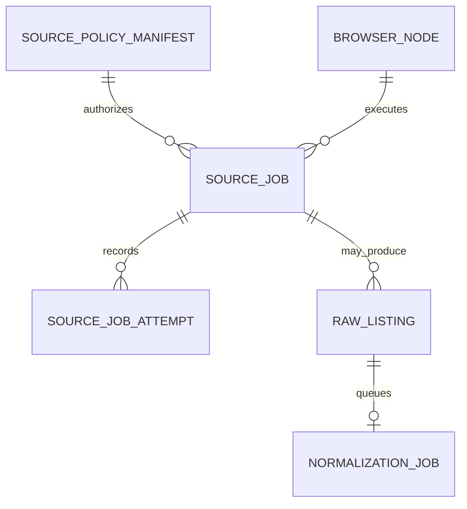

# Maritime and OpenClaw Contract Alignment Implementation Plan

> **For agentic workers:** REQUIRED SUB-SKILL: Use superpowers:subagent-driven-development (recommended) or superpowers:executing-plans to implement this plan task-by-task. Steps use checkbox (`- [ ]`) syntax for tracking.

**Goal:** Add strict, persisted source-orchestration, connector, Maritime, and browser-execution contracts while preserving Vera's deterministic fixture demo and existing normalization queue.

**Architecture:** Add a separate `SourceJob` control-plane model beside the existing `NormalizationJob` data-processing model. Keep live Maritime and OpenClaw code absent: `packages/connectors` owns provider-neutral interfaces and deterministic mocks, `packages/domain` owns strict schemas/transitions, `packages/policy` remains the sole fail-closed evaluator, and `packages/db` persists only source jobs, attempts, node health, and acquisition provenance.

**Tech Stack:** TypeScript 6 strict mode, Zod 4, SQLite, Drizzle ORM/Kit, Vitest, Playwright, pnpm workspaces.

## Global Constraints

- Production acquisition modes are exactly `official_api`, `email_alert`, `local_browser`, and `user_capture`; the code-level union additionally contains test-only `fixture`.
- Source policy states are exactly `approved`, `user_triggered_only`, `experimental_personal`, and `disabled`.
- `execution: manual | scheduled` remains separate from policy state.
- Maritime and OpenClaw implementations are out of scope; add interfaces and no-network mocks only.
- Existing demo fixtures remain sanitized and must use `acquisitionMode: "fixture"`, never `official_api`.
- Do not add source-specific browser automation, network fetching, credentials, cookies, browser profiles, OAuth, Gmail, Calendar, autonomous actions, or broad crawling.
- Every new boundary uses strict Zod validation and fails closed.
- Preserve raw evidence, canonical listings, fixture identities, current content hashes/idempotency keys, and the existing `normalization_jobs` lifecycle.
- Use migration `0003`; never reset or destructively recreate a user's database outside the migration transaction.
- Run narrow tests first, then format, lint, typecheck, unit, integration, E2E, and build.

---

### Task 1: Acquisition, policy-state, and source-job domain contracts

**Files:**
- Modify: `packages/domain/src/source-policy.ts`
- Modify: `packages/domain/src/listing.ts`
- Create: `packages/domain/src/source-orchestration.ts`
- Create: `packages/domain/src/source-orchestration.unit.test.ts`
- Modify: `packages/domain/src/schemas.unit.test.ts`
- Modify: `packages/domain/src/index.ts`

**Interfaces:**
- Produces: `AcquisitionModeSchema`, `ProductionAcquisitionModeSchema`, `SourcePolicyStateSchema`.
- Produces: `SourceJobSchema`, `SourceJobResultSchema`, `SourceJobStatusSchema`, `JobAttemptSchema`, `BrowserNodeStatusSchema`, `ManualActionRequiredSchema`, `DeferredJobReasonSchema`.
- Produces: `transitionSourceJobStatus(current, requested): SourceJobStatus` and `isBrowserNodeStale(node, now): boolean`.
- Changes: `RawListingCaptureSchema` and `RawListingSchema` require `acquisitionMode`.

- [ ] **Step 1: Write failing domain tests for exact vocabularies, strict payloads, state transitions, stale heartbeats, and credential-key rejection**

```ts
expect(AcquisitionModeSchema.options).toEqual([
  "official_api",
  "email_alert",
  "local_browser",
  "user_capture",
  "fixture"
]);
expect(SourcePolicyStateSchema.options).toEqual([
  "approved",
  "user_triggered_only",
  "experimental_personal",
  "disabled"
]);

expect(() =>
  SourceJobPayloadSchema.parse({
    acquisitionMode: "local_browser",
    nodeId: "node-local-1",
    savedSearchId: "saved-search-1",
    savedSearchUrl: "https://www.zillow.com/homes/for_rent/",
    committedCursor: null,
    limits: {
      maxPages: 2,
      maxRecords: 20,
      maxBytes: 1_000_000,
      maxDurationMilliseconds: 60_000,
      maxConcurrency: 1
    },
    password: "must-reject"
  })
).toThrow();

expect(transitionSourceJobStatus("dispatched", "deferred_node_offline")).toBe(
  "deferred_node_offline"
);
expect(() => transitionSourceJobStatus("completed", "queued")).toThrow(
  InvalidSourceJobTransitionError
);
expect(
  isBrowserNodeStale(
    browserNode({ heartbeatExpiresAt: "2026-07-18T12:00:00.000Z" }),
    new Date("2026-07-18T12:00:00.001Z")
  )
).toBe(true);
```

- [ ] **Step 2: Run the focused tests and verify they fail because the contracts do not exist**

Run: `pnpm exec vitest run packages/domain/src/source-orchestration.unit.test.ts packages/domain/src/schemas.unit.test.ts`  
Expected: FAIL with missing exports/types.

- [ ] **Step 3: Add acquisition and policy-state fields to the version-2 manifest schema**

```ts
export const ProductionAcquisitionModeSchema = z.enum([
  "official_api",
  "email_alert",
  "local_browser",
  "user_capture"
]);

export const AcquisitionModeSchema = z.enum([
  ...ProductionAcquisitionModeSchema.options,
  "fixture"
]);

export const SourcePolicyStateSchema = z.enum([
  "approved",
  "user_triggered_only",
  "experimental_personal",
  "disabled"
]);

export const SourcePolicyManifestSchema = z
  .object({
    schemaVersion: z.literal(2),
    connectorId: z.string().trim().min(1).max(120),
    displayName: z.string().trim().min(1).max(160),
    version: z.number().int().positive(),
    source: ListingSourceLabelSchema,
    acquisitionMode: AcquisitionModeSchema,
    policyState: SourcePolicyStateSchema,
    enabled: z.boolean(),
    execution: SourceExecutionSchema,
    capabilities: UniqueCapabilitiesSchema,
    allowedOperations: UniqueOperationsSchema,
    allowedDomains: z.array(SourceDomainSchema),
    allowedOrigins: z.array(SourceOriginSchema),
    allowedHttpMethods: z.array(SourceHttpMethodSchema),
    requiresUserSession: z.boolean(),
    requiresApproval: z.boolean(),
    minimumIntervalSeconds: z.number().int().positive().nullable(),
    maxConcurrency: z.number().int().positive().max(100),
    globalKillSwitchKey: z.string().trim().min(1).max(160),
    connectorKillSwitchKey: z.string().trim().min(1).max(160),
    dataClassification: SourceDataClassificationSchema,
    redactionRules: z.array(SourceRedactionRuleSchema).min(1),
    manualBlockerBehavior: ManualBlockerBehaviorSchema,
    owner: z.string().trim().min(1).max(160),
    reviewedAt: IsoDateSchema,
    decisionRecord: z.string().trim().min(1).max(500),
    notes: z.string().trim().min(1).max(2_000),
    createdAt: IsoDateTimeSchema,
    updatedAt: IsoDateTimeSchema
  })
  .strict();
```

Keep the current duplicate-array, timestamp-order, and scheduled-minimum-interval refinements verbatim.
Add four exact refinements: `fixture` requires `dataClassification: "synthetic"`; `disabled`
requires `enabled: false`; `user_triggered_only` requires `execution: "manual"`; and
`experimental_personal` requires `acquisitionMode: "local_browser"`.

- [ ] **Step 4: Require acquisition mode on raw listing captures without changing hash inputs**

```ts
export const RawListingCaptureSchema = z
  .object({
    id: EntityIdSchema,
    source: ListingSourceLabelSchema,
    acquisitionMode: AcquisitionModeSchema,
    sourceListingId: z.string().trim().min(1).max(200).nullable(),
    sourceUrl: z.string().url().max(2_048).nullable(),
    captureMethod: ListingCaptureMethodSchema,
    observedAt: IsoDateTimeSchema,
    sourcePostedAt: IsoDateTimeSchema.nullable(),
    rawText: z.string().min(1).max(250_000).nullable(),
    rawJson: JsonValueSchema.nullable(),
    captureMetadata: JsonObjectSchema
  })
  .strict()
  .superRefine((capture, context) => {
    if (capture.rawText === null && capture.rawJson === null) {
      context.addIssue({
        code: "custom",
        path: ["rawText"],
        message: "A raw listing requires raw text or raw JSON evidence."
      });
    }
  });
```

Do not add `acquisitionMode` to the object serialized by `computeRawContentHash`; existing immutable evidence hashes remain stable.

- [ ] **Step 5: Implement strict source-orchestration schemas and transitions**

```ts
export const SourceJobStatusSchema = z.enum([
  "queued",
  "dispatched",
  "running",
  "completed",
  "retryable_failed",
  "permanently_failed",
  "deferred_node_offline",
  "manual_action_required",
  "cancelled_by_policy"
]);

export const DeferredJobReasonSchema = z.enum([
  "node_unregistered",
  "node_offline",
  "stale_heartbeat",
  "node_revoked"
]);

export const ManualActionBlockerSchema = z.enum([
  "login",
  "reauthentication",
  "two_factor_authentication",
  "captcha",
  "consent",
  "camera_permission",
  "microphone_permission"
]);

export const BrowserCaptureLimitsSchema = z
  .object({
    maxPages: z.number().int().positive().max(20),
    maxRecords: z.number().int().positive().max(200),
    maxBytes: z.number().int().positive().max(25_000_000),
    maxDurationMilliseconds: z.number().int().positive().max(900_000),
    maxConcurrency: z.literal(1)
  })
  .strict();

export const SourceJobPayloadSchema = z.discriminatedUnion("acquisitionMode", [
  z.object({ acquisitionMode: z.literal("fixture"), fixtureSetId: EntityIdSchema }).strict(),
  z
    .object({ acquisitionMode: z.literal("user_capture"), captureReference: EntityIdSchema })
    .strict(),
  z
    .object({
      acquisitionMode: z.enum(["official_api", "email_alert"]),
      sourceConfigurationId: EntityIdSchema,
      committedCursor: ConnectorCursorSchema.nullable()
    })
    .strict(),
  z
    .object({
      acquisitionMode: z.literal("local_browser"),
      nodeId: EntityIdSchema,
      savedSearchId: EntityIdSchema,
      savedSearchUrl: SafeBrowserUrlSchema,
      committedCursor: ConnectorCursorSchema.nullable(),
      limits: BrowserCaptureLimitsSchema
    })
    .strict()
]);
```

Define `SourceJobSchema` with opaque identifiers, manifest version, trigger, operation, payload,
payload hash, idempotency key, attempt counts, status, timestamps, nullable manual/deferred/result
fields, and cross-field refinements. Define `JobAttemptSchema`, `BrowserNodeStatusSchema`,
`ManualActionRequiredSchema`, and `SourceJobResultSchema` with no arbitrary metadata objects.

```ts
const transitions: Readonly<Record<SourceJobStatus, readonly SourceJobStatus[]>> = {
  queued: ["dispatched", "cancelled_by_policy"],
  dispatched: [
    "running",
    "deferred_node_offline",
    "manual_action_required",
    "retryable_failed",
    "permanently_failed",
    "cancelled_by_policy"
  ],
  running: [
    "completed",
    "retryable_failed",
    "permanently_failed",
    "manual_action_required",
    "cancelled_by_policy"
  ],
  retryable_failed: ["queued", "permanently_failed", "cancelled_by_policy"],
  deferred_node_offline: ["queued", "cancelled_by_policy"],
  manual_action_required: ["queued", "cancelled_by_policy"],
  completed: [],
  permanently_failed: [],
  cancelled_by_policy: []
};
```

- [ ] **Step 6: Export the contracts and rerun domain tests**

Run: `pnpm exec vitest run packages/domain/src/source-orchestration.unit.test.ts packages/domain/src/schemas.unit.test.ts packages/domain/src/jobs.unit.test.ts`  
Expected: PASS.

- [ ] **Step 7: Commit the domain slice**

```bash
git add packages/domain/src
git commit -m "feat: define source orchestration domain contracts"
```

---

### Task 2: Fail-closed policy-state evaluation and manifest compatibility

**Files:**
- Modify: `packages/policy/src/manifests.ts`
- Modify: `packages/policy/src/registry.ts`
- Modify: `packages/policy/src/registry.unit.test.ts`
- Modify: `packages/db/src/fixtures.ts`
- Modify: `apps/web/lib/capture-service.ts`
- Modify: `apps/web/lib/capture-service.integration.test.ts`

**Interfaces:**
- Changes: `SourcePolicyRequestSchema` requires `acquisitionMode`.
- Adds denial reasons: `acquisition_mode_mismatch`, `policy_state_disabled`, and `policy_state_disallows_execution`.
- Existing fixture policy becomes `fixture` / `approved`.
- Existing manual policy becomes `user_capture` / `user_triggered_only`.

- [ ] **Step 1: Add failing policy tests**

```ts
expect(
  new SourcePolicyRegistry(withManualManifest({ policyState: "disabled", enabled: false })).evaluate(
    manualRequest
  )
).toMatchObject({ allowed: false, reason: "policy_state_disabled" });

expect(
  registry.evaluate({ ...manualRequest, acquisitionMode: "official_api" })
).toMatchObject({ allowed: false, reason: "acquisition_mode_mismatch" });

expect(
  registry.evaluate({ ...manualRequest, execution: "scheduled" })
).toMatchObject({ allowed: false, reason: "policy_state_disallows_execution" });
```

- [ ] **Step 2: Run the focused policy tests and verify failure**

Run: `pnpm exec vitest run packages/policy/src/registry.unit.test.ts`  
Expected: FAIL because requests and manifests lack mode/state semantics.

- [ ] **Step 3: Upgrade initial manifests and fixture manifests to schema version 2**

```ts
const fixtureManifest = SourcePolicyManifestSchema.parse({
  schemaVersion: 2,
  connectorId: "fixture.feed.v1",
  displayName: "Sanitized fixture feed",
  version: 1,
  source: "other",
  acquisitionMode: "fixture",
  policyState: "approved",
  enabled: true,
  execution: "manual",
  capabilities: ["fixture.read"],
  allowedOperations: ["fixture.read_sanitized"],
  allowedDomains: [],
  allowedOrigins: [],
  allowedHttpMethods: [],
  requiresUserSession: false,
  requiresApproval: false,
  minimumIntervalSeconds: null,
  maxConcurrency: 1,
  globalKillSwitchKey: "integrations.disabled",
  connectorKillSwitchKey: "connectors.fixture.feed.v1.disabled",
  dataClassification: "synthetic",
  redactionRules,
  manualBlockerBehavior: "stop_and_request_user_action",
  owner: "Vera maintainers",
  reviewedAt: "2026-07-17",
  decisionRecord: "docs/DECISIONS/0004-fail-closed-connectors.md",
  notes: "Reads only sanitized local fixture data and performs no network access.",
  ...timestamps
});

const manualCaptureManifest = SourcePolicyManifestSchema.parse({
  schemaVersion: 2,
  connectorId: "manual.capture.v1",
  displayName: "Manual listing capture",
  version: 1,
  source: "other",
  acquisitionMode: "user_capture",
  policyState: "user_triggered_only",
  enabled: true,
  execution: "manual",
  capabilities: ["manual.capture"],
  allowedOperations: ["capture.user_supplied"],
  allowedDomains: [],
  allowedOrigins: [],
  allowedHttpMethods: [],
  requiresUserSession: false,
  requiresApproval: false,
  minimumIntervalSeconds: null,
  maxConcurrency: 1,
  globalKillSwitchKey: "integrations.disabled",
  connectorKillSwitchKey: "connectors.manual.capture.v1.disabled",
  dataClassification: "user_supplied",
  redactionRules,
  manualBlockerBehavior: "stop_and_request_user_action",
  owner: "Vera maintainers",
  reviewedAt: "2026-07-17",
  decisionRecord: "docs/DECISIONS/0004-fail-closed-connectors.md",
  notes: "Stores user-supplied text or structured data; provenance URLs are never fetched.",
  ...timestamps
});
```

Every `fixture-label-*` entry remains disabled and adds `acquisitionMode: "fixture"` and
`policyState: "disabled"` while preserving its current capability-free policy fields.

- [ ] **Step 4: Evaluate mode and policy state before capabilities**

```ts
if (manifest.acquisitionMode !== request.acquisitionMode) {
  return this.#deny("acquisition_mode_mismatch", request, manifest);
}
if (manifest.policyState === "disabled") {
  return this.#deny("policy_state_disabled", request, manifest);
}
if (manifest.policyState === "user_triggered_only" && request.execution !== "manual") {
  return this.#deny("policy_state_disallows_execution", request, manifest);
}
if (manifest.policyState === "experimental_personal" && !manifest.enabled) {
  return this.#deny("connector_disabled", request, manifest);
}
```

Do not reorder or alter the existing kill-switch, enabled-state, capability, operation, network,
session, or approval checks after inserting the new mode/state checks.

- [ ] **Step 5: Pass connector acquisition mode from the capture service**

```ts
const policy = dependencies.policyRegistry.evaluate({
  connectorId: connector.connectorId,
  acquisitionMode: connector.acquisitionMode,
  capability: connector.capability,
  execution: "manual",
  operation: operationFor(request),
  hasUserSession: false,
  hasApproval: false,
  network: null
});
```

- [ ] **Step 6: Run policy and capture-service tests**

Run: `pnpm exec vitest run packages/policy/src/registry.unit.test.ts apps/web/lib/capture-service.integration.test.ts`  
Expected: PASS.

- [ ] **Step 7: Commit the policy slice**

```bash
git add packages/policy packages/db/src/fixtures.ts apps/web/lib/capture-service.ts apps/web/lib/capture-service.integration.test.ts
git commit -m "feat: enforce acquisition policy states"
```

---

### Task 3: Optional connector operations and idempotent result envelopes

**Files:**
- Modify: `packages/connectors/src/contracts.ts`
- Modify: `packages/connectors/src/errors.ts`
- Modify: `packages/connectors/src/fixture-connector.ts`
- Modify: `packages/connectors/src/manual-connector.ts`
- Modify: `packages/connectors/src/connectors.unit.test.ts`
- Modify: `apps/web/lib/connector-registry.ts`

**Interfaces:**
- Produces: `SourceConnector`, `CaptureSourceConnector`, `ConnectorOperationResultSchema`.
- Produces: `executeConnectorOperation(connector, request, context)`.
- Fixture/manual retain direct synchronous capture compatibility and expose no discover/fetch-detail implementation.

- [ ] **Step 1: Write failing connector contract tests**

```ts
expect(connector.acquisitionMode).toBe("fixture");
expect(connector.source).toBe("other");
expect(connector.operations).toEqual(["capture"]);

await expect(
  executeConnectorOperation(connector, {
    operation: "discover",
    correlationId: "correlation-1",
    payloadHash: SHA256_A,
    idempotencyKey: SHA256_B,
    completedAt: NOW.toISOString()
  })
).resolves.toMatchObject({
  status: "unsupported_operation",
  operation: "discover",
  records: []
});
```

- [ ] **Step 2: Run connector tests and verify failure**

Run: `pnpm exec vitest run packages/connectors/src/connectors.unit.test.ts`  
Expected: FAIL because metadata, optional operations, and result envelopes do not exist.

- [ ] **Step 3: Define the connector surface and strict result envelope**

```ts
export const ConnectorOperationSchema = z.enum(["discover", "capture", "fetch_detail"]);

export const ConnectorOperationResultSchema = z
  .object({
    connectorId: EntityIdSchema,
    source: ListingSourceLabelSchema,
    acquisitionMode: AcquisitionModeSchema,
    operation: ConnectorOperationSchema,
    status: z.enum(["completed", "unsupported_operation", "failed"]),
    correlationId: EntityIdSchema,
    payloadHash: Sha256Schema,
    idempotencyKey: Sha256Schema,
    resultHash: Sha256Schema,
    records: z.array(RawListingEnvelopeSchema),
    previousCursor: ConnectorCursorSchema.nullable(),
    cursorCandidate: ConnectorCursorSchema.nullable(),
    completedAt: IsoDateTimeSchema,
    untrustedInput: z.literal(true)
  })
  .strict();

export interface SourceConnector {
  readonly connectorId: string;
  readonly displayName: string;
  readonly source: ListingSourceLabel;
  readonly acquisitionMode: AcquisitionMode;
  readonly capability: SourceCapability;
  readonly policyRequirement: SourcePolicyRequirement;
  readonly operations: readonly ConnectorOperation[];
  readonly cursorState: ConnectorCursor | null;
  discover?(request: ConnectorDiscoveryRequest, context: ConnectorContext): Promise<readonly RawListingEnvelope[]>;
  capture?(request: CaptureRequest, context: ConnectorContext): RawListingEnvelope | Promise<RawListingEnvelope>;
  fetchDetail?(request: ConnectorFetchDetailRequest, context: ConnectorContext): Promise<RawListingEnvelope>;
  health(registry: SourcePolicyRegistry): ConnectorHealth;
}

export interface CaptureSourceConnector<Request extends CaptureRequest = CaptureRequest>
  extends SourceConnector {
  supports(request: CaptureRequest): request is Request;
  capture(request: Request, context: ConnectorContext): RawListingEnvelope;
}
```

Compute `resultHash` from the strict result body and stable domain prefix. Unsupported operations
return no records or cursor candidate and never call another operation.

- [ ] **Step 4: Add metadata to fixture and manual connectors**

```ts
readonly source = "other" as const;
readonly acquisitionMode = "fixture" as const; // manual uses "user_capture"
readonly operations = ["capture"] as const;
readonly cursorState = null;
readonly policyRequirement = {
  connectorId: this.connectorId,
  acquisitionMode: this.acquisitionMode,
  capability: this.capability,
  operation: "fixture.read_sanitized" // manual uses capture.user_supplied
} as const;
```

Add `acquisitionMode` to `RawListingEnvelope` and every parsed envelope.

- [ ] **Step 5: Preserve capture registry typing**

```ts
const connectors = Object.freeze([
  new FixtureConnector(),
  new ManualCaptureConnector()
]) satisfies readonly CaptureSourceConnector[];
```

- [ ] **Step 6: Run connector and capture tests**

Run: `pnpm exec vitest run packages/connectors/src/connectors.unit.test.ts apps/web/lib/capture-service.integration.test.ts`  
Expected: PASS with no network calls.

- [ ] **Step 7: Commit the connector slice**

```bash
git add packages/connectors apps/web/lib/connector-registry.ts
git commit -m "feat: align source connector contracts"
```

---

### Task 4: Browser execution provider and deterministic mock

**Files:**
- Create: `packages/connectors/src/browser-execution.ts`
- Create: `packages/connectors/src/browser-execution.unit.test.ts`
- Modify: `packages/connectors/src/index.ts`

**Interfaces:**
- Produces: `BrowserExecutionProvider`.
- Produces: `MockBrowserExecutionProvider` with injected scripted outcomes.
- Produces strict heartbeat, navigation, capture, cancellation, result, and manual-action schemas.

- [ ] **Step 1: Write failing browser-provider tests**

```ts
await expect(provider.navigate(validNavigation)).resolves.toMatchObject({
  status: "completed",
  correlationId: validNavigation.correlationId,
  untrustedInput: true
});

await expect(
  provider.navigate({ ...validNavigation, targetUrl: "https://outside.example/listing" })
).rejects.toThrow("allowlist");

await expect(provider.capture(validCapture)).resolves.toMatchObject({
  status: "manual_action_required",
  manualAction: { blocker: "captcha" }
});
```

- [ ] **Step 2: Run the focused test and verify failure**

Run: `pnpm exec vitest run packages/connectors/src/browser-execution.unit.test.ts`  
Expected: FAIL with missing module/exports.

- [ ] **Step 3: Implement strict request/result schemas and the interface**

```ts
export interface BrowserExecutionProvider {
  readonly providerId: string;
  heartbeat(request: BrowserHeartbeatRequest): Promise<BrowserNodeStatus>;
  navigate(request: BrowserNavigationRequest): Promise<BrowserExecutionResult>;
  capture(request: BrowserCaptureRequest): Promise<BrowserExecutionResult>;
  cancel(request: BrowserCancellationRequest): Promise<BrowserCancellationResult>;
}

export const BrowserNavigationRequestSchema = z
  .object({
    nodeId: EntityIdSchema,
    executionId: EntityIdSchema,
    correlationId: EntityIdSchema,
    targetUrl: SafeBrowserUrlSchema,
    allowedUrls: z.array(SafeBrowserUrlSchema).min(1).max(201),
    limits: BrowserCaptureLimitsSchema
  })
  .strict()
  .superRefine((request, context) => {
    if (!request.allowedUrls.includes(request.targetUrl)) {
      context.addIssue({ code: "custom", path: ["targetUrl"], message: "Target is outside the exact allowlist." });
    }
  });
```

Every request/result includes a correlation ID. Results contain only bounded structured evidence,
safe counts, a cursor candidate, a typed blocker/failure, and `untrustedInput: true`.

- [ ] **Step 4: Implement the no-network scripted mock**

```ts
export class MockBrowserExecutionProvider implements BrowserExecutionProvider {
  readonly providerId = "mock-openclaw";

  constructor(private readonly script: readonly MockBrowserOutcome[]) {}

  async navigate(input: BrowserNavigationRequest): Promise<BrowserExecutionResult> {
    const request = BrowserNavigationRequestSchema.parse(input);
    return this.nextResult("navigate", request.correlationId, request.nodeId);
  }

  async capture(input: BrowserCaptureRequest): Promise<BrowserExecutionResult> {
    const request = BrowserCaptureRequestSchema.parse(input);
    return this.nextResult("capture", request.correlationId, request.nodeId);
  }

  // heartbeat and cancel parse strict input and return deterministic safe results.
}
```

- [ ] **Step 5: Run browser-provider tests**

Run: `pnpm exec vitest run packages/connectors/src/browser-execution.unit.test.ts`  
Expected: PASS for success, allowlist denial, cancellation, all manual blockers, and strict payload rejection.

- [ ] **Step 6: Commit the browser boundary**

```bash
git add packages/connectors/src/browser-execution.ts packages/connectors/src/browser-execution.unit.test.ts packages/connectors/src/index.ts
git commit -m "feat: define browser execution provider boundary"
```

---

### Task 5: Maritime orchestrator interface and local mock

**Files:**
- Create: `packages/connectors/src/maritime-orchestrator.ts`
- Create: `packages/connectors/src/maritime-orchestrator.unit.test.ts`
- Modify: `packages/connectors/src/index.ts`

**Interfaces:**
- Produces: `MaritimeOrchestrator`.
- Produces: `LocalMockMaritimeOrchestrator`.
- Consumes: `SourcePolicyRegistry`, `BrowserExecutionProvider`, and Task 1 source-job transitions.

- [ ] **Step 1: Write failing orchestration contract tests**

```ts
const job = await orchestrator.scheduleConnectorJob(validBrowserJobInput);
expect(job.status).toBe("queued");

const offline = await orchestrator.dispatchJob(job.id);
expect(offline).toMatchObject({
  status: "deferred_node_offline",
  deferredReason: "node_offline",
  result: null
});
expect(offline.payload.committedCursor).toBe(job.payload.committedCursor);

const denied = await disabledOrchestrator.dispatchJob(disabledJob.id);
expect(denied.status).toBe("cancelled_by_policy");

const replay = await orchestrator.dispatchJob(completedJob.id);
expect(replay.result?.idempotentReplay).toBe(true);
```

- [ ] **Step 2: Run the focused test and verify failure**

Run: `pnpm exec vitest run packages/connectors/src/maritime-orchestrator.unit.test.ts`  
Expected: FAIL with missing interface/mock.

- [ ] **Step 3: Define the orchestration interface**

```ts
export interface MaritimeOrchestrator {
  scheduleConnectorJob(input: ScheduleSourceJobInput): Promise<SourceJob>;
  dispatchJob(jobId: string): Promise<SourceJob>;
  getJobStatus(jobId: string): Promise<SourceJob | null>;
  retryJob(jobId: string): Promise<SourceJob>;
  cancelByPolicy(jobId: string, reason: string): Promise<SourceJob>;
  receiveBrowserNodeHeartbeat(status: BrowserNodeStatus): Promise<BrowserNodeStatus>;
}
```

- [ ] **Step 4: Implement the deterministic in-memory mock**

```ts
export class LocalMockMaritimeOrchestrator implements MaritimeOrchestrator {
  readonly #jobs = new Map<string, SourceJob>();
  readonly #nodes = new Map<string, BrowserNodeStatus>();
  readonly #resultsByIdempotencyKey = new Map<string, SourceJobResult>();

  constructor(
    private readonly policy: SourcePolicyRegistry,
    private readonly browser: BrowserExecutionProvider,
    private readonly now: () => Date
  ) {}

  async dispatchJob(jobId: string): Promise<SourceJob> {
    const job = this.requireJob(jobId);
    if (job.status === "completed") return this.asReplay(job);

    const decision = this.policy.evaluate(policyRequestFor(job));
    if (!decision.allowed) return this.transition(job, "cancelled_by_policy", { policyReason: decision.reason });

    const dispatched = this.transition(job, "dispatched");
    if (dispatched.acquisitionMode === "local_browser") {
      const node = this.#nodes.get(dispatched.payload.nodeId);
      const reason = deferredReasonFor(node, this.now());
      if (reason) return this.transition(dispatched, "deferred_node_offline", { deferredReason: reason });
    }
    return this.execute(dispatched);
  }
}
```

All transitions use `transitionSourceJobStatus`. Offline and manual-action results contain no
records, success result, or cursor candidate. Retry preserves job ID, correlation ID, payload hash,
idempotency key, and committed cursor.

- [ ] **Step 5: Run orchestration tests**

Run: `pnpm exec vitest run packages/connectors/src/maritime-orchestrator.unit.test.ts`  
Expected: PASS for scheduling, dispatch, query, retry, policy cancellation, heartbeat, offline/stale node, manual blockers, and idempotent replay.

- [ ] **Step 6: Commit the Maritime boundary**

```bash
git add packages/connectors/src/maritime-orchestrator.ts packages/connectors/src/maritime-orchestrator.unit.test.ts packages/connectors/src/index.ts
git commit -m "feat: define Maritime orchestration boundary"
```

---

### Task 6: SQLite schema, migration 0003, repositories, and preservation tests

**Files:**
- Modify: `packages/db/src/schema.ts`
- Modify: `packages/db/src/repositories.ts`
- Modify: `packages/db/src/sqlite-repositories.ts`
- Modify: `packages/db/src/row-mappers.ts`
- Modify: `packages/db/src/fixtures.ts`
- Modify: `packages/db/src/seed.ts`
- Modify: `packages/db/src/seed.integration.test.ts`
- Modify: `packages/db/src/migration.integration.test.ts`
- Create: `packages/db/src/source-orchestration.integration.test.ts`
- Generate and refine: `packages/db/drizzle/0003_*.sql`
- Generate: `packages/db/drizzle/meta/0003_snapshot.json`
- Modify: `packages/db/drizzle/meta/_journal.json`

**Interfaces:**
- Produces repositories: `sourceJobs`, `sourceJobAttempts`, `browserNodes`.
- Changes `raw_listings` and `source_policy_manifests` persistence to include acquisition/policy fields.
- Preserves every existing table and the `normalization_jobs` repository.

- [ ] **Step 1: Write failing migration and repository integration tests**

```ts
it("migrates existing fixture data without resetting evidence", () => {
  migrateThrough(connection, 2);
  seedDatabase(createSqliteRepositories(connection));
  const before = snapshotCoreCounts(connection);

  migrateDatabase(connection);

  expect(snapshotCoreCounts(connection)).toEqual(before);
  expect(sqlite.prepare("select acquisition_mode from raw_listings where id = ?").get("raw-juniper-zillow"))
    .toEqual({ acquisition_mode: "fixture" });
  expect(sqlite.prepare("select acquisition_mode, policy_state from source_policy_manifests where connector_id = ?").get("manual.capture.v1"))
    .toEqual({ acquisition_mode: "user_capture", policy_state: "user_triggered_only" });
});

it("persists source transitions and append-only attempts transactionally", () => {
  const queued = repositories.sourceJobs.enqueue(sourceJobFixture()).record;
  const dispatched = repositories.sourceJobs.transition(queued.id, "dispatched", NOW);
  repositories.sourceJobAttempts.append(jobAttemptFixture(dispatched.id));
  expect(repositories.sourceJobs.getById(queued.id)?.status).toBe("dispatched");
  expect(() => directSqlUpdateAttempt()).toThrow(/append-only/u);
});
```

- [ ] **Step 2: Run focused DB tests and verify failure**

Run: `pnpm exec vitest run packages/db/src/migration.integration.test.ts packages/db/src/source-orchestration.integration.test.ts packages/db/src/seed.integration.test.ts`  
Expected: FAIL because migration and repositories do not exist.

- [ ] **Step 3: Add Drizzle schema fields and tables**

```ts
acquisitionMode: text("acquisition_mode").notNull(),
```

Add that field to `rawListings`. Add `acquisitionMode` and `policyState` to
`sourcePolicyManifests`, update its supported schema-version check to 2, and add closed-value checks.

```ts
export const sourceJobs = sqliteTable("source_jobs", {
  id: text("id").primaryKey(),
  connectorId: text("connector_id").notNull(),
  source: text("source").notNull(),
  acquisitionMode: text("acquisition_mode").notNull(),
  manifestVersion: integer("manifest_version").notNull(),
  trigger: text("trigger").notNull(),
  operation: text("operation").notNull(),
  payload: text("payload", { mode: "json" }).$type<SourceJob["payload"]>().notNull(),
  payloadHash: text("payload_hash").notNull(),
  idempotencyKey: text("idempotency_key").notNull(),
  status: text("status").notNull(),
  attempts: integer("attempts").notNull(),
  maxAttempts: integer("max_attempts").notNull(),
  manualAction: text("manual_action", { mode: "json" }).$type<SourceJob["manualAction"]>(),
  deferredReason: text("deferred_reason"),
  result: text("result", { mode: "json" }).$type<SourceJob["result"]>(),
  createdAt: text("created_at").notNull(),
  updatedAt: text("updated_at").notNull(),
  completedAt: text("completed_at")
});
```

Add unique idempotency and status indexes/checks. Add `source_job_attempts` with a source-job foreign
key, unique job/attempt number, and append-only triggers. Add `browser_nodes` keyed by node ID with
provider, status, contract version, safe capabilities, heartbeat times, and update time.

- [ ] **Step 4: Generate migration 0003 and inspect it**

Run: `pnpm db:generate`  
Expected: one new `0003_*.sql`, snapshot, and journal entry.

- [ ] **Step 5: Refine migration 0003 to preserve and backfill data**

The migration must:

```sql
CASE
  WHEN capture_method = 'fixture' THEN 'fixture'
  ELSE 'user_capture'
END AS acquisition_mode
```

when copying `raw_listings`; recreate `raw_listings_no_update` and
`raw_listings_no_delete`; and map manifests as:

```sql
CASE
  WHEN connector_id = 'manual.capture.v1' THEN 'user_capture'
  ELSE 'fixture'
END AS acquisition_mode,
CASE
  WHEN connector_id = 'fixture.feed.v1' THEN 'approved'
  WHEN connector_id = 'manual.capture.v1' THEN 'user_triggered_only'
  ELSE 'disabled'
END AS policy_state,
2 AS schema_version
```

Create `source_job_attempts_no_update` and `source_job_attempts_no_delete`. Follow the existing
foreign-key-off rebuild convention and rely on `migrateDatabase` to restore foreign keys and run
`foreign_key_check`.

- [ ] **Step 6: Implement row mappers and repository interfaces**

```ts
export interface SourceJobRepository {
  enqueue(job: SourceJob): { readonly record: SourceJob; readonly inserted: boolean };
  getById(id: string): SourceJob | null;
  getByIdempotencyKey(key: string): SourceJob | null;
  list(): readonly SourceJob[];
  transition(id: string, requested: SourceJobStatus, transitionedAt: string, patch?: SourceJobTransitionPatch): SourceJob;
}

export interface SourceJobAttemptRepository {
  append(attempt: JobAttempt): JobAttempt;
  listByJobId(jobId: string): readonly JobAttempt[];
}

export interface BrowserNodeRepository {
  upsert(status: BrowserNodeStatus): BrowserNodeStatus;
  getById(id: string): BrowserNodeStatus | null;
  list(): readonly BrowserNodeStatus[];
}
```

`transition` reads current state, calls `transitionSourceJobStatus`, validates the patched result,
and writes it inside the repository transaction. Attempts expose no update/delete method.

- [ ] **Step 7: Update seed and raw imports**

Every fixture `RawListingCapture` gets `acquisitionMode: "fixture"`; capture service imports use the
connector envelope's mode. Update seed manifest expectations to schema version 2. Keep the raw
content hash input unchanged and assert that the twelve existing content hashes and idempotency keys
do not change.

- [ ] **Step 8: Run DB and compatibility tests**

Run: `pnpm exec vitest run packages/db/src/migration.integration.test.ts packages/db/src/source-orchestration.integration.test.ts packages/db/src/seed.integration.test.ts packages/db/src/repositories.integration.test.ts packages/connectors/src/connectors.unit.test.ts apps/web/lib/demo-search-service.integration.test.ts`  
Expected: PASS; seed remains 12 raw, 12 source, 8 canonical, 3 duplicate clusters.

- [ ] **Step 9: Commit the persistence slice**

```bash
git add packages/db apps/web/lib/capture-service.ts
git commit -m "feat: persist source jobs and browser node health"
```

---

### Task 7: Architecture, data-model, policy, security, and ADR documentation

**Files:**
- Modify: `docs/ARCHITECTURE.md`
- Modify: `docs/DATA_MODEL.md`
- Modify: `docs/SOURCE_POLICY.md`
- Modify: `docs/SECURITY.md`
- Create: `docs/DECISIONS/0007-maritime-openclaw-contract-boundaries.md`

**Interfaces:**
- Documents implemented contracts/mocks versus future live adapters.
- Supersedes only the obsolete cloud/browser clauses of ADR 0001 and ADR 0004.

- [ ] **Step 1: Update architecture status and topology**

Document that the code now has five code-level acquisition modes, four production modes, four policy
states, optional connector operations, source jobs separate from normalization jobs, browser and
Maritime mocks, visible offline/manual states, and no live Maritime/OpenClaw integration.

- [ ] **Step 2: Update the Mermaid entity model**

Add:



Explain migration 0003, acquisition-mode backfill, source-job transitions, attempt immutability,
latest node-health storage, and cursor-candidate non-commit semantics.

- [ ] **Step 3: Correct source-policy and security language**

State explicitly:

> The production connector portfolio has four acquisition modes. `fixture` is an additional
> code-level, test-only mode and cannot represent a live provider.

Document independent execution/policy fields, strict credential-free payloads, stale heartbeat,
unsupported operations, manual blockers, and offline behavior. Preserve all kill-switch and
fail-closed rules.

- [ ] **Step 4: Add ADR 0007**

Record:

- Maritime is the primary target control plane while current code supplies a local mock only;
- OpenClaw is the default replaceable browser adapter while current code supplies a no-network mock;
- source jobs are separate from normalization jobs;
- fixture is a test-only acquisition mode;
- the cloud/browser deferral statements in ADR 0001 and ADR 0004 are superseded;
- no live connector or SDK is authorized by this decision.

- [ ] **Step 5: Run formatting and contradiction scans**

Run: `pnpm exec prettier --check docs/ARCHITECTURE.md docs/DATA_MODEL.md docs/SOURCE_POLICY.md docs/SECURITY.md docs/DECISIONS/0007-maritime-openclaw-contract-boundaries.md`  
Expected: PASS.

Run: `rg -n 'exactly four acquisition modes|fixture.*official_api|Maritime remains the future|browser capture is post-core' AGENTS.md VERA_BUILD_PLAN.md docs packages`  
Expected: only historical context with an explicit superseded note, or no contradictory current-state claim.

- [ ] **Step 6: Commit documentation**

```bash
git add docs/ARCHITECTURE.md docs/DATA_MODEL.md docs/SOURCE_POLICY.md docs/SECURITY.md docs/DECISIONS/0007-maritime-openclaw-contract-boundaries.md
git commit -m "docs: record orchestration contract boundaries"
```

---

### Task 8: Full acceptance, security review, and final handoff

**Files:**
- Review: every file changed by Tasks 1–7
- Modify only if verification exposes a regression.

**Interfaces:**
- Verifies the complete change without external side effects.

- [ ] **Step 1: Run formatting and lint**

Run: `pnpm format:check`  
Expected: PASS.

Run: `pnpm lint`  
Expected: PASS with zero warnings.

- [ ] **Step 2: Run typecheck**

Run: `pnpm typecheck`  
Expected: PASS across all workspace projects.

- [ ] **Step 3: Run unit and integration tests**

Run: `pnpm test:unit`  
Expected: PASS including new domain, policy, connector, browser, and Maritime contract tests.

Run: `pnpm test:integration`  
Expected: PASS; credential-gated live provider test remains skipped unless explicitly enabled.

- [ ] **Step 4: Run E2E and production build**

Run: `pnpm test:e2e`  
Expected: all deterministic Chromium flows PASS with no live side effects.

Run: `pnpm build`  
Expected: Next.js, worker, and Railway bootstrap builds PASS.

- [ ] **Step 5: Verify migration and demo compatibility on an isolated database**

Run: `VERA_DATA_DIR="$(mktemp -d)/vera" pnpm db:migrate` followed by the same environment for `pnpm db:seed`.  
Expected seed summary: 12 raw listings, 12 source records, 8 canonical listings, and 3 duplicate clusters.

Run the migration-preservation integration test against a database stopped at migration 0002 and
confirm the same core record IDs and counts after 0003.

- [ ] **Step 6: Review diff for secrets and forbidden behavior**

Run: `git diff --check`  
Expected: no whitespace errors.

Run: `git diff --name-only` and inspect every changed file.  
Expected: no `.env`, token, cookie, profile, real contact fixture, live URL automation, Maritime SDK,
OpenClaw SDK, generic fetch, send, apply, pay, CAPTCHA bypass, or credential-login path.

Run: `rg -n -i 'password|cookie|authorization|session[_ -]?export|profile[_ -]?path|captchaBypass|credentialLogin|messages\.send|drafts\.send' packages apps docs/DECISIONS/0007-maritime-openclaw-contract-boundaries.md`  
Expected: only prohibition/validation/test strings; no job field or executable capability.

- [ ] **Step 7: Confirm worktree and summarize**

Run: `git status --short`  
Expected: clean after final commit.

Final report must include migration filename/backfill behavior, contracts added, compatibility impact
on fixture/manual connectors, commands and results, unresolved risks, and the exact next prompt.
