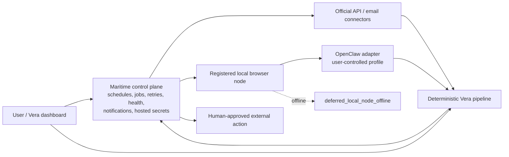

# Maritime and OpenClaw Documentation Correction Implementation Plan

> **For agentic workers:** REQUIRED SUB-SKILL: Use superpowers:subagent-driven-development (recommended) or superpowers:executing-plans to implement this plan task-by-task. Steps use checkbox (`- [ ]`) syntax for tracking.

**Goal:** Make Vera's six authoritative contributor and product documents consistently define Maritime as the primary MVP orchestrator and OpenClaw as the default replaceable local-browser adapter, with exact source modes, policy states, offline deferral, and deterministic pipeline invariants.

**Architecture:** This is a documentation-only correction. The documents will distinguish the currently implemented local fixture/manual worker from the normative MVP topology: a Maritime-hosted control plane dispatching saved-search jobs to a local OpenClaw node whose authenticated browser profile never leaves the user's machine. Source policy remains deterministic and fail-closed, and every acquisition mode feeds the existing deterministic Vera pipeline.

**Tech Stack:** Markdown, Mermaid, TypeScript interface examples, Prettier 3.9.5, ripgrep consistency checks.

## Global Constraints

- Update `docs/PRODUCT.md`, `docs/ARCHITECTURE.md`, `docs/SOURCE_POLICY.md`, `docs/SECURITY.md`, `AGENTS.md`, and `VERA_BUILD_PLAN.md`.
- Maritime is the primary orchestration and deployment environment for monitoring jobs, scheduled triggers, retries, agent health, notifications, and hosted secrets.
- OpenClaw is the default `local_browser` execution adapter and remains replaceable behind an interface.
- Consumer-site sessions, cookies, and browser profiles remain local by default; users log in manually.
- Vera never asks for, records, types, uploads, or transmits third-party passwords.
- Offline local nodes produce the visible state `deferred_local_node_offline`; cursor state does not advance.
- The acquisition-mode vocabulary is exactly `official_api | email_alert | local_browser | user_capture`.
- The source-policy state vocabulary is exactly `approved | user_triggered_only | experimental_personal | disabled`.
- Browser acquisition uses configured saved-search URLs, source-specific cursors or last-seen IDs, and only newly discovered records. It never performs broad website crawling.
- Craigslist starts with official search-alert email ingestion; automated Craigslist browser search is disabled.
- Zillow and Facebook Marketplace `local_browser` monitoring are `experimental_personal` and disabled by default; `user_capture` remains available.
- Preserve the exact deterministic flow: source record -> normalization -> provenance -> deduplication -> ranking -> notification -> human-approved external action.
- Do not add application code, dependencies, migrations, credentials, live integrations, autonomous messaging, or account-login automation.
- The workspace has no Git repository. Use explicit review checkpoints rather than commit steps.

---

## File structure and responsibilities

- `docs/PRODUCT.md`: user-facing MVP boundary, non-goals, safety invariants, success criteria, and honest readiness status.
- `docs/ARCHITECTURE.md`: target deployment topology, control/data boundaries, dispatch state machine, connector abstraction, deterministic data flow, and implementation sequence.
- `docs/SOURCE_POLICY.md`: normative acquisition-mode and policy-state semantics, evaluation order, saved-search/cursor constraints, and initial source portfolio.
- `docs/SECURITY.md`: Maritime/local-node trust boundary, secret ownership, node transport, password prohibition, browser blockers, and deferral/audit safety.
- `AGENTS.md`: contributor mission, repository boundary, source order, invariants, and MVP definition of done.
- `VERA_BUILD_PLAN.md`: corrected recommended architecture, repository layout, source strategy, milestones, and acceptance gates.

### Task 1: Correct the product charter and contributor contract

**Files:**

- Modify: `docs/PRODUCT.md`
- Modify: `AGENTS.md`

**Interfaces:**

- Consumes: approved design terminology and exact vocabularies.
- Produces: the top-level MVP scope that the architecture and policy documents refine.

- [ ] **Step 1: Replace the product MVP acquisition boundary**

In `docs/PRODUCT.md`, replace the current ingestion-only item with content that makes orchestration and browser acquisition first-class while preserving the deterministic pipeline:

```markdown
2. Acquire listings through `official_api`, `email_alert`, `local_browser`, and `user_capture` connectors. Maritime is the primary orchestration environment; OpenClaw is the default replaceable adapter for approved local-browser sources.
3. Keep authenticated consumer-site sessions in a user-controlled local OpenClaw profile. The user signs in manually, and Vera never requests or transmits a third-party password.
4. Preserve immutable source evidence and process every record through normalization, provenance, deduplication, deterministic ranking, notification, and human-approved external action.
```

Renumber the remaining MVP items without deleting draft-only Gmail, approval-bound Calendar, audit, or credential-free test requirements.

- [ ] **Step 2: Replace obsolete product non-goals**

Remove statements that defer hosted Maritime jobs or make OpenClaw optional/post-MVP. Retain and sharpen these non-goals:

```markdown
- Broad website crawling, arbitrary marketplace exploration, CAPTCHA handling, stealth automation, proxy use, or anti-bot evasion.
- Autonomous marketplace messages, email, SMS, calls, applications, uploads, payments, or account changes.
- Password collection, credential replay, or automated account login. Consumer-site login remains a manual action in the user's local browser profile.
```

State that browser monitoring is limited to reviewed saved-search URLs and newly discovered IDs.

- [ ] **Step 3: Update product safety and readiness language**

Add Maritime/local-node deferral to the fail-closed invariant and add the password/session split to the private-action invariant. The readiness section must say the topology is normative MVP architecture but not yet implemented:

```markdown
The current clean clone still runs fixture and user-capture jobs locally. Maritime orchestration, remote dispatch, email-alert ingestion, and the local OpenClaw bridge remain implementation work; they are now required MVP architecture rather than optional post-MVP experiments.
```

- [ ] **Step 4: Correct `AGENTS.md` architecture and source order**

Replace `infra/maritime` optional wording with:

```markdown
- `infra/maritime`: primary orchestration/deployment assets for monitoring schedules, durable jobs, retries, agent health, notifications, and hosted secrets.
```

Update the connector boundary to name the four acquisition modes and OpenClaw as the default replaceable `local_browser` adapter. Replace the initial source order with:

1. sanitized fixture/test-double path;
2. user capture;
3. Craigslist official search-alert email ingestion;
4. reviewed official APIs;
5. local OpenClaw monitoring for an exact saved-search URL, beginning with Zillow/Facebook only as disabled `experimental_personal` manifests.

Add the exact four policy states and `deferred_local_node_offline` to the contributor invariants. Keep autonomous send, CAPTCHA bypass, credential login, and broad crawling prohibited.

- [ ] **Step 5: Verify Task 1 language**

Run:

```sh
rg -n 'Maritime|OpenClaw|official_api|email_alert|local_browser|user_capture|deferred_local_node_offline|third-party password|saved-search' docs/PRODUCT.md AGENTS.md
```

Expected: both files contain the primary topology, four modes, local-session rule, saved-search limit, and visible deferral.

Run:

```sh
rg -n -i 'Maritime.*optional|optional.*Maritime|OpenClaw.*optional|post-MVP.*OpenClaw|browser connector remains outside|browser.*after the local MVP' docs/PRODUCT.md AGENTS.md
```

Expected: no matches.

- [ ] **Review checkpoint:** read both files top to bottom and confirm they do not claim Maritime/OpenClaw code already exists.

### Task 2: Replace the target architecture and build sequence

**Files:**

- Modify: `docs/ARCHITECTURE.md`
- Modify: `VERA_BUILD_PLAN.md`

**Interfaces:**

- Consumes: product boundary from Task 1.
- Produces: deployment topology and milestone ordering consumed by policy/security edits.

- [ ] **Step 1: Correct the readiness verdict and resolved contradictions**

In `docs/ARCHITECTURE.md`, explicitly separate current implementation from the target:

```markdown
The current implementation runs fixture/user-capture ingestion and normalization locally. The normative Ship Season topology uses Maritime as the primary orchestrator and deployment environment, with a registered local OpenClaw node for browser-only work.
```

Replace the resolved-plan rows that reject Maritime/OpenClaw with decisions that promote them while excluding broad crawling and cloud browser profiles.

- [ ] **Step 2: Replace the architecture diagram**

Use this topology:



Explain that Maritime owns job lifecycle while the local node exclusively owns browser session material.

- [ ] **Step 3: Add dispatch and deferral semantics**

Document the exact dispatch payload, authenticated/encrypted transport requirement, minimum returned evidence, cursor-commit rule, and this state transition:

```text
scheduled -> dispatching
  -> running_local_browser -> succeeded | retryable | failed
  -> deferred_local_node_offline -> dispatching | cancelled
```

State that deferral creates no RawListing, success event, or cursor advance and remains visible in UI/health.

- [ ] **Step 4: Add the target `SourceConnector` abstraction**

Add the exact conceptual interface from the design spec:

```ts
type AcquisitionMode = "official_api" | "email_alert" | "local_browser" | "user_capture";

interface SourceConnector {
  readonly connectorId: string;
  readonly acquisitionMode: AcquisitionMode;
  discover(input: ConnectorDiscoveryInput): Promise<ConnectorDiscoveryResult>;
  acquire(input: ConnectorAcquireInput): Promise<RawListingEnvelope[]>;
}
```

Label it target architecture, not implemented code. State that OpenClaw implements a separate replaceable browser-executor interface used by `local_browser` connectors.

- [ ] **Step 5: Restore the deterministic pipeline explicitly**

Add this exact sequence to `docs/ARCHITECTURE.md`:

```text
source record
  -> normalization
  -> provenance
  -> deduplication
  -> ranking
  -> notification
  -> human-approved external action
```

Explain that acquisition output cannot bypass any stage.

- [ ] **Step 6: Correct `VERA_BUILD_PLAN.md`**

Make these coherent changes:

- promote Maritime to the primary orchestration/deployment tier and repository responsibility;
- promote the OpenClaw local bridge to a required MVP milestone before source-specific browser monitoring;
- define browser monitoring as saved-search/cursor based, never source-wide;
- place Craigslist `email_alert` before browser connectors;
- mark Zillow/Facebook browser monitoring `experimental_personal` and disabled by default;
- make offline-node deferral, health visibility, and cursor preservation acceptance criteria;
- retain fixture/manual paths as local development and outage fallback, not the target production control plane.

Do not add hosted browser profiles, autonomous messages, password handling, or an assertion that infrastructure already exists.

- [ ] **Step 7: Verify Task 2 consistency**

Run:

```sh
rg -n -i 'optional.*Maritime|Maritime.*optional|post-local|hosted integrations.*after|OpenClaw.*optional|scheduled browser watching comes later|browser capture is deferred|browser connector remains outside' docs/ARCHITECTURE.md VERA_BUILD_PLAN.md
```

Expected: no superseded decision remains.

Run:

```sh
rg -n 'Maritime|OpenClaw|deferred_local_node_offline|SourceConnector|official_api|email_alert|local_browser|user_capture|source record|human-approved external action' docs/ARCHITECTURE.md VERA_BUILD_PLAN.md
```

Expected: both files contain target topology, deferral, modes, and the deterministic boundary.

- [ ] **Review checkpoint:** verify diagrams and milestone prose agree, and existing implementation status remains honest.

### Task 3: Define the normative source-policy contract

**Files:**

- Modify: `docs/SOURCE_POLICY.md`

**Interfaces:**

- Consumes: target connector modes and dispatch lifecycle from Task 2.
- Produces: the normative permission ceiling and source portfolio used by Security.

- [ ] **Step 1: Add the acquisition-mode vocabulary**

Define exactly:

```text
official_api
email_alert
local_browser
user_capture
```

Map current capabilities to modes without replacing the existing closed capability vocabulary. State that fixture adapters are local test doubles for the `official_api` contract shape and make no network request.

- [ ] **Step 2: Add the four source-policy states**

Use exactly this meaning:

| State                   | Permission ceiling                                                                                |
| ----------------------- | ------------------------------------------------------------------------------------------------- |
| `approved`              | May run under declared manual or Maritime-scheduled execution when every other check passes.      |
| `user_triggered_only`   | Direct user action only; scheduled dispatch always denies.                                        |
| `experimental_personal` | Personal single-user experiment; exact reviewed saved search; disabled until explicit enablement. |
| `disabled`              | Every operation denies.                                                                           |

State that policy state does not replace runtime enablement, manifest validation, connection/session state, saved-search allowlists, node assignment, limits, kill switches, or approvals.

- [ ] **Step 3: Update evaluation order for Maritime/local dispatch**

Add checks for acquisition mode, source-policy state, trigger compatibility, exact saved-search URL, committed cursor, assigned local node, and node health before dispatch. Define `deferred_local_node_offline` as an allowed non-success outcome only after policy authorization; it must append a safe event and preserve the cursor.

- [ ] **Step 4: Replace the manifest portfolio**

Use the exact initial decisions:

| Source/mode                            | State                   | Default                   | Rule                                            |
| -------------------------------------- | ----------------------- | ------------------------- | ----------------------------------------------- |
| Fixture test double / `official_api`   | `approved`              | Enabled in dev/test       | Local sanitized data only.                      |
| General `user_capture`                 | `user_triggered_only`   | Enabled                   | Inert URL and supplied evidence.                |
| Craigslist / `email_alert`             | `approved`              | Disabled until configured | Official search-alert email ingestion.          |
| Craigslist / `local_browser`           | `disabled`              | Disabled                  | No automated browser search initially.          |
| Zillow / `local_browser`               | `experimental_personal` | Disabled                  | Exact saved-search URL through local OpenClaw.  |
| Facebook Marketplace / `local_browser` | `experimental_personal` | Disabled                  | Exact saved-search URL through local OpenClaw.  |
| Known-source `user_capture`            | `user_triggered_only`   | Available                 | Direct user-supplied capture remains available. |

- [ ] **Step 5: Replace browser policy with saved-search/cursor rules**

Require exact saved-search URLs, newly discovered IDs only, cursor commit only after durable idempotent raw import, bounded detail-page visits, manual blockers, and distinct empty/deferred/failure outcomes. Prohibit arbitrary category exploration, entire-site crawling, search widening, unrelated recommendations, and any message/apply/payment/account controls.

- [ ] **Step 6: Expand required policy tests**

Add documentation requirements for:

- each unknown policy state or acquisition mode denying;
- scheduled execution denying `user_triggered_only` and disabled `experimental_personal` entries;
- node offline producing visible deferral without cursor advance;
- saved-search escape and stale/replayed cursor inputs denying;
- newly discovered records importing once;
- Craigslist browser monitoring denying;
- Zillow/Facebook browser monitoring remaining disabled until explicit enablement;
- credentials/session artifacts never entering dispatch or audit.

- [ ] **Step 7: Verify Task 3**

Run:

```sh
for term in official_api email_alert local_browser user_capture approved user_triggered_only experimental_personal disabled deferred_local_node_offline; do rg -q "$term" docs/SOURCE_POLICY.md || exit 1; done
```

Expected: exit zero.

Run:

```sh
rg -n -i 'browser capture is not part|if later enabled|scheduled browser capture requires a future decision|browser.*post-MVP' docs/SOURCE_POLICY.md
```

Expected: no matches.

- [ ] **Review checkpoint:** verify policy state and runtime enabled/disabled are never conflated.

### Task 4: Correct the cloud/local security boundary

**Files:**

- Modify: `docs/SECURITY.md`

**Interfaces:**

- Consumes: source-policy states, dispatch data, and browser behavior from Tasks 2-3.
- Produces: mandatory controls and residual risks for the corrected MVP topology.

- [ ] **Step 1: Add Maritime and local-node trust boundaries**

Document:

- Maritime as trusted orchestration for schedules, job metadata, approved hosted integration secrets, notifications, and health;
- the local node as a separate trust boundary holding OpenClaw profile/session state;
- the dispatch channel as mutually authenticated, encrypted, replay-protected, bounded, and revocable when implemented;
- browser page content and local-node output as untrusted until schema/evidence validation succeeds.

- [ ] **Step 2: Split secret ownership explicitly**

Add this invariant:

```markdown
Maritime's secret manager stores only secrets required by approved hosted/API and email connectors. Consumer-site passwords, browser cookies, local storage, session exports, password-manager values, and OpenClaw profile contents never enter Maritime.
```

State that Vera exposes no password form/API, credential-login capability, automated typing path, or session-export upload. The user logs in manually in the local profile.

- [ ] **Step 3: Replace obsolete browser-baseline language**

Remove “disabled for the MVP baseline” and “future experiment” language. Define first-class but narrow browser controls: exact saved-search allowlist, new-ID cursor, bounded pages/bytes/time, no arbitrary JavaScript by default, manual blockers, no broad crawling, no autonomous controls, immediate node/source kill switches, and local profile storage.

- [ ] **Step 4: Add offline and cursor threat handling**

Document these threats and controls:

- node impersonation or stale registration;
- replayed dispatch/result messages;
- cursor rollback or premature advance;
- offline node confused with empty result;
- browser layout changes producing unsafe capture;
- unrelated account/page data escaping the node.

Require `deferred_local_node_offline`, cursor preservation, safe health/audit metadata, stable job IDs, and no success/raw record on deferral.

- [ ] **Step 5: Update security acceptance and residual risks**

Add checks proving:

- dispatch contains no password/session artifact;
- offline node is visible and cursor preserving;
- browser navigation cannot escape a configured saved search/source detail scope;
- Zillow/Facebook remain disabled `experimental_personal` by default;
- Craigslist browser mode denies;
- no autonomous message/account-login path exists.

Change “future browser connector” residual risk to acknowledge first-class, source-specific browser brittleness and local-node availability risk.

- [ ] **Step 6: Verify Task 4**

Run:

```sh
rg -n 'Maritime|OpenClaw|local node|deferred_local_node_offline|password|cookies|saved-search|cursor|mutually authenticated|replay' docs/SECURITY.md
```

Expected: the trust, secret, browser, and deferral controls are all present.

Run:

```sh
rg -n -i 'browser automation is disabled for the MVP|later experiment|future browser connector' docs/SECURITY.md
```

Expected: no matches.

- [ ] **Review checkpoint:** confirm Maritime secret ownership does not accidentally include local browser sessions.

### Task 5: Run the requirement-by-requirement completion audit

**Files:**

- Verify: `docs/PRODUCT.md`
- Verify: `docs/ARCHITECTURE.md`
- Verify: `docs/SOURCE_POLICY.md`
- Verify: `docs/SECURITY.md`
- Verify: `AGENTS.md`
- Verify: `VERA_BUILD_PLAN.md`
- Verify: `docs/superpowers/specs/2026-07-18-maritime-openclaw-mvp-architecture-design.md`

**Interfaces:**

- Consumes: all corrected documents.
- Produces: evidence that every approved requirement is explicit and no obsolete decision remains.

- [ ] **Step 1: Format all changed Markdown**

Run:

```sh
pnpm exec prettier --write --ignore-path /dev/null \
  AGENTS.md VERA_BUILD_PLAN.md \
  docs/PRODUCT.md docs/ARCHITECTURE.md docs/SOURCE_POLICY.md docs/SECURITY.md \
  docs/superpowers/specs/2026-07-18-maritime-openclaw-mvp-architecture-design.md \
  docs/superpowers/plans/2026-07-18-maritime-openclaw-documentation-correction.md
```

Expected: each file is formatted or reported unchanged.

- [ ] **Step 2: Check formatting**

Run the same file list with `prettier --check --ignore-path /dev/null`.

Expected: `All matched files use Prettier code style!`

- [ ] **Step 3: Prove all exact vocabularies are present in normative docs**

Run:

```sh
for file in docs/PRODUCT.md docs/ARCHITECTURE.md docs/SOURCE_POLICY.md docs/SECURITY.md AGENTS.md VERA_BUILD_PLAN.md; do
  for term in Maritime OpenClaw official_api email_alert local_browser user_capture approved user_triggered_only experimental_personal disabled deferred_local_node_offline; do
    rg -q "$term" "$file" || { echo "missing $term in $file"; exit 1; }
  done
done
```

Expected: exit zero with no missing-term output.

- [ ] **Step 4: Prove source-specific decisions**

Run:

```sh
for file in docs/PRODUCT.md docs/ARCHITECTURE.md docs/SOURCE_POLICY.md docs/SECURITY.md AGENTS.md VERA_BUILD_PLAN.md; do
  rg -qi 'Craigslist' "$file" || exit 1
  rg -qi 'Zillow' "$file" || exit 1
  rg -qi 'Facebook Marketplace' "$file" || exit 1
done
```

Expected: exit zero. Manually confirm Craigslist is email-alert-first/browser-disabled and Zillow/Facebook browser monitoring is experimental-personal/default-disabled while user capture remains available.

- [ ] **Step 5: Scan superseded decisions**

Run:

```sh
rg -n -i \
  'optional.*Maritime|Maritime.*optional|post-local.*Maritime|Maritime.*after the local|OpenClaw.*optional|post-MVP.*OpenClaw|browser capture is not part of the blocking MVP|browser connector remains outside|browser automation is disabled for the MVP baseline|scheduled browser capture requires a future decision|because browser capture is deferred' \
  AGENTS.md VERA_BUILD_PLAN.md docs/PRODUCT.md docs/ARCHITECTURE.md docs/SOURCE_POLICY.md docs/SECURITY.md
```

Expected: no matches.

- [ ] **Step 6: Verify deterministic pipeline and prohibitions**

Read every file and confirm the ordered pipeline appears without a bypass. Run:

```sh
rg -n -i 'autonomous.*messag|account-login|credential-login|third-party password|broad.*crawl|entire.*site|human-approved external action' \
  AGENTS.md VERA_BUILD_PLAN.md docs/PRODUCT.md docs/ARCHITECTURE.md docs/SOURCE_POLICY.md docs/SECURITY.md
```

Expected: every file preserves the required prohibitions and human approval boundary.

- [ ] **Step 7: Verify no application scope change**

Run:

```sh
find apps packages infra -type f -newermt '2026-07-18 00:00:00' \
  -not -path '*/node_modules/*' -not -path '*/dist/*' -not -path '*/.next/*'
```

Expected: no source file was changed by this documentation-only correction. If unrelated pre-existing files have today's timestamp, inspect rather than modifying them.

- [ ] **Step 8: Final manual audit**

Build a ten-row requirement checklist from the approved design and cite the exact section in the six documents proving each item. Confirm current implementation status is honest and no real credentials, personal data, browser profile, connector code, or live integration was added.

- [ ] **Review checkpoint:** report exact changed files, decisions, verification commands/results, and remaining implementation work without claiming the target infrastructure exists.
