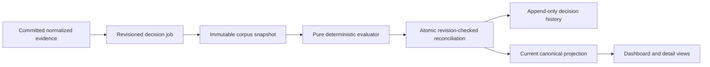

# Production Decision Engines Implementation Plan

> **For agentic workers:** REQUIRED SUB-SKILL: Use superpowers:subagent-driven-development (recommended) or superpowers:executing-plans to implement this plan task-by-task. Steps use checkbox (`- [ ]`) syntax for tracking.

**Goal:** Replace Vera's fixture-declared demo decisions with production-grade deterministic normalization, deduplication, canonical reconciliation, ranking, and risk evaluation that runs after every normalized capture.

**Architecture:** `packages/scoring` remains pure and deterministic; it transforms strict domain snapshots into a complete decision plan without database, network, browser, or LLM access. A separate durable worker queue loads a revisioned SQLite corpus snapshot, computes outside a transaction, and atomically reconciles active canonical projections plus immutable pair, score, risk, and run history only when the corpus revision is still current.

**Tech Stack:** Node 24 LTS, TypeScript 6.0.3 strict, pnpm 11.14.0 workspaces, Zod 4.4.3, SQLite with better-sqlite3 12.11.1 and Drizzle ORM 0.45.2, sharp 0.35.3, Vitest 4.1.10, Playwright 1.61.1, Next.js 16.2.10.

## Global Constraints

- Read `AGENTS.md`, `VERA_BUILD_PLAN.md` sections 8–10, and `docs/superpowers/specs/2026-07-20-production-decision-engines-design.md` before each task.
- Preserve all uncommitted Milestone 3 extraction changes and commit them separately before Milestone 4 implementation.
- `packages/scoring` must not import database, web, worker, browser, AI-provider, or network modules.
- Run no geocoding, routing, URL resolution, image downloading, scraping, browser automation, Gmail, Calendar, notification, or external side effect.
- Treat raw records, extraction values, image bytes, URLs, and descriptions as untrusted input.
- Never persist raw email addresses, phone numbers, contact URLs, or reversible contact fingerprints in pair evaluations, scores, metrics, logs, or activity metadata.
- Missing data remains unknown. Unknown fees are never zero; unknown factors are neutral unless the preference explicitly says `penalize`.
- Hard constraints, scores, explanations, duplicate decisions, and risk indicators are deterministic and have no LLM dependency.
- Use “risk indicator” and “needs verification”; never emit a definitive scam or fraud verdict.
- Retain every source record and every field-provenance row. Canonical merging never destroys evidence.
- Preserve canonical IDs, lifecycle state, shortlist state, workflow references, and activity history across recomputation.
- Use forward-only migrations and preserve existing user data; never reset the database to make migration tests pass.
- Perform decision computation outside SQLite transactions and apply the complete plan atomically after a corpus-revision check.
- Default tests, fixture evaluation, seed, and build must make no external network request.
- Use sanitized synthetic fixtures only; no credentials or real personal/listing contact data.
- Version constants are exactly `decision-normalization.v1`, `listing-photo.dhash64.v1`, `listing-dedupe.v1`, `canonical-stitch.v1`, `listing-score.v2`, `listing-risk.v2`, and `decision-plan.v1`.

---

## File Structure

### Domain

- Create `packages/domain/src/decision.ts`: versions, normalized decision input, pair features/evaluations, overrides, cluster plans, score v2, risk v2, decision jobs, and decision plans.
- Create `packages/domain/src/decision.unit.test.ts`: strict boundary and cross-field invariant tests.
- Modify `packages/domain/src/listing.ts`: coordinates, photo metadata, canonical projection state, versioned score/risk compatibility.
- Modify `packages/domain/src/search-profile.ts`: closed preference unknown behavior and duplicate-code validation.
- Modify `packages/domain/src/capture-api.ts`: optional decision-job status after normalization.
- Modify `packages/domain/src/demo-api.ts`: v2 listing detail and override/job API schemas.
- Modify `packages/domain/src/api.ts`: active/superseded and eligibility summary fields.
- Modify `packages/domain/src/index.ts`: public exports.

### Scoring

- Create `packages/scoring/src/normalization/address.ts`, `phone.ts`, `url.ts`, `money.ts`, `date.ts`, and `index.ts`.
- Create `packages/scoring/src/photos.ts`: decoder contract, sharp adapter, dHash, and Hamming distance.
- Create `packages/scoring/src/dedupe/config.ts`, `features.ts`, `pair.ts`, `candidates.ts`, `cluster.ts`, and `overrides.ts`.
- Create `packages/scoring/src/canonical/stitch.ts`, `identity.ts`, and `plan.ts`.
- Create `packages/scoring/src/ranking/config.ts`, `constraints.ts`, `factors.ts`, `penalties.ts`, `explanations.ts`, and `score.ts`.
- Create `packages/scoring/src/risk/config.ts`, `evidence.ts`, `language-rules.ts`, `comparative-rules.ts`, and `evaluate.ts`.
- Create `packages/scoring/src/evaluate-corpus.ts`: top-level pure composition.
- Replace `packages/scoring/src/demo-evaluation.ts` with compatibility exports delegating to production functions, then remove those exports after seed/UI migration.
- Add focused `*.unit.test.ts` files next to each module.
- Modify `packages/scoring/src/index.ts`, `package.json`, and `tsconfig.json`.

### Testing and fixtures

- Create `packages/testing/src/decision-fixtures.ts`: sanitized source inputs, pair labels, risk cases, and golden configuration.
- Create `packages/testing/src/index.ts`: public fixture exports.
- Create `packages/testing/scripts/generate-photo-fixtures.ts`.
- Create generated sanitized assets under `packages/testing/fixtures/photos/` plus `README.md` provenance.
- Create `packages/scoring/src/evaluate-fixtures-cli.ts` and its unit test.
- Modify root `package.json` with `scoring:evaluate-fixtures`.

### Persistence

- Modify `packages/db/src/schema.ts`, `repositories.ts`, `row-mappers.ts`, `sqlite-repositories.ts`, and `index.ts`.
- Create generated migration `packages/db/drizzle/0005_production_decision_engines.sql` and matching Drizzle metadata.
- Add `packages/db/src/decision-jobs.integration.test.ts`, `decision-reconciliation.integration.test.ts`, and migration coverage.
- Modify `packages/db/src/fixtures.ts`, `seed.ts`, and seed tests so product outcomes are computed.

### Worker

- Create `apps/worker/src/decision-worker.ts` and integration test.
- Create `apps/worker/src/decision-runtime.ts` and unit test.
- Modify `apps/worker/src/normalization-worker.ts`, `cli.ts`, `index.ts`, lifecycle tests, logger tests, and package dependencies.

### Web and documentation

- Create `apps/web/app/api/dedupe/overrides/route.ts` and integration test.
- Create `apps/web/app/api/decision-jobs/[id]/route.ts` and integration test.
- Modify listing APIs, presentation service, dashboard, listing detail, capture status UI, styles, and Playwright tests.
- Modify `README.md`, `.env.example` only if configuration changes, `docs/ARCHITECTURE.md`, `docs/DATA_MODEL.md`, `docs/SECURITY.md`, and `docs/DEMO.md`.
- Create `docs/DECISIONS/0008-production-decision-engines.md`.

---

### Task 0: Preserve and checkpoint the completed Milestone 3 hardening

**Files:**

- Existing modified Milestone 3 files shown by `git status --short`
- Exclude: `docs/superpowers/specs/2026-07-20-production-decision-engines-design.md`, already committed as `7b8e661`

**Interfaces:**

- Consumes: current uncommitted extraction v2 monetary-role changes.
- Produces: a clean baseline commit before database/domain types are expanded.

- [ ] **Step 1: Verify the exact pending file set**

Run:

```bash
git status --short
git diff --check
git diff --name-only
```

Expected: only the ten previously reviewed Milestone 3 files are modified; no `.env`, database, image, build, or dependency artifacts are tracked.

- [ ] **Step 2: Run the narrow Milestone 3 checks**

Run:

```bash
pnpm vitest run --project unit packages/domain/src/extraction.unit.test.ts packages/ai/src/evidence-validator.unit.test.ts
pnpm run typecheck
```

Expected: all focused tests and every package typecheck pass.

- [ ] **Step 3: Commit only the Milestone 3 changes**

Run:

```bash
git add docs/ARCHITECTURE.md docs/DATA_MODEL.md docs/DECISIONS/0006-provider-neutral-structured-extraction.md docs/SECURITY.md docs/superpowers/specs/2026-07-17-provider-neutral-structured-extraction-design.md packages/ai/src/evidence-validator.ts packages/ai/src/evidence-validator.unit.test.ts packages/domain/src/capture-api.ts packages/domain/src/extraction.ts packages/domain/src/extraction.unit.test.ts
git diff --cached --check
git commit -m "fix: harden extraction money roles"
```

Expected: one isolated commit; `git status --short` is clean.

---
### Task 1: Add strict domain contracts for deterministic decisions

**Files:**

- Create: `packages/domain/src/decision.ts`
- Create: `packages/domain/src/decision.unit.test.ts`
- Modify: `packages/domain/src/listing.ts`
- Modify: `packages/domain/src/search-profile.ts`
- Modify: `packages/domain/src/capture-api.ts`
- Modify: `packages/domain/src/demo-api.ts`
- Modify: `packages/domain/src/api.ts`
- Modify: `packages/domain/src/index.ts`

**Interfaces:**

- Consumes: immutable source records, protected in-memory contact fingerprints, preferences, existing canonical identity, and active overrides.
- Produces: one strictly validated `DecisionPlan` that persistence can apply without interpreting business rules.

- [ ] **Step 1: Write failing schema and invariant tests**

Add tests that prove:

```ts
expect(DecisionJobStatusSchema.safeParse("queued").success).toBe(true);
expect(DecisionJobStatusSchema.safeParse("succeeded").success).toBe(true);
expect(DecisionJobStatusSchema.safeParse("running").success).toBe(true);
expect(DecisionJobStatusSchema.safeParse("retryable_failed").success).toBe(true);
expect(DecisionJobStatusSchema.safeParse("permanently_failed").success).toBe(true);
expect(DecisionJobStatusSchema.safeParse("cancelled").success).toBe(true);
expect(DecisionJobStatusSchema.safeParse("complete").success).toBe(false);
```

Also cover strict-object rejection, finite coordinates, confidence and basis-point bounds, sorted unique source IDs, source-pair ordering, override cross-field rules, nonempty evidence, closed reason codes, score arithmetic, and `inputHash === payloadHash(canonicalInput)` fixtures. A `force_merge` must reject a missing `survivorCanonicalId`; a `force_split` must reject one source ID or a survivor ID.

Run:

```bash
pnpm vitest run --project unit packages/domain/src/decision.unit.test.ts
```

Expected: failure because the decision contracts do not exist.

- [ ] **Step 2: Add closed versions, enums, and normalized input schemas**

Export these exact constants and core shapes:

```ts
export const DECISION_NORMALIZATION_VERSION = "decision-normalization.v1";
export const PHOTO_HASH_VERSION = "listing-photo.dhash64.v1";
export const DEDUPE_VERSION = "listing-dedupe.v1";
export const STITCH_VERSION = "canonical-stitch.v1";
export const SCORE_VERSION = "listing-score.v2";
export const RISK_VERSION = "listing-risk.v2";
export const DECISION_PLAN_VERSION = "decision-plan.v1";

export const DecisionJobStatusSchema = z.enum([
  "queued",
  "running",
  "succeeded",
  "retryable_failed",
  "permanently_failed",
  "cancelled",
]);

export const NormalizedDecisionSourceSchema = z.strictObject({
  sourceRecordId: EntityIdSchema,
  rawListingId: EntityIdSchema,
  sourceLabel: NonEmptyStringSchema,
  connectorId: NonEmptyStringSchema,
  acquisitionMode: AcquisitionModeSchema,
  sourceListingId: z.string().trim().min(1).nullable(),
  acquiredAt: TimestampSchema,
  observedAt: TimestampSchema,
  postedAt: TimestampSchema.nullable(),
  normalizedAddress: z.string().trim().min(1).nullable(),
  normalizedUnit: z.string().trim().min(1).nullable(),
  latitude: z.number().finite().gte(-90).lte(90).nullable(),
  longitude: z.number().finite().gte(-180).lte(180).nullable(),
  canonicalUrl: z.url().nullable(),
  rentCents: z.number().int().nonnegative().nullable(),
  requiredRecurringFeeCents: z.number().int().nonnegative().nullable(),
  beds: z.number().nonnegative().nullable(),
  baths: z.number().nonnegative().nullable(),
  squareFeet: z.number().int().positive().nullable(),
  availableOn: IsoDateSchema.nullable(),
  descriptionText: z.string(),
  photoHashes: z.array(PhotoHashSchema).max(50),
  contactFingerprint: z.string().regex(/^[a-f0-9]{64}$/).nullable(),
  fieldCandidates: z.array(ProvenancedFieldCandidateSchema),
});
```

Keep `contactFingerprint` an input-only SHA-256/HMAC-compatible opaque value and mark it with a comment prohibiting persistence in evaluation output.

- [ ] **Step 3: Add pair, override, cluster, canonical, score, risk, and plan schemas**

Define strict schemas and inferred types for:

```ts
type DuplicateDecision = "link" | "review" | "separate";
type DuplicateOverrideKind = "force_merge" | "force_split";
type UnknownPreferenceBehavior = "neutral" | "penalize";
type CanonicalProjectionState = "active" | "superseded";
type DecisionJobTrigger = "normalization" | "manual_recompute" | "seed";

interface DecisionPlan {
  version: typeof DECISION_PLAN_VERSION;
  normalizationVersion: typeof DECISION_NORMALIZATION_VERSION;
  dedupeVersion: typeof DEDUPE_VERSION;
  stitchVersion: typeof STITCH_VERSION;
  scoreVersion: typeof SCORE_VERSION;
  riskVersion: typeof RISK_VERSION;
  corpusRevision: number;
  inputHash: string;
  pairEvaluations: DuplicatePairEvaluation[];
  clusterPlans: DuplicateClusterPlan[];
  canonicalPlans: CanonicalListingPlan[];
  scoreSnapshots: ListingScoreV2[];
  riskSignals: RiskSignalV2[];
}
```

Each pair must use lexicographically ordered distinct source IDs. Each cluster and canonical plan must contain sorted unique members. Persisted pair output must contain only boolean contact-match evidence, never the contact fingerprint. Each score must satisfy:

```ts
Math.max(
  0,
  baseScoreBasisPoints -
    stalePenaltyBasisPoints -
    lowConfidencePenaltyBasisPoints -
    riskPenaltyBasisPoints,
) === finalScoreBasisPoints;
```

Also reject any component or final score outside `0..10_000`.

- [ ] **Step 4: Extend existing listing, preference, and API schemas compatibly**

Add nullable `latitude` and `longitude` to source records, decoded photo metadata to `ListingPhoto`, projection state plus supersession fields to canonical listings, and v2 score/risk schemas without deleting the v1 readers needed for the migration. Add a closed `unknownBehavior` defaulting to `neutral` on weighted preferences and reject duplicate preference codes during profile parsing.

Expose only safe decision-job summaries from capture APIs:

```ts
decisionJob: z.strictObject({
  id: EntityIdSchema,
  status: DecisionJobStatusSchema,
  corpusRevision: z.number().int().nonnegative(),
}).nullable()
```

Add request/response schemas for `GET /api/decision-jobs/:id`, `GET /api/dedupe/overrides`, and `POST /api/dedupe/overrides`. The POST body must accept only `force_merge` or `force_split`, sorted source-record IDs, an optional reason limited to 500 characters, and the survivor only for merges.

- [ ] **Step 5: Export and verify the boundary**

Run:

```bash
pnpm vitest run --project unit packages/domain/src/decision.unit.test.ts packages/domain/src/search-profile.unit.test.ts packages/domain/src/api.unit.test.ts
pnpm --filter @vera/domain typecheck
pnpm run lint
```

Expected: focused tests, domain typecheck, and lint pass.

- [ ] **Step 6: Commit the domain contract**

```bash
git add packages/domain
git diff --cached --check
git commit -m "feat(domain): define deterministic decision contracts"
```

---

### Task 2: Implement closed, deterministic normalization

**Files:**

- Create: `packages/scoring/src/normalization/address.ts`
- Create: `packages/scoring/src/normalization/phone.ts`
- Create: `packages/scoring/src/normalization/url.ts`
- Create: `packages/scoring/src/normalization/money.ts`
- Create: `packages/scoring/src/normalization/date.ts`
- Create: `packages/scoring/src/normalization/index.ts`
- Create: focused unit tests beside each normalizer
- Modify: `packages/scoring/src/index.ts`

**Interfaces:**

- Consumes: already-extracted values plus source-record metadata.
- Produces: deterministic comparable values; it never fills absent facts or performs network lookup.

- [ ] **Step 1: Write failing table-driven normalization tests**

Cover at minimum:

```ts
[
  ["12 North Main Street Apt. #4B, Boston, MA 02110", "12 n main st", "4b"],
  ["12 N Main St, Unit 4B, Boston, MA 02110-1234", "12 n main st", "4b"],
  ["12 N Main St Boston MA", "12 n main st boston ma", null],
]
```

Also test PO boxes, directional and suffix expansion, punctuation, apartment markers, non-US text returning conservative normalized text, extension-aware US phones, malformed phones returning `null`, default ports, fragments, tracking-parameter removal, query-key sorting, non-HTTP URL rejection, exact cents with billing period, required recurring fee separation, leap days, explicit-offset timestamps, ambiguous dates returning `null`, and DST boundary cases.

Run:

```bash
pnpm vitest run --project unit packages/scoring/src/normalization
```

Expected: failure because the modules do not exist.

- [ ] **Step 2: Implement US address normalization with separate unit extraction**

Use a closed token map for USPS-style directionals and common street suffixes. Normalize Unicode with `NFKC`, lowercase, collapse whitespace, remove punctuation conservatively, preserve street numbers and letter suffixes, and extract unit markers `apt`, `apartment`, `unit`, `#`, `suite`, and `ste`. Do not infer city/state/ZIP or call a geocoder.

Return:

```ts
type NormalizedAddress = {
  address: string | null;
  unit: string | null;
};
```

An empty or punctuation-only value returns both fields as `null`.

- [ ] **Step 3: Implement phone and URL normalization**

Normalize phones to E.164 only when the input is unambiguously a US/Canada 10-digit number or an 11-digit number beginning with `1`; preserve an extension as a separate field. Do not guess a country code for any other length.

For URLs, use the built-in `URL` parser, allow only `http:` and `https:`, lowercase hostnames, remove default ports and fragments, remove only the closed tracking-key set (`utm_*`, `fbclid`, `gclid`, `mc_cid`, `mc_eid`), sort remaining query pairs, preserve meaningful path/query values, and never resolve redirects.

- [ ] **Step 4: Implement money and date normalization**

Money parsing must use decimal-string arithmetic rather than binary float multiplication. Preserve ISO currency and billing period and separate:

```ts
type NormalizedHousingCost = {
  baseRentCents: number | null;
  requiredRecurringFeeCents: number | null;
  currency: "USD" | null;
  billingPeriod: "month" | "week" | "day" | "unknown";
};
```

Do not convert weekly/daily rent to monthly rent. Unknown fees remain `null`.

Date normalization accepts ISO dates, explicit US month-name dates, and timestamps with an explicit offset. Convert timestamps to the configured search-profile timezone before selecting the calendar date. Reject ambiguous numeric dates and impossible dates.

- [ ] **Step 5: Compose normalized decision inputs without invention**

Add a pure `normalizeDecisionSource` that chooses only explicit/provenanced source candidates, records normalization reason codes, retains `null` for unknown, and sorts photos and field candidates deterministically. Protect the in-memory contact value by hashing the normalized phone or lowercased email with an injected keyed hasher; never emit the source contact value or fingerprint from later pair results.

- [ ] **Step 6: Verify deterministic behavior and commit**

Run the entire normalizer suite twice and compare the serialized golden output:

```bash
pnpm vitest run --project unit packages/scoring/src/normalization
pnpm vitest run --project unit packages/scoring/src/normalization
pnpm --filter @vera/scoring typecheck
pnpm run lint
git add packages/scoring/src/normalization packages/scoring/src/index.ts
git diff --cached --check
git commit -m "feat(scoring): add closed listing normalization"
```

Expected: both runs pass with byte-identical snapshots.

---

### Task 3: Add bounded fixture-photo metadata and perceptual hashing

**Files:**

- Modify: `packages/scoring/package.json`
- Modify: `pnpm-lock.yaml`
- Create: `packages/scoring/src/photos.ts`
- Create: `packages/scoring/src/photos.unit.test.ts`
- Create: `packages/testing/scripts/generate-photo-fixtures.ts`
- Create: `packages/testing/fixtures/photos/README.md`
- Create: generated PNG assets under `packages/testing/fixtures/photos/`
- Modify: `packages/testing/package.json`

**Interfaces:**

- Consumes: explicitly downloaded image bytes supplied by an acquisition layer or sanitized local fixture bytes.
- Produces: decoded metadata plus a versioned 64-bit dHash; it never downloads an image itself.

- [ ] **Step 1: Add failing byte-limit, metadata, hash, and distance tests**

Tests must prove:

- identical images have Hamming distance `0`;
- a resized/re-encoded visual fixture remains within the configured near-duplicate threshold;
- clearly different fixtures exceed that threshold;
- width, height, MIME type, byte size, and hash version are recorded;
- unsupported formats, truncated bytes, decompression bombs, excessive dimensions, and over-limit byte buffers fail with typed errors;
- fixture paths never become network fetches.

Run:

```bash
pnpm vitest run --project unit packages/scoring/src/photos.unit.test.ts
```

Expected: failure because the image contract is absent.

- [ ] **Step 2: Install the pinned decoder and define a replaceable boundary**

Run:

```bash
pnpm --filter @vera/scoring add sharp@0.35.3
```

Define:

```ts
interface PhotoDecoder {
  decodeForHash(input: Uint8Array, limits: PhotoDecodeLimits): Promise<DecodedPhoto>;
}

type PhotoDecodeLimits = {
  maxBytes: 10_000_000;
  maxPixels: 40_000_000;
  maxWidth: 10_000;
  maxHeight: 10_000;
};
```

Configure sharp with `limitInputPixels`, no animated-frame expansion, autorotation, and an exact grayscale `9 x 8` nearest-neighbor output.

- [ ] **Step 3: Implement `listing-photo.dhash64.v1`**

Compare each of the eight horizontal adjacent pixel pairs in all eight rows. Set one bit when the left pixel is greater than the right pixel, serialize the unsigned 64-bit result as exactly 16 lowercase hexadecimal characters, and implement Hamming distance using XOR plus Kernighan bit counting on `bigint`.

The returned metadata is:

```ts
{
  byteSize,
  width,
  height,
  mimeType,
  perceptualHash,
  perceptualHashVersion: PHOTO_HASH_VERSION,
}
```

- [ ] **Step 4: Generate and document sanitized fixture assets**

Use a deterministic script with programmatic colors/shapes and no real rental photos. Generate one base image, one visually equivalent transform, and at least two distinct images. Record the generator command, purpose, and synthetic provenance in `README.md`.

Run:

```bash
pnpm --filter @vera/testing generate:photo-fixtures
pnpm vitest run --project unit packages/scoring/src/photos.unit.test.ts
pnpm audit --prod
```

Expected: all tests pass and the decoder introduces no critical/high production vulnerability.

- [ ] **Step 5: Commit the photo boundary**

```bash
git add packages/scoring/package.json packages/scoring/src/photos.ts packages/scoring/src/photos.unit.test.ts packages/testing/package.json packages/testing/scripts/generate-photo-fixtures.ts packages/testing/fixtures/photos pnpm-lock.yaml
git diff --cached --check
git commit -m "feat(scoring): add bounded perceptual photo hashing"
```

---

### Task 4: Implement candidate generation and explainable pair evaluation

**Files:**

- Create: `packages/scoring/src/dedupe/config.ts`
- Create: `packages/scoring/src/dedupe/features.ts`
- Create: `packages/scoring/src/dedupe/pair.ts`
- Create: `packages/scoring/src/dedupe/candidates.ts`
- Create: focused unit tests beside each file
- Modify: `packages/scoring/src/index.ts`

**Interfaces:**

- Consumes: normalized source records and an explicit versioned dedupe configuration.
- Produces: bounded, sorted candidate pairs and persisted-safe feature/evidence snapshots.

- [ ] **Step 1: Write a failing labeled pair-evaluation suite**

Include true and false pairs for source ID, canonical URL, address+unit, contact match, exact photo hash, different nonempty units, incompatible exact source IDs, similar text at different addresses, close rent but different beds, and missing-heavy records. Assert pair order and exact reason codes.

Run:

```bash
pnpm vitest run --project unit packages/scoring/src/dedupe
```

Expected: failure because dedupe functions do not exist.

- [ ] **Step 2: Define and validate the default configuration**

Start with integer weights totaling exactly `10_000`:

```ts
export const DEFAULT_DEDUPE_CONFIG = {
  version: DEDUPE_VERSION,
  automaticLinkThreshold: 7_500,
  reviewThreshold: 6_000,
  maxCandidatePairs: 2_000,
  fallbackBlockSize: 250,
  weights: {
    address: 2_500,
    geographic: 1_000,
    rent: 1_500,
    bedsBaths: 1_000,
    squareFeet: 750,
    text: 1_250,
    photo: 1_500,
    postingTime: 500,
  },
} as const;
```

Reject negative weights, thresholds outside `0..10_000`, `reviewThreshold > automaticLinkThreshold`, and unsafe pair/block bounds.

- [ ] **Step 3: Implement deterministic feature functions**

Implement and independently test:

```ts
addressSimilarity(a, b): BasisPoints | null;
geographicSimilarity(a, b): BasisPoints | null;
rentSimilarity(a, b): BasisPoints | null;
bedsBathsSimilarity(a, b): BasisPoints | null;
squareFeetSimilarity(a, b): BasisPoints | null;
textSimilarity(a, b): BasisPoints | null;
photoSimilarity(a, b): BasisPoints | null;
postingTimeSimilarity(a, b): BasisPoints | null;
```

Use token-set Jaccard plus normalized edit similarity for addresses; Haversine distance for coordinates; bounded relative deltas for numeric fields; Unicode-token 3-gram Jaccard for text; minimum dHash Hamming distance across photos; and absolute UTC duration for posting time. Return `null` when evidence is missing and use integer basis-point arithmetic with documented rounding.

- [ ] **Step 4: Implement hard links and conflict gates before weighted scoring**

Evaluate in this order:

1. incompatible nonempty source IDs from the same source label force `separate`;
2. conflicting nonempty normalized units at the same address force `separate`;
3. a materially different location—address similarity below `2_500` basis points and, when both coordinates exist, distance over 500 meters—blocks contact-only and photo-only hard links but does not by itself force a pair apart;
4. exact same source label + source ID links;
5. exact canonical URL links;
6. exact normalized address + unit links;
7. exact protected contact match links unless a conflict gate fired;
8. exact photo hash links unless a conflict gate fired;
9. otherwise compute the renormalized weighted score over known features.

Persist only `contactMatched: boolean`; exclude both fingerprints. Include all contributing feature values, omitted-feature codes, decision threshold, config version, and evidence IDs in the pair evaluation.

- [ ] **Step 5: Generate bounded candidate pairs**

Block by exact source key, URL key, address token key, ZIP when explicit, phone/email fingerprint in memory, photo hash, and conservative rent/bed bands. Deduplicate pairs by lexicographically ordered IDs, sort them, and enforce `maxCandidatePairs`. If records remain unblocked, compare only deterministic chunks of `fallbackBlockSize`; never perform an unbounded all-pairs scan.

Return typed truncation metadata:

```ts
{
  pairs: CandidatePair[];
  wasTruncated: boolean;
  candidateCountBeforeLimit: number;
  limit: number;
}
```

A truncated production plan must fail visibly rather than silently apply incomplete clustering.

- [ ] **Step 6: Verify and commit pair evaluation**

```bash
pnpm vitest run --project unit packages/scoring/src/dedupe
pnpm --filter @vera/scoring typecheck
pnpm run lint
git add packages/scoring/src/dedupe packages/scoring/src/index.ts
git diff --cached --check
git commit -m "feat(scoring): add explainable duplicate pair evaluation"
```

---

### Task 5: Add override-aware clustering and stable canonical stitching

**Files:**

- Create: `packages/scoring/src/dedupe/overrides.ts`
- Create: `packages/scoring/src/dedupe/cluster.ts`
- Create: `packages/scoring/src/canonical/identity.ts`
- Create: `packages/scoring/src/canonical/stitch.ts`
- Create: `packages/scoring/src/canonical/plan.ts`
- Create: focused unit tests beside each file
- Modify: `packages/scoring/src/index.ts`

**Interfaces:**

- Consumes: link pair evaluations, active overrides, previous canonical membership/identity, source records, and provenance candidates.
- Produces: complete cluster and canonical projection plans, including explicit supersession redirects.

- [ ] **Step 1: Write failing cluster-regression and identity tests**

Cover:

- transitive `A-B` and `B-C` link decisions forming one connected component;
- a `force_split(A,C)` cannot-link blocking a transitive union;
- a `force_merge` linking separate components and selecting its declared survivor;
- newest active override winning for the same normalized source set;
- deterministic results independent of input ordering;
- a new cluster receiving a stable ID derived from its smallest source-record ID;
- an unchanged/expanded cluster preserving its prior canonical ID;
- a split preserving the old ID only for the component containing the old primary source;
- a merge preserving an explicit override survivor, otherwise the oldest touched active canonical ID;
- lifecycle, shortlist, workflow, and activity references staying attached to the survivor;
- old canonical IDs becoming `superseded` with a redirect rather than being deleted.

Run:

```bash
pnpm vitest run --project unit packages/scoring/src/dedupe packages/scoring/src/canonical
```

Expected: failure because clustering and canonical planning do not exist.

- [ ] **Step 2: Resolve active overrides deterministically**

Normalize every override's source IDs, group by its closed identity key, and choose the highest `(createdAt, id)` tuple. Expired/revoked overrides remain historical but are not active. Validate all source IDs exist in the corpus before applying an override; otherwise return a typed `invalid_override_reference` error.

- [ ] **Step 3: Build connected components with cannot-link constraints**

Use a deterministic union-find implementation. Seed cannot-link pairs from active `force_split` overrides. Process active `force_merge` edges first, then automatic link edges sorted by descending score and ascending pair key. Before unioning two roots, reject the union if any cannot-link endpoints would become connected and record `blocked_by_force_split` in cluster diagnostics.

Never union `review` or `separate` pair decisions automatically.

- [ ] **Step 4: Assign stable canonical identities and supersession plans**

Implement these exact rules:

```text
no prior overlap:
  canonical ID = deterministic hash of the smallest source-record ID
overlap with exactly one prior active canonical:
  preserve that canonical ID
split of one prior active canonical:
  preserve its ID only in the component containing its prior primary source
merge touching multiple prior active canonicals:
  use force-merge survivor when present; otherwise choose the oldest canonical,
  breaking equal timestamps by canonical ID
every losing prior canonical:
  mark superseded and redirect to the winner
```

If two components would claim the same prior canonical after those rules, fail the plan with `ambiguous_canonical_identity`; do not guess.

- [ ] **Step 5: Stitch each field from provenance, not from source brand**

Rank field candidates by this tuple, descending unless stated otherwise:

```ts
[
  sourceTrustBasisPoints,
  confidenceBasisPoints,
  observedAt,
  extractionMethodPriority,
  completenessContribution,
  sourceRecordIdAscending,
]
```

Source trust is configured per acquisition channel/connector evidence quality; do not hardcode Zillow, Facebook, Craigslist, or Apartments.com as inherently truthful. Prefer an explicit value over unknown only when it passes field validation. Preserve every losing candidate and record the selected field-provenance ID plus reason codes in the canonical plan.

Select the primary source record using freshness, field completeness, average selected-field confidence, configured source trust, and ascending ID as the final tie-break. Record those components in the stitch snapshot.

- [ ] **Step 6: Compose and verify cluster plans**

Each output must include sorted member source IDs, input pair IDs, applied override IDs, blocked edge diagnostics, selected primary source, stitched fields, prior canonical references, lifecycle preservation data, and supersession redirects. Serialize the same shuffled corpus 100 times and assert byte-identical results.

Run:

```bash
pnpm vitest run --project unit packages/scoring/src/dedupe packages/scoring/src/canonical
pnpm --filter @vera/scoring typecheck
pnpm run lint
```

Expected: all focused tests pass.

- [ ] **Step 7: Commit clustering and stitching**

```bash
git add packages/scoring/src/dedupe packages/scoring/src/canonical packages/scoring/src/index.ts
git diff --cached --check
git commit -m "feat(scoring): reconcile stable duplicate clusters"
```

---

### Task 6: Implement versioned deterministic ranking

**Files:**

- Create: `packages/scoring/src/ranking/config.ts`
- Create: `packages/scoring/src/ranking/constraints.ts`
- Create: `packages/scoring/src/ranking/factors.ts`
- Create: `packages/scoring/src/ranking/penalties.ts`
- Create: `packages/scoring/src/ranking/explanations.ts`
- Create: `packages/scoring/src/ranking/score.ts`
- Create: focused unit and golden tests beside each file
- Modify: `packages/scoring/src/index.ts`

**Interfaces:**

- Consumes: a stitched canonical projection, versioned profile preferences, current result-set context, risk summaries, and an injected evaluation time.
- Produces: immutable `listing-score.v2` inputs, factor results, eligibility, independent penalties, reasons, explanation, and final score.

- [ ] **Step 1: Write failing hard-constraint, unknown, and golden-score tests**

Cover budget, bedroom, explicit pet denial, move-in, required must-haves, missing values, contradictory preferences, factor renormalization, rounding, each penalty independently, score clamping, stable reason ordering, and byte-identical results for repeated inputs.

Use golden fixtures with hand-calculated basis points. One required assertion must prove missing pet policy is not treated as denial when behavior is `neutral`, while the same unknown field receives only the configured factor penalty under `penalize`.

Run:

```bash
pnpm vitest run --project unit packages/scoring/src/ranking
```

Expected: failure because ranking modules do not exist.

- [ ] **Step 2: Define closed constraints, factors, and validated config**

Use closed reason/factor codes, including:

```ts
type HardConstraintCode =
  | "budget_exceeded"
  | "bedrooms_below_minimum"
  | "pets_explicitly_disallowed"
  | "availability_after_latest_move_in"
  | "required_feature_absent";

type ScoreFactorCode =
  | "monthly_housing_cost"
  | "bedrooms"
  | "bathrooms"
  | "move_in_timing"
  | "pet_policy"
  | "commute"
  | "must_haves"
  | "nice_to_haves";
```

Validate factor weights as nonnegative integers with at least one positive factor. Keep commute unknown unless explicit coordinates/travel evidence already exists; do not call routing services.

Use this initial penalty config:

```ts
{
  staleBands: [
    { olderThanDays: 30, penaltyBasisPoints: 1_500 },
    { olderThanDays: 14, penaltyBasisPoints: 750 },
    { olderThanDays: 7, penaltyBasisPoints: 250 },
  ],
  lowConfidenceFloorBasisPoints: 7_000,
  maxLowConfidencePenaltyBasisPoints: 1_500,
  unknownPenaltyScoreBasisPoints: 2_500,
  riskSeverityPenaltyBasisPoints: {
    informational: 0,
    low: 250,
    medium: 750,
    high: 1_500,
  },
  maxRiskPenaltyBasisPoints: 3_000,
}
```

- [ ] **Step 3: Evaluate hard constraints without LLMs or unknown coercion**

Return `eligible`, failed reason codes, supporting observed values, and provenance IDs. A hard constraint fails only on explicit contradictory evidence. Unknown produces `needs_verification` metadata and does not fail a hard constraint in this milestone; its only configurable effect is the per-preference `neutral` or `penalize` ranking behavior.

- [ ] **Step 4: Score known factors and renormalize exactly**

Evaluate each known factor in integer basis points. For `unknownBehavior: neutral`, remove its weight from the denominator. For `penalize`, include its weight with `unknownPenaltyScoreBasisPoints`. Allocate normalized factor contributions using largest-remainder apportionment so their integer sum equals the rounded base score and tie-break equal remainders by factor code.

- [ ] **Step 5: Compute three separate penalty channels**

Compute and persist:

- stale penalty from explicit evaluation time and freshest source observation;
- low-confidence penalty from selected-field confidence only;
- risk penalty from active evidence-backed risk severity.

Do not hide one penalty inside another. Apply caps independently and clamp:

```ts
finalScore = Math.max(
  0,
  baseScore - stalePenalty - lowConfidencePenalty - riskPenalty,
);
```

An ineligible listing keeps its computed fit score for diagnostics but sorts after all eligible listings and exposes the hard-constraint reasons prominently.

- [ ] **Step 6: Generate deterministic plain-language explanations**

Map closed reason codes to parameterized sentence templates; do not use an LLM. Include the strongest positive factor, every hard-constraint failure, every nonzero penalty, and each important unknown. Sort reasons by severity, absolute contribution, then reason code.

Persist versioned input/config hashes, evaluation time, factor inputs, weights, contributions, eligibility, reason codes, and explanation. Exclude contact data and raw listing prose.

- [ ] **Step 7: Verify and commit ranking**

```bash
pnpm vitest run --project unit packages/scoring/src/ranking
pnpm --filter @vera/scoring typecheck
pnpm run lint
git add packages/scoring/src/ranking packages/scoring/src/index.ts
git diff --cached --check
git commit -m "feat(scoring): add versioned explainable ranking"
```

---

### Task 7: Implement evidence-backed risk indicators

**Files:**

- Create: `packages/scoring/src/risk/config.ts`
- Create: `packages/scoring/src/risk/evidence.ts`
- Create: `packages/scoring/src/risk/language-rules.ts`
- Create: `packages/scoring/src/risk/comparative-rules.ts`
- Create: `packages/scoring/src/risk/evaluate.ts`
- Create: focused unit tests beside each file
- Modify: `packages/scoring/src/index.ts`

**Interfaces:**

- Consumes: source text, normalized/stiched values, duplicate evidence, fixture photo hashes, and current eligible result-set context.
- Produces: only versioned risk indicators with bounded evidence snippets and deterministic severities.

- [ ] **Step 1: Write failing risk-evidence tests for every required rule**

Create positive, boundary, and near-miss fixtures for:

1. wire, crypto, gift card, or required deposit before viewing;
2. out-of-country landlord plus courier/key delivery;
3. pressure/urgency plus refusal or inability to show;
4. suspicious off-platform contact instructions;
5. reused photos across materially different addresses;
6. material inconsistencies inside a duplicate cluster;
7. unusual external links or URL shorteners;
8. missing address plus extreme low-price outlier.

Assert every signal includes source-record IDs, rule version, observed evidence, severity, reason code, and `needs_verification`. Assert descriptions say “risk indicator,” never “scam” or “fraud.”

Run:

```bash
pnpm vitest run --project unit packages/scoring/src/risk
```

Expected: failure because risk modules do not exist.

- [ ] **Step 2: Build safe evidence extraction**

Normalize text only for matching; retain a redacted, maximum-240-character evidence window around the matched phrase. Redact email addresses and phone numbers before storage. Store offsets into the sanitized source text when possible. Never render matched HTML.

Use closed keyword/pattern sets with conjunction requirements. For example, `deposit_before_viewing` requires both a deposit/payment phrase and a pre-view/no-viewing phrase in a bounded window; the word “deposit” alone must not trigger it.

- [ ] **Step 3: Implement language and link indicators**

Recognize explicit payment instruments, out-of-country+courier combinations, pressure+refusal combinations, requests to leave the platform for nonstandard contact/payment, non-HTTP schemes, IP-literal hosts, punycode hosts, credential-like query parameters, and a closed documented URL-shortener host set. Do not resolve or visit URLs.

- [ ] **Step 4: Implement cross-record and result-set indicators**

Use these initial deterministic thresholds:

- reused photo: dHash Hamming distance `<= 4` and different nonempty normalized addresses;
- rent inconsistency: greater than `max($250, 10%)`;
- recurring-fee inconsistency: greater than `max($100, 20%)`;
- bedroom or bathroom inconsistency: absolute delta `>= 1`;
- low-price outlier: at least five comparable listings, missing address, price `<= 60%` of median, and modified z-score `<= -3.0`; when median absolute deviation is zero, require only the ratio gate and record the zero-MAD reason.

Use integer cents and rational comparisons to avoid floating-point threshold drift. A difference alone is not a verdict; every output remains a `risk_indicator` with evidence.

- [ ] **Step 5: Deduplicate, order, and verify signals**

Generate a stable idempotency key from `(riskVersion, canonicalId, code, sortedSourceIds, evidenceHash)`. Sort by severity descending, code, then key. Repeated evaluation must return byte-identical output and no duplicate key.

Run:

```bash
pnpm vitest run --project unit packages/scoring/src/risk
pnpm --filter @vera/scoring typecheck
pnpm run lint
git add packages/scoring/src/risk packages/scoring/src/index.ts
git diff --cached --check
git commit -m "feat(scoring): add evidence-backed risk indicators"
```

---

### Task 8: Compose the pure corpus evaluator and production fixture benchmark

**Files:**

- Create: `packages/scoring/src/evaluate-corpus.ts`
- Create: `packages/scoring/src/evaluate-corpus.unit.test.ts`
- Create: `packages/testing/src/decision-fixtures.ts`
- Modify: `packages/testing/src/index.ts`
- Modify: `packages/testing/package.json`
- Modify: `packages/scoring/package.json`
- Create: `packages/scoring/src/evaluate-fixtures-cli.ts`
- Create: `packages/scoring/src/evaluate-fixtures-cli.unit.test.ts`
- Modify: `packages/scoring/src/demo-evaluation.ts`
- Modify: `packages/scoring/src/index.ts`
- Modify: root `package.json`

**Interfaces:**

- Consumes: one immutable corpus snapshot, active overrides, prior canonical identity, search profile, injected clock, and explicit configs.
- Produces: a fully validated decision plan plus transparent fixture-corpus quality counts.

- [ ] **Step 1: Write a failing end-to-end pure-evaluator test**

Assert this exact order:

```text
normalize sources
  -> generate/evaluate candidate pairs
  -> apply overrides and cluster
  -> preserve/stitch canonical identity
  -> evaluate risk over canonical/result-set context
  -> rank with separate risk penalty
  -> validate and hash complete decision plan
```

Prove shuffled source/pair/override input produces the identical plan, truncated candidate generation returns a typed failure, and no package-level clock/random/network call changes output.

- [ ] **Step 2: Implement `evaluateCorpus` as the only top-level composition**

Use dependency injection:

```ts
type EvaluateCorpusDependencies = {
  now: Date;
  contactHasher: ContactHasher;
  dedupeConfig: DedupeConfig;
  stitchConfig: StitchConfig;
  rankingConfig: RankingConfig;
  riskConfig: RiskConfig;
};

function evaluateCorpus(
  snapshot: DecisionCorpusSnapshot,
  dependencies: EvaluateCorpusDependencies,
): DecisionPlan;
```

Canonicalize all arrays before hashing. The plan input hash must cover versions, corpus revision, source IDs plus content hashes, active overrides, prior canonical membership/identity, search profile version, configs, and evaluation time.

- [ ] **Step 3: Build a sanitized labeled decision corpus**

Create at least twelve records across the four existing labels with:

- at least three true duplicate groups;
- hard false pairs sharing rent/text tokens;
- incomplete addresses, fees, pets, photos, dates, and square footage;
- every required risk-rule positive and a near-miss negative;
- synthetic contacts only, stored solely in protected fixture input;
- all 66 unordered pairs labeled `duplicate` or `not_duplicate`, so precision/recall denominators are explicit rather than sampled opportunistically.

Do not encode expected production cluster IDs, scores, or risks in the seed rows. Expected benchmark labels belong only in the testing package.

- [ ] **Step 4: Implement the honest fixture-evaluation CLI**

Add root script:

```json
"scoring:evaluate-fixtures": "pnpm --filter @vera/scoring evaluate:fixtures"
```

Print:

```text
fixture records: N
labeled duplicate pairs: P positive / Q negative
true positives: TP  false positives: FP
false negatives: FN  true negatives: TN
precision: TP/(TP+FP)
recall: TP/(TP+FN)
risk indicator counts by code: ...
```

If any denominator is zero, print `not measurable`, never `100%`. Always print: `Sanitized fixture corpus; small-sample results are regression evidence, not production performance claims.` Exit nonzero only for invalid fixtures, nondeterminism, or unmet checked-in regression floors; print those floor values explicitly.

- [ ] **Step 5: Replace demo-only scoring internals with compatibility delegates**

Retain existing imports while changing `demo-evaluation.ts` to call the production normalizer/ranker/risk evaluator. Mark compatibility exports with a removal issue reference in the decision ADR, but do not leave a second scoring implementation.

- [ ] **Step 6: Verify the corpus evaluator and CLI twice**

```bash
pnpm vitest run --project unit packages/scoring/src/evaluate-corpus.unit.test.ts packages/scoring/src/evaluate-fixtures-cli.unit.test.ts
pnpm run scoring:evaluate-fixtures
pnpm run scoring:evaluate-fixtures
pnpm --filter @vera/scoring typecheck
pnpm run lint
```

Expected: tests pass; both CLI outputs are identical and include raw counts plus the small-sample caveat.

- [ ] **Step 7: Commit pure evaluation and fixtures**

```bash
git add packages/scoring packages/testing package.json
git diff --cached --check
git commit -m "feat(scoring): compose deterministic corpus evaluation"
```

---

### Task 9: Add forward-only persistence for decision history and queue state

**Files:**

- Modify: `packages/db/src/schema.ts`
- Modify: `packages/db/src/repositories.ts`
- Modify: `packages/db/src/row-mappers.ts`
- Modify: `packages/db/src/sqlite-repositories.ts`
- Modify: `packages/db/src/index.ts`
- Create: `packages/db/drizzle/0005_production_decision_engines.sql`
- Modify: `packages/db/drizzle/meta/_journal.json`
- Create/update: generated Drizzle snapshot metadata for migration 0005
- Create: `packages/db/src/decision-jobs.integration.test.ts`
- Create: `packages/db/src/decision-history.integration.test.ts`
- Modify: migration integration tests

**Interfaces:**

- Consumes: strict domain records and append-only evaluation snapshots.
- Produces: a SQLite repository boundary for corpus revisions, jobs, pair history, overrides, runs, stable canonical projections, photos, scores, and risks.

- [ ] **Step 1: Write failing forward-migration and repository tests**

Create a temporary database at migration 0004 containing a representative search profile, raw listing, source record, provenance, canonical listing, shortlist lifecycle, score, risk, and activity event. Migrate to 0005 and assert every row remains readable and linked.

Add repository tests for:

- monotonic corpus revisions;
- unique active decision job per `(searchProfileId, targetCorpusRevision)`;
- idempotent enqueue/result writes;
- legal job-state transitions only;
- append-only pair, run, score, risk, and job-attempt history;
- override creation plus revocation without update/delete of the original row;
- stable canonical projection updates and supersession redirect reads;
- WAL and foreign keys still enabled;
- rollback of a deliberately invalid multi-table write.

Run:

```bash
pnpm vitest run --project integration packages/db/src/decision-jobs.integration.test.ts packages/db/src/decision-history.integration.test.ts packages/db/src/migrations.integration.test.ts
```

Expected: failure because migration 0005 and repositories are absent.

- [ ] **Step 2: Extend existing projection tables without destructive resets**

Use additive columns where SQLite permits them:

```text
listing_source_records:
  latitude REAL NULL
  longitude REAL NULL

listing_photos:
  byte_size INTEGER NULL
  width INTEGER NULL
  height INTEGER NULL
  mime_type TEXT NULL
  perceptual_hash TEXT NULL
  perceptual_hash_version TEXT NULL
  content_hash TEXT NULL

canonical_listings:
  projection_state TEXT NOT NULL DEFAULT 'active'
  superseded_by_id TEXT NULL REFERENCES canonical_listings(id)
  primary_source_record_id TEXT NULL REFERENCES listing_source_records(id)
  stitch_version TEXT NULL
  stitch_input_hash TEXT NULL
  updated_by_decision_run_id TEXT NULL

listing_scores:
  schema_version TEXT NOT NULL DEFAULT 'listing-score.v1'
  decision_run_id TEXT NULL REFERENCES decision_runs(id)
  input_hash TEXT NULL
  eligible INTEGER NULL
  base_score_basis_points INTEGER NULL
  stale_penalty_basis_points INTEGER NULL
  low_confidence_penalty_basis_points INTEGER NULL
  risk_penalty_basis_points INTEGER NULL
  final_score_basis_points INTEGER NULL

risk_signals:
  schema_version TEXT NOT NULL DEFAULT 'listing-risk.v1'
  decision_run_id TEXT NULL REFERENCES decision_runs(id)
  idempotency_key TEXT NULL
  evidence_json TEXT NULL
  needs_verification INTEGER NOT NULL DEFAULT 1
```

Preserve legacy JSON/score columns until all readers migrate. Add checks for coordinate pairs, closed projection states, hash formats, and basis-point ranges. Add indexes for active canonical projections, source coordinates, photo hashes, and active score/risk lookups.

- [ ] **Step 3: Create immutable decision-history tables**

Add:

```text
decision_corpus_state(
  search_profile_id PRIMARY KEY,
  revision INTEGER NOT NULL,
  updated_at TEXT NOT NULL
)

decision_jobs(
  id PRIMARY KEY,
  search_profile_id NOT NULL,
  target_corpus_revision INTEGER NOT NULL,
  trigger TEXT NOT NULL,
  status TEXT NOT NULL,
  input_hash TEXT,
  attempt_count INTEGER NOT NULL,
  available_at TEXT NOT NULL,
  lease_owner TEXT,
  lease_expires_at TEXT,
  error_code TEXT,
  error_message TEXT,
  created_at TEXT NOT NULL,
  updated_at TEXT NOT NULL
)

decision_job_attempts(
  id PRIMARY KEY,
  job_id NOT NULL,
  attempt_number INTEGER NOT NULL,
  started_at TEXT NOT NULL,
  finished_at TEXT,
  outcome TEXT,
  error_code TEXT,
  duration_ms INTEGER,
  UNIQUE(job_id, attempt_number)
)

decision_runs(
  id PRIMARY KEY,
  job_id NOT NULL UNIQUE,
  search_profile_id NOT NULL,
  corpus_revision INTEGER NOT NULL,
  plan_version TEXT NOT NULL,
  input_hash TEXT NOT NULL,
  output_hash TEXT NOT NULL,
  counts_json TEXT NOT NULL,
  created_at TEXT NOT NULL
)

duplicate_pair_evaluations(
  id PRIMARY KEY,
  decision_run_id NOT NULL,
  left_source_record_id NOT NULL,
  right_source_record_id NOT NULL,
  decision TEXT NOT NULL,
  score_basis_points INTEGER,
  config_version TEXT NOT NULL,
  features_json TEXT NOT NULL,
  evidence_json TEXT NOT NULL,
  UNIQUE(decision_run_id, left_source_record_id, right_source_record_id)
)

duplicate_overrides(
  id PRIMARY KEY,
  search_profile_id NOT NULL,
  kind TEXT NOT NULL,
  source_record_ids_json TEXT NOT NULL,
  survivor_canonical_id TEXT,
  reason TEXT,
  created_by TEXT NOT NULL,
  created_at TEXT NOT NULL
)

duplicate_override_revocations(
  id PRIMARY KEY,
  override_id NOT NULL UNIQUE,
  reason TEXT,
  created_by TEXT NOT NULL,
  created_at TEXT NOT NULL
)

canonical_decision_runs(
  id PRIMARY KEY,
  decision_run_id NOT NULL,
  canonical_listing_id NOT NULL,
  cluster_id NOT NULL,
  primary_source_record_id NOT NULL,
  stitch_version TEXT NOT NULL,
  stitch_input_hash TEXT NOT NULL,
  member_source_record_ids_json TEXT NOT NULL,
  selected_fields_json TEXT NOT NULL,
  diagnostics_json TEXT NOT NULL
)
```

All JSON columns are parsed through strict Zod schemas on every repository read/write. Add foreign keys and indexes for worker polling, profile revision, pair lookup, canonical history, and revocations.

- [ ] **Step 4: Implement typed queue and history repositories**

Add interfaces such as:

```ts
interface DecisionJobRepository {
  bumpCorpusRevisionAndEnqueue(input: EnqueueDecisionInput): DecisionJob;
  claimNext(input: ClaimDecisionJobInput): DecisionJobClaim | null;
  recordAttemptStart(input: StartDecisionAttemptInput): JobAttempt;
  markRetryableFailure(input: RetryDecisionJobInput): DecisionJob;
  markPermanentFailure(input: FailDecisionJobInput): DecisionJob;
  markCancelled(input: CancelDecisionJobInput): DecisionJob;
  getById(id: string): DecisionJob | null;
}

interface DecisionHistoryRepository {
  appendRun(input: DecisionRunWrite): DecisionRun;
  appendPairEvaluations(input: readonly DuplicatePairEvaluationWrite[]): void;
  appendCanonicalRuns(input: readonly CanonicalDecisionRunWrite[]): void;
}

interface DuplicateOverrideRepository {
  listActive(searchProfileId: string): DuplicateOverride[];
  create(input: CreateDuplicateOverride): DuplicateOverride;
  revoke(input: RevokeDuplicateOverride): DuplicateOverrideRevocation;
}
```

Repository methods must reject updates/deletes of append-only rows. Claiming uses one immediate transaction, a lease owner, and expiry. Retry uses capped exponential backoff with injected clock and deterministic jitter input, never random global state.

- [ ] **Step 5: Generate, inspect, and test migration 0005**

Run:

```bash
pnpm run db:generate
pnpm run db:migrate
pnpm vitest run --project integration packages/db/src/migrations.integration.test.ts packages/db/src/decision-jobs.integration.test.ts packages/db/src/decision-history.integration.test.ts
pnpm --filter @vera/db typecheck
```

Inspect the SQL to verify there is no `DROP TABLE`, data-clearing `DELETE`, or default that converts unknown to false/zero. If Drizzle rebuilds a table for constraints, require explicit `INSERT ... SELECT ...` preservation and an integration row-count assertion before and after migration.

- [ ] **Step 6: Commit persistence history and queue state**

```bash
git add packages/db
git diff --cached --check
git commit -m "feat(db): persist deterministic decision history"
```

---

### Task 10: Add atomic, revision-checked canonical reconciliation

**Files:**

- Modify: `packages/db/src/repositories.ts`
- Modify: `packages/db/src/row-mappers.ts`
- Modify: `packages/db/src/sqlite-repositories.ts`
- Create: `packages/db/src/decision-reconciliation.integration.test.ts`
- Modify: `packages/db/src/index.ts`

**Interfaces:**

- Consumes: one validated decision plan for a known profile revision.
- Produces: immutable history plus the current canonical projection in one all-or-nothing transaction.

- [ ] **Step 1: Write failing reconciliation integration tests**

Cover:

- applying a complete plan creates history, clusters, active canonical listings, sources, field selections, score snapshots, and risk signals;
- the same `(jobId, inputHash)` returns the existing result and writes no duplicate rows;
- same job with a different hash fails as `idempotency_conflict`;
- a stale corpus revision fails before any write and requeues a fresh target revision;
- injected failure after pair history rolls back every table;
- a merge supersedes the losing canonical and preserves survivor lifecycle/workflow/activity references;
- a split preserves the prior ID only for the prior primary component;
- source records and provenance remain unchanged;
- inactive historical scores/risks remain queryable while only the newest run is current.

Run:

```bash
pnpm vitest run --project integration packages/db/src/decision-reconciliation.integration.test.ts
```

Expected: failure before the reconciliation repository exists.

- [ ] **Step 2: Implement a read-only revisioned decision snapshot**

Add:

```ts
interface DecisionReconciliationRepository {
  readSnapshot(input: {
    searchProfileId: string;
    targetCorpusRevision: number;
  }): DecisionCorpusSnapshot;

  applyPlan(input: {
    jobId: string;
    leaseOwner: string;
    plan: DecisionPlan;
  }): AppliedDecisionRun;
}
```

The snapshot transaction reads the profile, every normalized source/provenance/photo record in stable ID order, active overrides, active canonical identity/membership/lifecycle, and current revision. It must not expose raw credentials, cookies, contact values, or raw protected extraction outside the local process. Derive contact fingerprints in memory through an injected keyed hasher.

- [ ] **Step 3: Implement one atomic apply transaction**

Inside an immediate transaction:

1. re-read and compare corpus revision;
2. validate job lease owner/status and plan versions;
3. check idempotent existing run by job ID/input hash;
4. append decision run and pair/canonical history;
5. upsert cluster projections and full membership;
6. update survivor canonical projections without overwriting lifecycle/shortlist/workflow fields;
7. mark losers superseded with redirects;
8. replace current canonical-source and selected-field projection rows from the complete plan;
9. append v2 score and risk snapshots linked through `decision_run_id`, with current reads joining against `canonical_listings.updated_by_decision_run_id` rather than mutating prior snapshots;
10. validate every current canonical has exactly one score snapshot for this run and only its evidence-backed risk snapshots;
11. mark the job succeeded and attempt finished;
12. append one sanitized activity event with counts, versions, hashes, and duration—never raw listing/contact text.

Any error rolls back all twelve steps.

- [ ] **Step 4: Handle stale revisions without false success**

On revision mismatch, return a typed `stale_corpus_revision` result. In a separate short transaction, mark the attempt retryable and ensure one queued job exists for the newest revision. Do not apply partial results and do not treat a stale computation as an empty/successful run.

- [ ] **Step 5: Verify append-only and identity behavior**

```bash
pnpm vitest run --project integration packages/db/src/decision-reconciliation.integration.test.ts packages/db/src/repositories.integration.test.ts
pnpm --filter @vera/db typecheck
pnpm run lint
git add packages/db/src
git diff --cached --check
git commit -m "feat(db): reconcile canonical decisions atomically"
```

Expected: all focused repository suites pass.

---

### Task 11: Run decision evaluation after every normalized capture and seed through the same path

**Files:**

- Create: `apps/worker/src/decision-worker.ts`
- Create: `apps/worker/src/decision-worker.integration.test.ts`
- Create: `apps/worker/src/decision-runtime.ts`
- Create: `apps/worker/src/decision-runtime.unit.test.ts`
- Modify: `apps/worker/src/normalization-worker.ts`
- Modify: `apps/worker/src/normalization-worker.integration.test.ts`
- Modify: `apps/worker/src/cli.ts`
- Modify: `apps/worker/src/index.ts`
- Modify: `apps/worker/package.json`
- Modify: `packages/db/src/fixtures.ts`
- Modify: `packages/db/src/seed.ts`
- Modify: `packages/db/src/seed.integration.test.ts`
- Create: `scripts/seed.ts`
- Modify: root `package.json`

**Interfaces:**

- Consumes: successful normalization commits and explicit manual/seed recompute requests.
- Produces: durable decision jobs and current computed canonical projections; it never relies on fixture-declared outcomes.

- [ ] **Step 1: Write failing normalization-to-decision lifecycle tests**

Prove:

- a normalization transaction that imports one or more changed source/provenance/photo rows also increments the profile corpus revision and enqueues exactly one decision job;
- an idempotent raw import that changes nothing does not increment the revision;
- enqueue failure rolls back normalized writes rather than leaving unranked evidence;
- capture status exposes `normalization_succeeded` while the decision job is queued/running, then exposes current canonical readiness only after apply;
- decision worker retries only typed transient SQLite/lease errors;
- schema/config/plan validation errors become permanent failures with sanitized messages;
- expired leases can be reclaimed; active leases cannot;
- cancellation leaves source evidence intact and creates no false decision success.

Run:

```bash
pnpm vitest run --project integration apps/worker/src/normalization-worker.integration.test.ts apps/worker/src/decision-worker.integration.test.ts
```

Expected: failure before decision jobs are wired into normalization.

- [ ] **Step 2: Enqueue inside the normalization commit transaction**

When source records, provenance, normalized fields, coordinates, or downloaded-photo metadata materially change, call `bumpCorpusRevisionAndEnqueue` in the same transaction. Coalesce multiple writes for the same profile/revision using a unique index. Record the decision-job ID on the normalization outcome, but do not claim scoring has completed.

Raw listing and activity append-only behavior remains unchanged.

- [ ] **Step 3: Implement the decision worker with typed recovery**

The worker loop performs:

```ts
const claim = repositories.decisionJobs.claimNext({ workerId, now, leaseMs });
if (!claim) return { kind: "idle" };

const snapshot = repositories.decisions.readSnapshot({
  searchProfileId: claim.searchProfileId,
  targetCorpusRevision: claim.targetCorpusRevision,
});

const plan = evaluateCorpus(snapshot, injectedDependencies);
return repositories.decisions.applyPlan({
  jobId: claim.id,
  leaseOwner: workerId,
  plan,
});
```

Never hold a database transaction while normalizing photos or evaluating the corpus. Heartbeat/extend leases between bounded stages. On shutdown or `AbortSignal`, stop claiming new work and release/expire the current lease safely.

- [ ] **Step 4: Integrate fair normalization and decision polling**

Update the runtime to alternate bounded batches: at most one normalization job, then one decision job, repeating until idle or the configured batch ceiling. Preserve existing orchestration contracts and local mock behavior; this is local worker execution, not a real Maritime deployment.

Add CLI modes:

```text
pnpm run worker:start                 # continuous normalization + decision loop
pnpm --filter @vera/worker run-once  # one bounded combined batch
pnpm --filter @vera/worker decisions:once
```

Structured logs include correlation/job/run IDs, revision, versions, counts, duration, and typed error code only. They exclude raw text, contact data, URLs with query values, and protected extraction.

- [ ] **Step 5: Remove fixture-declared product decisions from seed data**

Keep twelve sanitized source fixtures and their provenance, but delete hardcoded canonical clusters, scores, and risks from the seed inputs. `scripts/seed.ts` must:

1. open/migrate the configured SQLite database;
2. idempotently insert profile and evidence fixtures;
3. enqueue a `seed` decision job only when evidence/config changed or no current v2 run exists;
4. synchronously run bounded worker batches until that seed job succeeds or fails;
5. exit nonzero on failure and print only safe counts/IDs.

Change root script to:

```json
"db:seed": "node --import tsx scripts/seed.ts"
```

Running it twice must keep one current canonical projection per cluster, append no duplicate decision run for the same job/input hash, and preserve user-created lifecycle/shortlist data.

- [ ] **Step 6: Verify worker and seed behavior**

```bash
pnpm vitest run --project unit apps/worker/src/decision-runtime.unit.test.ts
pnpm vitest run --project integration apps/worker/src/normalization-worker.integration.test.ts apps/worker/src/decision-worker.integration.test.ts packages/db/src/seed.integration.test.ts
pnpm run db:migrate
pnpm run db:seed
pnpm run db:seed
pnpm --filter @vera/worker typecheck
pnpm run lint
```

Expected: all tests pass; both seed runs succeed; second run reports idempotent/current state rather than duplicating outcomes.

- [ ] **Step 7: Commit worker integration and computed seed**

```bash
git add apps/worker packages/db/src/fixtures.ts packages/db/src/seed.ts packages/db/src/seed.integration.test.ts scripts/seed.ts package.json
git diff --cached --check
git commit -m "feat(worker): evaluate every normalized capture"
```

---

### Task 12: Expose safe override/job APIs and production decision evidence in the UI

**Files:**

- Create: `apps/web/app/api/dedupe/overrides/route.ts`
- Create: `apps/web/app/api/dedupe/overrides/route.integration.test.ts`
- Create: `apps/web/app/api/decision-jobs/[id]/route.ts`
- Create: `apps/web/app/api/decision-jobs/[id]/route.integration.test.ts`
- Modify: existing listing collection/detail API routes and tests
- Modify: `apps/web/src/server/demo-service.ts` or current presentation service
- Modify: dashboard listing-card components
- Modify: listing detail page/components
- Modify: capture status UI
- Modify: styles used by these components
- Modify: `apps/web/e2e/demo-flow.spec.ts`

**Interfaces:**

- Consumes: repository summaries and strict request schemas.
- Produces: visible pending/failure/current decision state, explainable scores/risks/provenance, and persisted administrative overrides without exposing protected data.

- [ ] **Step 1: Write failing route authorization and validation tests**

For overrides, test:

- unauthenticated or non-owner requests deny;
- CSRF/origin checks follow the existing mutation-route policy;
- `force_merge` requires at least two existing source IDs and one valid survivor canonical;
- `force_split` requires at least two existing source IDs and rejects a survivor;
- source IDs from different profiles reject;
- unknown fields, credentials, contact values, and oversized reasons reject;
- disabled source policy or kill switch cancels/rejects recompute fail-closed;
- a valid override is append-only, audited, bumps the corpus revision, and enqueues one recompute job.

For job status, test owner scoping, not-found behavior, retry-safe status serialization, sanitized error messages, and absence of raw listing/contact payloads.

Run:

```bash
pnpm vitest run --project integration apps/web/app/api/dedupe/overrides/route.integration.test.ts 'apps/web/app/api/decision-jobs/[id]/route.integration.test.ts'
```

Expected: failure because routes do not exist.

- [ ] **Step 2: Implement persisted override endpoints without UI mutation controls**

The approved scope includes code-level APIs only. Do not add dashboard merge/split buttons in this milestone. The POST flow is:

```text
authenticate local owner
  -> validate origin and strict schema
  -> verify source/canonical ownership and references
  -> evaluate policy/kill switches
  -> append override and activity event
  -> bump revision and enqueue recompute in one transaction
  -> return 202 with override and decision-job summary
```

Return `409` for an idempotency-key conflict, `422` for invalid references, and fail closed on policy uncertainty. Accept an `Idempotency-Key` header constrained to safe ASCII and persist its hash, not arbitrary header content.

- [ ] **Step 3: Implement safe decision-job status**

Return only:

```ts
{
  id,
  searchProfileId,
  status,
  targetCorpusRevision,
  attemptCount,
  createdAt,
  updatedAt,
  completedAt,
  error: errorCode ? { code: errorCode, recoveryAction } : null,
}
```

Map internal stack traces/SQLite details to closed public error codes. Never return raw input/output JSON, contact hashes, URLs, listing prose, lease owner, or worker host details.

- [ ] **Step 4: Move listing reads to current production projections**

Dashboard collection queries must:

- show active canonical projections only;
- follow supersession redirects for detail URLs;
- order eligible listings by v2 final score, then ineligible listings, then freshness and ID;
- show duplicate source count and source labels;
- show base score and the three separate penalties;
- display hard-constraint and unknown/verification badges;
- display discovery time/alert latency from source evidence;
- expose current/queued/running/failed decision status without calling pending results current.

Detail views must render selected-field provenance, rejected candidates, normalization/stitch reasons, every score factor, hard-constraint reasons, risk evidence, source freshness, photo-hash metadata where present, and version/input-hash prefixes. Escape all source text and URLs; external URLs remain inert unless the existing policy explicitly permits opening them.

- [ ] **Step 5: Update the golden E2E flow**

Seed via the computed path, start web and worker, then assert:

```text
create/update profile
  -> capture fixture/user input
  -> see normalization pending
  -> see decision queued/running
  -> see current deduped canonical results
  -> inspect score reasons and risk evidence
  -> shortlist
  -> preserve draft-preview and tentative-hold approval flow
  -> inspect append-only activity log
```

Add a direct API E2E request for one merge or split override and verify the recomputed cluster while lifecycle state remains attached to the survivor. Do not add an override UI control.

- [ ] **Step 6: Verify and commit the web boundary**

```bash
pnpm vitest run --project integration apps/web/app/api/dedupe/overrides/route.integration.test.ts 'apps/web/app/api/decision-jobs/[id]/route.integration.test.ts'
pnpm --filter @vera/web typecheck
pnpm run test:e2e
pnpm run lint
git add apps/web
git diff --cached --check
git commit -m "feat(web): surface production decision evidence"
```

---

### Task 13: Document operations, run the full acceptance gate, and audit safety

**Files:**

- Create: `docs/DECISIONS/0008-production-decision-engines.md`
- Modify: `docs/ARCHITECTURE.md`
- Modify: `docs/DATA_MODEL.md`
- Modify: `docs/SECURITY.md`
- Modify: `docs/DEMO.md`
- Modify: `README.md`
- Modify: `.env.example` only if a new nonsecret tuning variable is truly required
- Modify: root/package scripts only when acceptance reveals a command defect

**Interfaces:**

- Consumes: the implemented, tested runtime behavior.
- Produces: accurate production architecture, migration/rollback operations, data model, security boundary, demo instructions, and a clean release candidate.

- [ ] **Step 1: Write the production decision ADR**

Record:

- immutable evidence and evaluation history versus mutable current canonical projection;
- revisioned compute-outside/apply-inside transaction model;
- stable canonical identity and supersession rules;
- override API scope without UI controls;
- local deterministic engine under the Maritime orchestration boundary;
- sharp as a replaceable byte-decoder only, never a downloader;
- exact algorithm versions/config defaults;
- why unknown remains neutral by default;
- small-sample limitations of fixture precision/recall;
- compatibility/removal path for `demo-evaluation.ts` exports;
- alternatives rejected and operational consequences.

- [ ] **Step 2: Update architecture, data model, security, demo, and README**

Add a Mermaid flow:



Document every new table/relationship, append-only versus projection semantics, active/current query rules, migration `0005`, lease/retry behavior, source/provenance retention, contact-fingerprint lifetime, image limits, no-network guarantees, URL non-resolution, log redaction, override audit behavior, decision failure recovery, and the exact operator commands:

```bash
pnpm run db:migrate
pnpm run db:seed
pnpm run worker:start
pnpm run scoring:evaluate-fixtures
```

Do not describe fixtures as production connectors or benchmark metrics as real-world performance.

- [ ] **Step 3: Run formatting and static checks**

```bash
pnpm run format:check
pnpm run lint
pnpm run typecheck
```

Expected: all pass with no warnings promoted outside existing policy.

- [ ] **Step 4: Run tests from narrowest to broadest**

```bash
pnpm run test:unit
pnpm run test:integration
pnpm run test:e2e
pnpm run test
```

Expected: all default tests pass without external APIs, live accounts, Gmail/Calendar side effects, browser marketplace automation, or image/network downloads.

- [ ] **Step 5: Run migration, seed, determinism, build, and dependency gates**

```bash
pnpm run db:migrate
pnpm run db:seed
pnpm run db:seed
pnpm run scoring:evaluate-fixtures
pnpm run scoring:evaluate-fixtures
pnpm run build
pnpm audit --prod
git diff --check
```

Expected:

- migration succeeds on both empty and pre-0005 fixture databases;
- seed is idempotent and computes product outcomes through the worker path;
- fixture CLI output is identical across runs and includes counts/caveat;
- build succeeds;
- no critical/high production dependency vulnerability is introduced;
- no whitespace errors remain.

- [ ] **Step 6: Perform a manual secrets, safety, and dead-code audit**

Run:

```bash
git status --short
git diff --name-only
git diff --stat
rg -n "(BEGIN (RSA |EC |OPENSSH )?PRIVATE KEY|OPENAI_API_KEY=.|password\s*[:=]|cookie\s*[:=]|captchaBypass|credentialLogin|send\()" --glob '!node_modules/**' --glob '!pnpm-lock.yaml' .
rg -n "(scam|fraud)" apps packages docs --glob '!**/*.test.ts' --glob '!**/fixtures/**'
rg -n "demo-evaluation" apps packages
```

Review every match in context. Confirm no credentials, cookies, real contacts, raw contact fingerprints, autonomous send/apply/pay paths, scraping, CAPTCHA behavior, or categorical verdicts were introduced. Confirm compatibility exports are the only remaining `demo-evaluation` references and are documented.

- [ ] **Step 7: Commit documentation and any gate-only fixes**

```bash
git add README.md docs .env.example package.json pnpm-lock.yaml
git diff --cached --check
git commit -m "docs: operate production decision engines"
```

If `.env.example`, `package.json`, or `pnpm-lock.yaml` did not change in this task, omit them from `git add` rather than forcing an empty pathspec assumption.

- [ ] **Step 8: Prepare the completion report**

Report:

- migration file and exact migrate/seed commands;
- contracts/algorithms and version constants added;
- worker, API, dashboard, and existing connector compatibility impact;
- fixture precision/recall raw counts and the small-sample caveat;
- all commands run and pass/fail totals;
- dependency-audit outcome;
- files/commits created;
- unresolved production risks without broadening the MVP;
- the exact next implementation prompt.

Recommended next prompt after successful completion:

```text
Read AGENTS.md, the production decision-engine ADR, and the current worker flow.
Implement the smallest production-ready user-capture ingestion path that accepts
user-supplied listing text and inert URLs, validates source policy fail-closed,
stores immutable evidence and provenance, and drives the existing normalization
and decision queues to a current canonical result. Do not fetch supplied URLs,
add platform scraping, or add real Maritime/OpenClaw/Gmail/Calendar integrations.
Add API, UI, repository, policy, audit, integration, and E2E coverage; run the full
acceptance gate and document operator recovery behavior.
```

---

## Final Definition of Done

- Every committed normalized capture either has a visible queued/running/failed decision job or a current decision run; an empty/success state is never used for processing failure.
- Normalization, dedupe, clustering, stitching, ranking, risk, and plan outputs are deterministic, strictly schema-validated, versioned, explainable, and free of LLM/network dependencies.
- Raw source/provenance evidence and immutable evaluation history are retained; canonical IDs and user workflow/lifecycle state survive recomputation.
- Overrides are append-only, owner/policy checked, audited, and accessible by API without adding premature UI complexity.
- Photo handling is byte-in/metadata-out with explicit limits and synthetic fixtures; no image downloader or platform connector is introduced.
- The forward migration preserves existing data, WAL, and foreign keys.
- Seeded dashboard outcomes are computed by the same production worker path used after captures.
- Fixture metrics expose raw counts and state their small-sample limitation.
- Lint, typecheck, unit, integration, E2E, full tests, migration, idempotent seed, deterministic fixture evaluation, build, and production dependency audit all pass.
