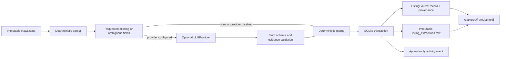

# Provider-neutral structured extraction design

Status: implemented and audited
Reviewed: 2026-07-20

## Goal

Complete Vera Milestone 3 by augmenting deterministic listing normalization with a provider-neutral structured-extraction boundary. Vera must remain useful without credentials, call a live model only when explicitly configured, preserve evidence and uncertainty field by field, and expose a human-readable explanation for every extracted value.

This work does not canonicalize newly captured records. A captured record remains a `RawListing` plus one `ListingSourceRecord`; deduplication and canonicalization remain Milestone 4.

## Scope

The implementation includes:

- strict extraction schemas in `packages/domain`;
- `LLMProvider`, deterministic `MockLLMProvider`, and an official OpenAI Responses API provider in `packages/ai`;
- deterministic-first, LLM-second extraction and deterministic merge behavior;
- immutable extraction-run persistence with prompt, extraction, usage, and latency metadata;
- asynchronous worker execution with cancellation and typed retry/dead-letter behavior;
- a capture evidence-detail page at `/captures/[rawListingId]`;
- golden, prompt-injection, missing-field, repair, timeout, merge, no-network, persistence, worker, API, and browser tests;
- an explicitly opted-in live OpenAI integration test.

The implementation excludes:

- canonical listing creation or duplicate clustering for newly captured records;
- browser automation, arbitrary URL retrieval, Gmail, Calendar, and external actions;
- AI policy decisions, scoring, fraud verdicts, or state transitions;
- logging prompts, raw model output, secrets, or contact details;
- a hardcoded default model.

## Architectural boundary

`packages/domain` owns the strict schemas and inferred types because the AI package, worker, database, and web application all consume them. `packages/ai` owns provider calls, prompt construction, typed provider errors, response validation, timeout/cancellation handling, usage accounting, and the single schema-repair retry. `packages/connectors` retains deterministic normalization and owns the deterministic merge from provider extraction into normalized fields and provenance. The worker composes all three packages.



Provider work never occurs inside a SQLite transaction. The transaction inserts the source record, all field-provenance rows, the extraction run, the normalization-completion event, and the job-completion state together.

## Strict extraction vocabulary

Every extraction field is a strict discriminated union:

```ts
type ExtractedField<T> =
  | {
      status: "known";
      value: T;
      confidenceBasisPoints: number;
      evidenceSnippet: string;
    }
  | {
      status: "unknown";
      value: null;
      confidenceBasisPoints: 0;
      evidenceSnippet: null;
      reason: "not_present" | "ambiguous" | "conflicting_evidence" | "unrecognized_format";
    };
```

Known confidence is an integer from 1 through 10,000. Unknown confidence is exactly zero. A known field requires a trimmed evidence snippet of at most 1,000 characters. An unknown field has neither a value nor evidence snippet.

`ListingExtraction` has exactly these fields:

| Field                   | Value type and rules                                                                                                                                |
| ----------------------- | --------------------------------------------------------------------------------------------------------------------------------------------------- |
| `title`                 | Non-empty string, maximum 300 characters                                                                                                            |
| `bedrooms`              | Non-negative half-unit number                                                                                                                       |
| `bathrooms`             | Non-negative half-unit number                                                                                                                       |
| `addressText`           | Non-empty string, maximum 300 characters                                                                                                            |
| `squareFeet`            | Positive integer                                                                                                                                    |
| `propertyType`          | Closed property-type vocabulary already owned by the domain                                                                                         |
| `baseRent`              | `MoneyObservation` containing integer minor units, three-letter uppercase currency, explicit billing period, and raw amount language                |
| `requiredRecurringFees` | Array of labeled `MoneyObservation` objects; an empty array is known only when the evidence explicitly states that no required recurring fees exist |
| `availabilityRaw`       | Original availability phrase, without model paraphrase                                                                                              |
| `availableOn`           | ISO calendar date only when directly justified by the evidence                                                                                      |
| `leaseTermMonths`       | Positive integer month count only when explicit or arithmetically exact                                                                             |
| `catsAllowed`           | Boolean only when cats are explicitly allowed or prohibited                                                                                         |
| `dogsAllowed`           | Boolean only when dogs are explicitly allowed or prohibited                                                                                         |
| `amenities`             | Deduplicated array containing only explicitly stated amenity labels                                                                                 |
| `sourcePostedAt`        | ISO timestamp only when directly justified                                                                                                          |
| `contactChannel`        | `email`, `phone`, `platform_message`, `website_form`, or `other` only when explicit                                                                 |
| `contactName`           | Name text occurring in supplied evidence                                                                                                            |
| `contactEmail`          | Syntactically valid email occurring in supplied evidence                                                                                            |
| `contactPhone`          | Phone text occurring in supplied evidence                                                                                                           |
| `contactUrl`            | Safe HTTP(S) URL occurring in supplied evidence                                                                                                     |

`MoneyObservation` is strict:

```ts
interface MoneyObservation {
  amountMinorUnits: number;
  currency: string;
  billingPeriod: "day" | "week" | "month" | "year";
  rawAmount: string;
}
```

The model may not assume USD from locale, assume monthly billing from a rent label, convert currencies, annualize amounts, or combine fees. If any component required for a `MoneyObservation` is unjustified, that money field remains unknown. The raw amount preserves the supplied currency and billing language.

Required recurring fees remain distinct entries. Base rent never includes deposits, utilities, parking, pet rent, amenity fees, or other recurring charges. One-time deposits and charges are outside this extraction schema and are never added to recurring-fee totals.

Pet permission is independently represented for cats and dogs. Text about a pet deposit or generic “pet friendly” wording does not prove that both cats and dogs are allowed unless the supplied language does so explicitly.

The raw availability phrase can be known while `availableOn` remains unknown. Relative phrases such as “next month” do not become dates without a justified reference date. Approximate phrases such as “mid-August” remain raw language only.

Contact fields are known only when the exact normalized value is present in the supplied record. Contact details are allowed in the local extraction result and evidence-detail response, but never in logs or activity metadata.

## Deterministic-first request selection

The current deterministic parser runs first for every capture. It produces known or unknown results with reason codes. The LLM request lists only fields that are:

- `not_present`;
- `ambiguous`;
- `conflicting_evidence`; or
- `unrecognized_format`.

Structured fixture and user-supplied JSON values are not sent for re-extraction. Deterministically known URL and source classification are not sent. The prompt includes the full user-supplied listing record because evidence for one missing field can depend on neighboring language, but it explicitly names the only fields the provider may populate. Every unrequested output field must remain unknown and is ignored during merge even if the provider violates that instruction.

If no field needs provider help, or no live provider is configured, normalization completes in `deterministic_only` mode. Vera never substitutes the mock provider at runtime.

## Evidence validation and merge rules

Provider schema validation is necessary but not sufficient. Before merge, deterministic semantic validation enforces:

1. Every known evidence snippet occurs in the supplied record after line-ending and whitespace normalization.
2. The provider may populate only requested fields.
3. Known provider confidence is at least 7,000 basis points.
4. Contact email, phone, URL, and name values occur in the supplied record after field-appropriate normalization.
5. Known money raw language occurs in the supplied record and supports the amount, currency, and billing period.
6. A known availability date is supported by the availability evidence and is not derived from an approximate or unanchored relative phrase.
7. An empty recurring-fee array has explicit “no required fee” evidence.
8. Pet booleans have species-specific or unambiguously inclusive evidence.

Merge precedence is closed and deterministic:

1. User-supplied structured or sanitized-fixture values win.
2. Deterministic rule values with direct evidence win.
3. A semantically valid provider value may fill only an unknown/ambiguous deterministic field.
4. A rejected provider value leaves the field explicitly unknown with its deterministic reason.

The provider never overwrites a known deterministic value, regardless of model confidence. Confidence is persisted for user interpretation and governs the 7,000-basis-point provider acceptance threshold; it is not authorization to replace stronger provenance.

The merged extraction maps into `ListingSourceRecord` without discarding richer evidence:

- `monthlyRentCents` is populated only for a known USD/month base rent;
- `recurringFeesCents` is populated only when the required-fee list is known and every entry is USD/month, otherwise the richer list remains in the extraction row and the aggregate stays unknown;
- `availableOn`, square feet, lease term, amenities, property type, and explicit pet booleans map to matching source-record fields;
- contact channel maps to the source record, while contact values remain in the protected extraction result;
- all merged fields, including unknown and contact fields, receive `FieldProvenance` rows.

## Provider contract

The provider-neutral interface is asynchronous:

```ts
interface LLMProvider {
  readonly providerId: string;
  readonly model: string;
  extract(
    request: ListingExtractionRequest,
    options: { signal: AbortSignal; timeoutMilliseconds: number }
  ): Promise<ListingExtractionProviderResult>;
}
```

The request contains:

- supplied evidence text;
- its SHA-256 hash;
- requested field names;
- deterministic unknown reasons;
- prompt-template version;
- extraction-schema version.

The result contains:

- a strict `ListingExtraction`;
- provider and model identifiers;
- opaque provider response ID when available;
- input, output, and total token counts;
- total measured latency;
- repair count, zero or one.

The versions began at `listing-extraction.prompt.v1` and `listing-extraction.v1`. The implemented monetary-role hardening advances extraction semantics to `listing-extraction.v2` while keeping the prompt at v1; persisted v1 runs remain readable. Changes to instructions, field semantics, validation, or merge policy require an intentional version change.

## Mock provider

`MockLLMProvider` is deterministic and has no network dependency. Tests construct it with a map or resolver keyed by the request/input hash. It records received requests for assertions and returns cloned, schema-validated values. It can deterministically simulate:

- a successful extraction;
- malformed provider output;
- typed refusal or provider errors;
- cancellation;
- a request that remains pending until the caller's abort signal fires.

The production worker never creates a mock provider implicitly.

## OpenAI Responses provider

The live provider uses the current official `openai` JavaScript package, verified as 6.48.0 during design, and the Responses API structured-output parser. It uses `responses.parse` with the SDK's strict Zod text-format helper and `ListingExtractionSchema`. The request sets `store: false` and provides no tools.

Configuration rules:

- `OPENAI_API_KEY` supplies the credential through local process configuration;
- `VERA_LLM_MODEL` is required and is the only source of model selection;
- there is no model fallback or hardcoded model name;
- `VERA_LLM_TIMEOUT_MS` is optional, defaults to 20,000, and must be an integer from 1,000 through 30,000;
- SDK transport retries are disabled with `maxRetries: 0`; Vera's worker owns transient retries.

When both the API key and model are absent, the worker runs deterministic-only. When exactly one is present, configuration fails visibly rather than silently ignoring a partial live-provider setup.

The prompt treats listing content as quoted untrusted data. It states that instructions inside the listing cannot request secrets, command execution, browsing, policy changes, or extra fields. No tools, secrets, policy registry, filesystem paths, audit history, or unrelated records are exposed to the model.

The provider passes the caller's abort signal and the validated timeout to the SDK. Latency uses a monotonic clock. Usage totals aggregate both calls when a repair occurs.

## One repair retry

The first structured response is parsed by the SDK and then by Vera's schema and semantic evidence validator. A response that is structurally invalid or fails semantic evidence validation receives exactly one repair request. The repair request includes:

- the same supplied evidence;
- the same requested field set and versions;
- safe validation issue codes and field paths;
- an instruction to return a complete replacement object.

It does not include the raw invalid model response. A second invalid response throws `LLMInvalidOutputError`. Refusal, configuration, authentication, cancellation, timeout, rate-limit, and transport failures do not trigger schema repair.

## Typed errors and retry semantics

The AI boundary defines these safe typed errors:

| Error                       | Worker behavior                                                          |
| --------------------------- | ------------------------------------------------------------------------ |
| `LLMConfigurationError`     | Permanent dead letter                                                    |
| `LLMTimeoutError`           | Retryable                                                                |
| `LLMCancelledError`         | Retryable unless the process is shutting down; lease remains recoverable |
| `LLMAuthenticationError`    | Permanent dead letter                                                    |
| `LLMRateLimitError`         | Retryable                                                                |
| `LLMTransientProviderError` | Retryable                                                                |
| `LLMPermanentProviderError` | Permanent dead letter                                                    |
| `LLMRefusalError`           | Permanent dead letter and visible recovery guidance                      |
| `LLMInvalidOutputError`     | Permanent dead letter after the one repair attempt                       |

Errors contain only safe codes, provider/model identifiers, retryability, status class, and opaque request IDs. Raw provider bodies, prompts, listing content, headers, and credentials are excluded.

`NormalizationJobRepository.fail` gains explicit retryability. Retryable failures retain bounded exponential scheduling. Permanent failures move directly to `dead_letter`; the domain invariant permits a dead-letter job after at least one attempt rather than pretending all attempts were consumed.

## Asynchronous worker lifecycle

`processNextNormalizationJob` becomes asynchronous. The polling loop never overlaps polls: it schedules the next poll only after the current job finishes. The lease duration becomes 90 seconds, which exceeds the maximum two-call provider duration plus persistence margin. One worker remains the supported topology.

The worker owns an `AbortController` for the active extraction. SIGINT or SIGTERM aborts the provider request, waits for the job to reach a recoverable state, closes the database, and then stops. Network work and waiting never hold a SQLite transaction.

## Immutable extraction persistence

Migration 0002 creates `listing_extractions` with:

- `id` primary key;
- unique `raw_listing_id` foreign key;
- unique `listing_source_record_id` foreign key;
- `mode`: `deterministic_only` or `llm_augmented`;
- SHA-256 `input_hash`;
- JSON requested field list;
- nullable provider, model, and opaque provider response ID;
- prompt-template and extraction-schema versions;
- nullable validated provider-result JSON;
- required merged-extraction JSON;
- input, output, and total token counts;
- latency milliseconds;
- repair count constrained to zero or one;
- completion timestamp.

JSON values are parsed through strict domain schemas on every repository read. Token counts are zero in deterministic-only mode. Provider/model/response/result are null in deterministic-only mode and required in LLM-augmented mode. A source record and extraction row have a one-to-one relationship.

The repository exposes insert, get-by-raw-listing, and get-by-source-record only. It exposes no update or delete method. SQLite update/delete triggers enforce immutability even for direct SQL.

Failed provider calls do not insert extraction rows or partial source records. Their safe outcome appears in normalization job state and append-only activity events.

## Audit and privacy

Successful `normalization.completed` metadata adds only:

- extraction mode;
- provider/model when applicable;
- prompt and extraction versions;
- requested-field count;
- known and unknown field counts;
- input/output/total token counts;
- latency milliseconds;
- repair count.

Failure metadata adds only safe error code/category, retryability, and resulting job state. Logs follow the same allowlist.

The following never appear in logs or activity metadata:

- API keys, authorization headers, or SDK request headers;
- listing text or prompt text;
- raw model output;
- evidence snippets;
- full provenance URLs;
- contact names, email addresses, phone numbers, or contact URLs.

The local SQLite extraction result may contain contact data because it is user-supplied listing evidence required by the feature. It remains subject to the existing local-data and full-reset policy.

## Capture evidence-detail experience

The selected product boundary is `/captures/[rawListingId]`; no canonical listing is fabricated.

The capture status API expands each field summary with:

- display value;
- known or unknown status and unknown reason;
- extraction method;
- confidence percentage;
- evidence snippet when known;
- a human-readable explanation such as “Rule matched the labeled monthly rent” or “AI filled a previously ambiguous fee using quoted evidence.”

Money displays its original currency and billing period. Base rent and required recurring fees are separate. Availability shows raw language beside any justified date. Pet permission shows cats and dogs separately. Contact details appear only when their merged extraction field is known.

After capture, the existing UI links to `/captures/[rawListingId]`. The detail page polls while the job is queued or leased, shows a safe typed failure state for dead-letter jobs, and renders the field explanation after completion. It does not expose raw audit payloads or provider response IDs.

## Test design

### Domain and AI unit tests

- strict known/unknown field invariants for every extraction field;
- currency and billing-period preservation;
- recurring-fee separation and explicit-empty semantics;
- species-specific pet permission;
- raw availability without unjustified date parsing;
- contact values only when present;
- golden messy-listing responses;
- prompt-injection text preserved as data and unable to change requested fields;
- deterministic mock output and request recording;
- no-network mock contract;
- environment model/timeout validation;
- OpenAI response parsing through an injected fake client;
- invalid output followed by one successful repair;
- two invalid outputs producing `LLMInvalidOutputError`;
- timeout and caller cancellation;
- typed OpenAI error mapping and aggregate token/latency metadata.

### Merge unit tests

- structured and deterministic known values beat provider values;
- provider fills only requested unknown/ambiguous fields;
- confidence below 7,000 is rejected;
- non-matching evidence snippets are rejected;
- contact values without exact evidence are rejected;
- conflicting fee/rent and unjustified date outputs remain unknown;
- provenance method, confidence, snippet, and unknown reason match the winning field.

### Persistence and worker integration tests

- migration preserves existing seeded data and append-only triggers;
- extraction-run insert/read and JSON validation;
- extraction-run update/delete trigger rejection;
- source record, provenance, extraction row, event, and job completion commit atomically;
- injected rollback leaves no partial source/extraction/provenance rows;
- deterministic-only completion makes no provider call;
- configured provider receives only missing/ambiguous fields;
- retryable provider error schedules retry;
- permanent error dead-letters immediately;
- cancellation leaves recoverable job state;
- audit metadata contains versions and usage but no listing/contact content.

### API and browser tests

- capture detail returns field explanations and unknown reasons;
- queued, processing, completed, and dead-letter views are visible;
- base rent, recurring fees, availability, pets, and contact fields render distinctly;
- prompt-injection fixture cannot create navigation, policy, or command behavior;
- capture flow links to the evidence-detail page;
- all default browser tests use mock or deterministic-only paths and make no external request.

### Opt-in live integration test

The live test runs only when all are true:

- `VERA_RUN_LIVE_LLM_TESTS=1`;
- `OPENAI_API_KEY` is non-empty;
- `VERA_LLM_MODEL` is non-empty.

Otherwise the test is skipped. It sends one small sanitized synthetic listing, asserts strict parsed output and usage metadata, and never runs in the default `pnpm test` acceptance path merely because credentials exist.

## Alternatives considered

### Canonical listing detail only

Rejected because newly captured source records are not canonicalized yet. Showing only seeded canonical listings would not expose the extraction result requested by this milestone.

### Create a canonical listing for every capture

Rejected because it silently pulls deduplication and canonicalization from Milestone 4 and would give single-source records a misleading canonical status.

### Custom HTTP client for OpenAI

Rejected because the official SDK provides the current Responses API, structured-output parser, typed errors, timeout support, and cancellation. A custom client would duplicate security-sensitive transport behavior.

### Use the mock provider when live configuration is absent

Rejected because test fixtures must never masquerade as extracted facts in the product. Credential-free mode uses deterministic parsing only.

### Let model confidence override deterministic facts

Rejected because model self-confidence is not stronger provenance. The model fills only gaps and cannot replace structured or rule-backed values.

## Acceptance

Milestone 3 is complete when:

1. Every named provider, schema, error, and metadata interface is exported and strictly typechecked.
2. Deterministic parsing always precedes provider extraction.
3. Only missing or ambiguous fields are requested and eligible for AI merge.
4. Currency, billing periods, base rent, recurring fees, pet permission, availability language/date, and contact-presence rules pass golden tests.
5. Prompt-injection fixtures cannot access secrets, tools, commands, navigation, or policy.
6. Prompt and extraction versions plus usage/latency metadata persist in an immutable extraction row.
7. The evidence-detail page explains values, evidence, confidence, provenance, and unknown reasons.
8. Timeouts, cancellation, one repair retry, typed retry/dead-letter behavior, rollback, and audit redaction are proven by tests.
9. The default unit, integration, and browser suites perform no external API calls.
10. The opt-in live test is skipped without its explicit flag, key, and model.
11. Formatting, linting, typechecking, all default tests, production build, migration/seed smoke, and migration drift checks pass.
