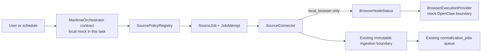
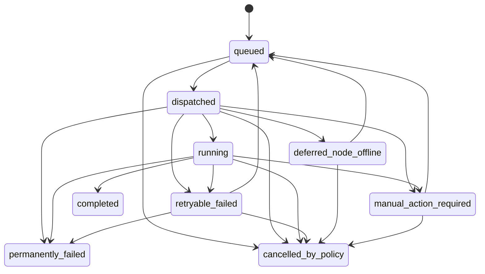

# Maritime and OpenClaw Contract Alignment Design

Status: Approved design  
Date: 2026-07-18

## Purpose

Align Vera's implemented TypeScript contracts and SQLite model with the approved architecture in
which Maritime is the primary orchestration environment and OpenClaw is the default replaceable
local browser execution adapter. This change defines contracts, validation, state transitions,
mocks, and persistence only. It does not connect to Maritime, launch OpenClaw, automate a
marketplace, add credentials, or turn sanitized fixtures into production connectors.

The existing deterministic fixture demo and user-capture path remain operational and no-network.
The existing normalization queue remains responsible only for turning an accepted immutable raw
listing into a normalized source record and extraction run.

## Resolved terminology

The production acquisition portfolio has exactly four modes:

- `official_api`;
- `email_alert`;
- `local_browser`;
- `user_capture`.

The code-level `AcquisitionMode` union also includes `fixture`. `fixture` is a test-only acquisition
mode for local sanitized data. It is intentionally not shaped or reported as `official_api`, because
doing so would allow demo fixtures to masquerade as a production connector.

Every source policy manifest has one independent policy state:

- `approved`;
- `user_triggered_only`;
- `experimental_personal`;
- `disabled`.

Policy state is a permission ceiling. `execution: manual | scheduled` remains a separate field.
Neither field grants execution by itself; manifest validation, runtime enablement, capability,
operation, kill switches, network scope, session state, and approval checks all still apply.

## Architecture

The alignment is additive. It does not replace the working local extraction queue.



`SourceJob` represents acquisition orchestration. `NormalizationJob` remains a local data-processing
job. A source job may eventually produce one or more strict connector result envelopes that are
accepted through the existing ingestion boundary; it does not directly create canonical listings,
scores, notifications, approvals, or external effects.

Maritime and browser interfaces live in `packages/connectors` for this milestone. That package
already owns external integration boundaries and depends only on domain and policy packages. A new
workspace package would add package and build complexity without improving the contract-only slice.

## Domain contracts

### Acquisition and policy

`packages/domain/src/source-policy.ts` owns:

```ts
type AcquisitionMode =
  | "official_api"
  | "email_alert"
  | "local_browser"
  | "user_capture"
  | "fixture";

type SourcePolicyState =
  | "approved"
  | "user_triggered_only"
  | "experimental_personal"
  | "disabled";
```

`SourcePolicyManifest` gains required `acquisitionMode` and `policyState` fields. The manifest schema
version advances from 1 to 2 because required fields and evaluation semantics change.

`SourcePolicyRequest` includes the requested acquisition mode. The registry denies when the request
mode differs from the selected manifest. It also denies:

- every request under `disabled`;
- scheduled execution under `user_triggered_only`;
- an `experimental_personal` manifest while runtime-disabled;
- all existing malformed, missing, killed, unsupported, or out-of-scope cases.

Capability remains a closed namespaced operation boundary and is not inferred from policy state.

### Source connector

The common connector surface contains:

- stable `connectorId`;
- human-readable `displayName`;
- source label;
- acquisition mode;
- source-policy requirement containing connector, capability, and operation identity;
- supported operation declarations;
- health reporting;
- current cursor or last-seen state when applicable;
- optional `discover`, `capture`, and `fetchDetail` implementations.

Fixture and manual connectors support capture only. They expose no discover or fetch-detail method.
Callers invoke operations through a checked dispatcher. A missing operation returns a strict typed
`unsupported_operation` result and never falls back to another operation or mode.

Every successful connector operation returns a strict idempotent envelope containing:

- connector, source, acquisition mode, and operation;
- correlation ID;
- payload hash and stable idempotency key;
- schema-validated but still untrusted result records;
- previous cursor and optional cursor candidate;
- completion time and safe counts.

A cursor candidate is not a committed cursor. Future ingestion code may commit it only after every
corresponding raw record has been accepted durably and idempotently.

The existing fixture/manual `capture` implementation remains compatible with the current capture
service. A thin checked execution wrapper supplies the new result envelope without forcing a rewrite
of the working demo ingestion boundary.

### Source job lifecycle

The source job states are exactly:

```text
queued
dispatched
running
completed
retryable_failed
permanently_failed
deferred_node_offline
manual_action_required
cancelled_by_policy
```

Domain transition functions own legal state changes. Repositories and mocks do not mutate the state
arbitrarily. The minimum transition graph is:



`completed`, `permanently_failed`, and `cancelled_by_policy` are terminal. Retry reuses the same job
identity and idempotency key.

`SourceJob` contains only opaque identifiers and minimum control data: job/correlation IDs,
connector/source/mode, manifest version, trigger, operation, strict discriminated payload, payload
hash, idempotency key, current state, attempt limits, timestamps, and optional safe terminal/deferred
metadata.

Source-job payloads are strict discriminated schemas:

- fixture payload: sanitized fixture-set reference only;
- user-capture payload: opaque protected capture reference only, never pasted evidence;
- official API/email payload: reviewed source configuration reference and optional cursor;
- local-browser payload: node ID, saved-search ID, exact HTTP(S) URL without URL credentials,
  committed cursor, and bounded page/record/byte/duration/concurrency limits.

There is no arbitrary metadata bag in a job payload. Unknown keys such as password, cookie,
authorization header, session export, profile path, or raw browser storage fail strict validation.

`JobAttempt` records attempt number, start/completion times, outcome state, safe typed error or
deferred reason, correlation ID, and payload hash. It stores no raw connector result or secret.

`SourceJobResult` carries one strict connector result envelope or a typed non-success result. An
idempotent replay of the same job/result identity resolves to the original result rather than
creating a second result or advancing a cursor twice.

### Node and manual-action state

`BrowserNodeStatus` contains an opaque node ID, provider ID, status, last heartbeat, heartbeat expiry,
supported contract version, and safe capability flags. Node status is one of online, offline, stale,
or revoked. A pure helper derives stale state from the heartbeat expiry and an injected clock.

`ManualActionRequired` uses a closed blocker vocabulary:

- login;
- reauthentication;
- two-factor authentication;
- CAPTCHA;
- consent;
- camera permission;
- microphone permission.

It contains only the job, node, source, blocker, safe user instruction, correlation ID, and time.
It cannot contain form values, credentials, cookies, or page content.

`DeferredJobReason` distinguishes an unregistered node, an offline node, a stale heartbeat, and a
revoked node. These reasons are never represented as successful empty search results.

## Browser execution boundary

`BrowserExecutionProvider` is provider-neutral. OpenClaw will implement it later. This task supplies
only a deterministic mock with no browser or network dependency.

The interface supports:

- heartbeat/health;
- allowlisted navigation;
- bounded capture;
- structured results marked as untrusted input;
- typed manual blockers;
- cancellation;
- correlation IDs on every request and result.

Navigation requests include one target URL and an explicit set of allowed URLs. The target must
exactly match one entry. URL syntax forbids credentials, fragments, localhost, private/IP-literal
hosts, non-HTTP(S) schemes, and explicit ports. Arbitrary JavaScript, generic click actions,
credential login, CAPTCHA handling, messaging, applying, uploading, and payment are absent from the
interface.

The mock accepts an injected scripted outcome. It can return captured untrusted evidence, a manual
blocker, cancellation, or a typed failure. It does not infer success from missing data.

## Maritime orchestration boundary

`MaritimeOrchestrator` is an application-owned control-plane interface. A later Maritime SDK or HTTP
adapter must remain behind it. The interface supports:

- scheduling a connector job;
- dispatching a job;
- querying status;
- retrying a safe transient failure;
- cancelling by policy;
- receiving browser-node heartbeats.

`LocalMockMaritimeOrchestrator` stores contract state in memory for deterministic tests. It uses an
injected source-policy registry and browser provider. It does not claim to emulate Maritime
durability, authentication, encryption, or deployment.

Dispatch evaluates policy before connector or browser execution. A policy denial produces
`cancelled_by_policy`. A local-browser job then checks its assigned node:

- missing, offline, stale, or revoked produces `deferred_node_offline` plus a typed deferred reason;
- no connector call occurs;
- no RawListing or success result exists;
- the committed cursor remains unchanged;
- retry may return the same job to `queued` only after policy still allows it.

A browser manual blocker produces `manual_action_required`. It is not retryable automatically and
does not advance the cursor. Transient provider failure produces `retryable_failed`; only that state
and offline/manual states can be explicitly requeued under the domain transition map.

## Persistence and migration

Migration `0003` upgrades existing databases rather than resetting them.

It performs these changes:

1. Rebuild `source_policy_manifests` with schema version 2 and required `acquisition_mode` and
   `policy_state` columns.
2. Backfill `fixture.feed.v1` as `fixture` / `approved`.
3. Backfill `manual.capture.v1` as `user_capture` / `user_triggered_only`.
4. Backfill legacy label-only fixture manifests as `fixture` / `disabled`.
5. Rebuild or extend `raw_listings` with required `acquisition_mode`, mapping `fixture` capture rows
   to `fixture` and manual rows to `user_capture`, while recreating append-only triggers and indexes.
6. Add `source_jobs` for orchestration state and minimum payload/control metadata.
7. Add append-only `source_job_attempts` for attempt history.
8. Add `browser_nodes` for latest safe heartbeat/health state.

Existing raw listings, source records, canonical listings, fixture records, extractions, scores,
risks, activity events, and normalization jobs are copied unchanged. Foreign-key checks run after
the migration. Seed remains idempotent and validates the backfilled manifest and acquisition-mode
values.

Repository interfaces provide enqueue/get/list/transition for source jobs, append/list for attempts,
and upsert/get/list for safe browser-node heartbeat state. Source job transitions call the domain
transition function inside a transaction. Attempt rows reject update and delete through SQLite
triggers.

## Compatibility

The deterministic demo remains fixture-only and no-network. Fixture records now say
`acquisitionMode: fixture`; they never say `official_api`. Demo counts, IDs, hashes, canonical
listings, source labels, score/risk fixtures, and the public banner remain unchanged.

Manual capture remains synchronous at its current API boundary, uses `user_capture`, and never
fetches its provenance URL. The normalization worker and `normalization_jobs` repository are
unchanged except for consuming the additional raw-listing acquisition-mode field.

Existing connectors gain metadata and optional-operation declarations. They do not gain discovery,
detail fetching, browser, email, or external-effect behavior. No live source manifest is enabled.

The migration is forward-only. Existing application data is preserved; downgrading code after the
manifest schema version becomes 2 is unsupported.

## Documentation

Update:

- `docs/ARCHITECTURE.md` with implemented contract boundaries and the distinction between source and
  normalization jobs;
- `docs/DATA_MODEL.md` with new entities, states, migration, and acquisition-mode provenance;
- `docs/SOURCE_POLICY.md` so the four production modes plus test-only `fixture` are unambiguous;
- `docs/SECURITY.md` with strict payload and mock-boundary controls;
- a new ADR that supersedes the outdated cloud/browser portions of ADR 0001 and ADR 0004 without
  rewriting historical decisions.

The docs must continue to say that real Maritime transport and OpenClaw execution are not
implemented.

## Testing

Required unit and contract coverage:

- fixture and manual connectors reject unsupported discover/fetch-detail operations;
- disabled policy cancels a job before dispatch;
- an absent or offline node produces `deferred_node_offline`;
- a stale heartbeat produces the same visible state with the distinct stale reason;
- login, 2FA, CAPTCHA, consent, camera, and microphone outcomes produce
  `manual_action_required`;
- repeated execution returns an idempotent job/result envelope;
- job and browser payloads reject unknown or malformed fields;
- serialized job payloads contain no credentials, cookies, authorization headers, session exports,
  browser storage, profile paths, password-manager values, or pasted evidence;
- browser navigation outside the exact allowlist rejects;
- illegal source-job transitions reject;
- acquisition-mode/policy-state mismatches deny;
- repository migration preserves existing fixture/source/canonical rows;
- source-job transitions and attempts persist transactionally;
- attempt rows are append-only;
- seed remains idempotent after migration.

The full acceptance gate is:

```bash
pnpm format:check
pnpm lint
pnpm typecheck
pnpm test:unit
pnpm test:integration
pnpm test:e2e
pnpm build
```

All tests use sanitized local data and mocks. No test requires a Maritime account, OpenClaw,
marketplace session, live browser source, OAuth credential, landlord account, or external side
effect.

## Non-goals

- Maritime SDK, API, deployment, schedules, authentication, or transport implementation.
- OpenClaw installation, profile creation, browser launch, or page automation.
- Site-specific Zillow, Facebook Marketplace, Craigslist, or Apartments.com automation.
- Email-alert ingestion or official API integration.
- Cursor commit after real ingestion; this task defines the candidate/committed distinction only.
- UI for job or node health.
- Gmail, Calendar, messaging, application, upload, payment, CAPTCHA, credential-login, or autonomous
  action behavior.

## Acceptance criteria

The design is complete when:

1. the five code-level acquisition modes and four policy states are strict domain types;
2. fixtures use only `fixture`, not `official_api`;
3. connector operations are optional and unsupported calls fail closed;
4. the required source-job, attempt, node, manual-action, and deferred schemas exist;
5. browser and Maritime interfaces have deterministic no-network mocks;
6. disabled policy, offline/stale node, manual blocker, cancellation, retry, and idempotent replay
   outcomes are distinct;
7. strict payloads contain only minimum control data and reject credential/session fields;
8. migration 0003 preserves existing data and backfills acquisition/policy state correctly;
9. existing fixture/manual demo behavior and normalization processing remain compatible;
10. architecture, data-model, policy, security, and ADR documentation accurately distinguish
    implemented mocks from future live adapters;
11. lint, typecheck, unit, integration, E2E, and build all pass without external side effects.
