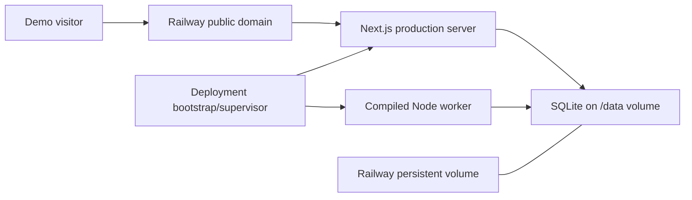

# Railway Offline Demo Deployment Design

**Status:** Approved for implementation on 2026-07-18  
**Date:** 2026-07-18

## Goal

Publish Vera's existing Ship Season demo at a stable public URL without changing its product boundary or safety posture. The deployment must present only sanitized fixture data, make no live marketplace or personal-service connections, persist its local SQLite database across restarts, and fail closed if required storage or demo configuration is unavailable.

## Platform Decision

Use Railway for this demo deployment.

Railway is the better fit than Vercel for the current architecture because Vera is a stateful Node application with a long-running worker and a SQLite database. Railway supports a persistent volume mounted into a service at runtime, configurable start commands, HTTP health checks, and public service domains. Vercel's serverless execution and ephemeral filesystem would require an architecture change or a hosted database, neither of which is justified for this deadline-limited demo.

Relevant Railway behavior is documented in [Volumes](https://docs.railway.com/volumes), [Start Command](https://docs.railway.com/deployments/start-command), [Healthchecks](https://docs.railway.com/deployments/healthchecks), and [Public Networking](https://docs.railway.com/public-networking).

## Scope

The deployment will:

- build the existing pnpm workspace;
- run the production Next.js server and compiled Node worker in one Railway service;
- mount one persistent Railway volume at `/data`;
- migrate and idempotently seed the demo database after the volume is mounted;
- expose the web service through a Railway-provided public domain;
- use `/api/health` as the deployment health check;
- keep the existing fixture-only demo banner visible;
- run exactly one service replica.

The deployment will not:

- add live marketplace scraping or browser automation;
- enable Gmail, Calendar, AI, or any other live integration;
- accept or store credentials;
- include real personal data;
- replace SQLite or split the application into multiple deployed services;
- broaden the MVP or add demo-only product behavior.

## Runtime Topology

One Railway service owns the web process, worker process, and SQLite database file.

This single-service topology is intentional. A Railway volume is mounted to one service, and SQLite depends on a single local filesystem with coordinated writers. Horizontal scaling is disabled; the service must remain at one replica.

## Build and Startup Lifecycle

Railway will use Railpack and the repository root as the workspace root. Configuration-as-code will define:

- build command: `pnpm build`;
- start command: `pnpm deploy:railway`;
- health-check path: `/api/health`;
- health-check timeout: 300 seconds;
- restart policy: retry on failure with a bounded retry count.

Railway volumes are available during runtime, not during image build or pre-deploy execution. Database migration and seeding must therefore occur in the runtime start path, after `/data` is mounted, rather than in a pre-deploy command. See Railway's [Volumes](https://docs.railway.com/volumes) and [Config as Code reference](https://docs.railway.com/config-as-code/reference).

The runtime bootstrap will:

1. require `RAILWAY_VOLUME_MOUNT_PATH` to be present and absolute;
2. require the mount path to equal the configured `/data` deployment path;
3. set `VERA_DATA_DIR` from that path and force `VERA_DEMO_MODE=1`;
4. remove live LLM configuration from the child-process environment;
5. run the existing database migration workflow;
6. run the existing deterministic, idempotent demo seed;
7. start the compiled worker and the production Next.js server on `0.0.0.0` using Railway's injected `PORT`;
8. forward `SIGINT` and `SIGTERM` to both children;
9. terminate the service if either child exits unexpectedly.

The service must not report healthy until startup migration and seed have succeeded and the web application can answer `/api/health`.

## Persistent Storage

The Railway volume will be mounted at `/data`, and the SQLite database will live beneath that directory. Existing database initialization continues to enable foreign keys and WAL mode.

Startup migration and seed operations are repeatable. The fixture seed must remain idempotent so a restart or redeploy does not duplicate listings, events, provenance, scores, risks, or duplicate-cluster membership.

If the volume is missing, mounted at an unexpected path, or unwritable, startup fails before either application process starts. The deployment must never silently fall back to an ephemeral database.

## Configuration

The Railway service will contain only non-secret demo configuration:

- `VERA_DEMO_MODE=1`;
- `NEXT_TELEMETRY_DISABLED=1`;
- Railway-provided `PORT` and `RAILWAY_VOLUME_MOUNT_PATH`.

`VERA_DATA_DIR` is derived by the runtime bootstrap instead of being manually duplicated in the Railway dashboard. `OPENAI_API_KEY`, `VERA_LLM_MODEL`, `VERA_LLM_TIMEOUT_MS`, marketplace credentials, email credentials, and calendar credentials must be absent.

The bootstrap removes live LLM variables before launching child processes even if they are accidentally present. Demo mode remains the authoritative fail-closed guard.

## Public Networking and Health

The service will receive a Railway-provided public domain. Railway injects the service `PORT`; the web server must bind to `0.0.0.0` on that value. Railway's health check will call `/api/health` and only mark the deployment active after a successful response. See [Public Networking](https://docs.railway.com/public-networking) and [Healthchecks](https://docs.railway.com/deployments/healthchecks).

The health endpoint must reveal no secrets, filesystem paths, fixture contents, or personal data.

## Safety Invariants

The deployment preserves these invariants:

1. **Fixture-only data:** every displayed listing is sanitized seeded data, and the exact demo-mode disclosure remains visible.
2. **No live source access:** source labels are provenance labels for fixtures, not permission to fetch marketplace pages; no platform scraping is added.
3. **No credentials:** the service starts and operates without marketplace, Gmail, Calendar, browser-profile, or AI credentials.
4. **Fail-closed capabilities:** missing or invalid demo/storage configuration stops startup rather than enabling a live or ephemeral fallback.
5. **Auditable, deterministic behavior:** migrations and seed imports remain transactional and idempotent; existing provenance, lifecycle, and append-only audit constraints remain intact.

## Failure and Rollback Behavior

- Build failure leaves the previous healthy Railway deployment active.
- Migration or seed failure prevents the new deployment from becoming healthy.
- Web or worker process failure terminates the service so Railway can restart it under the configured policy.
- Database data persists on the mounted volume across service restarts and redeploys.
- Rollback selects the previous application deployment while retaining the same compatible volume. Destructive or backward-incompatible migrations are out of scope for this demo.

## Verification

Before deployment:

- run lint, formatting check, typecheck, unit tests, integration tests, E2E tests, and build;
- test the bootstrap against a temporary directory;
- test rejection of a missing, relative, or unexpected volume path;
- test signal forwarding and child-process failure behavior;
- confirm no live integration variables are required.

After deployment:

- confirm `/api/health` returns HTTP 200;
- load the public dashboard and confirm the exact demo-mode banner;
- confirm the expected 8 canonical listings backed by 12 source records;
- exercise the golden path: search, inspect provenance and risk evidence, shortlist, and view activity;
- restart the Railway service and confirm the data is not duplicated;
- inspect logs for migration, seed, web, and worker startup without secret or fixture-payload leakage.

## Acceptance Criteria

The deployment is accepted when:

- a public Railway URL consistently serves the existing Vera demo;
- `/api/health` passes Railway's deployment health check;
- the fixture disclosure is visible and all live capabilities remain disabled;
- the persistent database survives a service restart without duplication;
- both the web server and worker run under one supervised service;
- the repository's full acceptance gate passes after deployment support is added.

## Known Limitation and External Blocker

This design intentionally supports one replica only. It is suitable for a short-lived demo, not a multi-tenant or high-availability production system.

Implementation can proceed locally after this document is approved. Creating the public deployment additionally requires access to a Railway account and project with permission to create a service, attach a volume, and generate a public domain. Railway CLI authentication can be completed interactively or with an account/project token as described in [Railway CLI login](https://docs.railway.com/cli/login); credentials must not be committed to the repository.
