# Production decision engines design

Status: approved design awaiting implementation
Reviewed: 2026-07-20

## Goal

Complete Vera Milestone 4 with production-grade deterministic normalization, duplicate detection, canonical reconciliation, preference ranking, and evidence-backed risk indicators. The same code path must evaluate sanitized fixtures and every newly normalized user capture. Fixture declarations may provide labels for regression tests, but they may not provide the product's computed clusters, scores, or risk outcomes.

This milestone preserves Vera's single-user SQLite topology and renter-controlled safety boundary. It adds no source scraping, browser automation, network geocoding, messaging, notification, Gmail, Calendar, payment, or LLM decision behavior.

## Current state and replacement boundary

The repository already has domain and SQLite shapes for photos, duplicate clusters, canonical listings, canonical source membership, canonical field selection, scores, and risk signals. The dashboard renders seeded versions of those records. `packages/scoring` currently contains only four equally weighted demo factors and three partial risk rules. The fixture seed declares three duplicate clusters, eight canonical listings, eight score snapshots, and three risk signals by hand. The normalization worker stops after writing one source record, its provenance, and its extraction run.

Milestone 4 replaces those fixture-declared decisions with versioned engines. Existing source, raw, extraction, provenance, lifecycle, and activity data remain valid. The migration is forward-only and must not reset an existing database.

## Scope

The implementation includes:

- deterministic US-focused address, phone, URL, money, date, and photo normalization;
- photo-ingestion metadata and 64-bit perceptual difference hashes from supplied image bytes;
- exact duplicate indicators, probabilistic pair features, configurable scoring, and deterministic clustering;
- persisted merge and split overrides plus strict local APIs;
- stable canonical identities and field-level stitching with complete provenance;
- deterministic hard constraints, weighted preferences, separate penalties, versioned score snapshots, and plain-language explanations;
- the eight required evidence-backed risk-rule families;
- a durable decision queue and transactional worker reconciliation after every successful normalization;
- computed fixture seeding, a labeled evaluation corpus, and a metrics CLI;
- dashboard and listing-detail projections for decision status, eligibility, score reasons, penalties, duplicate evidence, and risk evidence;
- unit, integration, API, worker, migration, CLI, and Playwright coverage.

The implementation excludes:

- network image downloading; callers supply downloaded bytes and policy/provenance metadata;
- network geocoding or routing; coordinates and commute durations are used only when supplied by a reviewed connector;
- LLM-generated scores, duplicate decisions, explanations, or risk signals;
- categorical fraud or scam verdicts;
- autonomous notification or any external side effect;
- multi-user conflict resolution or a distributed job queue;
- merge/split override UI controls. The persisted API and read projections ship now.

## Architectural boundary

`packages/domain` owns strict versioned decision schemas. `packages/scoring` owns pure deterministic normalization, pair features, clustering, canonical selection, ranking, risk rules, explanation rendering, fixture evaluation, and configuration validation. It has no database, network, browser, or LLM access.

`packages/db` owns migrations, row validation, durable decision jobs, immutable evaluation history, append-only overrides, and one transactional `applyDecisionPlan` repository operation. `apps/worker` snapshots the corpus, invokes `packages/scoring` outside a transaction, and applies the returned plan only if the corpus revision has not changed. `apps/web` validates override requests, exposes safe job status, and renders the resulting projections.

```mermaid
flowchart LR
    Raw["Immutable raw and extraction evidence"]
    Source["Normalized source record and provenance"]
    Job["Durable decision job"]
    Snapshot["Immutable corpus snapshot"]
    Normalize["Decision normalization"]
    Pair["Pair indicators and features"]
    Overrides["Active merge and split overrides"]
    Cluster["Deterministic clustering and stitching"]
    Rank["Hard constraints, ranking, and penalties"]
    Risk["Evidence-backed risk rules"]
    Apply["Revision-checked SQLite transaction"]
    UI["Dashboard and evidence views"]

    Raw --> Source --> Job --> Snapshot --> Normalize --> Pair --> Overrides --> Cluster
    Cluster --> Rank
    Cluster --> Risk
    Rank --> Apply
    Risk --> Apply
    Apply --> UI
```

Provider or connector work never occurs in the decision transaction. The worker remains single-process for the SQLite MVP, but stale-snapshot protection prevents an API write or new source import from applying an obsolete plan.

## Version vocabulary

The initial production versions are constants:

- `decision-normalization.v1`;
- `listing-photo.dhash64.v1`;
- `listing-dedupe.v1`;
- `canonical-stitch.v1`;
- `listing-score.v2`;
- `listing-risk.v2`;
- `decision-plan.v1`.

Configuration objects carry their own schema version and are included in input hashes. Any material change to normalization, feature formulas, thresholds, weights, conflict gates, source selection, score semantics, explanation templates, or risk rules requires an intentional version change.

## Decision input

The worker builds a protected `DecisionSourceInput` for each source record from:

- `ListingSourceRecord`;
- its immutable `RawListing` acquisition mode and source capture time;
- complete `FieldProvenance` rows;
- its `ListingExtractionRun`, including contact values when they occurred in supplied evidence;
- all `ListingPhoto` rows and supplied fixture-image bytes when hashing is still required;
- optional connector-supplied latitude and longitude;
- current canonical membership and lifecycle state.

Raw contact values are used only in process memory. `NormalizedDecisionSource` exposes normalized contact values to the pair evaluator inside `packages/scoring`, but persisted pair results contain only boolean indicators and reason codes. No phone, email, contact URL, or reversible contact fingerprint enters a pair row, score snapshot, metric, log, or activity payload.

All arrays and pair keys use stable lexicographic ordering. All clocks and ID factories are injected. Every hash uses canonical JSON with recursively sorted object keys and preserved array order.

## Normalization

Normalization is lossless: original source and extraction values remain untouched. Normalized values are versioned decision features.

### US address normalization

`normalizeUsAddress` accepts the structured address plus an optional raw address phrase. It:

- applies Unicode NFKC, trims, case-folds, and collapses whitespace;
- normalizes punctuation without removing house-number suffixes;
- expands a closed mapping for directional and street-suffix abbreviations;
- normalizes two-letter US region codes and ZIP or ZIP+4 spelling;
- extracts a trailing `apartment`, `apt`, `unit`, `suite`, or `#` identifier into a distinct unit only when the boundary is explicit;
- normalizes equivalent unit prefixes but preserves the unit identifier;
- never invents a city, region, postal code, country, street number, or unit;
- retains ambiguous content in normalized line text and emits an ambiguity reason.

The match key distinguishes missing unit from a known unit. Two records with the same street and different known units have a material conflict. A record with unknown unit may still match one known-unit record probabilistically but cannot exact-link two different known units.

### Phone normalization

`normalizeUsPhone` removes visual punctuation and separates a recognized extension. It emits E.164 only for exactly ten digits or eleven digits beginning with `1`. Seven-digit local numbers, other country codes, too many digits, ambiguous extensions, and malformed strings return explicit unknown or invalid results. Phone normalization never infers an area code.

### URL canonicalization

`canonicalizeListingUrl` reuses Vera's safe public HTTP(S) boundary and then:

- lowercases scheme and host;
- rejects credentials, fragments, explicit non-default ports, IP literals, and local/private hostnames;
- removes default ports and fragments;
- collapses repeated path slashes and removes a non-root trailing slash;
- removes a closed set of tracking keys such as `utm_*`, `fbclid`, `gclid`, and `mc_*`;
- retains source identity parameters and all unrecognized query keys;
- sorts retained query pairs by key and value;
- never resolves redirects or performs DNS/network access.

### Money and recurring fees

Decision money retains integer minor units, explicit currency, and billing period. The canonical monthly total is known only when base rent is known and every required recurring fee is known in the same currency with a monthly billing period. Unknown recurring fees produce `partial`, not a zero-fee assumption. Day, week, and year observations remain preserved but are not converted into monthly values in this version.

### Date normalization

Date-only values are validated from numeric UTC calendar components and serialized as `YYYY-MM-DD`. Timestamp comparison uses valid ISO instants. No date-only value passes through local-time parsing. Relative or approximate text remains raw extraction evidence and never becomes a decision date.

### Photo metadata and perceptual hashing

Photo hashing accepts supplied bytes plus a strict metadata envelope; it does not fetch a URL. A replaceable `PhotoDecoder` returns bounded width, height, media type, and grayscale pixels. The first adapter uses a pinned current stable `sharp` package after registry verification.

The difference-hash implementation resizes to 9×8 grayscale pixels without enlargement-dependent randomness, compares each horizontal neighbor, and emits a lowercase 16-hex-character 64-bit hash. Byte SHA-256 and perceptual hash remain separate. Maximum byte size, pixel count, width, and height are enforced before persistence. Decode failure, unsupported media, and unsafe dimensions are typed permanent failures.

Sanitized deterministic image assets live under `packages/testing/fixtures/photos`. Fixture metadata identifies them through a closed asset registry rather than an arbitrary filesystem path. Product code receives bytes from that registry or a future reviewed downloader; this milestone adds no download capability.

## Duplicate candidate generation

Candidate generation uses indexed or precomputed blocking keys:

- normalized source and source listing ID;
- canonical URL;
- normalized address, unit, postal code, and street tokens;
- exact photo byte/perceptual hash;
- normalized contact match in protected memory;
- compatible city, bedroom bucket, and posting-time window for fuzzy candidates.

Routine imports evaluate the affected neighborhood, not every historical pair. Records without useful blocking keys enter a deterministic chunked fallback scan. Configuration limits chunk size and total candidates. Reaching the safety limit produces a visible retryable or permanent typed outcome according to whether more chunks remain; it never marks the job successful with omitted candidates.

Every pair key sorts the two source IDs. The input hash binds both normalized inputs, extraction/provenance versions, photo hashes, and dedupe configuration.

## Exact duplicate indicators and conflict gates

The evaluator emits exact indicators for:

- same normalized source ID within the same source;
- same canonical URL;
- exact normalized street address and unit;
- exact normalized contact email or E.164 phone;
- exact photo byte hash;
- exact perceptual photo hash.

Exact indicators are evidence, not unconditional permission to merge. These gates apply before clustering:

- a shared manager/contact value alone cannot merge otherwise different properties;
- a photo match with incompatible known addresses does not merge and instead feeds the reused-photo risk rule;
- conflicting known units prevent an automatic edge;
- same source ID or canonical URL combined with material property conflicts yields a visible review decision rather than silent merge;
- an active split override always blocks an automatic edge.

Same source ID, canonical URL, or exact address and unit creates a deterministic duplicate decision when no gate rejects it. Contact and photo matches create a deterministic duplicate decision only with one additional compatible property-specific feature. Every decision stores reason codes.

## Probabilistic pair features

Each feature returns `known` with a score from 0 through 10,000 basis points or `unknown` with a reason. Missing features are excluded and weights renormalize.

Initial formulas are:

- address similarity: weighted exact component agreement plus normalized token-trigram Dice similarity;
- geographic distance: Haversine distance, full score at or below 25 metres, zero at or above 500 metres, linear between them;
- rent delta: relative difference, full score at or below 2 percent, zero at or above 20 percent, linear between them;
- bedrooms/bathrooms: full score for exact values, half score for a half-unit difference, zero for a difference greater than one;
- square footage: relative difference, full score at or below 5 percent, zero at or above 30 percent, linear between them;
- text similarity: Unicode-normalized lowercase word-token Dice score after a closed stop-word list;
- photo distance: best 64-bit Hamming distance, full score through distance 2, zero at or above distance 16, linear between them;
- posting proximity: full score through 24 hours, zero at or beyond 30 days, linear between them.

The default weight configuration totals 10,000 basis points before missing-feature renormalization and has a reviewed automatic-edge threshold. Deterministic exact decisions bypass the numeric threshold only after conflict gates. Pair results persist each known/unknown feature, effective weight, total score, threshold, exact-link codes, conflict codes, and final decision.

## Overrides and clustering

`DuplicateOverride` is append-only. It identifies an ordered source-record pair, `force_merge` or `force_split`, a bounded rationale, user actor, payload hash, optional survivor canonical ID, optional superseded override ID, and creation time. The latest valid event for a pair is active. Reversal creates a new superseding event.

Clustering uses deterministic union-find:

1. install all active `force_split` pairs as cannot-link constraints;
2. validate and apply `force_merge` edges;
3. apply accepted automatic edges in descending decision strength, then pair-key order;
4. before every union, reject a union that would place any cannot-link pair in one component;
5. return `override_conflict` without a persistence plan if forced constraints are transitively impossible.

Connected components retain every source record. Singleton components produce canonical listings with no duplicate-cluster badge. Components of two or more produce a current duplicate-cluster projection and immutable pair/run evidence.

## Stable canonical identities and reconciliation

Canonical identity is a materialized projection with immutable evidence history.

- A new component without prior membership receives deterministic cluster and canonical IDs derived from its lexicographically smallest source ID and the ID version.
- If a component overlaps exactly one active canonical listing, that canonical ID survives.
- On split, the component containing the former primary source retains the old canonical ID. Other components receive deterministic new IDs.
- On merge, a canonical listing with user lifecycle state other than `new` wins over untouched listings. Otherwise the oldest `createdAt`, then canonical ID, wins.
- Two independently user-touched canonical listings never auto-merge. They require `force_merge` with an explicit survivor.
- Losing canonical rows become `superseded` and point to the active survivor. They are never deleted, and existing audit/workflow references remain valid.
- The dashboard lists active projections; a direct lookup of a superseded ID returns redirect metadata.

The worker may mutate current canonical membership and field-selection projections only through `applyDecisionPlan`. Repository interfaces do not expose arbitrary update or delete operations.

## Canonical stitching

Each field is selected independently from known member-source values. Selection order is:

1. known before unknown;
2. higher field-provenance confidence;
3. fresher observation;
4. greater source-record completeness;
5. higher versioned acquisition-channel trust;
6. lexicographically smaller source-record ID.

Trust is based on reviewed acquisition channels, not marketplace brands. Initial configuration may distinguish `official_api`, `email_alert`, `local_browser`, `user_capture`, and test-only `fixture`; it cannot turn unknown into known or override a material conflict.

Canonical field output points to the exact winning `FieldProvenance`. Current field selections may change during reconciliation, while immutable canonicalization-run plans retain historical selections. Amenities use a stable union with provenance for each selected label. Freshest time is the maximum valid observation. Completeness is recomputed from the current canonical field set.

Material disagreements do not disappear during stitching. They feed risk evaluation and the listing-detail explanation.

## Ranking

The ranking engine accepts one canonical listing, its selected provenance, active source members, active risk indicators, a strict search profile, and a versioned score configuration.

### Hard constraints

The closed constraint vocabulary is:

- `monthlyTotalCents`;
- `bedrooms`;
- `bathrooms`;
- `availableOn`;
- `catsAllowed`;
- `dogsAllowed`;
- `amenities`;
- `leaseTermMonths`;
- `distanceKilometers` when coordinates exist.

Each result is `satisfied`, `violated`, `unknown_allowed`, or `unknown_rejected`. A known violation or `unknown_rejected` makes the listing ineligible. The listing and evidence remain visible. Unsupported fields/operators or type-mismatched values are configuration failures, not ignored constraints.

### Weighted preferences and unknown handling

Weighted preference codes are parsed from a closed grammar:

- `total_monthly_cost`;
- `distance`;
- `bedrooms`;
- `bathrooms`;
- `move_in`;
- `pet_policy`;
- `commute:<anchor-slug>` when an explicit duration is supplied;
- `amenity:<amenity-slug>`;
- `freshness`;
- `completeness`.

Only explicit profile preferences create factors. Each preference has positive integer weight and `unknownBehavior` of `neutral` or `penalize`; existing profiles migrate to `neutral`. Neutral unknown factors are inactive. Penalized unknown factors use the configuration's explicit unknown score. Active weights renormalize to 10,000 basis points. Duplicate and unsupported codes fail validation.

Factor scores range from 0 through 10,000. An eligible base fit is their renormalized weighted average. No active factor produces an explicit `insufficient_scoring_preferences` outcome rather than a fabricated midpoint.

### Separate penalties

Penalties are non-negative basis-point deductions recorded separately from preference factors:

- staleness, from injected evaluation time and configured age bands;
- low confidence, from selected field provenance relevant to active constraints/preferences;
- risk, from active risk severity/confidence with a configured cap.

Penalties cannot change hard-constraint eligibility. The final eligible score is the clamped base score minus the sum of capped penalties. Ineligible listings receive an explicit eligibility outcome and zero display score; they are not deleted or silently filtered.

### Score snapshot and explanations

New scores use schema version 2 and store:

- canonical listing and profile IDs/versions;
- algorithm and configuration versions;
- a PII-free normalized input snapshot and SHA-256 hash;
- hard-constraint results;
- factor results, active state, raw/effective weights, and reason codes;
- separate penalties;
- eligibility;
- base and final scores;
- ordered reason codes and deterministic explanation sentences;
- computation time.

Explanation text comes from versioned reason templates. It cannot contain a model-generated claim. Legacy v1 demo score rows remain readable during migration, but computed seed and new worker output use v2.

## Risk indicators

The risk engine receives exact immutable evidence and a result-set context. It never emits a fraud verdict. Each active indicator stores rule/config version, severity, deterministic confidence, source-record IDs, field paths, bounded exact evidence excerpts, comparative values when applicable, evidence/input hashes, verification action, and evaluation time.

Required rule families are:

1. **Irreversible payment or deposit before viewing:** wire transfer, cryptocurrency, gift-card, or deposit/payment requests explicitly tied to a time before viewing/showing/tour.
2. **Out-of-country or courier key:** owner/landlord absence abroad combined with courier, mailed key, remote key handoff, or payment language.
3. **Pressure and refusal to show:** urgency/pressure language combined in the same source record with refusal or inability to provide an in-person or authenticated showing.
4. **Suspicious off-platform contact:** explicit instruction to leave the platform for a closed unusual-channel vocabulary. Ordinary supplied email or phone contact alone is not suspicious.
5. **Reused photos at different addresses:** exact byte hash or perceptual distance at or below the reviewed threshold across incompatible known normalized addresses.
6. **Material duplicate inconsistencies:** conflicting known normalized address/unit; rent difference above both a fixed-dollar and relative threshold; material recurring-fee, bedroom, bathroom, or selected contact conflicts.
7. **Unusual external links:** a closed URL-shortener list or an external registrable domain inconsistent with the record's reviewed source context. Analysis is syntactic and performs no redirect, DNS, or network lookup.
8. **Missing address and extreme low-price outlier:** missing street address plus rent below the configured median ratio and robust-deviation threshold among at least five known comparable records in the same city and bedroom bucket.

Near-miss text fixtures must not fire. Rules that need two clauses require both within the same bounded evidence record. Comparative signals include evidence from every contributing record. Sparse or incomparable result sets produce no outlier signal.

Risk evaluation history is immutable. The current projection separates algorithm `active` or `resolved` state from user review status so recomputation never overwrites a user's verified/dismissed choice.

## Persistence and migration

The forward-only migration adds or extends these structures:

### New tables

- `listing_decision_jobs`: unique idempotency key, cause, target corpus revision, leased lifecycle, attempts, safe error metadata, timestamps;
- `decision_corpus_state`: singleton monotonic revision;
- `duplicate_pair_evaluations`: run ID, ordered source pair, algorithm/config versions, input hash, exact/conflict codes, strict feature JSON, weighted result, threshold, decision, timestamp;
- `duplicate_overrides`: append-only override events with pair, decision, actor, rationale, payload hash, survivor, supersession, timestamp;
- `canonicalization_runs`: immutable corpus revision, source/profile/config hashes, affected IDs, complete plan hash/summary, outcome, timestamp;
- `risk_evaluation_runs`: immutable canonical/input/config hash, complete strict signal snapshot, timestamp.

Append-only tables receive SQLite update/delete rejection triggers.

### Extended tables

- `listing_source_records` and `canonical_listings`: nullable latitude/longitude microdegrees;
- `listing_photos`: media type, byte size, width, height, byte hash, perceptual hash, hash algorithm version;
- `duplicate_clusters`: current algorithm/config version and projection state;
- `canonical_listings`: active/superseded projection state and nullable survivor redirect;
- `listing_scores`: schema version plus nullable v2 input snapshot, hard constraints, penalties, eligibility, base score, and explanations; v1 rows remain valid;
- `risk_signals`: schema/rule/config versions, input/evidence hashes, evaluation state/time, and review state compatibility.

The migration backfills legacy rows with explicit v1/legacy version markers and safe defaults. It preserves current source records, canonical listings, lifecycle states, scores, risks, and fixture data. No table reset or destructive inference is permitted.

The source-record, photo, override, and profile repositories increment corpus revision through reviewed repository transactions or defensive SQLite triggers. A source normalization transaction inserts its complete source/provenance/extraction/photo set, reads the resulting revision, and enqueues the decision job before commit.

## Durable decision job

Decision job states are `queued`, `leased`, `completed`, `retryable`, and `dead_letter`, matching the local normalization queue semantics while remaining a distinct job type.

The job payload contains only cause, target corpus revision, bounded affected source IDs, profile IDs, correlation/causation IDs, and input hash. It contains no raw text, prompts, contact values, photo bytes, credentials, cookies, URLs with query values, or browser data.

Processing steps are:

1. atomically lease the next runnable job;
2. load and schema-validate a corpus snapshot at its current revision;
3. compute the full decision plan outside any SQLite transaction;
4. begin an immediate transaction;
5. compare current and snapshot corpus revision;
6. on mismatch, roll back and schedule a typed stale-snapshot retry;
7. on match, append pair/run/score/risk history, reconcile current cluster/canonical/field/risk projections, append a redacted activity event, and complete the job atomically.

Idempotency uses the plan input hash and target revision. Reprocessing the same completed plan returns the existing result. No partial membership, canonical selection, score, risk, event, or job completion may survive rollback.

## Canonical reconciliation safeguards

`applyDecisionPlan` validates before writing:

- every source member exists exactly once in the proposed active projection;
- every selected provenance row belongs to the selected source and field;
- every cluster/canonical ID follows stable identity rules;
- every superseded canonical has exactly one active redirect target;
- user-touched merge rules and explicit survivor requirements hold;
- every score/risk references an active canonical in the plan;
- every persisted hash matches canonical JSON recomputation;
- the plan's corpus revision equals the database revision.

Failure rolls back the whole plan. Repository consumers cannot directly reassign memberships, replace canonical facts, or resolve algorithm risk state.

## APIs and UI

The local APIs are:

- `GET /api/dedupe/overrides`: ordered append-only override history plus active state;
- `POST /api/dedupe/overrides`: strict pair, decision, rationale, optional superseded ID, and required survivor for two touched listings;
- `GET /api/decision-jobs/[id]`: safe state, attempt count, timestamps, typed error/recovery action, and no evidence payload;
- existing listing detail: v2 eligibility, hard constraints, factors, effective weights, penalties, explanations, pair/cluster reasons, source provenance, and exact risk evidence;
- existing listing collection: active canonical projections with decision state, eligibility, current score, duplicate count, and risk count.

Override POST computes a stable payload hash, appends the override and redacted activity event, increments corpus revision, and enqueues a decision job in one transaction. It performs no synchronous canonical mutation. Malformed pairs, missing sources, self-pairs, invalid supersession, contradictory active constraints, and missing required survivor return typed safe errors.

New captures show normalization and decision progress separately. A normalized source is not represented as an empty search result while decision work is queued or failed. Dead-letter decision jobs remain visible with a recovery action.

Excluded listings remain inspectable and are labeled as excluded. Risk UI consistently uses “risk indicator,” “needs verification,” and evidence language. No result can trigger outreach, notification, or another external effect in this milestone.

## Seed and fixture evaluation

The sanitized source fixture corpus remains the input of record. Hand-authored duplicate labels move to a labeled pair matrix used only for evaluation. Hand-authored canonical, score, and risk fixtures no longer drive seeded product output.

The seed path inserts profiles, raw/source/provenance/extraction/photo evidence and then invokes the same decision worker/reconciler used for user captures. Re-running seed and decision processing is idempotent.

`pnpm scoring:evaluate-fixtures` evaluates the labeled corpus without SQLite or network access and prints:

- true positives, false positives, true negatives, and false negatives;
- precision as `TP / (TP + FP)` with numerator and denominator;
- recall as `TP / (TP + FN)` with numerator and denominator;
- source-record and labeled-pair counts;
- an explicit small-sanitized-sample warning;
- risk-indicator counts by code and severity;
- clustering summary and configuration versions.

Undefined precision or recall prints `not defined` with the zero denominator, never `100%`. The command evaluates twice and fails if canonical serialized results differ. It does not claim production accuracy or statistical significance.

## Error model

Typed permanent errors include:

- malformed or unsupported normalization/configuration;
- unsupported constraint/preference code or value type;
- invalid or contradictory overrides;
- unsafe image metadata or permanent decode failure;
- missing/mismatched provenance;
- impossible canonical membership, survivor, or redirect plan;
- deterministic hash/schema mismatch.

Typed retryable errors include:

- stale corpus revision;
- SQLite busy/lease contention;
- recoverable expired lease;
- incomplete chunked candidate scan that has a durable next cursor.

Errors expose safe code, category, retryability, opaque IDs, and recovery action. They exclude raw evidence, contact values, photo bytes, full URLs, request bodies, and database statements.

## Security and privacy

- All source, extraction, photo, and model output remains untrusted input.
- No normalizer resolves URLs, geocodes addresses, downloads images, or calls routing services.
- Photo fixture access uses a closed registry and bounded bytes, never an arbitrary path.
- Contact values remain protected local evidence and in-memory comparison inputs only.
- Pair rows and metrics store match booleans/reason codes, not raw or hashed contact values.
- Logs and activity events contain versions, counts, IDs, hashes, decisions, and safe error codes only.
- Risk evidence may contain user-supplied local listing excerpts in protected risk storage; it is never copied to logs or activity metadata.
- Score snapshots exclude contact details, raw descriptions, and full URLs.
- No protected-class, neighborhood desirability, demographic, or inferred personal attribute enters dedupe, ranking, or risk logic.
- No risk result is a definitive accusation.
- No decision result authorizes a side effect.

## Testing

### Normalization and photo unit tests

- address abbreviation, punctuation, ZIP+4, explicit unit extraction, missing unit, conflicting unit, and ambiguous text;
- US E.164 success, extension handling, seven-digit ambiguity, invalid country/length;
- canonical URL tracking removal, retained identity keys, stable query order, unsafe host/credential rejection;
- known, partial, and unknown rent/fee totals without conversion or zero assumptions;
- leap dates, invalid dates, and timezone-independent date-only output;
- photo byte metadata, exact dHash, near-image Hamming distance, different-image distance, size/pixel rejection, decoder failure;
- deterministic repeated serialization for every normalizer.

### Dedupe and clustering tests

- labeled true/false pair matrix;
- each exact indicator and every conflict gate;
- each probabilistic feature at full, intermediate, zero, and unknown values;
- missing-feature weight renormalization and configuration validation;
- automatic threshold boundaries;
- connected components, deterministic edge order, bridge regressions, and singleton output;
- force merge, force split, supersession, transitive contradiction, and explicit survivor;
- stable canonical ID across added source, merge, split, retry, and input ordering;
- user-touched automatic-merge prevention;
- canonical field winner ordering and exact provenance selection;
- all source membership and non-selected provenance retained.

### Ranking tests

- every hard-constraint field/operator;
- known violation, unknown allow, and unknown reject;
- neutral unknown removal and penalized unknown behavior;
- exact 10,000-basis-point weight renormalization;
- explicit factors only and unsupported-code failure;
- stale, confidence, and risk penalties remain separate and capped;
- ineligible listing remains visible with zero display score;
- golden v2 input hashes, factors, penalties, reason codes, and explanations;
- deterministic output under input reordering.

### Risk tests

- positive and near-miss fixtures for all eight required rule families;
- phrase-clause locality for pressure, refusal, out-of-country, and courier patterns;
- ordinary email/phone contact does not trigger suspicious-channel rules;
- exact and near photo reuse across compatible versus incompatible addresses;
- material inconsistency thresholds at both sides of each boundary;
- shortener/external-domain syntax without network calls;
- low-price rule minimum sample, comparable bucket, median ratio, robust deviation, missing-address requirement, and zero-MAD behavior;
- exact evidence, source IDs, hashes, verification action, and prohibited scam-verdict wording.

### Persistence and worker integration tests

- forward migration preserves existing source, canonical, lifecycle, score, risk, and activity rows;
- WAL/foreign keys and new constraints/triggers;
- append-only pair/run/override history;
- corpus revision increments and job idempotency;
- source normalization enqueues decision work atomically;
- stale revision retry and no partial writes;
- full reconciliation rollback at each write stage;
- stable membership and redirects across merge/split;
- duplicate plan replay creates no duplicate snapshots;
- protected contact values absent from pair rows, scores, logs, activities, and metrics;
- seed uses computed decisions and is idempotent;
- newly captured source reaches active canonical dashboard output.

### API, CLI, and E2E tests

- strict override GET/POST, self-pair denial, survivor requirement, supersession, audit redaction, and queued recomputation;
- safe decision-job pending, retryable, completed, and dead-letter responses;
- listing collection/detail v2 score and risk projection;
- fixture evaluation counts, denominator handling, small-sample warning, risk counts, and repeated-output determinism;
- Playwright capture to normalization to decision completion to active listing, score explanation, duplicate provenance, risk evidence, and activity log;
- default test and build paths make no external network request.

## Acceptance

Milestone 4 is complete when:

1. Every requested normalization function is strict, deterministic, versioned, and covered by boundary tests.
2. Supplied image bytes produce validated metadata, SHA-256, dHash, and tested Hamming distance without network fetching.
3. The labeled pair matrix, exact indicators, every probabilistic feature, weighted decision, and connected-component clusters are computed by production code.
4. Merge/split overrides persist append-only, reconcile through the worker, and reject contradictions atomically.
5. Canonical identities remain stable, superseded IDs redirect, every source remains attached exactly once, and every selected field retains exact provenance.
6. Hard constraints, configurable unknown handling, active-weight renormalization, separate penalties, v2 input snapshots/reasons, and deterministic explanations pass golden tests.
7. All eight required risk-rule families emit evidence-backed indicators with near-miss regression coverage and no scam verdict.
8. Every normalized capture enqueues and completes decision processing, then appears as an active canonical listing or visible failed job.
9. Fixture seeding uses the production engine and the CLI reports honest small-sample precision/recall plus risk counts.
10. Migration, seed, formatting, lint, typecheck, unit, integration, E2E, and production build gates pass without external calls or secret/personal fixture leakage.

## Alternatives rejected

### Full-corpus rebuild after every import

Rejected because it creates unnecessary work and makes stable canonical identities and concurrent revision handling harder. Deterministic affected-neighborhood evaluation plus bounded fallback scanning preserves correctness for the single-user corpus.

### Event-sourced application rewrite

Rejected because the additional projection infrastructure is disproportionate to the SQLite MVP. Immutable evaluation/run history plus restricted materialized reconciliation provides the required auditability without replacing the application architecture.

### Fixture-only scoring library

Rejected because it would leave real captures outside canonicalization and the dashboard would continue presenting declared demo decisions rather than production engine output.

### Contact or photo match as an unconditional merge

Rejected because managers reuse contact details and deceptive listings reuse photos. Exact indicators remain explainable evidence but pass through property-conflict gates.

### LLM explanations or fraud classification

Rejected because deterministic reason templates are sufficient, reproducible, cheaper, and cannot override evidence or policy.
