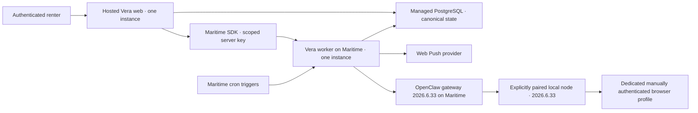

# Maritime Execution Plane, Scheduling, and Notifications Design

Status: approved for implementation  
Date: 2026-07-22  
Scope: founder-release Maritime worker and OpenClaw gateway deployment, PostgreSQL-owned scheduling and dispatch, browser Web Push notifications, and operator visibility

## Goal

Make Maritime Vera's primary hosted execution and scheduling environment without moving canonical domain state or local marketplace sessions out of Vera's existing trust boundaries. The founder release runs one hosted Vera web application, one managed PostgreSQL database, one Vera worker on Maritime, one pinned OpenClaw gateway on Maritime, and one explicitly paired founder-controlled browser node/profile.

The implementation must prove that a policy-approved scheduled acquisition can be created and executed idempotently, that one matching listing can produce at most one privacy-preserving notification, and that the existing user-triggered browser capture can reach its selected local node through the hosted gateway. PostgreSQL remains authoritative for users, policy, jobs, attempts, approvals, results, notifications, and append-only audit history.

## Repository reconciliation

The repository already provides the foundations below and they will be extended rather than replaced:

- PostgreSQL is the only hosted persistence implementation through `@vera/db`; SQLite is isolated behind `@vera/db/demo` for the deterministic offline demo.
- Hosted repositories are asynchronous and tenant-scoped, with composite ownership constraints and a narrow cross-user worker-claim interface.
- `SourceJob`, `SourceJobResult`, `JobAttempt`, browser-node state, deferred-node state, manual-action state, source policy, and immutable browser-capture acceptance already exist.
- PostgreSQL source-job claims use leases and `FOR UPDATE SKIP LOCKED`; normalization and decision queues already support crash recovery and bounded retries.
- The worker already rotates across acquisition, normalization, and decision jobs and creates one bounded PostgreSQL pool per process.
- The OpenClaw adapter already uses fixed `nodes invoke` calls for `browser.proxy` `GET /tabs` and `GET /snapshot`; it exposes no navigation, click, type, script, compose, send, apply, payment, upload, or filesystem operation.
- Hosted identity and per-user ownership are implemented. Calendar authorization is incremental and separate from identity.
- The deterministic demo composition never instantiates OpenClaw or a hosted integration.

The following contradictions or missing foundations must be corrected as part of this milestone:

1. `AGENTS.md` still contains historical SQLite and “OpenClaw not implemented” wording that conflicts with ADR 0009, ADR 0010, and current code.
2. `README.md` and Railway/demo deployment documentation still describe Railway as the production worker destination. The web application may remain on its current host, but the production worker and scheduler must move to Maritime.
3. `LocalMockMaritimeOrchestrator` is the only orchestration implementation. There is no authenticated Maritime runtime adapter, deployment metadata, or trigger/run persistence.
4. `infra/maritime` does not exist.
5. The worker has no HTTP liveness/readiness server and no durable service heartbeat for the operations view.
6. The repository has no production notification provider, Web Push subscription state, delivery queue, quiet-hour enforcement, digest fallback, or notification operations view.
7. Gmail alert ingestion is absent even though the Prompt 10 acceptance path assumes a policy-approved Gmail/API scheduled job. This milestone will add the smallest alert-ingestion scheduling foundation needed for that path; it will not add Gmail sending or broaden OAuth scopes beyond the separately enabled read capability.
8. Maritime's documented OpenClaw template is pinned to `2026.5.28`, while OpenClaw's published advisory marks versions before `2026.6.5` as affected. Vera currently pins the same historical version and keeps it disabled. The founder deployment must not enable that image.

## Verified platform versions and interfaces

The implementation pins exact versions verified on 2026-07-22:

- `maritime-sdk@0.5.0` for server-runtime calls;
- `maritime-cli@1.7.0` for explicit operator deployment, trigger, environment, status, logs, and rollback commands;
- `ghcr.io/openclaw/openclaw:2026.6.33` for the Maritime gateway and `openclaw@2026.6.33` for the local node and worker-side CLI;
- `web-push@3.6.7` for the founder Web Push channel;
- Node 24 LTS and pnpm 11.14.0, preserving the repository baseline.

The selected OpenClaw version is the current `extended-stable` npm tag and is newer than the first patched version `2026.6.5`. Direct CLI inspection confirms that `2026.6.33` retains:

```text
openclaw nodes invoke
  --node <id>
  --command browser.proxy
  --params <json>
  --idempotency-key <key>
  --invoke-timeout <ms>
  --json
```

It also retains `node run`, `devices approve`, `nodes approve`, `nodes describe`, and `nodes status`. Vera will update its exact compatibility pin from `2026.5.28` to `2026.6.33`; a node or gateway reporting any other version remains incompatible until a separately reviewed migration changes the pin.

Maritime's supported runtime surfaces used by Vera are:

- SDK `agents.get`, `agents.list`, `agents.start`, and `agents.logs` for status, wake, and sanitized diagnostics;
- typed SDK errors for authentication, authorization, rate limit, not found, API failure, and connection failure;
- CLI `create`, `deploy --source docker --image`, `env`, `status`, `history`, `logs`, and `triggers create/list/delete` for explicit operator workflows;
- Maritime cron triggers to wake a sleeping worker;
- Maritime encrypted secret environment variables;
- Maritime's supported GitHub-repository Docker build for the Vera worker;
- Maritime's supported Docker-image deployment source for the pinned OpenClaw gateway.

Application request handlers never spawn the Maritime CLI. Dashboard-internal or undocumented Maritime endpoints are not used.

## Approaches considered

### Selected: PostgreSQL pull queue plus authenticated Maritime wake

Vera persists a one-time dispatch envelope in PostgreSQL, calls Maritime's authenticated start/wake API, and lets the worker claim the job from PostgreSQL. Maritime receives no listing payload, user OAuth token, page evidence, browser session artifact, or arbitrary command.

This design preserves PostgreSQL as canonical state, makes a wake retry harmless, avoids exposing a new job endpoint, and uses only current documented Maritime SDK/CLI surfaces.

### Rejected: public Vera worker webhook

A public worker webhook would require an additional HMAC/nonce protocol and ingress surface. Maritime's current cron-trigger command does not document custom per-delivery headers or an application payload contract suitable for Vera's job protocol. A URL-as-secret webhook is insufficient for Vera's replay and ownership requirements.

### Rejected: Maritime chat or webhook payload as the job protocol

Sending job data as an agent message would duplicate canonical state, make natural-language delivery part of a security boundary, and risk leaking unnecessary listing or user data. Maritime execution state is evidence, not Vera's job record.

## Founder-release topology



The founder release uses one region and no horizontal scaling. Web, worker, gateway, and database are placed in the closest supported region. No design assumes private container-to-container networking. Database, Maritime API, Web Push, and gateway traffic uses reviewed public TLS endpoints and application/provider authentication.

The web host is not required to move in this milestone. Maritime is primary for worker execution, lifecycle, triggers, and the gateway. Demo and production composition roots remain separate.

## Maritime orchestration boundary

### Contract evolution

The existing `MaritimeOrchestrator` remains the application-owned boundary. It gains provider-neutral status and diagnostic results only where required:

```ts
interface MaritimeOrchestrator {
  scheduleConnectorJob(input: ScheduleSourceJobInput): Promise<SourceJob>;
  dispatchJob(jobId: string): Promise<SourceJob>;
  getJobStatus(jobId: string): Promise<SourceJob | null>;
  getDeploymentHealth(): Promise<OrchestrationDeploymentHealth>;
  getDiagnosticReference(): Promise<SanitizedDiagnosticReference | null>;
  retryJob(jobId: string): Promise<SourceJob>;
  cancelByPolicy(jobId: string, reason: string): Promise<SourceJob>;
  receiveBrowserNodeHeartbeat(status: BrowserNodeStatus): Promise<BrowserNodeStatus>;
}
```

`LocalMockMaritimeOrchestrator` continues to implement the same contract without network access. `ProductionMaritimeOrchestrator` composes tenant repositories, the global worker queue boundary, a minimal Maritime SDK client adapter, policy, clock, ID source, and redacted logger. Domain and worker code do not import Maritime SDK types.

### Runtime client

`MaritimeControlPlaneClient` is the smallest testable adapter over the official SDK:

```ts
interface MaritimeControlPlaneClient {
  wake(agentId: string, signal?: AbortSignal): Promise<MaritimeAgentState>;
  getAgent(agentId: string, signal?: AbortSignal): Promise<MaritimeAgentState>;
  getSanitizedLogs(agentId: string, limit: number, signal?: AbortSignal): Promise<readonly SanitizedLogReference[]>;
}
```

It validates all SDK output through strict schemas and maps provider failures to closed error codes:

- `maritime_authentication_failed`;
- `maritime_authorization_failed`;
- `maritime_rate_limited`;
- `maritime_agent_not_found`;
- `maritime_configuration_invalid`;
- `maritime_temporarily_unavailable`;
- `maritime_provider_failed`.

Authentication/configuration/not-found errors are not automatically retried. Rate limits, connection failures, and provider unavailability use bounded exponential backoff with jitter owned by the durable Vera attempt, never nested unbounded SDK retries.

### Dispatch sequence

1. A tenant-scoped service creates or resolves one idempotent `SourceJob` in `queued` state.
2. Current user, integration, source policy, kill switches, trigger mode, approval, payload hash, and account state are checked.
3. Vera creates one stateful dispatch intent with issuer `vera-control-plane`, audience equal to the exact worker agent ID, a random nonce hash, job/user binding, correlation ID, payload hash, issued time, expiry, and idempotency key.
4. Vera calls `agents.start` through the SDK. No job payload is sent.
5. On authenticated acceptance, Vera records the dispatch receipt and moves the job to `dispatched`.
6. The worker consumes the single-use dispatch record, validates the configured Maritime worker identity, nonce hash, expiry, ownership, payload hash, replay state, current policy, and current user/integration state.
7. The existing PostgreSQL worker queue leases the job and moves it to `running`.
8. The worker executes outside transactions, records an immutable attempt, and commits only a validated result.

If the wake succeeds but the database receipt fails, the worker cannot consume an unaccepted dispatch. Retrying wake is safe. If the worker was already awake, the accepted PostgreSQL dispatch remains sufficient; wake is an availability action, not job authorization.

## Durable jobs, schedules, and retries

PostgreSQL remains canonical for every SourceJob transition. Existing states remain unchanged:

```text
queued
dispatched
running
completed
retryable_failed
permanently_failed
deferred_node_offline
manual_action_required
cancelled_by_policy
```

The migration adds:

- `maritime_deployments`: non-secret worker/gateway agent IDs, names, expected version/image, diagnostic base reference, environment, and timestamps;
- `maritime_dispatches`: issuer, audience, tenant/job binding, nonce hash, payload hash, correlation ID, worker agent ID, issued/expiry/accepted/consumed timestamps, state, optimistic revision, and unique idempotency key;
- `production_schedules`: tenant-owned schedule kind, connector/profile binding, enabled state, cadence metadata, next due time, feature flag, source-policy requirement, and Maritime trigger reference;
- `production_schedule_runs`: immutable due tick, idempotency key, dispatch/job reference, outcome, and safe error code;
- `service_heartbeats`: bounded worker role/version/readiness/last-seen state without secrets or environment values.

One Maritime cron trigger wakes the worker every five minutes. The worker reconciles due PostgreSQL schedules when it wakes. This is not a second cron system: Maritime decides when execution is awakened; PostgreSQL determines which policy-owned schedule is due and makes duplicate trigger delivery harmless.

Supported scheduled work is limited to:

- Gmail listing-alert ingestion after `gmail.readonly` is intentionally enabled;
- reviewed official API/feed connectors whose manifests explicitly allow scheduled execution;
- normalization and deterministic rescoring reconciliation;
- stale-listing checks that make no hidden source request;
- notification fan-out;
- worker, gateway, node-heartbeat, and trigger reconciliation;
- cleanup of expired dispatch intents, OAuth states, and other explicitly ephemeral records.

Public consumer-site browser jobs stay user-triggered. No scheduled Zillow, Facebook Marketplace, or Craigslist browser acquisition is enabled. An `experimental_personal` schedule is representable only behind an off-by-default server flag, explicit user opt-in, exact saved-search URL, online-node check, low rate, and all kill switches. No such schedule is enabled by this implementation.

Retry behavior is closed and typed:

- safe transient provider/network/rate-limit failures may return to `retryable_failed` with bounded attempts and `availableAt` backoff;
- policy, ownership, payload, authentication, unsupported-operation, replay, and permanent provider failures do not retry;
- missing/stale local nodes become `deferred_node_offline`, never empty success;
- login, reauthentication, pairing, capability approval, 2FA, CAPTCHA, consent, rate/bot challenge, redirect, and layout blockers become `manual_action_required`;
- exhausted jobs remain `permanently_failed` and appear in the dead-letter operations view;
- policy changes cancel queued, dispatched, and future execution before provider I/O;
- an accepted immutable acquisition result is not rerun because later normalization fails.

## Gmail alert scheduling foundation

The current repository lacks Gmail acquisition. To satisfy the production-scheduling acceptance path without importing the full historical Gmail milestone, this implementation adds one narrow read-only connector operation:

```text
connector: google.gmail.listing-alerts.v1
mode: email_alert
capability: gmail.alert.read
operation: gmail.capture_configured_alerts
policy: approved only after user capability enablement
execution: scheduled
```

The integration requests `https://www.googleapis.com/auth/gmail.readonly` incrementally only when the renter enables alert ingestion. It searches only a dedicated Vera label or configured sender/subject allowlist, imports through the existing raw-ingestion pipeline, stores only message ID as external reference plus extracted listing facts and minimal provenance, and advances the Gmail history/cursor only after durable idempotent import.

OAuth initiation remains bound to the authenticated Vera user, exact callback, random single-use state, and PKCE. The migration adds a narrow `gmail_oauth_states` table with an application-encrypted verifier and an expiry/consumption lifecycle; the existing tenant-owned Google integration connection continues to hold the application-encrypted refresh token and verified granted-scope set. No access token is persisted in browser storage.

No Gmail compose/send capability is introduced by this repair. There is no `messages.send`, `drafts.send`, mailbox modification, deletion, labeling, forwarding, or SMTP path. Sanitized fixtures and a mock Gmail client cover default tests; an opt-in staging test requires explicit Google configuration.

## OpenClaw gateway and local node

### Version migration

Migration `0003` changes the expected OpenClaw version constraint and default from `2026.5.28` to `2026.6.33`. Existing browser-node records are preserved, their expected version becomes `2026.6.33`, and compatibility becomes `unknown` until a fresh verified heartbeat reports the exact version. No source is automatically enabled.

### Deployment

The gateway uses the official image `ghcr.io/openclaw/openclaw:2026.6.33` through Maritime's supported Docker deployment source. The operator does not add provider keys, gateway authentication, public access, or node pairing until deployment status and `openclaw --version` confirm the exact pin.

The local node also installs `openclaw@2026.6.33`. Pairing follows that version's supported two-stage device/node approval flow. The operator verifies the node with `nodes describe` and grants only `browser.proxy`. Gateway and node command policy explicitly denies `system.run`, filesystem access, messaging, notifications, camera, microphone, location, canvas, screen recording, uploads, downloads, and unrelated browser profiles.

The existing Vera adapter continues to call only `GET /tabs` and `GET /snapshot` for the selected profile. A gateway that is sleeping, restarting, unavailable, or version-incompatible produces a retryable/deferred visible state, not an empty result.

### Privacy boundary

The marketplace password, cookies, local/session storage, browser profile, password-manager data, and raw CDP endpoint remain only on the user-controlled machine. The bounded page content required for capture may traverse the Maritime-hosted gateway and reach the Vera worker. This is disclosed honestly in setup and UI.

Neither PostgreSQL nor Maritime receives browser cookies, storage, profile archives, passwords, screenshots, full snapshots, or raw private pages by default. Gateway tokens and Maritime keys stay in server/agent secret stores and never enter a job, audit event, log, client bundle, URL, or PostgreSQL row.

## Browser Web Push notifications

### Provider boundary

```ts
interface NotificationProvider {
  readonly providerId: string;
  send(input: NotificationSendRequest, signal?: AbortSignal): Promise<NotificationSendResult>;
}
```

Implementations are:

- `MockNotificationProvider`: deterministic, no network, records strict requests for tests;
- `ConsoleNotificationProvider`: development-only, logs only safe IDs/status and never message or subscription secrets;
- `WebPushNotificationProvider`: production-capable VAPID Web Push through `web-push@3.6.7`.

The web application exposes an explicit user-click subscription flow and a service worker. The VAPID public key may enter the client bundle; the private key and subscription encryption key never do.

### Persistence

The additive migration adds tenant-owned:

- `notification_preferences`: enabled state, minimum score, freshness window, quiet hours, timezone, hourly limit, digest policy, risk ceiling, and timestamps;
- `web_push_subscriptions`: endpoint/auth/key material encrypted with the existing AES-256-GCM envelope and owner-bound additional authenticated data, safe browser label, status, last success/failure, and timestamps;
- `notification_deliveries`: canonical listing, decision-run/version, rule version, deep link, generic title/body, idempotency key, state, lease, attempts, next attempt, provider reference hash, safe error code, and timestamps;
- `notification_digest_items`: delivery-to-digest membership without copying listing descriptions or contact information.

### Eligibility and delivery rules

A notification is eligible only when:

1. the user's notification preference is enabled;
2. the listing satisfies deterministic hard constraints;
3. the versioned score meets the explicit threshold;
4. the observation is inside the configured freshness window;
5. the canonical listing/source cluster has not already generated an equivalent delivery;
6. the risk policy permits immediate notification;
7. the listing remains owned by the same user and current profile;
8. source policy and global notification kill switches still allow delivery.

Critical risk indicators suppress immediate notification and move the item to the in-app inbox. Lower-severity indicators do not appear in lock-screen text. Unknown fields stay neutral unless the user's explicit search rules say otherwise.

Quiet hours are evaluated in the user's IANA timezone. Eligible events during quiet hours become `deferred_quiet_hours`; they are not marked delivered. Hourly limits defer overflow into one digest. Repeated decision runs, trigger deliveries, retries, and provider ambiguity resolve through the unique delivery idempotency key.

Lock-screen payloads are intentionally generic:

```text
Title: Vera found a new match
Body: Open Vera to review a new listing.
Data: same-origin opaque listing deep link
```

They contain no address, description, price, landlord name, email, phone, risk evidence, protected-class inference, or OAuth/provider identifiers.

## Health and operations UI

The worker runs a small HTTP server alongside polling:

- `/health` proves only that the process is alive and returns service/version/time;
- `/ready` verifies PostgreSQL connectivity, current migration hash, worker configuration, and non-secret deployment identity;
- neither endpoint calls external providers or returns environment values, tokens, URLs with sensitive query strings, user data, or page content.

The worker writes a bounded service heartbeat to PostgreSQL. Maritime deployment status and sanitized log references are read server-side through the SDK. OpenClaw gateway version/health is read through its server-side adapter. A scheduled reconciliation calls only `nodes status` and `nodes describe` for the configured selected node, validates the gateway-authenticated result, and updates the existing browser-node heartbeat/capability/version projection. The manual founder registration helper remains setup evidence rather than a continuous liveness claim.

`/settings/operations` is protected by an exact server-side `VERA_OPERATOR_USER_IDS` allowlist in addition to normal authentication. It is not linked or rendered for ordinary renters. Every operations route repeats the same authorization check.

The view shows:

- Vera worker liveness/readiness/version and last heartbeat;
- Maritime agent status, last activity, and sanitized dashboard/log reference;
- OpenClaw gateway health and expected/reported version;
- selected browser node/profile, pairing/capability state, and heartbeat;
- configured triggers, last due/run/outcome, and stale trigger warnings;
- job counts for queued, dispatched, running, deferred, manual action, retryable, and permanent/dead-letter states;
- current global/source/browser/notification kill-switch state;
- notification queued/deferred/delivered/failed counts;
- policy-checked retry and cancellation controls.

Retry is available only for safe typed transient, deferred-offline-after-recovery, or explicitly recovered manual-action states. Cancellation rechecks policy, uses optimistic concurrency, appends an audit event, and cannot undo accepted evidence.

## Security and logging

The Maritime SDK key is server-only and carries exactly the `provision` and `deploy` scopes required for agent lookup/status and lifecycle wake. It does not carry `manage` or secret-management authority. Operator provisioning and secret-management credentials are separate and never installed in the Vera runtime.

Every dispatch and result includes a correlation ID and canonical payload hash. Dispatch nonce values are random, short-lived, single-use, stored as hashes, and never logged. The worker requires issuer `vera-control-plane` and an audience matching its exact configured Maritime agent ID. Replayed, expired, wrong-issuer, wrong-audience, wrong-user, wrong-job, wrong-payload, and already-consumed dispatches deny before a job lease or provider call.

All connector, Maritime, OpenClaw, Gmail, and Web Push output is untrusted. Strict Zod schemas, size limits, allowlists, safe error mapping, and redaction run before persistence or logging.

Logs and health output exclude:

- Maritime and gateway keys;
- OAuth access/refresh tokens and authorization codes;
- marketplace passwords, cookies, storage, and profile paths;
- Web Push endpoint/auth/key values;
- Gmail bodies and contact details;
- page snapshots, screenshots, raw provider responses, and sensitive query strings;
- database URLs and application encryption keys.

Audit events record safe IDs, hashes, enum states, policy decisions, attempts, timestamps, counts, and safe error codes. They never record raw listing/page/email content or secret material.

## Migration and rollback

The implementation uses one additive Drizzle PostgreSQL migration after `0002_openclaw_current_tab.sql`. It preserves users, source records, canonical listings, scores, browser acceptances, Calendar state, and demo fixtures.

The migration:

1. upgrades the OpenClaw expected-version constraint to `2026.6.33` and marks compatibility unknown;
2. adds Maritime deployment, dispatch, schedule, run, and service-heartbeat tables;
3. adds notification preference, encrypted subscription, delivery, and digest tables;
4. adds the narrow Gmail OAuth-state, cursor, and external-reference state required by scheduled alert ingestion;
5. adds tenant, uniqueness, lease, status, timestamp, hash, and same-owner constraints;
6. adds append-only enforcement for schedule runs and audit-like notification history where mutation is not required; dispatch state itself remains a constrained optimistic lifecycle so acceptance and consumption can be recorded without deleting its original identity or hashes.

Rollback does not use automatic down migrations. Before migration, the operator records a managed snapshot. Because the migration is additive, the previous app may be redeployed only after verifying it ignores all new columns/tables and tolerates the upgraded OpenClaw constraint. Otherwise, restore the pre-migration snapshot to a new database, validate it with the previous release, and switch `DATABASE_URL` under change control.

OpenClaw rollback redeploys the last reviewed patched image, restores the matching worker/local CLI pin, disables browser policy during the change, verifies pairing and `browser.proxy`, and only then allows founder dogfooding. Rollback never returns to `2026.5.28`.

## Deployment assets

`infra/maritime` will contain:

- `README.md`: topology, prerequisites, exact operator commands, triggers, health checks, rollback, and staging smoke tests;
- `ENVIRONMENT.md`: variable names, owner process, secret classification, and purpose only;
- `TOPOLOGY.md`: Mermaid data-flow and trust-boundary diagram;
- `OPENCLAW.md`: exact image pin, gateway setup, local node pairing, command allow/deny policy, upgrade and rollback;
- `COSTS.md`: founder assumptions for one web, one database, one worker, one always-available gateway, Web Push, and external provider usage;
- `validate.mjs` or equivalent no-secret static validator for image/version/command/config boundaries;
- worker Docker build configuration using Node 24, pnpm 11.14.0, the committed lockfile, non-root runtime, health check, and exact OpenClaw 2026.6.33 CLI installation.

No speculative `maritime.json` is added for multiple deployments. The current CLI supports a project manifest for one linked agent, while Vera needs separately managed worker and gateway agents. Explicit commands are clearer and avoid pretending one manifest represents both.

Deployment remains operator-controlled. The implementation provides validation and deployment commands but does not call Maritime production APIs or create resources automatically.

## Testing strategy

The default suite runs without Maritime, OpenClaw, Google, browser permission, Web Push network access, or any live provider.

### Unit and contract tests

- production and mock Maritime orchestrator contract parity;
- SDK output validation and auth/configuration/rate-limit/not-found/transient error mapping;
- dispatch nonce uniqueness, expiry, replay rejection, payload mismatch, wrong agent, and wrong user;
- no credential, cookie, snapshot, Push secret, Gmail content, or token in serialized payloads/logs/health;
- trigger tick idempotency and disabled schedule behavior;
- source disabled after queueing cancels before provider I/O;
- safe retry classification and permanent/dead-letter behavior;
- OpenClaw exact `2026.6.33` compatibility and fixed browser-proxy command surface;
- gateway unavailable/restarting and node offline/manual blockers;
- notification eligibility, threshold, freshness, hard constraints, duplicate suppression, risk ceiling, quiet hours, timezone/DST, rate limit, digest, and generic payload;
- Gmail configured-filter and cursor/idempotency behavior with sanitized fixtures;
- operator authorization and ordinary-renter denial.

### PostgreSQL integration tests

- dispatch uniqueness, same-owner foreign keys, transaction rollback, lease expiry/recovery, and concurrent claimers;
- duplicate worker execution resolves to one accepted attempt/result;
- replayed or cross-user dispatch/result rejection;
- source policy disabled after dispatch;
- immutable schedule-run and audit ordering;
- notification delivery uniqueness, concurrent claims, retry, quiet-hour deferral, digest membership, and encrypted subscription storage;
- service heartbeat staleness;
- Gmail message/cursor idempotency;
- production composition requires PostgreSQL and Maritime configuration;
- demo composition cannot import Maritime, Gmail, OpenClaw, or Web Push production adapters.

### End-to-end and opt-in staging tests

Deterministic Playwright tests cover Web Push settings with a fake browser subscription, operations authorization, scheduled job visibility, retry/cancel policy, and notification delivery state.

Opt-in staging tests require explicit flags plus configuration and verify:

- Maritime SDK status/wake against the exact worker agent;
- one Maritime cron trigger and idempotent schedule run;
- one read-only Gmail alert import when a dedicated test label/account is configured;
- one Web Push delivery to a founder test subscription;
- OpenClaw gateway `2026.6.33`, selected node/profile, bounded current-tab capture, offline deferral, and manual blocker behavior.

The live tests never send Gmail, message a marketplace account, apply, pay, upload, bypass a blocker, invite anyone, or modify a browser session beyond the already-approved current-tab read.

## Acceptance evidence

Implementation is complete only when evidence proves all of the following:

1. The production topology is documented and static validation confirms one worker image and exact OpenClaw `2026.6.33` image.
2. A policy-approved Gmail alert job can be scheduled through a Maritime trigger, recorded in PostgreSQL, claimed once, imported idempotently, and audited in the opt-in staging path.
3. A matching listing creates at most one eligible Web Push delivery, with generic lock-screen text and a same-origin deep link.
4. A user-triggered current-tab capture can use the Maritime-hosted gateway and selected local node in the opt-in staging path.
5. Gateway/node offline and manual blockers remain visible and never create empty success or cursor advance.
6. Source kill switches cancel queued/dispatched work and prevent future execution.
7. No browser session artifact, OAuth token, Push secret, raw email, or page snapshot is stored in Maritime job data, PostgreSQL operational tables, logs, health output, or client bundles.
8. Deployment and rollback use only documented Maritime SDK, CLI, API, trigger, secret, and Docker-image surfaces.
9. Format, lint, typecheck, unit, integration, PostgreSQL integration, E2E, build, static boundary checks, dependency audit, and deployment validation pass.

## Explicitly disabled behavior

The milestone does not enable:

- scheduled public consumer-site browser acquisition;
- Facebook Marketplace, Craigslist, or broad Zillow monitoring;
- crawling, unbounded pagination, automatic login, CAPTCHA/2FA/consent bypass, or stealth behavior;
- marketplace compose/send/contact/apply/payment/account-setting operations;
- Gmail send, SMTP, mailbox modification, deletion, forwarding, or automatic reply;
- full Calendar access, attendees, or notifications;
- raw screenshots, browser snapshots, cookies, storage, profile archives, or credentials in hosted persistence;
- Redis, Kubernetes, replicas, sharding, row-level security, or horizontal scaling;
- automatic production deployment from the implementation or test suite.

## Official references

- [Maritime CLI reference](https://maritime.sh/docs/cli)
- [Maritime SDK reference](https://maritime.sh/docs/sdk)
- [Maritime API reference](https://maritime.sh/docs/api)
- [Maritime Provisioning API](https://maritime.sh/docs/api/provisioning)
- [Maritime configuration and triggers](https://maritime.sh/docs/configuration)
- [Maritime OpenClaw guide](https://maritime.sh/docs/frameworks/openclaw)
- [OpenClaw advisory GHSA-9c3v-684m-579c](https://github.com/advisories/GHSA-9c3v-684m-579c)
- [OpenClaw 2026.6.33 release](https://github.com/openclaw/openclaw/releases/tag/v2026.6.33)
