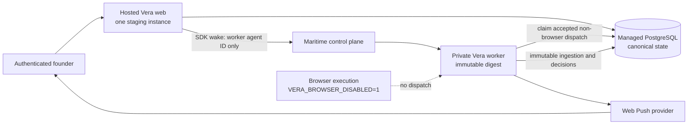

# Founder-release topology

## Active `founder_core`

Founder core uses one region, one authenticated hosted web instance, one private Maritime worker,
one managed PostgreSQL database, and no OpenClaw gateway or browser node. The worker requires only
its exact worker agent ID and scoped Maritime API key. It exposes no public application endpoint.

PostgreSQL owns identity, ownership, source policy, job state, dispatch attempts, schedules, results,
notification delivery state, and audit history. Maritime state is execution evidence only. The
worker serves health/readiness/metrics on its agent-local port and has no application job-invocation
endpoint; the platform's secret invoke webhook is not a Vera authorization surface.

The browser global kill switch remains set. Browser controls cannot be enabled through the
authenticated UI/API, browser SourceJobs deny before dispatch, production schedule kinds contain no
browser monitoring, gateway variables are absent, and no public browser endpoint exists.

## Blocked `founder_browser_experimental`

The experimental profile would add the pinned OpenClaw gateway and founder-controlled local
node/profile to every founder-core capability. It remains `no_go` under ADR 0012, so the following
is a non-deployable target architecture, not current staging:

No positive browser evidence, manual record, N/A result, or core release decision may make that
profile eligible. A future ADR must resolve ingress, authentication, exposure, pairing, narrow
command scope, shutdown, and multi-user isolation before the profile registry can change.
