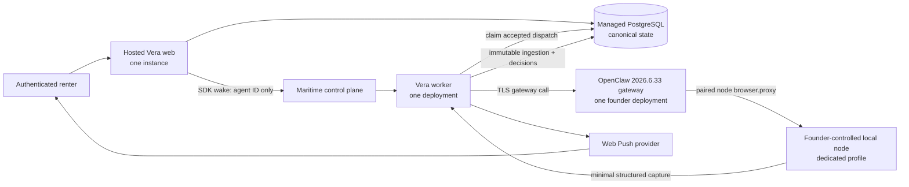

# Founder-release topology

The founder release uses one region, one hosted web instance, one Maritime worker, the founder's
existing Maritime OpenClaw gateway after inventory/reconciliation, one managed PostgreSQL database,
and one explicitly paired founder browser node/profile. There is no horizontal scaling requirement.

PostgreSQL owns identity, ownership, source policy, job state, dispatch attempts, approvals, results,
notification delivery state, and audit history. Maritime state is execution evidence only. The
worker serves health/readiness/metrics on its agent-local port and has no application job-invocation
endpoint; the platform's secret invoke webhook is not a Vera authorization surface.

The local node owns marketplace login state, cookies, local/session storage, and the dedicated browser profile. Only minimal page content needed for a user-approved capture may traverse the authenticated gateway. Production and deterministic demo composition roots never mix.
