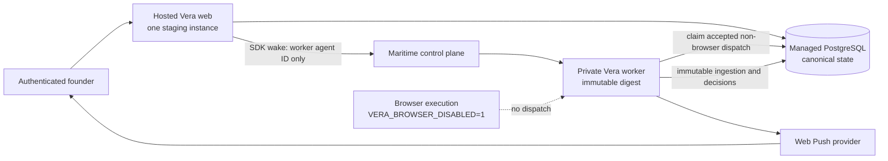
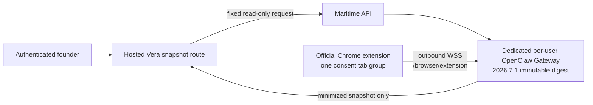

# Founder-release topology

## Active `founder_core`

```mermaid
flowchart LR
  U["Authenticated founder"] --> W["Hosted Vera web\none staging instance"]
  W --> P[("Managed PostgreSQL\ncanonical state")]
  W -->|"SDK wake: worker agent ID only"| M["Maritime control plane"]
  M --> V["Private Vera worker\nimmutable digest"]
  V -->|"claim accepted non-browser dispatch"| P
  V -->|"immutable ingestion and decisions"| P
  V --> Q["Web Push provider"]
  Q --> U
  X["Browser execution\nVERA_BROWSER_DISABLED=1"] -. "no dispatch" .-> V
```

Founder core uses one region, one authenticated hosted web instance, one private Maritime worker,
one managed PostgreSQL database, and no OpenClaw browser Gateway or extension connection. The worker
requires only its exact worker agent ID and scoped Maritime API key. It exposes no public
application endpoint.

The browser global kill switch remains set. Browser controls cannot be enabled through the
authenticated UI/API, browser SourceJobs deny before dispatch, production schedule kinds contain no
browser monitoring, browser-Gateway variables are absent, and no public browser endpoint exists.
The remote-extension spike cannot satisfy any founder-core browser-disabled phase.

## Blocked `founder_browser_experimental`

ADR 0013 defines this connectivity-only target:

```mermaid
flowchart LR
  U["Authenticated founder"] --> W["Hosted Vera snapshot route"]
  W -->|"fixed read-only request"| M["Maritime API"]
  M --> G["Dedicated per-user OpenClaw Gateway\n2026.7.1 immutable digest"]
  E["Official Chrome extension\none consent tab group"] -->|"outbound WSS\n/browser/extension"| G
  G -->|"minimized snapshot only"| W
```

There is no local OpenClaw installation, node, CLI, daemon, Companion, or Vera agent. Only the
official Chrome extension runs on the founder's machine. Each Vera user requires a separate Gateway
and credential set.

The endpoint is internet reachable. Control UI and unrelated surfaces must be unavailable, pairing
authentication is mandatory, and only `/browser/extension` may be exposed. The profile remains
`no_go` under `remote_extension_live_acceptance_pending` until its entire remote-extension phase
set has accepted private evidence, including proxy behavior, route isolation, both security audits,
one minimized shared-tab snapshot, non-interaction enforcement, revocation, and shutdown.

No connectivity result authorizes Zillow, Apartments.com, Facebook Marketplace, broad discovery,
navigation, typing, messaging, form submission, upload, download, application, or payment.
